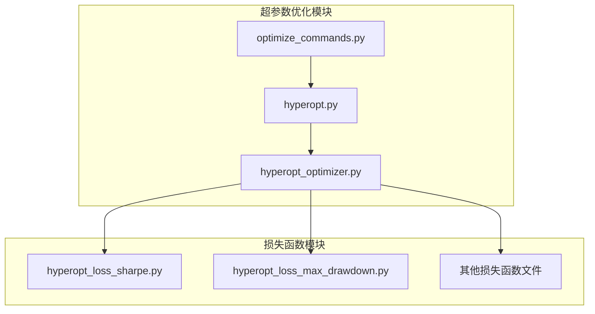
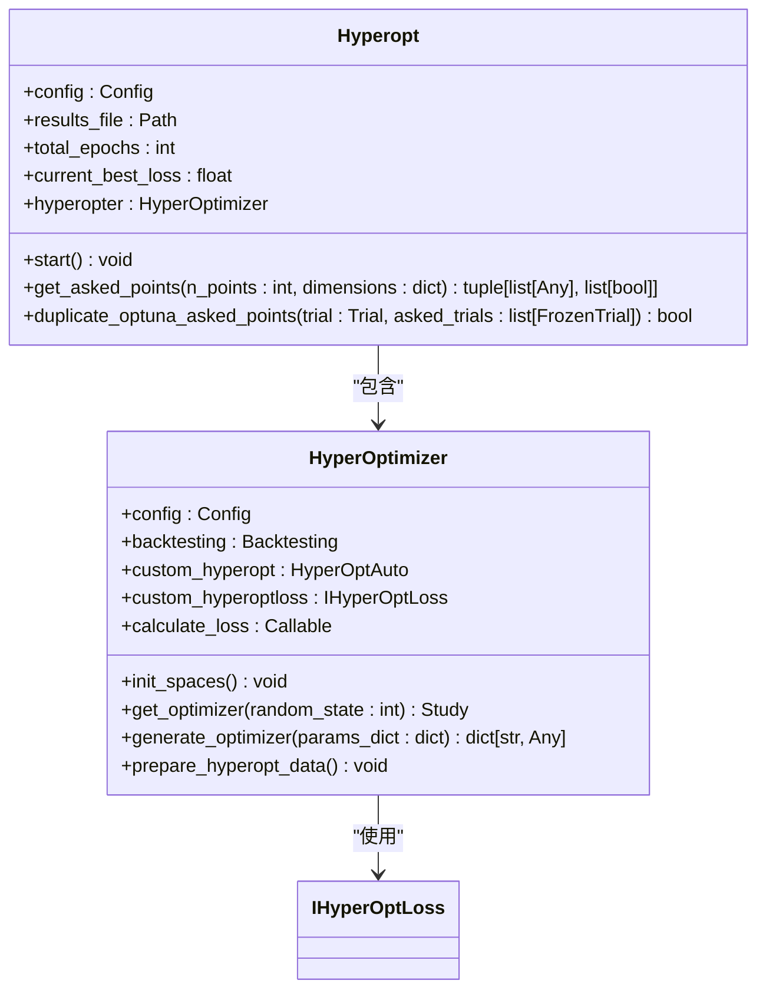
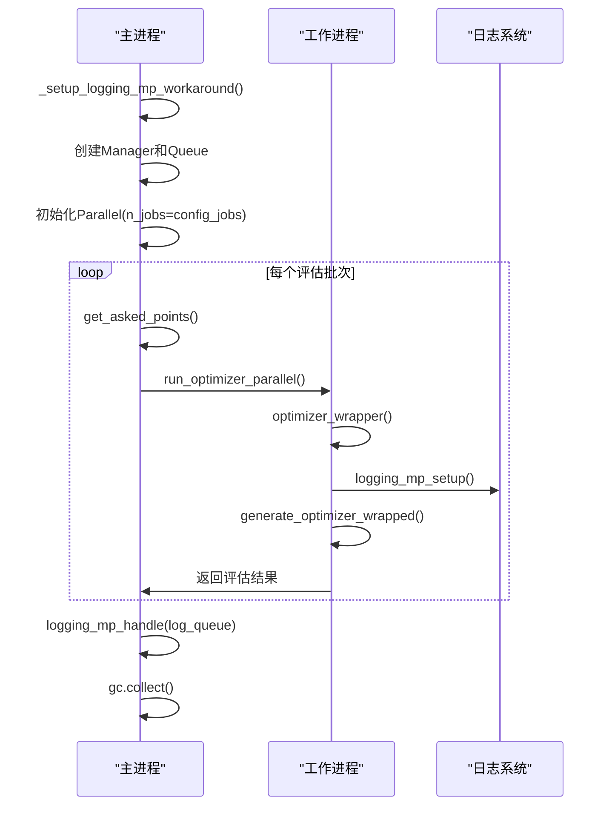
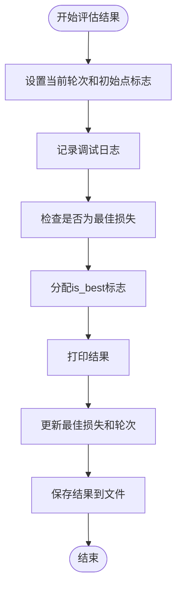
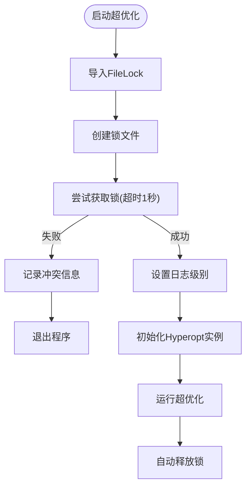

# 超参数优化（Hyperopt）

<cite>
**Referenced Files in This Document**   
- [hyperopt.py](file://freqtrade/optimize/hyperopt/hyperopt.py)
- [optimize_commands.py](file://freqtrade/commands/optimize_commands.py)
- [hyperopt_optimizer.py](file://freqtrade/optimize/hyperopt/hyperopt_optimizer.py)
- [hyperopt_loss_sharpe.py](file://freqtrade/optimize/hyperopt_loss/hyperopt_loss_sharpe.py)
- [hyperopt_loss_max_drawdown.py](file://freqtrade/optimize/hyperopt_loss/hyperopt_loss_max_drawdown.py)
- [hyperopt_loss_interface.py](file://freqtrade/optimize/hyperopt_loss/hyperopt_loss_interface.py)
</cite>

## 目录
1. [项目结构](#项目结构)
2. [核心组件](#核心组件)
3. [贝叶斯优化实现](#贝叶斯优化实现)
4. [并行评估机制](#并行评估机制)
5. [结果评估与记录](#结果评估与记录)
6. [并发冲突防护](#并发冲突防护)
7. [损失函数分析](#损失函数分析)

## 项目结构

freqtrade项目的超参数优化功能主要分布在`freqtrade/optimize`目录下，核心模块包括`hyperopt`和`hyperopt_loss`两个子包。`hyperopt`包包含超优化主逻辑，而`hyperopt_loss`包则提供多种损失函数实现。



**Diagram sources**
- [hyperopt.py](file://freqtrade/optimize/hyperopt/hyperopt.py)
- [hyperopt_optimizer.py](file://freqtrade/optimize/hyperopt/hyperopt_optimizer.py)
- [optimize_commands.py](file://freqtrade/commands/optimize_commands.py)
- [hyperopt_loss_sharpe.py](file://freqtrade/optimize/hyperopt_loss/hyperopt_loss_sharpe.py)
- [hyperopt_loss_max_drawdown.py](file://freqtrade/optimize/hyperopt_loss/hyperopt_loss_max_drawdown.py)

**Section sources**
- [hyperopt.py](file://freqtrade/optimize/hyperopt/hyperopt.py)
- [optimize_commands.py](file://freqtrade/commands/optimize_commands.py)
- [hyperopt_loss](file://freqtrade/optimize/hyperopt_loss)

## 核心组件

超参数优化系统由多个核心组件构成，包括`Hyperopt`主类、`HyperOptimizer`优化器、`IHyperOptLoss`损失函数接口以及各种具体的损失函数实现。这些组件协同工作，实现了完整的超参数优化流程。

**Section sources**
- [hyperopt.py](file://freqtrade/optimize/hyperopt/hyperopt.py#L40-L351)
- [hyperopt_optimizer.py](file://freqtrade/optimize/hyperopt/hyperopt_optimizer.py#L61-L482)
- [hyperopt_loss_interface.py](file://freqtrade/optimize/hyperopt_loss/hyperopt_loss_interface.py#L14-L38)

## 贝叶斯优化实现

`Hyperopt`类通过集成Optuna库实现了贝叶斯优化算法。该实现利用`HyperOptimizer`构建搜索空间，并通过`get_asked_points`方法避免参数重复。



**Diagram sources**
- [hyperopt.py](file://freqtrade/optimize/hyperopt/hyperopt.py#L40-L351)
- [hyperopt_optimizer.py](file://freqtrade/optimize/hyperopt/hyperopt_optimizer.py#L61-L482)

**Section sources**
- [hyperopt.py](file://freqtrade/optimize/hyperopt/hyperopt.py#L40-L351)
- [hyperopt_optimizer.py](file://freqtrade/optimize/hyperopt/hyperopt_optimizer.py#L61-L482)

## 并行评估机制

系统通过`Parallel`实现多进程并行评估，`_run_optimizer_parallel`方法负责工作进程的初始化与日志处理。



**Diagram sources**
- [hyperopt.py](file://freqtrade/optimize/hyperopt/hyperopt.py#L150-L220)
- [hyperopt_optimizer.py](file://freqtrade/optimize/hyperopt/hyperopt_optimizer.py#L380-L400)

**Section sources**
- [hyperopt.py](file://freqtrade/optimize/hyperopt/hyperopt.py#L150-L220)
- [hyperopt_optimizer.py](file://freqtrade/optimize/hyperopt/hyperopt_optimizer.py#L380-L400)

## 结果评估与记录

`evaluate_result`方法负责记录和比较每轮迭代的损失函数值，确保最优结果被正确识别和保存。



**Diagram sources**
- [hyperopt.py](file://freqtrade/optimize/hyperopt/hyperopt.py#L222-L250)

**Section sources**
- [hyperopt.py](file://freqtrade/optimize/hyperopt/hyperopt.py#L222-L250)

## 并发冲突防护

`start_hyperopt`函数通过`FileLock`防止多实例并发冲突，确保同一时间只有一个超优化实例在运行。



**Diagram sources**
- [optimize_commands.py](file://freqtrade/commands/optimize_commands.py#L100-L140)

**Section sources**
- [optimize_commands.py](file://freqtrade/commands/optimize_commands.py#L100-L140)

## 损失函数分析

`hyperopt_loss`模块提供了多种损失函数，每种都有其特定的数学原理和适用场景。

### Sharpe比率损失函数

Sharpe比率衡量单位风险的超额收益，适用于追求风险调整后收益的策略。

```python
# 数学公式：Sharpe Ratio = (平均超额收益) / (收益标准差)
# 实现：返回负的Sharpe比率，因为优化目标是最小化损失
return -sharp_ratio
```

**Section sources**
- [hyperopt_loss_sharpe.py](file://freqtrade/optimize/hyperopt_loss/hyperopt_loss_sharpe.py#L14-L38)

### 最大回撤损失函数

最大回撤损失函数结合了收益和风险，适用于风险厌恶型策略。

```python
# 数学公式：损失 = -总收益 / 最大回撤绝对值
# 实现：收益越高、回撤越小，损失值越小（更好）
return -total_profit / max_drawdown.drawdown_abs
```

**Section sources**
- [hyperopt_loss_max_drawdown.py](file://freqtrade/optimize/hyperopt_loss/hyperopt_loss_max_drawdown.py#L14-L45)

### 损失函数选择指南

| 损失函数 | 数学原理 | 适用场景 | 选择建议 |
|---------|--------|--------|--------|
| Sharpe比率 | 单位风险的超额收益 | 追求风险调整后收益 | 当风险控制与收益同等重要时 |
| 最大回撤 | 收益与最大回撤的比率 | 风险厌恶型策略 | 当资本保值是首要目标时 |
| 仅利润 | 纯利润最大化 | 高风险高收益策略 | 当愿意承担更高风险追求收益时 |
| Calmar比率 | 年化收益与最大回撤的比率 | 长期稳定收益策略 | 当关注长期表现稳定性时 |

用户可以根据策略目标选择或自定义损失函数。自定义损失函数需要继承`IHyperOptLoss`接口并实现`hyperopt_loss_function`方法，根据特定的优化目标设计损失计算逻辑。

**Section sources**
- [hyperopt_loss_interface.py](file://freqtrade/optimize/hyperopt_loss/hyperopt_loss_interface.py#L14-L38)
- [hyperopt_loss_sharpe.py](file://freqtrade/optimize/hyperopt_loss/hyperopt_loss_sharpe.py#L14-L38)
- [hyperopt_loss_max_drawdown.py](file://freqtrade/optimize/hyperopt_loss/hyperopt_loss_max_drawdown.py#L14-L45)