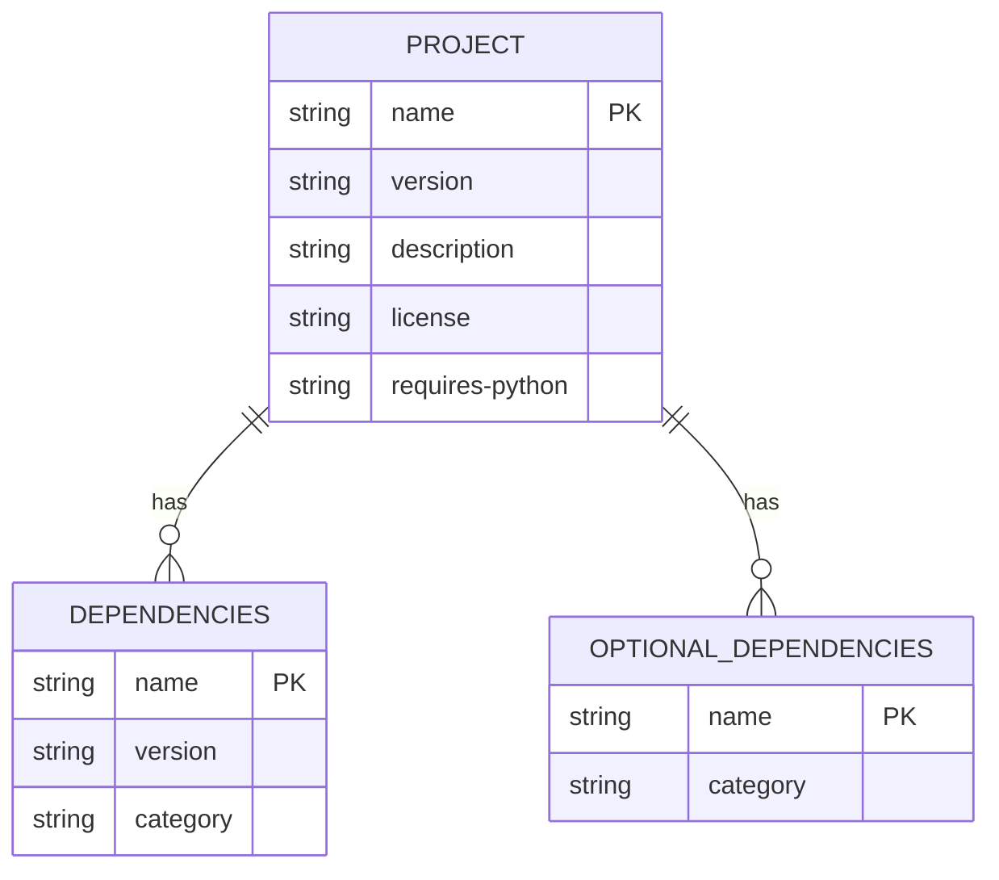
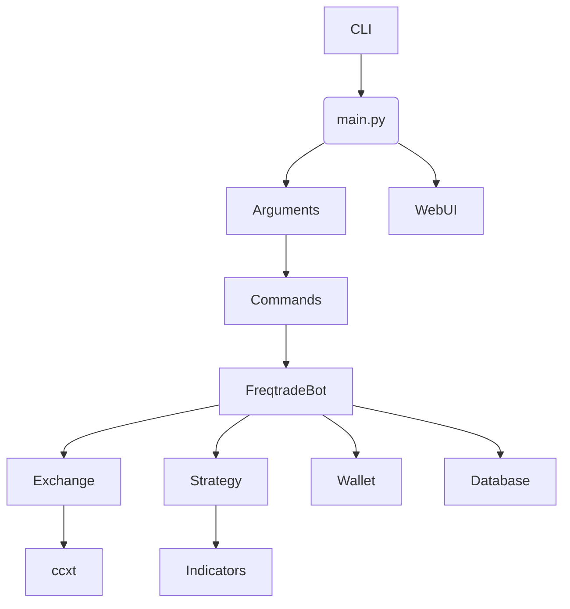
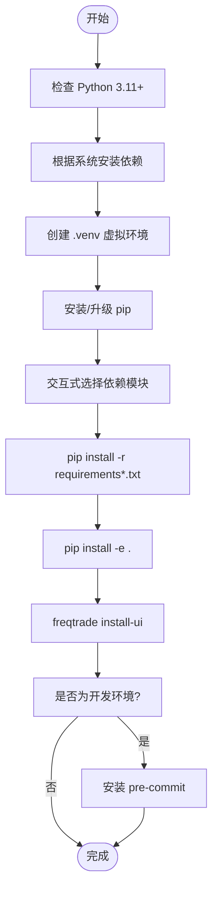
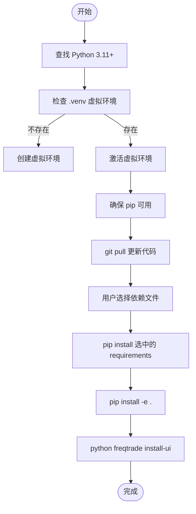
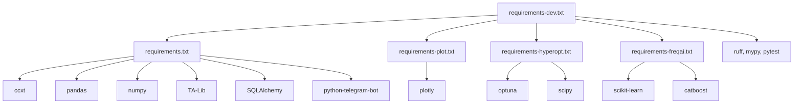

# 从源码编译安装

<cite>
**本文档中引用的文件**  
- [pyproject.toml](file://pyproject.toml)
- [setup.sh](file://setup.sh)
- [setup.ps1](file://setup.ps1)
- [requirements.txt](file://requirements.txt)
- [requirements-dev.txt](file://requirements-dev.txt)
- [requirements-freqai.txt](file://requirements-freqai.txt)
- [requirements-hyperopt.txt](file://requirements-hyperopt.txt)
- [requirements-plot.txt](file://requirements-plot.txt)
</cite>

## 目录
1. [简介](#简介)
2. [项目结构](#项目结构)
3. [核心组件](#核心组件)
4. [架构概述](#架构概述)
5. [详细组件分析](#详细组件分析)
6. [依赖分析](#依赖分析)
7. [性能考虑](#性能考虑)
8. [故障排除指南](#故障排除指南)
9. [结论](#结论)

## 简介
Freqtrade 是一个免费开源的加密货币交易机器人，使用 Python 编写，支持通过 Telegram 或 WebUI 进行控制。本指南详细说明如何从源码安装 Freqtrade，适用于希望贡献代码或进行深度定制的开发者。内容涵盖克隆 GitHub 仓库、切换分支、使用可编辑安装、依赖管理及跨平台编译问题解决方案。

## 项目结构
Freqtrade 项目采用模块化设计，主要目录包括 `freqtrade`（核心代码）、`user_data`（用户配置与策略）、`tests`（测试代码）和 `scripts`（辅助脚本）。根目录包含多个 `requirements-*.txt` 文件用于不同功能模块的依赖管理，以及 `setup.sh` 和 `setup.ps1` 脚本用于自动化安装。

**Section sources**
- [README.md](file://README.md#L0-L22)

## 核心组件

### 源码安装流程
从源码安装 Freqtrade 需要克隆 GitHub 仓库，切换到 `stable` 或 `develop` 分支，并使用 `pip install -e .` 进行可编辑安装。此方法允许开发者直接修改源码并立即生效，非常适合贡献代码或深度定制。

**Section sources**
- [setup.sh](file://setup.sh#L224-L255)
- [setup.ps1](file://setup.ps1#L226-L271)

### pyproject.toml 配置
`pyproject.toml` 文件定义了项目的元数据、依赖关系和构建配置。它使用 `setuptools` 作为构建后端，声明了项目名称、版本、作者、许可证、Python 版本要求及各类依赖（核心、可选、开发）。可选依赖包括 `plot`、`hyperopt`、`freqai` 等模块，可通过 `pip install freqtrade[plot,hyperopt]` 安装。



**Diagram sources**
- [pyproject.toml](file://pyproject.toml#L0-L55)
- [pyproject.toml](file://pyproject.toml#L56-L117)

## 架构概述
Freqtrade 的架构分为命令行接口（CLI）、核心交易引擎、交易所适配器、策略模块和 WebUI。`main.py` 是程序入口，通过 `Arguments` 解析命令行参数并调用相应功能模块。系统使用 `ccxt` 库与各大交易所通信，策略通过继承 `IStrategy` 接口实现。



**Diagram sources**
- [main.py](file://freqtrade/main.py#L0-L79)
- [commands](file://freqtrade/commands)
- [freqtradebot.py](file://freqtrade/freqtradebot.py)

## 详细组件分析

### setup.sh 脚本分析
`setup.sh` 是 Linux/macOS 系统下的自动化安装脚本，负责检查 Python 版本、安装系统依赖、创建虚拟环境、安装 Python 依赖并部署 freqUI 前端。

#### 功能流程


**Diagram sources**
- [setup.sh](file://setup.sh#L0-L291)

**Section sources**
- [setup.sh](file://setup.sh#L0-L291)

### setup.ps1 脚本分析
`setup.ps1` 是 Windows 系统下的 PowerShell 安装脚本，功能与 `setup.sh` 类似，但使用 Windows 原生命令和路径处理。

#### 功能流程


**Diagram sources**
- [setup.ps1](file://setup.ps1#L0-L273)

**Section sources**
- [setup.ps1](file://setup.ps1#L0-L273)

## 依赖分析
Freqtrade 使用分层的依赖管理策略。`requirements.txt` 包含核心依赖，如 `ccxt`、`pandas`、`numpy`、`TA-Lib`。其他 `requirements-*.txt` 文件按功能划分：
- `requirements-plot.txt`: `plotly` 用于绘图
- `requirements-hyperopt.txt`: `scipy`, `optuna` 用于超参数优化
- `requirements-freqai.txt`: `scikit-learn`, `catboost` 用于机器学习
- `requirements-dev.txt`: 包含所有依赖及开发工具（`pytest`, `ruff`, `pre-commit`）



**Diagram sources**
- [requirements.txt](file://requirements.txt#L0-L63)
- [requirements-dev.txt](file://requirements-dev.txt#L0-L32)
- [requirements-freqai.txt](file://requirements-freqai.txt#L0-L12)

**Section sources**
- [requirements.txt](file://requirements.txt#L0-L63)
- [requirements-dev.txt](file://requirements-dev.txt#L0-L32)
- [requirements-freqai.txt](file://requirements-freqai.txt#L0-L12)

## 性能考虑
在源码安装时，应注意以下性能和兼容性问题：

### Cython 扩展与编译问题
TA-Lib 等库包含 C 扩展，可能在不同平台上编译失败。建议：
- Linux: 安装 `libpython3.x-dev` 和 `build-essential`
- macOS: 使用 Homebrew 安装 `gettext` 和 `libomp`
- Windows: 使用预编译的 wheel 包或 Anaconda

### NumPy 版本冲突
`pyproject.toml` 中指定 `numpy>2.0,<3.0`，但某些旧版库可能不兼容。若遇问题，可尝试：
```bash
pip install numpy==1.24.4
```
或使用虚拟环境隔离。

### 虚拟环境建议
强烈建议使用虚拟环境（`.venv`）来隔离依赖，避免与系统 Python 冲突。`setup.sh` 和 `setup.ps1` 均会自动创建 `.venv`。

**Section sources**
- [pyproject.toml](file://pyproject.toml#L40-L41)
- [setup.sh](file://setup.sh#L150-L155)
- [setup.ps1](file://setup.ps1#L42-L45)

## 故障排除指南
### 常见安装错误
- **Python 版本过低**: 确保 Python >= 3.11
- **pip 未安装**: 脚本会尝试自动安装
- **权限错误**: 避免使用 `sudo`，使用虚拟环境
- **网络问题**: 配置 pip 镜像源

### 分支切换问题
使用 `git checkout stable` 或 `git checkout develop` 切换分支。若遇冲突，可运行 `setup.sh --reset` 进行硬重置。

**Section sources**
- [setup.sh](file://setup.sh#L199-L226)
- [README.md](file://README.md#L221-L229)

## 结论
从源码安装 Freqtrade 为开发者提供了最大的灵活性。通过 `setup.sh`（Linux/macOS）或 `setup.ps1`（Windows）脚本，可以自动化完成环境搭建、依赖安装和前端部署。`pyproject.toml` 提供了清晰的依赖和打包配置。使用虚拟环境和可编辑安装（`pip install -e .`）是最佳实践，能有效避免依赖冲突并方便代码修改。