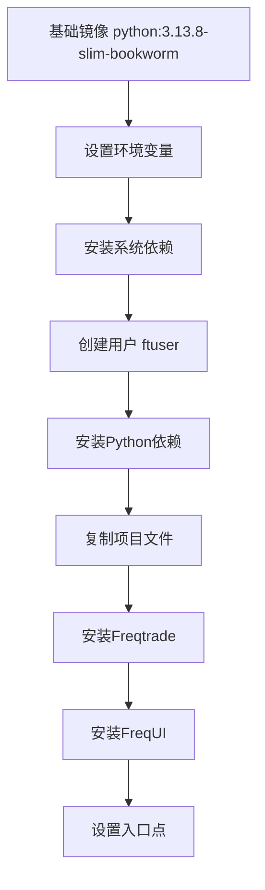
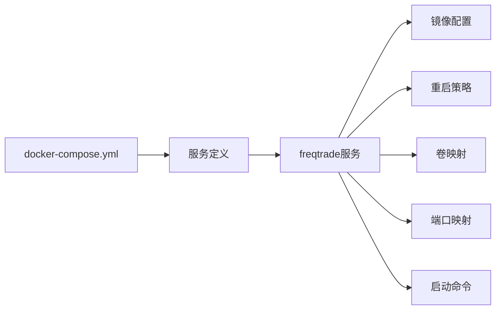

# 安装与环境配置

<cite>
**本文档中引用的文件**  
- [Dockerfile](file://Dockerfile)
- [docker-compose.yml](file://docker-compose.yml)
- [setup.ps1](file://setup.ps1)
- [setup.sh](file://setup.sh)
- [README.md](file://README.md)
- [pyproject.toml](file://pyproject.toml)
- [requirements.txt](file://requirements.txt)
</cite>

## 目录
1. [简介](#简介)
2. [系统要求](#系统要求)
3. [通过pip安装](#通过pip安装)
4. [通过Docker安装](#通过docker安装)
5. [从源码编译安装](#从源码编译安装)
6. [不同操作系统的配置指导](#不同操作系统的配置指导)
7. [Dockerfile与docker-compose.yml解析](#dockerfile与docker-composeyml解析)
8. [常见安装错误排查](#常见安装错误排查)
9. [验证安装](#验证安装)
10. [安全配置与性能优化](#安全配置与性能优化)

## 简介
Freqtrade是一款免费开源的加密货币交易机器人，使用Python编写，支持多种交易所，并可通过Telegram或WebUI进行控制。本指南将详细介绍如何在不同环境下搭建Freqtrade运行环境，涵盖pip、Docker和源码编译三种安装方式，以及针对不同操作系统的具体配置方法。

**Section sources**
- [README.md](file://README.md#L1-L229)

## 系统要求
### 硬件要求
- 最低配置：2GB RAM，1GB磁盘空间，2vCPU
- 推荐配置：4GB RAM以上，SSD存储，多核CPU以支持高频交易和回测

### 软件要求
- Python 3.11或更高版本
- pip包管理工具
- git版本控制系统
- TA-Lib技术分析库
- virtualenv（推荐）
- Docker（推荐）

### 网络要求
- 精确同步的系统时钟（建议使用NTP服务）
- 稳定的互联网连接以访问交易所API

**Section sources**
- [README.md](file://README.md#L200-L229)

## 通过pip安装
### 基本安装步骤
1. 确保已安装Python 3.11+和pip
2. 创建虚拟环境：
```bash
python -m venv .venv
source .venv/bin/activate  # Linux/macOS
# 或
.venv\Scripts\activate     # Windows
```
3. 安装主依赖：
```bash
pip install -r requirements.txt
```
4. 安装Freqtrade：
```bash
pip install -e .
```

### 可选功能模块安装
Freqtrade支持多个可选功能模块，可根据需要选择安装：

| 模块 | 依赖文件 | 功能描述 |
|------|----------|----------|
| 绘图功能 | requirements-plot.txt | 支持Plotly图表绘制 |
| 超参数优化 | requirements-hyperopt.txt | 支持Optuna等超参优化工具 |
| FreqAI机器学习 | requirements-freqai.txt | 支持自适应预测建模 |
| FreqAI强化学习 | requirements-freqai-rl.txt | 支持PyTorch强化学习模型 |
| 开发环境 | requirements-dev.txt | 包含所有依赖的完整开发环境 |

**Section sources**
- [pyproject.toml](file://pyproject.toml#L49-L126)
- [requirements.txt](file://requirements.txt#L1-L63)

## 通过Docker安装
### 使用预构建镜像
```bash
# 拉取稳定版镜像
docker pull freqtradeorg/freqtrade:stable

# 或使用开发版
docker pull freqtradeorg/freqtrade:develop
```

### 使用docker-compose
配置`docker-compose.yml`文件：
```yaml
services:
  freqtrade:
    image: freqtradeorg/freqtrade:stable
    restart: unless-stopped
    container_name: freqtrade
    volumes:
      - "./user_data:/freqtrade/user_data"
    ports:
      - "127.0.0.1:8080:8080"
    command: >
      trade
      --logfile /freqtrade/user_data/logs/freqtrade.log
      --db-url sqlite:////freqtrade/user_data/tradesv3.sqlite
      --config /freqtrade/user_data/config.json
      --strategy SampleStrategy
```

启动服务：
```bash
docker-compose up -d
```

### GPU支持（FreqAI专用）
如需使用GPU加速FreqAI模型训练，需在docker-compose中添加GPU资源配置：
```yaml
deploy:
  resources:
    reservations:
      devices:
        - driver: nvidia
          count: 1
          capabilities: [gpu]
```

**Section sources**
- [docker-compose.yml](file://docker-compose.yml#L1-L36)
- [Dockerfile](file://Dockerfile#L1-L53)

## 从源码编译安装
### Linux/macOS安装脚本
使用`setup.sh`脚本自动化安装：
```bash
# 下载并执行安装脚本
wget https://raw.githubusercontent.com/freqtrade/freqtrade/stable/setup.sh
bash setup.sh --install
```

脚本功能包括：
- 自动检测Python版本（3.11-3.13）
- 根据操作系统安装系统依赖
- 创建虚拟环境
- 安装Python依赖包
- 安装Freqtrade主程序
- 安装FreqUI界面

### Windows安装脚本
使用PowerShell脚本`setup.ps1`：
```powershell
# 以管理员身份运行PowerShell
Set-ExecutionPolicy RemoteSigned -Scope CurrentUser
.\setup.ps1
```

脚本特点：
- 自动查找Python安装路径
- 支持多版本Python选择
- 提供交互式依赖选择界面
- 生成详细的安装日志
- 支持错误时自动打开日志文件

**Section sources**
- [setup.sh](file://setup.sh#L0-L290)
- [setup.ps1](file://setup.ps1#L0-L272)

## 不同操作系统的配置指导
### Linux系统
#### Debian/Ubuntu
```bash
# 安装系统依赖
sudo apt-get update
sudo apt-get install -y gcc build-essential autoconf libtool pkg-config make wget git curl python3.11-dev python3.11-venv
```

#### RedHat/CentOS
```bash
# 安装系统依赖
sudo yum update
sudo yum install -y gcc gcc-c++ make autoconf libtool pkg-config wget git python311-devel
```

### macOS系统
```bash
# 安装Homebrew（如未安装）
/bin/bash -c "$(curl -fsSL https://raw.githubusercontent.com/Homebrew/install/HEAD/install.sh)"

# 安装必要依赖
brew install gettext libomp
```

### Windows系统
#### PowerShell脚本使用方法
1. 以管理员身份打开PowerShell
2. 设置执行策略：
```powershell
Set-ExecutionPolicy RemoteSigned -Scope CurrentUser
```
3. 运行安装脚本：
```powershell
.\setup.ps1
```
4. 根据提示选择需要安装的依赖模块

脚本会自动处理以下任务：
- 检测并选择合适的Python版本
- 创建虚拟环境
- 安装选定的依赖包
- 安装Freqtrade主程序
- 安装FreqUI界面

**Section sources**
- [setup.sh](file://setup.sh#L145-L223)
- [setup.ps1](file://setup.ps1#L124-L195)

## Dockerfile与docker-compose.yml解析
### Dockerfile构建逻辑


**Diagram sources**
- [Dockerfile](file://Dockerfile#L1-L53)

### 多阶段构建策略
Freqtrade采用多阶段Docker构建策略：
1. **base阶段**：设置基础环境和系统依赖
2. **python-deps阶段**：安装Python编译依赖和基础包
3. **runtime-image阶段**：复制依赖到运行时镜像，减小最终镜像体积

### docker-compose.yml配置详解


**Diagram sources**
- [docker-compose.yml](file://docker-compose.yml#L1-L36)

## 常见安装错误排查
### 依赖冲突问题
**症状**：pip安装时报错"Could not find a version that satisfies the requirement"
**解决方案**：
1. 升级pip到最新版本：
```bash
python -m pip install --upgrade pip
```
2. 使用特定版本的依赖：
```bash
pip install "numpy<3.0"
```
3. 清除pip缓存：
```bash
pip cache purge
```

### 权限问题
**症状**：安装时出现"Permission denied"错误
**解决方案**：
1. 使用虚拟环境避免系统级安装
2. 使用`--user`参数进行用户级安装：
```bash
pip install --user package_name
```
3. 在Docker中确保正确的用户权限配置

### Python版本不兼容
**症状**：运行时报错"Python version not supported"
**解决方案**：
1. 确保使用Python 3.11或更高版本
2. 在Windows上使用setup.ps1脚本自动检测Python版本
3. 在Linux/macOS上使用setup.sh脚本自动选择合适的Python版本

### 网络连接问题
**症状**：下载依赖包超时或失败
**解决方案**：
1. 配置pip使用国内镜像源：
```bash
pip install -i https://pypi.tuna.tsinghua.edu.cn/simple package_name
```
2. 设置HTTP代理：
```bash
export HTTP_PROXY=http://proxy.company.com:8080
export HTTPS_PROXY=https://proxy.company.com:8080
```

**Section sources**
- [setup.sh](file://setup.sh#L94-L143)
- [setup.ps1](file://setup.ps1#L226-L271)

## 验证安装
### 基本功能测试
```bash
# 激活虚拟环境
source .venv/bin/activate  # Linux/macOS
# 或
.venv\Scripts\activate     # Windows

# 检查版本
freqtrade --version

# 查看帮助
freqtrade --help

# 创建用户数据目录
freqtrade create-userdir

# 生成新配置文件
freqtrade new-config -c user_data/config.json
```

### WebUI验证
```bash
# 启动Web服务器
freqtrade webserver

# 访问 http://localhost:8080 查看界面
```

### 交易模式测试
```bash
# 干运行模式启动
freqtrade trade --config user_data/config.json --dry-run
```

### 回测功能测试
```bash
# 下载测试数据
freqtrade download-data --exchange binance --pairs BTC/USDT --days 10

# 执行回测
freqtrade backtesting --config user_data/config.json --strategy SampleStrategy
```

**Section sources**
- [setup.sh](file://setup.sh#L250-L255)

## 安全配置与性能优化
### API密钥保护
1. 将API密钥存储在独立的配置文件中，不要硬编码在代码里
2. 使用环境变量存储敏感信息：
```bash
export FREQTRADE_API_KEY=your_api_key_here
export FREQTRADE_API_SECRET=your_api_secret_here
```
3. 配置文件权限设置为600：
```bash
chmod 600 user_data/config.json
```

### 性能优化建议
1. **数据库优化**：使用SQLite的WAL模式提高并发性能
2. **内存管理**：定期清理历史数据，避免数据库过大
3. **网络优化**：使用WebSocket替代REST API获取实时数据
4. **计算优化**：启用TA-Lib的C语言实现以提高指标计算速度
5. **日志优化**：合理设置日志级别，避免过多I/O操作

### 容器化部署最佳实践
1. 使用命名卷持久化用户数据
2. 限制容器资源使用：
```yaml
deploy:
  resources:
    limits:
      cpus: '2.0'
      memory: 4G
```
3. 配置健康检查：
```yaml
healthcheck:
  test: ["CMD", "freqtrade", "status"]
  interval: 30s
  timeout: 10s
  retries: 3
```

**Section sources**
- [README.md](file://README.md#L1-L229)
- [Dockerfile](file://Dockerfile#L1-L53)