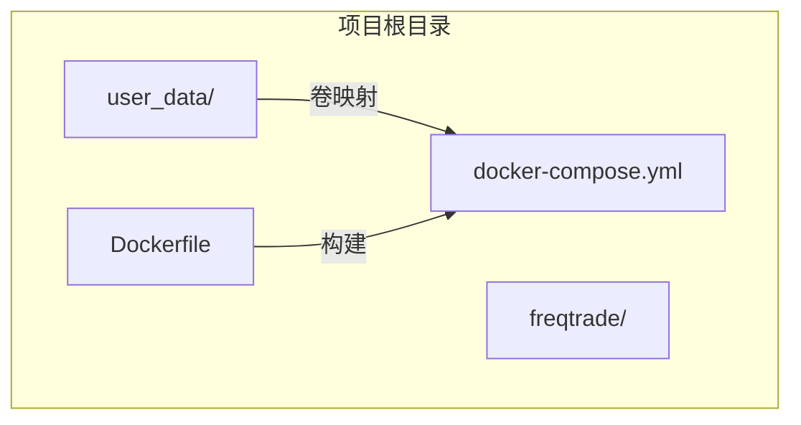
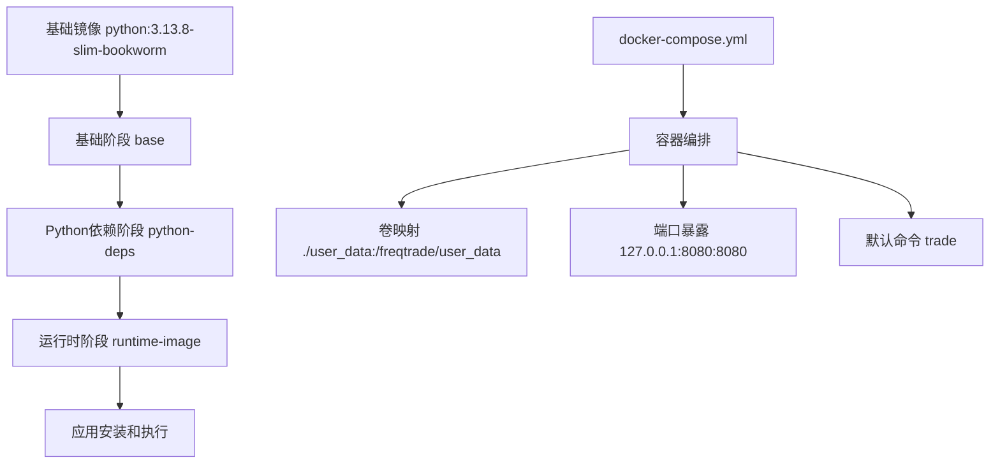
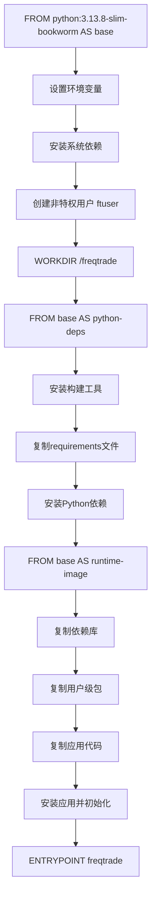
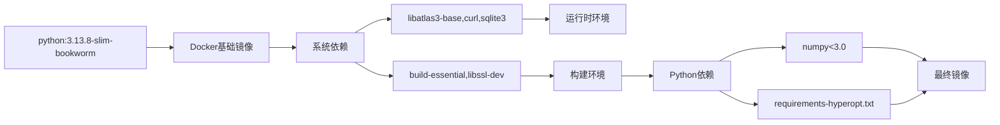

# 通过Docker安装

<cite>
**Referenced Files in This Document**   
- [Dockerfile](file://Dockerfile)
- [docker-compose.yml](file://docker-compose.yml)
- [requirements-freqai-rl.txt](file://requirements-freqai-rl.txt)
</cite>

## 目录
1. [简介](#简介)
2. [项目结构](#项目结构)
3. [核心组件](#核心组件)
4. [架构概述](#架构概述)
5. [详细组件分析](#详细组件分析)
6. [依赖分析](#依赖分析)
7. [性能考虑](#性能考虑)
8. [故障排除指南](#故障排除指南)
9. [结论](#结论)
10. [附录](#附录)（如有必要）

## 简介
本文档提供了使用Docker安装和配置Freqtrade的完整指南。涵盖了从基础镜像选择到多阶段构建过程的详细解析，以及docker-compose.yml文件中各项配置的含义说明。指导用户如何使用官方镜像快速部署，以及如何通过自定义Dockerfile构建包含特定依赖的镜像。

## 项目结构
Freqtrade项目的根目录包含Docker相关的核心配置文件，包括Dockerfile和docker-compose.yml。用户数据目录（user_data）被设计为与容器进行卷映射，以实现数据持久化。项目采用模块化结构，将核心代码、配置示例和构建辅助工具分离。



**Diagram sources**
- [Dockerfile](file://Dockerfile#L1-L52)
- [docker-compose.yml](file://docker-compose.yml#L1-L35)

**Section sources**
- [Dockerfile](file://Dockerfile#L1-L52)
- [docker-compose.yml](file://docker-compose.yml#L1-L35)

## 核心组件
核心组件包括Dockerfile中定义的多阶段构建流程和docker-compose.yml中定义的服务编排配置。Dockerfile采用多阶段构建策略优化镜像大小，而docker-compose.yml则定义了容器的运行时配置、卷映射和网络设置。

**Section sources**
- [Dockerfile](file://Dockerfile#L1-L52)
- [docker-compose.yml](file://docker-compose.yml#L1-L35)

## 架构概述
Freqtrade的Docker部署架构采用分层设计，基础层提供Python运行环境，依赖层安装必要的系统和Python包，运行时层则包含实际的应用代码和配置。通过docker-compose进行服务编排，实现了配置与代码的分离。



**Diagram sources**
- [Dockerfile](file://Dockerfile#L1-L52)
- [docker-compose.yml](file://docker-compose.yml#L1-L35)

## 详细组件分析

### Dockerfile多阶段构建分析
Dockerfile采用多阶段构建策略，分为三个主要阶段：基础阶段、Python依赖阶段和运行时阶段。这种设计有效分离了构建依赖和运行时依赖，显著减小了最终镜像的大小。

#### 多阶段构建流程


**Diagram sources**
- [Dockerfile](file://Dockerfile#L1-L52)

**Section sources**
- [Dockerfile](file://Dockerfile#L1-L52)

### docker-compose.yml配置分析
docker-compose.yml文件定义了Freqtrade服务的完整运行时配置，包括镜像选择、卷映射、端口暴露和启动命令。

#### 配置项详解
| 配置项 | 含义 | 示例值 | 说明 |
|--------|------|--------|------|
| image | 使用的Docker镜像 | freqtradeorg/freqtrade:stable | 推荐使用稳定版镜像 |
| volumes | 卷映射 | "./user_data:/freqtrade/user_data" | 实现数据持久化 |
| ports | 端口映射 | "127.0.0.1:8080:8080" | 仅限本地访问API端口 |
| command | 启动命令 | trade --config ... | 定义容器启动参数 |
| restart | 重启策略 | unless-stopped | 容器异常退出时自动重启 |

**Section sources**
- [docker-compose.yml](file://docker-compose.yml#L1-L35)

## 依赖分析
Freqtrade的Docker部署依赖于多个层次的依赖关系，包括基础镜像依赖、Python包依赖和运行时依赖。



**Diagram sources**
- [Dockerfile](file://Dockerfile#L1-L52)
- [requirements.txt](file://requirements.txt)
- [requirements-hyperopt.txt](file://requirements-hyperopt.txt)

**Section sources**
- [Dockerfile](file://Dockerfile#L1-L52)

## 性能考虑
使用多阶段构建可以显著减小最终镜像的大小，提高部署效率。通过将构建工具和运行时环境分离，避免了在生产镜像中包含不必要的构建依赖。卷映射配置确保了数据持久化，避免了容器重启导致的数据丢失。

## 故障排除指南
常见问题包括权限错误、依赖安装失败和端口冲突。确保user_data目录具有正确的读写权限，检查网络连接以确保依赖包可以正常下载，并确认8080端口未被其他进程占用。

**Section sources**
- [Dockerfile](file://Dockerfile#L1-L52)
- [docker-compose.yml](file://docker-compose.yml#L1-L35)

## 结论
本文档详细介绍了Freqtrade的Docker安装与配置方法。通过多阶段构建优化了镜像大小，使用卷映射实现了数据持久化，并通过合理的安全配置确保了API端口的安全性。用户可以根据需求选择使用官方镜像或自定义构建。

## 附录

### GPU支持配置
对于需要FreqAI-RL功能的用户，可以通过启用docker-compose.yml中的deploy部分来配置GPU支持：

```yaml
deploy:
  resources:
    reservations:
      devices:
        - driver: nvidia
          count: 1
          capabilities: [gpu]
```

此配置需要系统安装NVIDIA Docker工具包，并且requirements-freqai-rl.txt中包含了必要的深度学习依赖。

**Diagram sources**
- [docker-compose.yml](file://docker-compose.yml#L1-L35)
- [requirements-freqai-rl.txt](file://requirements-freqai-rl.txt#L1-L11)

### 最佳实践
1. **数据持久化**：始终使用卷映射将user_data目录挂载到容器外部
2. **安全配置**：仅将API端口暴露给本地回环地址(127.0.0.1)
3. **版本控制**：使用具体的镜像标签(如stable)而非latest
4. **日志管理**：通过--logfile参数指定日志文件路径
5. **版本更新**：定期拉取最新镜像以获取安全更新和功能改进