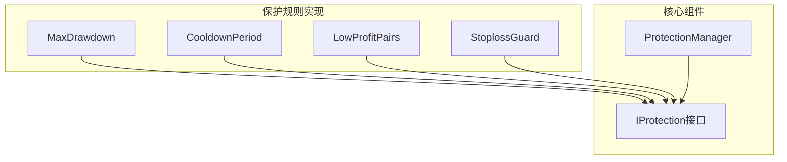
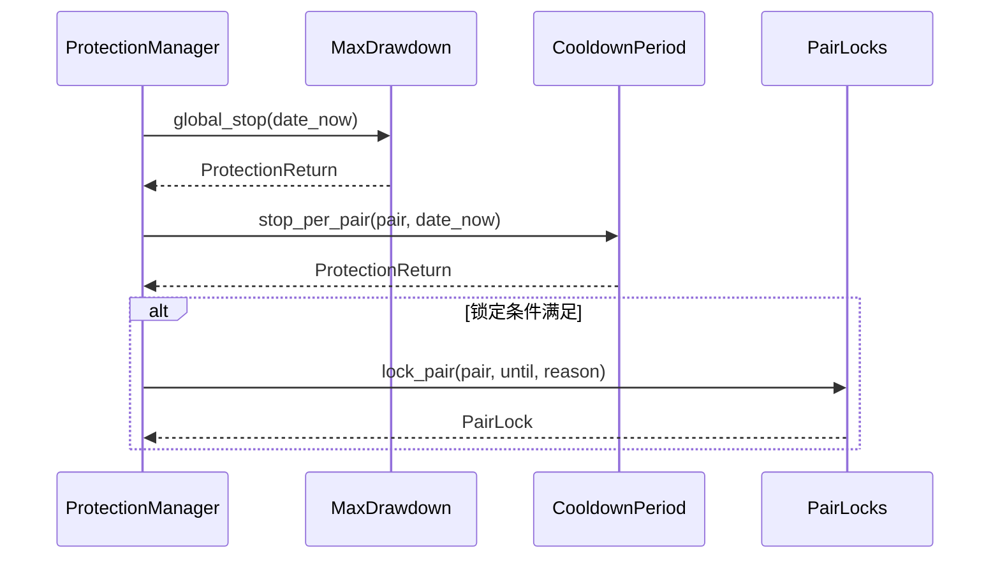

# 保护机制插件系统

<cite>
**Referenced Files in This Document**  
- [iprotection.py](file://freqtrade/plugins/protections/iprotection.py)
- [protectionmanager.py](file://freqtrade/plugins/protectionmanager.py)
- [max_drawdown_protection.py](file://freqtrade/plugins/protections/max_drawdown_protection.py)
- [cooldown_period.py](file://freqtrade/plugins/protections/cooldown_period.py)
- [low_profit_pairs.py](file://freqtrade/plugins/protections/low_profit_pairs.py)
- [stoploss_guard.py](file://freqtrade/plugins/protections/stoploss_guard.py)
</cite>

## 目录
1. [引言](#引言)
2. [核心架构](#核心架构)
3. [生命周期与状态管理](#生命周期与状态管理)
4. [保护规则协调机制](#保护规则协调机制)
5. [具体保护规则实现](#具体保护规则实现)
6. [自定义开发指南](#自定义开发指南)
7. [组合策略案例](#组合策略案例)
8. [结论](#结论)

## 引言
保护机制插件系统是Freqtrade框架中的关键风险控制组件，旨在通过可插拔的保护规则防止过度交易、控制回撤并屏蔽低效交易对。该系统通过`IProtection`接口定义统一的生命周期方法，并由`ProtectionManager`协调多个保护规则的执行。本文档将深入解析该系统的架构设计、核心组件的实现细节以及如何开发自定义保护规则。

## 核心架构
保护机制插件系统采用基于接口的插件化设计，核心由`IProtection`接口和`ProtectionManager`管理器构成。`IProtection`定义了所有保护规则必须实现的抽象方法，确保了接口的一致性。`ProtectionManager`负责加载、验证和协调所有配置的保护规则。

**Diagram sources**  
- [iprotection.py](file://freqtrade/plugins/protections/iprotection.py#L24-L140)
- [protectionmanager.py](file://freqtrade/plugins/protectionmanager.py#L19-L114)

**Section sources**
- [iprotection.py](file://freqtrade/plugins/protections/iprotection.py#L1-L141)
- [protectionmanager.py](file://freqtrade/plugins/protectionmanager.py#L1-L115)

## 生命周期与状态管理
`IProtection`接口定义了保护规则的生命周期方法，包括`global_stop`和`stop_per_pair`。这些方法在每次交易决策前被调用，以确定是否应阻止交易。状态管理通过配置参数和内部属性实现，如`_stop_duration`和`_lookback_period`，用于控制保护的持续时间和观察窗口。

**Section sources**
- [iprotection.py](file://freqtrade/plugins/protections/iprotection.py#L24-L140)

## 保护规则协调机制
`ProtectionManager`在交易决策前协调多个保护规则的执行。它遍历所有配置的保护规则，调用其`global_stop`或`stop_per_pair`方法，并根据返回的`ProtectionReturn`对象决定是否锁定交易。结果通过`PairLocks`进行聚合和持久化。

**Diagram sources**  
- [protectionmanager.py](file://freqtrade/plugins/protectionmanager.py#L19-L114)

**Section sources**
- [protectionmanager.py](file://freqtrade/plugins/protectionmanager.py#L1-L115)

## 具体保护规则实现

### 最大回撤保护
`MaxDrawdown`规则基于账户回撤阈值实现熔断逻辑。它通过`calculate_max_drawdown`函数计算指定时间窗口内的最大回撤，若超过配置的`max_allowed_drawdown`阈值，则触发全局交易停止。

**Section sources**
- [max_drawdown_protection.py](file://freqtrade/plugins/protections/max_drawdown_protection.py#L15-L101)

### 冷却期实现
`CooldownPeriod`规则通过`_cooldown_period`方法实现防止频繁交易的冷却期。它检查指定交易对在最近一次交易后的冷却时间，若仍在冷却期内，则阻止新的交易。

**Section sources**
- [cooldown_period.py](file://freqtrade/plugins/protections/cooldown_period.py#L11-L73)

### 低效交易对屏蔽
`LowProfitPairs`规则通过`_low_profit`方法实现对低效交易对的动态屏蔽。它计算指定时间窗口内交易对的总利润，若低于`required_profit`阈值，则锁定该交易对。

**Section sources**
- [low_profit_pairs.py](file://freqtrade/plugins/protections/low_profit_pairs.py#L12-L101)

### 止损后全局保护
`StoplossGuard`规则在止损触发后实施全局保护。它通过`_stoploss_guard`方法监控频繁止损事件，若在指定时间窗口内发生超过`trade_limit`次的止损且利润低于`required_profit`，则触发全局或局部交易锁定。

**Section sources**
- [stoploss_guard.py](file://freqtrade/plugins/protections/stoploss_guard.py#L13-L108)

## 自定义开发指南
开发自定义保护规则需继承`IProtection`接口并实现`global_stop`和`stop_per_pair`方法。建议通过`short_desc`方法提供简短描述，并利用`calculate_lock_end`方法计算锁定期结束时间。异常处理应通过日志记录，状态持久化可通过`PairLocks`实现。

**Section sources**
- [iprotection.py](file://freqtrade/plugins/protections/iprotection.py#L24-L140)

## 组合策略案例
通过组合多种保护机制，可以构建稳健的风险控制体系。例如，同时启用`MaxDrawdown`和`StoplossGuard`可以有效防止市场剧烈波动和频繁止损带来的风险。配置时需注意各规则的`stop_duration`和`lookback_period`参数，以避免过度保护。

**Section sources**
- [protectionmanager.py](file://freqtrade/plugins/protectionmanager.py#L1-L115)

## 结论
保护机制插件系统通过模块化设计和灵活的配置，为Freqtrade提供了强大的风险控制能力。深入理解各保护规则的实现机制和协调逻辑，有助于用户根据自身需求构建定制化的风险管理策略。