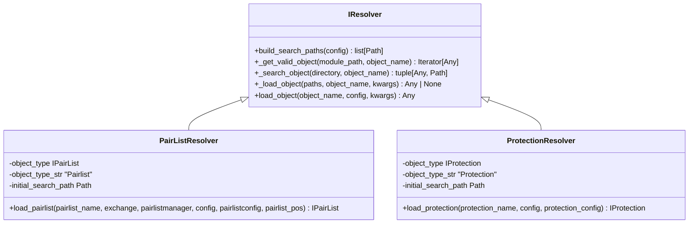
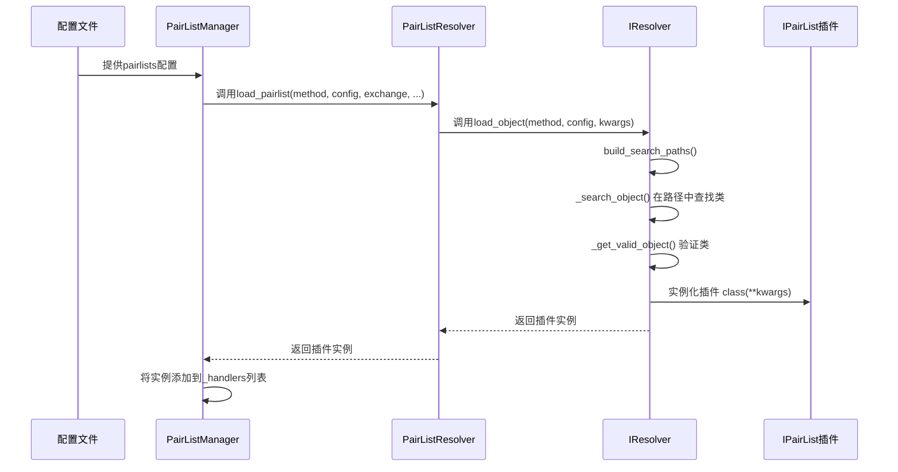
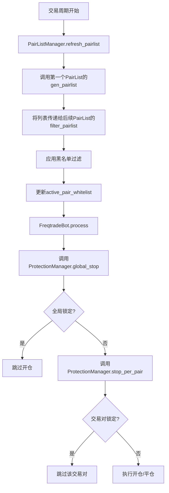

# 插件架构与扩展机制

<cite>
**本文档引用的文件**   
- [pairlist_resolver.py](file://freqtrade/resolvers/pairlist_resolver.py)
- [protection_resolver.py](file://freqtrade/resolvers/protection_resolver.py)
- [pairlistmanager.py](file://freqtrade/plugins/pairlistmanager.py)
- [protectionmanager.py](file://freqtrade/plugins/protectionmanager.py)
- [IPairList.py](file://freqtrade/plugins/pairlist/IPairList.py)
- [iresolver.py](file://freqtrade/resolvers/iresolver.py)
- [freqtradebot.py](file://freqtrade/freqtradebot.py)
</cite>

## 目录
1. [引言](#引言)
2. [插件动态发现与依赖解析](#插件动态发现与依赖解析)
3. [配置驱动的插件加载机制](#配置驱动的插件加载机制)
4. [插件管理器与核心引擎集成](#插件管理器与核心引擎集成)
5. [安全与稳定性考量](#安全与稳定性考量)
6. [扩展开发最佳实践](#扩展开发最佳实践)
7. [结论](#结论)

## 引言

Freqtrade 是一个功能强大的加密货币交易机器人，其核心优势之一在于其高度模块化和可扩展的插件架构。该架构允许用户通过配置文件灵活地加载和组合各种功能模块，如交易对列表（pairlist）和保护机制（protection），而无需修改核心代码。这种设计不仅提升了系统的灵活性和可维护性，还为社区贡献和第三方开发提供了坚实的基础。本文档将深入剖析 Freqtrade 的插件系统，重点阐述其如何通过 `resolvers` 模块实现插件的动态发现、实例化与依赖解析，并分析 `pairlistmanager` 和 `protectionmanager` 如何与核心交易引擎协同工作。

**Section sources**
- [freqtradebot.py](file://freqtrade/freqtradebot.py#L72-L763)

## 插件动态发现与依赖解析

Freqtrade 的插件解析机制建立在一个名为 `IResolver` 的抽象基类之上。该类定义了所有插件解析器的通用行为，包括搜索路径构建、模块导入、类验证和实例化。`IResolver` 通过 `build_search_paths` 方法构建一个包含多个目录的搜索路径列表，这些路径包括内置插件目录、用户数据目录下的自定义插件目录以及配置中指定的额外目录。这种分层搜索策略确保了系统既能使用内置功能，又能优先加载用户自定义的扩展。

当需要加载一个特定插件时，`IResolver` 会遍历搜索路径，利用 Python 的 `importlib` 动态导入每个 `.py` 文件。通过 `inspect` 模块，它会检查导入的模块中是否存在继承自指定基类（如 `IPairList` 或 `IProtection`）的类。一旦找到匹配的类，`IResolver` 就会调用其构造函数并传入必要的运行时上下文（如 `config`、`exchange` 等），从而完成插件的实例化。整个过程对核心引擎是透明的，实现了真正的动态加载和依赖注入。

**Diagram sources**
- [iresolver.py](file://freqtrade/resolvers/iresolver.py#L37-L289)
- [pairlist_resolver.py](file://freqtrade/resolvers/pairlist_resolver.py#L17-L56)
- [protection_resolver.py](file://freqtrade/resolvers/protection_resolver.py#L15-L43)

## 配置驱动的插件加载机制

插件的加载完全由配置文件驱动。在 `config.json` 中，用户可以通过 `pairlists` 和 `protections` 数组来声明需要启用的插件。每个数组项都是一个字典，其中 `method` 字段指定了要加载的插件类名，其余字段则作为该插件的配置参数。

`pairlist_resolver` 和 `protection_resolver` 是 `IResolver` 的具体实现，它们分别负责加载 `pairlist` 和 `protection` 类型的插件。当 `PairListManager` 或 `ProtectionManager` 初始化时，它们会遍历配置中的插件列表，调用相应的 `Resolver` 的 `load_pairlist` 或 `load_protection` 方法。这些方法会将配置中的参数打包成 `kwargs` 字典，并将其与 `config`、`exchange` 等运行时对象一起传递给 `IResolver.load_object`，最终完成插件的创建和上下文注入。这种设计使得插件的启用和配置变得极其简单，只需修改配置文件即可。

**Diagram sources**
- [pairlistmanager.py](file://freqtrade/plugins/pairlistmanager.py#L25-L61)
- [pairlist_resolver.py](file://freqtrade/resolvers/pairlist_resolver.py#L28-L56)

## 插件管理器与核心引擎集成

`PairListManager` 和 `ProtectionManager` 是插件系统与核心交易引擎之间的桥梁。`PairListManager` 负责管理一个插件链，该链以一个生成器插件（如 `StaticPairList`）开始，后跟多个过滤器插件（如 `PriceFilter`, `VolumePairList`）。在每个交易周期开始时，`refresh_pairlist` 方法会被调用，它首先调用链中第一个插件的 `gen_pairlist` 方法生成初始交易对列表，然后依次将该列表传递给后续的每个过滤器插件进行 `filter_pairlist` 操作，最终得到一个经过层层筛选的白名单。这个白名单随后被用于数据获取和交易信号生成。

`ProtectionManager` 则负责在交易执行前进行全局和局部的保护性检查。`global_stop` 方法会检查是否应该全局停止开仓，而 `stop_per_pair` 方法则会检查特定交易对是否应该被锁定。这些检查在 `FreqtradeBot` 的 `enter_positions` 和 `exit_positions` 流程中被调用，确保了风险控制策略能够及时生效。`ProtectionManager` 还负责验证配置的有效性，例如防止同时配置 `stop_duration` 和 `unlock_at` 等互斥参数。

**Diagram sources**
- [pairlistmanager.py](file://freqtrade/plugins/pairlistmanager.py#L135-L156)
- [protectionmanager.py](file://freqtrade/plugins/protectionmanager.py#L49-L61)
- [freqtradebot.py](file://freqtrade/freqtradebot.py#L72-L763)

## 安全与稳定性考量

Freqtrade 的插件架构在设计上充分考虑了安全性和稳定性。首先，插件的加载过程包含了严格的错误处理。如果一个插件模块存在语法错误或依赖缺失，`IResolver` 会捕获异常并记录警告，但不会中断整个系统的启动，从而保证了核心功能的可用性。其次，系统通过 `LoggingMixin` 提供了日志去重功能，避免了因插件频繁输出相同日志信息而导致的日志爆炸。

在沙箱执行方面，虽然插件是在同一个 Python 进程中运行，但通过定义清晰的接口契约（如 `IPairList` 和 `IProtection`），可以有效隔离插件的内部实现。插件只能通过预定义的方法和属性与核心系统交互，这在一定程度上限制了其潜在的破坏性。此外，系统还通过 `validate_protections` 等方法对配置进行校验，防止了因错误配置导致的逻辑错误。对于版本兼容性，开发者应确保插件代码与 Freqtrade 的 API 保持同步，建议通过官方发布的稳定版本进行开发和测试。

**Section sources**
- [iresolver.py](file://freqtrade/resolvers/iresolver.py#L37-L289)
- [logging_mixin.py](file://freqtrade/mixins/logging_mixin.py#L5-L41)
- [protectionmanager.py](file://freqtrade/plugins/protectionmanager.py#L115-L116)

## 扩展开发最佳实践

开发第三方插件时，应严格遵守以下最佳实践以确保其稳定性和可维护性。首先，必须实现插件对应的接口基类（如 `IPairList` 或 `IProtection`），并正确设置 `object_type` 等元数据。其次，应在 `short_desc` 和 `description` 方法中提供清晰的描述，方便用户理解和调试。

异常处理至关重要。插件内部应捕获所有可能的异常，并通过 `logger` 记录详细的错误信息，避免将异常抛出到核心引擎。对于需要外部数据的插件，应实现缓存机制以减少网络请求和提高性能。在测试方面，应编写全面的单元测试和集成测试，覆盖正常和异常场景。可以利用 `tests` 目录下的测试框架，模拟 `config` 和 `exchange` 对象来验证插件的行为。最后，应遵循 PEP 8 代码规范，并在代码中添加必要的注释和文档字符串。

**Section sources**
- [IPairList.py](file://freqtrade/plugins/pairlist/IPairList.py#L71-L287)
- [iprotection.py](file://freqtrade/plugins/protections/iprotection.py#L24-L140)

## 结论

Freqtrade 的插件架构通过 `IResolver` 基类、`Resolver` 实现和 `Manager` 管理器的协同工作，构建了一个强大、灵活且安全的扩展系统。该系统实现了插件的动态发现、配置驱动的加载、运行时上下文注入以及与核心引擎的无缝集成。通过对 `pairlist` 和 `protection` 模块的深入分析，我们可以看到 Freqtrade 如何将复杂的交易逻辑分解为可复用、可组合的组件。这种设计不仅极大地提升了系统的可配置性和可扩展性，也为开发者提供了一个清晰、规范的扩展开发路径。遵循本文档所述的最佳实践，开发者可以创建出稳定、高效且易于维护的第三方插件，进一步丰富 Freqtrade 的生态系统。