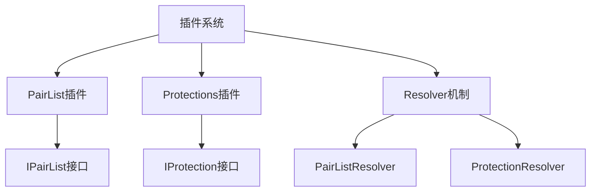
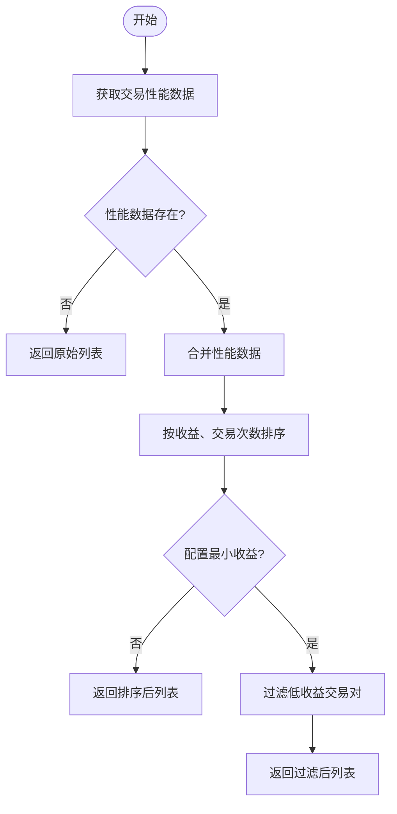
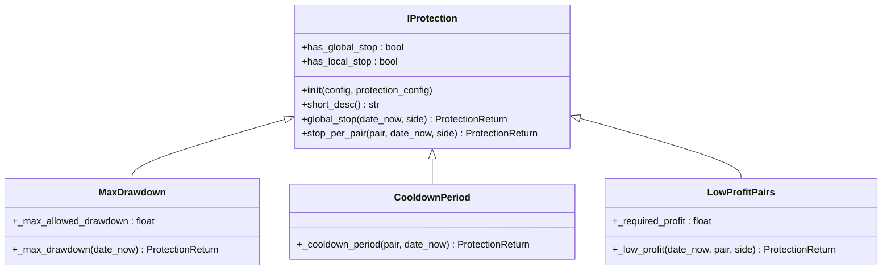

# 插件系统与扩展机制

<cite>
**本文档中引用的文件**  
- [IPairList.py](file://freqtrade/plugins/pairlist/IPairList.py)
- [VolumePairList.py](file://freqtrade/plugins/pairlist/VolumePairList.py)
- [PerformanceFilter.py](file://freqtrade/plugins/pairlist/PerformanceFilter.py)
- [pairlistmanager.py](file://freqtrade/plugins/pairlistmanager.py)
- [pairlist_resolver.py](file://freqtrade/resolvers/pairlist_resolver.py)
- [iprotection.py](file://freqtrade/plugins/protections/iprotection.py)
- [protectionmanager.py](file://freqtrade/plugins/protectionmanager.py)
- [protection_resolver.py](file://freqtrade/resolvers/protection_resolver.py)
- [max_drawdown_protection.py](file://freqtrade/plugins/protections/max_drawdown_protection.py)
- [cooldown_period.py](file://freqtrade/plugins/protections/cooldown_period.py)
- [low_profit_pairs.py](file://freqtrade/plugins/protections/low_profit_pairs.py)
</cite>

## 目录
1. [插件架构概览](#插件架构概览)
2. [PairList插件系统](#pairlist插件系统)
3. [Protections风险控制模块](#protections风险控制模块)
4. [自定义插件开发指南](#自定义插件开发指南)

## 插件架构概览

freqtrade的插件系统采用基于接口的模块化设计，通过resolvers实现动态组件加载。核心插件类型包括PairList和Protections，分别用于交易对筛选和风险控制。系统通过`IResolver`基类和具体解析器（如`PairListResolver`、`ProtectionResolver`）实现插件的动态加载与实例化，支持热加载和依赖注入机制，确保系统的灵活性和可扩展性。

**Diagram sources**
- [IPairList.py](file://freqtrade/plugins/pairlist/IPairList.py)
- [iprotection.py](file://freqtrade/plugins/protections/iprotection.py)
- [pairlist_resolver.py](file://freqtrade/resolvers/pairlist_resolver.py)
- [protection_resolver.py](file://freqtrade/resolvers/protection_resolver.py)

**Section sources**
- [IPairList.py](file://freqtrade/plugins/pairlist/IPairList.py)
- [iprotection.py](file://freqtrade/plugins/protections/iprotection.py)
- [pairlist_resolver.py](file://freqtrade/resolvers/pairlist_resolver.py)
- [protection_resolver.py](file://freqtrade/resolvers/protection_resolver.py)

## PairList插件系统

PairList插件系统实现了可扩展的交易对筛选策略，通过链式处理机制对交易对列表进行动态生成和过滤。`PairListManager`负责管理插件链，按顺序调用各插件的`gen_pairlist`和`filter_pairlist`方法，最终生成符合所有条件的交易对白名单。

### VolumePairList实现原理

`VolumePairList`作为生成器插件，基于交易量动态生成交易对列表。它支持两种模式：使用tickers的实时交易量或使用K线数据计算历史交易量。插件通过配置`number_assets`、`sort_key`等参数，筛选出交易量最高的指定数量交易对，并支持通过`min_value`和`max_value`进行过滤。

**Section sources**
- [VolumePairList.py](file://freqtrade/plugins/pairlist/VolumePairList.py)
- [pairlistmanager.py](file://freqtrade/plugins/pairlistmanager.py)

### PerformanceFilter实现原理

`PerformanceFilter`插件根据历史交易表现对交易对进行排序和筛选。它从数据库获取指定时间范围内的交易性能数据，按收益比率、交易次数和原始顺序进行排序，并可配置`min_profit`参数过滤掉收益低于阈值的交易对，确保只保留表现良好的交易对。

**Diagram sources**
- [PerformanceFilter.py](file://freqtrade/plugins/pairlist/PerformanceFilter.py)

**Section sources**
- [PerformanceFilter.py](file://freqtrade/plugins/pairlist/PerformanceFilter.py)

## Protections风险控制模块

Protections模块提供多层次的风险控制机制，包括最大回撤保护、冷却期和低利润对保护。这些保护规则可独立配置并组合使用，通过`ProtectionManager`统一管理，有效降低交易风险。

### 最大回撤保护

`MaxDrawdown`保护机制监控历史交易的最大回撤，当回撤超过配置的`max_allowed_drawdown`阈值时，触发全局停止交易，防止进一步亏损。该机制通过`calculate_max_drawdown`函数计算指定回看周期内的最大回撤，并根据配置的`stop_duration`或`unlock_at`决定停止交易的时长。

**Section sources**
- [max_drawdown_protection.py](file://freqtrade/plugins/protections/max_drawdown_protection.py)
- [protectionmanager.py](file://freqtrade/plugins/protectionmanager.py)

### 冷却期与低利润对保护

`CooldownPeriod`保护为每个交易对设置冷却期，在交易关闭后的一段时间内禁止重新开仓，防止频繁交易。`LowProfitPairs`保护则监控交易对的累计收益，当收益低于`required_profit`时锁定该交易对，避免在低效交易对上持续亏损。

**Diagram sources**
- [iprotection.py](file://freqtrade/plugins/protections/iprotection.py)
- [max_drawdown_protection.py](file://freqtrade/plugins/protections/max_drawdown_protection.py)
- [cooldown_period.py](file://freqtrade/plugins/protections/cooldown_period.py)
- [low_profit_pairs.py](file://freqtrade/plugins/protections/low_profit_pairs.py)

**Section sources**
- [max_drawdown_protection.py](file://freqtrade/plugins/protections/max_drawdown_protection.py)
- [cooldown_period.py](file://freqtrade/plugins/protections/cooldown_period.py)
- [low_profit_pairs.py](file://freqtrade/plugins/protections/low_profit_pairs.py)

## 自定义插件开发指南

开发自定义插件需遵循特定接口规范，实现必要的方法和属性。系统通过resolvers实现依赖注入和热加载，确保插件的灵活性和可维护性。

### 接口定义与依赖注入

自定义PairList插件需继承`IPairList`类，实现`needstickers`、`short_desc`等抽象方法，并可通过`available_parameters`定义配置参数。插件构造函数接收`exchange`、`config`等依赖项，由`PairListResolver`在加载时自动注入，实现依赖解耦。

**Section sources**
- [IPairList.py](file://freqtrade/plugins/pairlist/IPairList.py)
- [pairlist_resolver.py](file://freqtrade/resolvers/pairlist_resolver.py)

### 热加载机制

freqtrade的resolvers支持插件的热加载，允许在不重启系统的情况下动态加载和替换插件。`PairListResolver`和`ProtectionResolver`通过`load_object`方法实现插件类的动态导入和实例化，结合配置文件的实时读取，实现插件的无缝更新。

### 创建自定义配对列表生成器

创建新的配对列表生成器需实现`gen_pairlist`方法，该方法负责生成初始交易对列表。插件可通过`_exchange.get_markets`获取市场数据，结合自定义逻辑生成交易对，并通过`_whitelist_for_active_markets`和`verify_blacklist`进行有效性验证。

### 创建自定义保护规则

创建新的保护规则需继承`IProtection`类，实现`global_stop`或`stop_per_pair`方法。规则可通过`_config`和`_protection_config`访问配置参数，利用`Trade.get_trades_proxy`查询历史交易数据，并根据业务逻辑返回`ProtectionReturn`对象决定是否触发保护。

**Section sources**
- [IPairList.py](file://freqtrade/plugins/pairlist/IPairList.py)
- [iprotection.py](file://freqtrade/plugins/protections/iprotection.py)
- [pairlistmanager.py](file://freqtrade/plugins/pairlistmanager.py)
- [protectionmanager.py](file://freqtrade/plugins/protectionmanager.py)