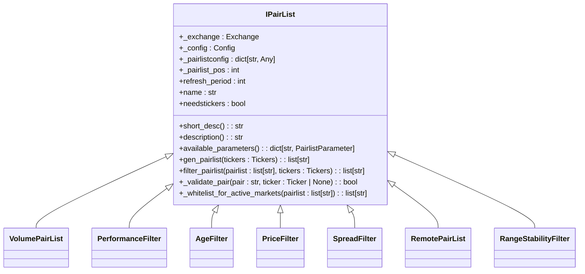
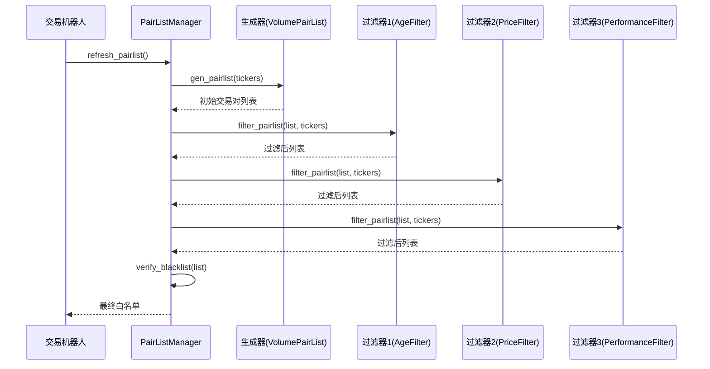
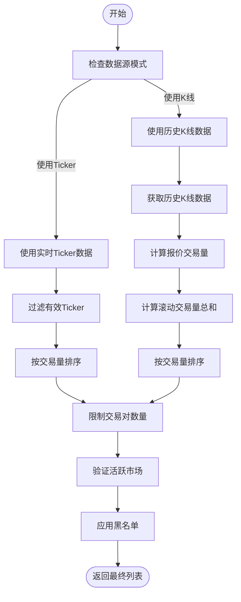
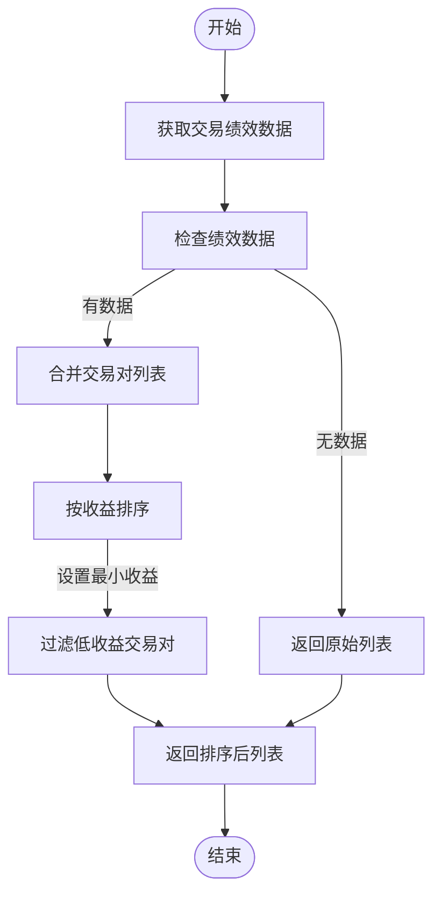
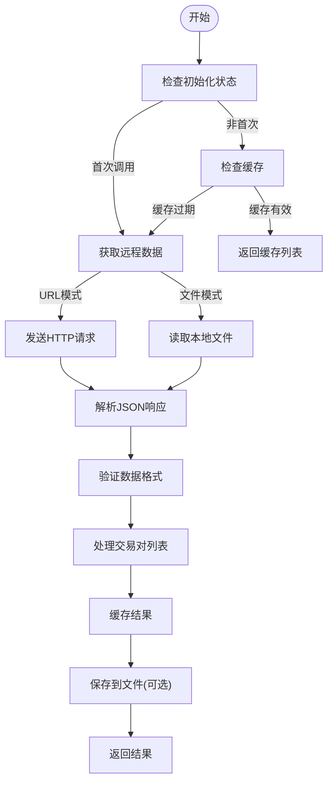
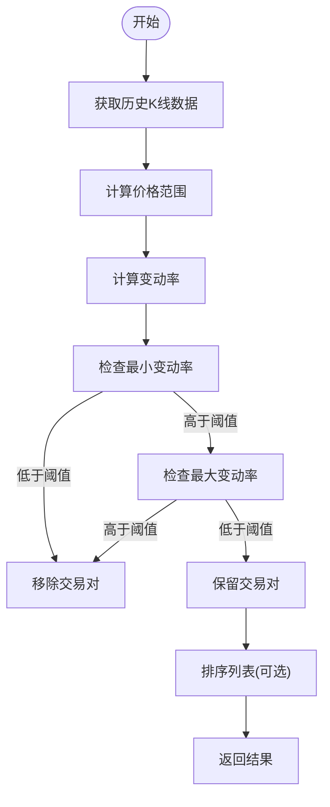
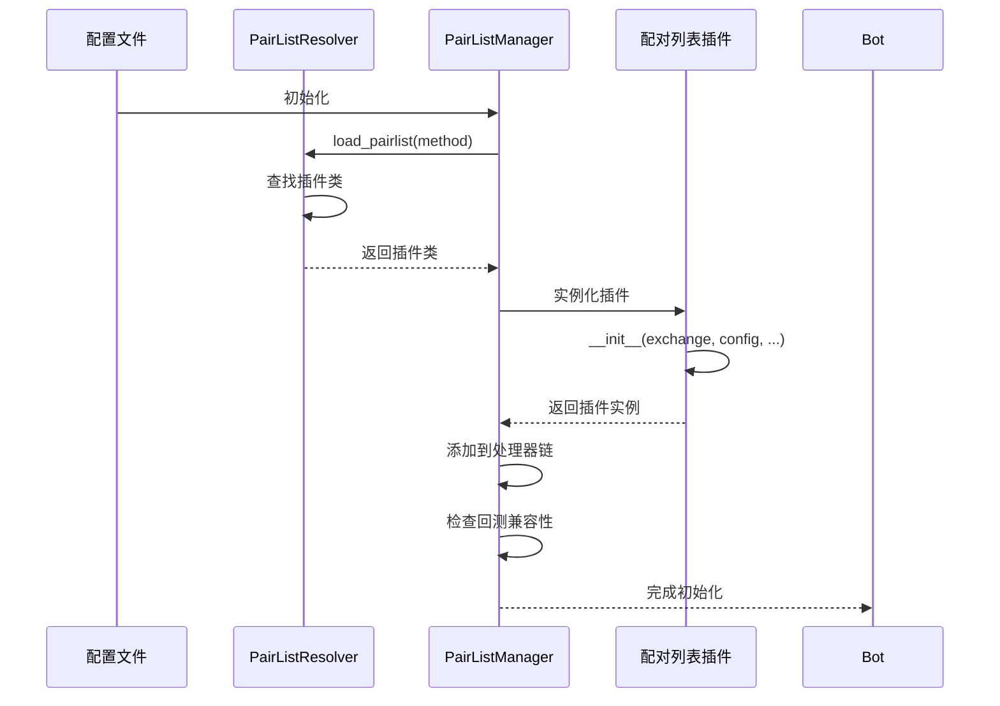

# 配对列表插件系统

<cite>
**本文档引用的文件**   
- [IPairList.py](file://freqtrade/plugins/pairlist/IPairList.py)
- [pairlistmanager.py](file://freqtrade/plugins/pairlistmanager.py)
- [VolumePairList.py](file://freqtrade/plugins/pairlist/VolumePairList.py)
- [PerformanceFilter.py](file://freqtrade/plugins/pairlist/PerformanceFilter.py)
- [AgeFilter.py](file://freqtrade/plugins/pairlist/AgeFilter.py)
- [PriceFilter.py](file://freqtrade/plugins/pairlist/PriceFilter.py)
- [SpreadFilter.py](file://freqtrade/plugins/pairlist/SpreadFilter.py)
- [RemotePairList.py](file://freqtrade/plugins/pairlist/RemotePairList.py)
- [rangestabilityfilter.py](file://freqtrade/plugins/pairlist/rangestabilityfilter.py)
</cite>

## 目录
1. [引言](#引言)
2. [核心接口设计](#核心接口设计)
3. [责任链模式实现](#责任链模式实现)
4. [VolumePairList算法分析](#volumepairlist算法分析)
5. [PerformanceFilter实现机制](#performancefilter实现机制)
6. [内置过滤器详解](#内置过滤器详解)
7. [自定义开发指南](#自定义开发指南)
8. [运行时加载流程](#运行时加载流程)

## 引言
配对列表插件系统是Freqtrade框架中的核心组件，负责动态生成和筛选交易对列表。该系统采用模块化设计，通过插件机制实现灵活的交易对管理策略。系统基于责任链模式构建，允许用户组合多个生成器和过滤器，形成复杂的筛选逻辑。整个系统在运行时动态加载，支持热更新和配置变更，为量化交易策略提供了强大的基础支持。

## 核心接口设计
配对列表系统的核心是`IPairList`抽象基类，定义了所有配对列表处理器的统一接口规范。该接口采用面向对象设计，通过抽象方法和属性约束确保插件的一致性。

**接口源码**
- [IPairList.py](file://freqtrade/plugins/pairlist/IPairList.py#L71-L287)

**接口源码**
- [IPairList.py](file://freqtrade/plugins/pairlist/IPairList.py#L71-L287)

## 责任链模式实现
配对列表管理器（PairListManager）采用责任链模式组合多个配对列表处理器，形成处理链条。该模式允许将请求沿着处理器链传递，每个处理器可以修改或过滤交易对列表。

**责任链源码**
- [pairlistmanager.py](file://freqtrade/plugins/pairlistmanager.py#L24-L214)

## VolumePairList算法分析
VolumePairList基于交易量动态筛选交易对，通过实时市场数据生成高流动性交易对列表。该算法支持两种数据源模式：实时ticker数据和历史K线数据。

**算法源码**
- [VolumePairList.py](file://freqtrade/plugins/pairlist/VolumePairList.py#L26-L314)

## PerformanceFilter实现机制
PerformanceFilter根据历史收益表现对交易对进行排序和筛选，优先选择历史表现优异的交易对。该过滤器从数据库获取交易绩效数据，实现基于历史收益的智能排序。

**实现源码**
- [PerformanceFilter.py](file://freqtrade/plugins/pairlist/PerformanceFilter.py#L18-L110)

## 内置过滤器详解

### AgeFilter
AgeFilter根据交易对上市天数进行筛选，确保只交易足够成熟的交易对。该过滤器通过获取历史K线数据来计算交易对的上市时间。

**配置参数**
- `min_days_listed`: 最小上市天数（默认10天）
- `max_days_listed`: 最大上市天数（可选）

**适用场景**
- 避免新上市交易对的高波动风险
- 筛选经过市场验证的成熟交易对

**源码**
- [AgeFilter.py](file://freqtrade/plugins/pairlist/AgeFilter.py#L22-L166)

### PriceFilter
PriceFilter基于价格特征进行筛选，支持多种价格相关条件的组合过滤。该过滤器利用实时ticker数据进行价格验证。

**配置参数**
- `low_price_ratio`: 最低价格比率
- `min_price`: 最小价格
- `max_price`: 最大价格
- `max_value`: 最大价值（价格×数量）

**适用场景**
- 避免价格过低的微小交易对
- 过滤价格波动过大的交易对
- 控制交易价值规模

**源码**
- [PriceFilter.py](file://freqtrade/plugins/pairlist/PriceFilter.py#L14-L174)

### SpreadFilter
SpreadFilter根据买卖价差进行筛选，优先选择流动性好、价差小的交易对。该过滤器利用实时ticker的bid/ask数据计算价差。

**配置参数**
- `max_spread_ratio`: 最大价差比率（默认0.5%）

**适用场景**
- 避免高滑点交易
- 选择流动性充足的交易对
- 降低交易成本

**源码**
- [SpreadFilter.py](file://freqtrade/plugins/pairlist/SpreadFilter.py#L14-L82)

## 自定义开发指南

### 数据源集成
实现新的数据源集成（如RemotePairList）需要继承`IPairList`基类，并实现`gen_pairlist`方法。以下为远程数据源集成的关键步骤：

**集成源码**
- [RemotePairList.py](file://freqtrade/plugins/pairlist/RemotePairList.py#L25-L317)

### 复合筛选策略
实现复合筛选策略（如rangestabilityfilter）需要结合多种指标进行综合判断。以下为范围稳定性过滤器的实现逻辑：

**策略源码**
- [rangestabilityfilter.py](file://freqtrade/plugins/pairlist/rangestabilityfilter.py#L21-L183)

## 运行时加载流程
配对列表系统的运行时加载流程涉及插件注册、依赖注入和动态实例化。系统通过解析器模式实现插件的动态加载和配置。

**加载源码**
- [pairlistmanager.py](file://freqtrade/plugins/pairlistmanager.py#L24-L214)
- [IPairList.py](file://freqtrade/plugins/pairlist/IPairList.py#L71-L287)