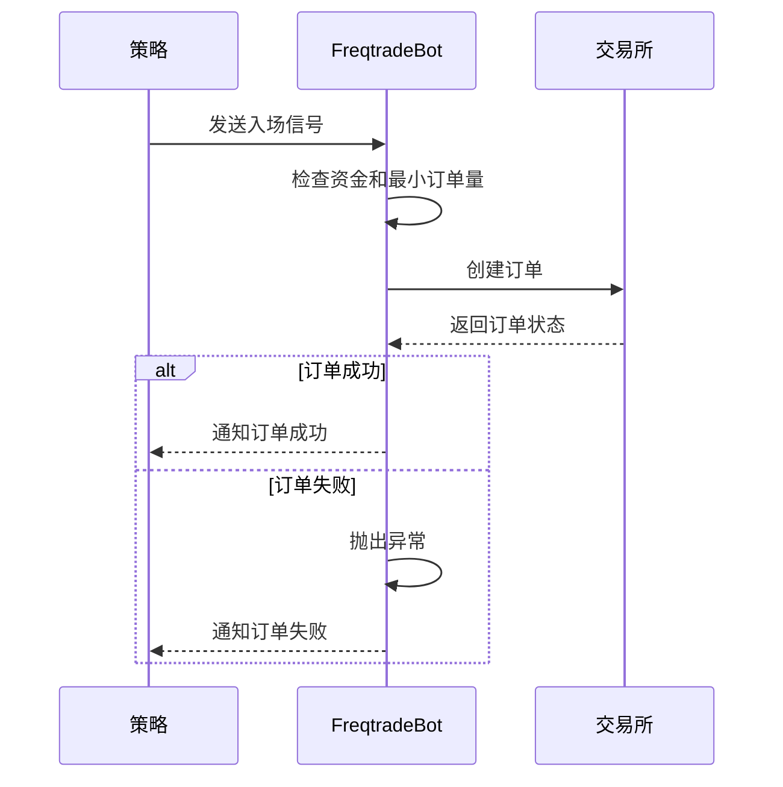
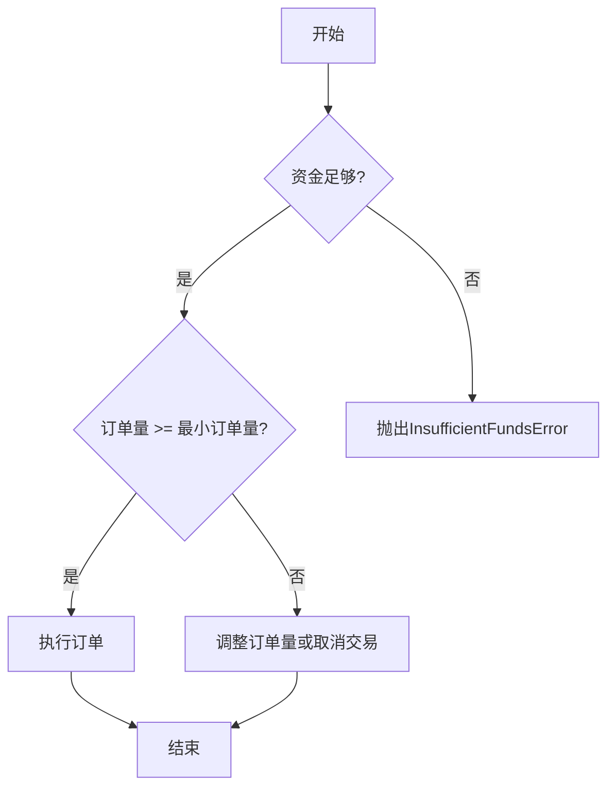
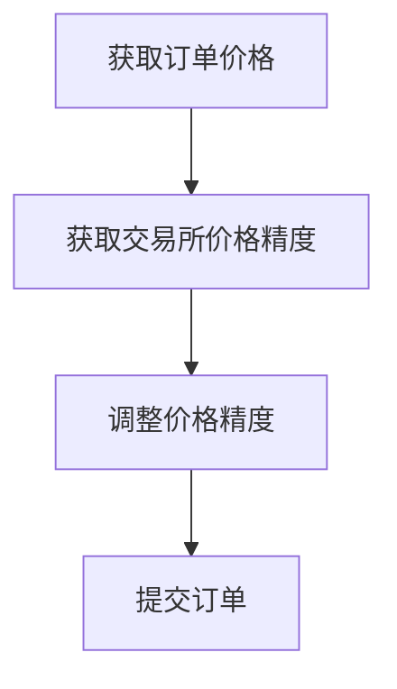
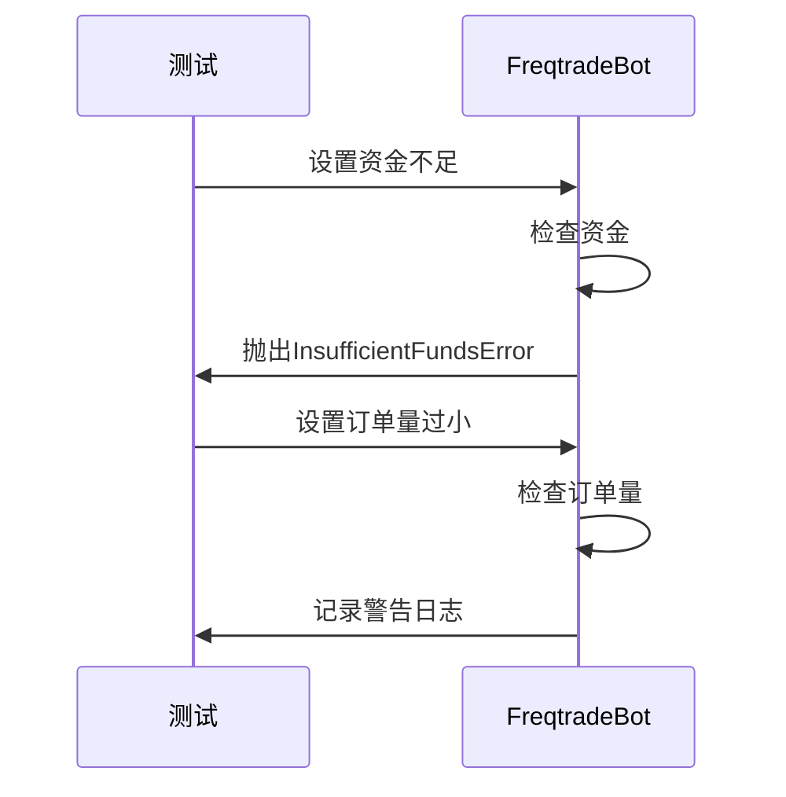

# 交易执行异常

<cite>
**本文档中引用的文件**  
- [freqtradebot.py](file://freqtrade/freqtradebot.py)
- [exceptions.py](file://freqtrade/exceptions.py)
- [wallets.py](file://freqtrade/wallets.py)
- [test_integration.py](file://tests/freqtradebot/test_integration.py)
</cite>

## 目录
1. [简介](#简介)
2. [核心异常类型](#核心异常类型)
3. [订单处理流程分析](#订单处理流程分析)
4. [资金检查与最小订单量验证](#资金检查与最小订单量验证)
5. [价格精度适配](#价格精度适配)
6. [集成测试场景分析](#集成测试场景分析)
7. [最佳实践](#最佳实践)

## 简介
本文档深入探讨了在使用Freqtrade进行交易执行过程中可能遇到的各类错误类型，包括`InvalidOrderException`、`InsufficientFundsError`、`OrderTooSmall`等。基于`freqtradebot.py`中的订单处理流程和`exceptions.py`中定义的异常体系，详细解释了各类错误的触发条件和处理机制。通过分析测试用例中的集成测试场景，展示了如何在策略中预判并处理这些异常，并提供了资金检查、最小订单量验证和价格精度适配的最佳实践。

## 核心异常类型

Freqtrade的异常体系以`FreqtradeException`为基类，派生出多个子类，用于处理不同类型的错误。主要异常类型包括：

- **InvalidOrderException**: 当订单无效时抛出，例如尝试取消已成交的订单。
- **InsufficientFundsError**: 当账户资金不足时抛出，无法创建新订单。
- **RetryableOrderError**: 当订单未找到时抛出，通常需要重试。
- **DependencyException**: 表示依赖关系未满足，如资金不足。
- **ExchangeError**: 由交易所引发的错误。

这些异常在交易执行过程中起到关键作用，帮助系统识别和处理各种异常情况。

**Section sources**
- [exceptions.py](file://freqtrade/exceptions.py#L42-L61)

## 订单处理流程分析

交易执行的核心流程在`freqtradebot.py`的`FreqtradeBot`类中实现。主要流程包括：

1. **创建交易**: `create_trade`方法检查交易策略的入场信号，如果信号触发，则创建新的交易记录并发出入场订单。
2. **资金检查**: 在创建交易前，系统会检查可用资金是否足够。
3. **订单执行**: `execute_entry`方法负责执行入场订单，处理订单的创建和状态更新。
4. **异常处理**: 在订单执行过程中，如果遇到异常（如资金不足），系统会抛出相应的异常并进行处理。

**Diagram sources**
- [freqtradebot.py](file://freqtrade/freqtradebot.py#L1500-L1600)

**Section sources**
- [freqtradebot.py](file://freqtrade/freqtradebot.py#L1500-L1600)

## 资金检查与最小订单量验证

在交易执行过程中，资金检查和最小订单量验证是确保交易成功的关键步骤。

### 资金检查
系统通过`Wallets`类的`get_available_stake_amount`方法检查可用资金。如果可用资金不足，系统会抛出`DependencyException`异常。

### 最小订单量验证
系统通过`exchange.get_min_pair_stake_amount`方法获取最小订单量。如果订单量小于最小订单量，系统会调整订单量或取消交易。

**Diagram sources**
- [wallets.py](file://freqtrade/wallets.py#L391-L417)
- [freqtradebot.py](file://freqtrade/freqtradebot.py#L2020-L2036)

**Section sources**
- [wallets.py](file://freqtrade/wallets.py#L391-L417)
- [freqtradebot.py](file://freqtrade/freqtradebot.py#L2020-L2036)

## 价格精度适配

在交易执行过程中，价格精度适配是确保订单能够被交易所接受的重要步骤。系统通过`exchange.price_to_precision`方法将价格调整到交易所要求的精度。

### 价格精度适配流程
1. 获取交易所的价格精度。
2. 将订单价格调整到指定精度。
3. 提交订单。

**Diagram sources**
- [freqtradebot.py](file://freqtrade/freqtradebot.py#L1500-L1600)

**Section sources**
- [freqtradebot.py](file://freqtrade/freqtradebot.py#L1500-L1600)

## 集成测试场景分析

通过分析`test_integration.py`中的集成测试场景，可以更好地理解异常处理机制。

### 测试场景1: 资金不足
在`test_dca_exiting`测试中，当资金不足时，系统会抛出`DependencyException`异常，并记录相关日志。

### 测试场景2: 订单量过小
在`test_dca_exiting`测试中，当订单量过小时，系统会记录警告日志，并调整订单量。

**Diagram sources**
- [test_integration.py](file://tests/freqtradebot/test_integration.py#L623-L647)

**Section sources**
- [test_integration.py](file://tests/freqtradebot/test_integration.py#L623-L647)

## 最佳实践

### 资金检查
- 在创建交易前，始终检查可用资金。
- 使用`get_available_stake_amount`方法获取可用资金。

### 最小订单量验证
- 在创建订单前，检查订单量是否大于最小订单量。
- 使用`get_min_pair_stake_amount`方法获取最小订单量。

### 价格精度适配
- 在提交订单前，使用`price_to_precision`方法调整价格精度。

### 异常处理
- 捕获并处理`InvalidOrderException`、`InsufficientFundsError`等异常。
- 记录详细的日志，便于调试和分析。

**Section sources**
- [freqtradebot.py](file://freqtrade/freqtradebot.py#L1500-L1600)
- [wallets.py](file://freqtrade/wallets.py#L391-L417)
- [test_integration.py](file://tests/freqtradebot/test_integration.py#L623-L647)