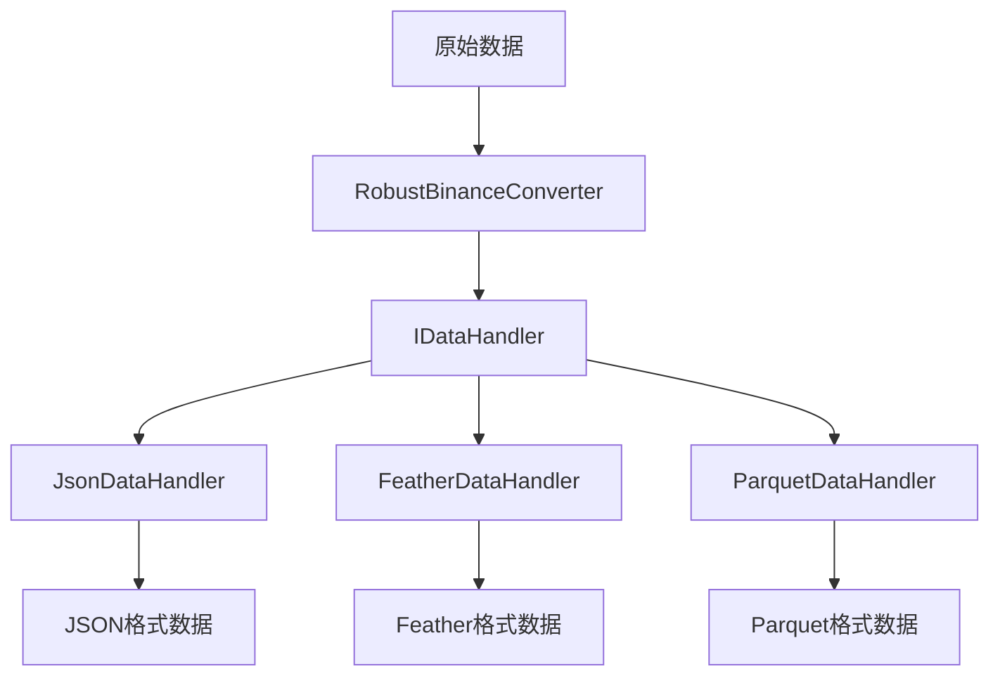
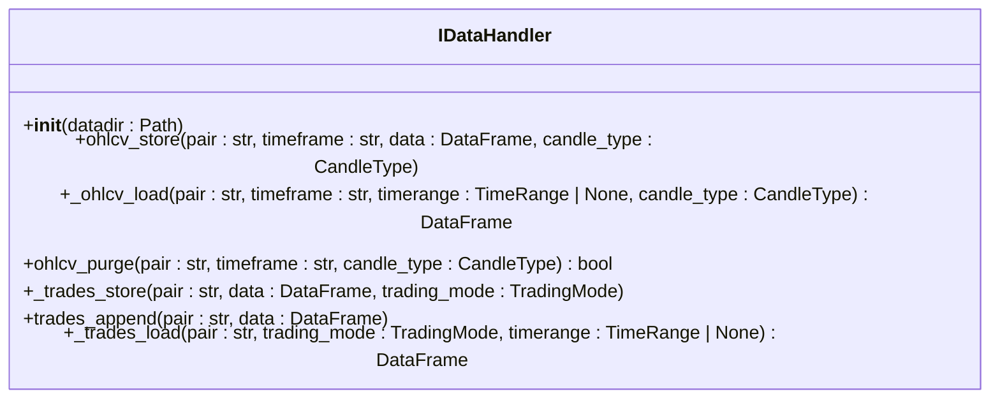
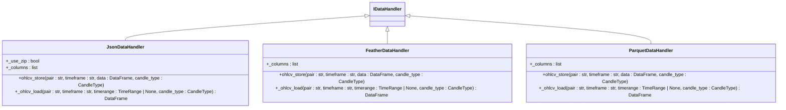
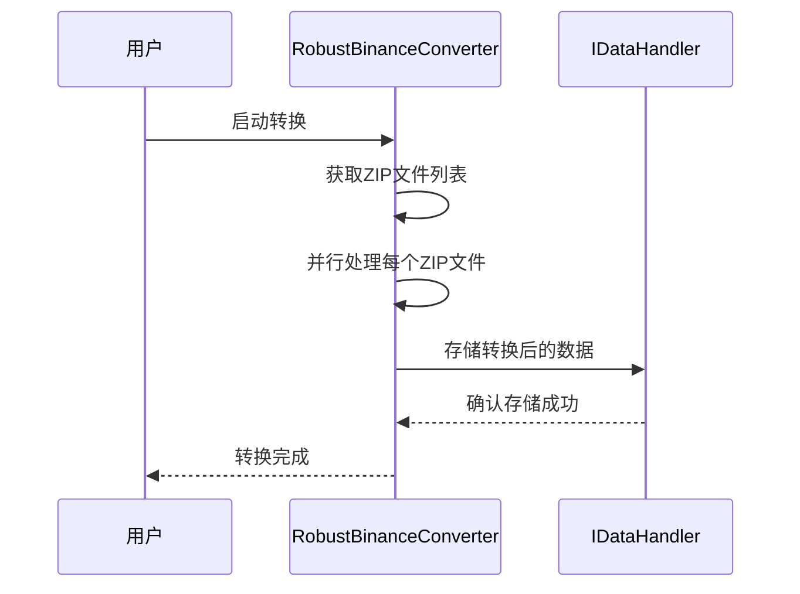
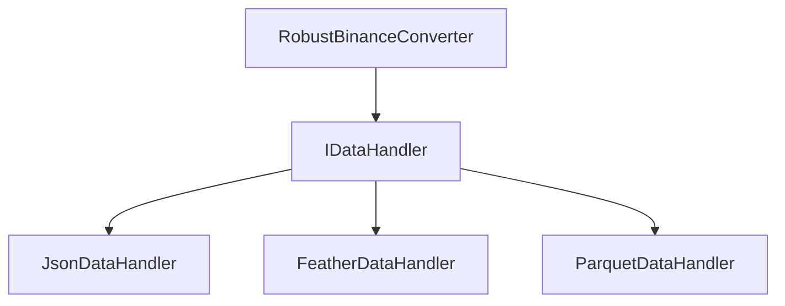

# 数据处理问题

<cite>
**本文档中引用的文件**  
- [robust_binance_converter.py](file://robust_binance_converter.py)
- [jsondatahandler.py](file://freqtrade/data/history/datahandlers/jsondatahandler.py)
- [featherdatahandler.py](file://freqtrade/data/history/datahandlers/featherdatahandler.py)
- [parquetdatahandler.py](file://freqtrade/data/history/datahandlers/parquetdatahandler.py)
- [idatahandler.py](file://freqtrade/data/history/datahandlers/idatahandler.py)
</cite>

## 目录
1. [简介](#简介)
2. [项目结构](#项目结构)
3. [核心组件](#核心组件)
4. [架构概述](#架构概述)
5. [详细组件分析](#详细组件分析)
6. [依赖分析](#依赖分析)
7. [性能考虑](#性能考虑)
8. [故障排除指南](#故障排除指南)
9. [结论](#结论)

## 简介
本文档全面解析在历史数据下载、格式转换和存储过程中可能出现的问题，如数据缺失、时间戳错位、K线精度不一致等。基于 `datahandlers` 模块的不同实现（JSON、Feather、Parquet）和 `robust_binance_converter.py` 中的容错处理机制，说明如何确保数据完整性。通过分析测试用例中的边界情况，提供数据校验脚本、重复记录处理和跨平台数据迁移的最佳实践指南。

## 项目结构
`freqtrade` 项目的数据处理模块主要集中在 `freqtrade/data/history/datahandlers` 目录下，该目录包含了多种数据处理格式的实现。`robust_binance_converter.py` 位于项目根目录，用于处理从币安下载的原始数据并将其转换为 Freqtrade 可用的格式。

**Section sources**
- [robust_binance_converter.py](file://robust_binance_converter.py#L1-L284)
- [idatahandler.py](file://freqtrade/data/history/datahandlers/idatahandler.py#L1-L585)

## 核心组件
核心组件包括 `IDataHandler` 接口及其具体实现类 `JsonDataHandler`、`FeatherDataHandler` 和 `ParquetDataHandler`，以及用于数据转换的 `RobustBinanceConverter` 类。这些组件共同确保了数据的完整性、一致性和高效性。

**Section sources**
- [idatahandler.py](file://freqtrade/data/history/datahandlers/idatahandler.py#L32-L531)
- [jsondatahandler.py](file://freqtrade/data/history/datahandlers/jsondatahandler.py#L17-L145)
- [featherdatahandler.py](file://freqtrade/data/history/datahandlers/featherdatahandler.py#L15-L184)
- [parquetdatahandler.py](file://freqtrade/data/history/datahandlers/parquetdatahandler.py#L14-L132)
- [robust_binance_converter.py](file://robust_binance_converter.py#L136-L240)

## 架构概述
系统架构采用抽象工厂模式，通过 `IDataHandler` 接口定义了数据处理的基本操作，具体的实现类负责不同格式的数据读写。`RobustBinanceConverter` 类则负责从原始数据源读取数据，并通过 `IDataHandler` 的具体实现将数据存储到目标格式中。

**Diagram sources**
- [robust_binance_converter.py](file://robust_binance_converter.py#L136-L240)
- [idatahandler.py](file://freqtrade/data/history/datahandlers/idatahandler.py#L32-L531)

## 详细组件分析

### IDataHandler 接口分析
`IDataHandler` 是所有数据处理类的基类，定义了数据加载、存储、删除等基本操作。它通过抽象方法确保所有子类都实现了必要的功能。

**Diagram sources**
- [idatahandler.py](file://freqtrade/data/history/datahandlers/idatahandler.py#L32-L531)

### 数据处理格式分析
`JsonDataHandler`、`FeatherDataHandler` 和 `ParquetDataHandler` 分别实现了 JSON、Feather 和 Parquet 格式的数据处理。每种格式都有其特点，例如 Feather 和 Parquet 在读写速度和存储效率上优于 JSON。

**Diagram sources**
- [jsondatahandler.py](file://freqtrade/data/history/datahandlers/jsondatahandler.py#L17-L145)
- [featherdatahandler.py](file://freqtrade/data/history/datahandlers/featherdatahandler.py#L15-L184)
- [parquetdatahandler.py](file://freqtrade/data/history/datahandlers/parquetdatahandler.py#L14-L132)

### RobustBinanceConverter 分析
`RobustBinanceConverter` 类负责处理从币安下载的 ZIP 文件，提取其中的 CSV 数据，并进行必要的清洗和转换，最终存储为 Freqtrade 支持的格式。

**Diagram sources**
- [robust_binance_converter.py](file://robust_binance_converter.py#L136-L240)

## 依赖分析
`IDataHandler` 接口被多个具体的数据处理类所实现，而 `RobustBinanceConverter` 依赖于 `IDataHandler` 接口来完成数据的存储。这种设计使得系统具有良好的扩展性和灵活性。

**Diagram sources**
- [robust_binance_converter.py](file://robust_binance_converter.py#L136-L240)
- [idatahandler.py](file://freqtrade/data/history/datahandlers/idatahandler.py#L32-L531)

## 性能考虑
使用 Feather 和 Parquet 格式可以显著提高数据读写速度和存储效率。`RobustBinanceConverter` 通过并行处理多个 ZIP 文件来加速数据转换过程。

## 故障排除指南
在数据处理过程中，可能会遇到数据缺失、时间戳错位等问题。建议使用数据校验脚本来验证数据的完整性，并定期检查数据源的稳定性。

**Section sources**
- [robust_binance_converter.py](file://robust_binance_converter.py#L1-L284)
- [idatahandler.py](file://freqtrade/data/history/datahandlers/idatahandler.py#L32-L531)

## 结论
通过合理的设计和实现，`freqtrade` 项目能够有效地处理历史数据的下载、格式转换和存储，确保数据的完整性和一致性。使用 `RobustBinanceConverter` 和 `IDataHandler` 接口的不同实现，可以灵活应对不同的数据处理需求。