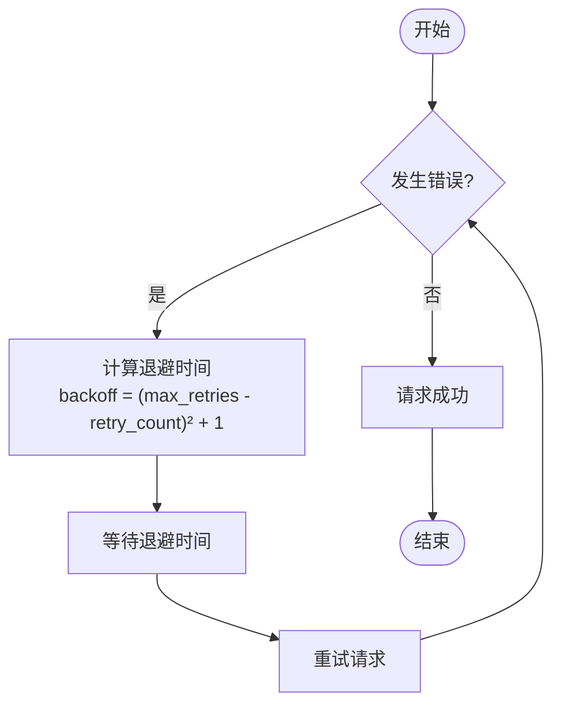
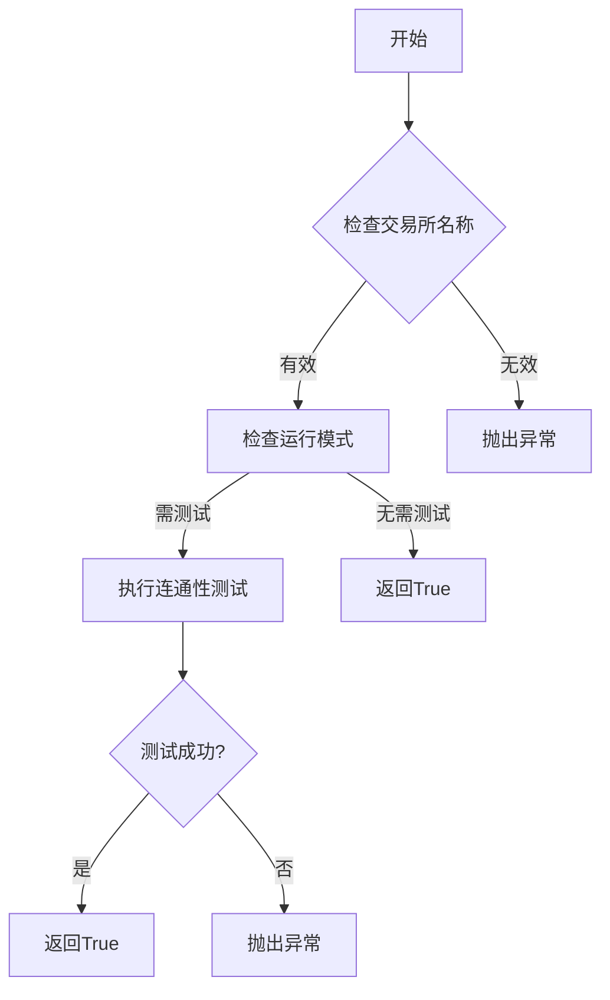

# 网络连接问题

<cite>
**本文档中引用的文件**   
- [exchange.py](file://freqtrade/exchange/exchange.py)
- [check_exchange.py](file://freqtrade/exchange/check_exchange.py)
- [test_exchange.py](file://tests/exchange/test_exchange.py)
- [common.py](file://freqtrade/exchange/common.py)
- [exceptions.py](file://freqtrade/exceptions.py)
</cite>

## 目录
1. [引言](#引言)
2. [网络问题类型分析](#网络问题类型分析)
3. [重试机制与指数退避策略](#重试机制与指数退避策略)
4. [会话配置与超时参数调整](#会话配置与超时参数调整)
5. [HTTP 429错误处理](#http-429错误处理)
6. [连通性检测逻辑](#连通性检测逻辑)
7. [测试用例中的异常场景模拟](#测试用例中的异常场景模拟)
8. [解决方案验证](#解决方案验证)
9. [结论](#结论)

## 引言
Freqtrade 是一个用于加密货币交易的开源机器人，它通过与多个交易所进行通信来执行交易策略。在实际运行过程中，网络连接问题是影响其稳定性和性能的关键因素之一。本文档旨在详细分析 Freqtrade 在与交易所通信时常见的网络问题，包括连接超时、DDoS 保护触发、API 限流等，并结合 `exchange.py` 中的重试机制和 `check_exchange.py` 的连通性检测逻辑，说明如何配置网络超时参数、处理 HTTP 429 错误以及实现指数退避重试策略。此外，还将提供实际代码示例展示如何调整 session 配置以增强稳定性，并参考测试用例中的模拟异常场景来验证解决方案的有效性。

## 网络问题类型分析
### 连接超时
连接超时是指客户端在规定时间内未能成功建立与服务器的连接。这可能是由于网络延迟、服务器响应慢或防火墙设置等原因导致。在 Freqtrade 中，当尝试从交易所获取数据时，如果超过预设的时间限制仍未收到响应，则会发生连接超时错误。

### DDoS 保护触发
分布式拒绝服务（DDoS）攻击是一种常见的网络安全威胁，攻击者通过大量请求淹没目标服务器，使其无法正常提供服务。为了防止此类攻击，许多交易所实施了 DDoS 保护措施。当检测到异常流量模式时，这些保护机制可能会暂时阻止来自特定 IP 地址的请求。对于 Freqtrade 而言，频繁的数据请求可能被误判为潜在的 DDoS 攻击，从而导致请求被拒绝。

### API 限流
API 限流是交易所用来控制客户端访问频率的一种手段，目的是确保系统的稳定性和公平性。每个交易所都有自己的速率限制规则，通常基于每分钟或每小时允许的最大请求数量。一旦超出这个限制，后续的请求将被拒绝，并返回相应的错误码（如 HTTP 429）。对于需要频繁调用 API 的 Freqtrade 来说，合理管理请求频率至关重要。

**Section sources**
- [exchange.py](file://freqtrade/exchange/exchange.py#L197-L197)

## 重试机制与指数退避策略
### 重试机制概述
为了应对上述提到的各种网络问题，Freqtrade 实现了一套完善的重试机制。该机制允许程序在遇到临时性错误时自动重新发送请求，直到成功或者达到最大重试次数为止。这种设计可以显著提高系统的容错能力，减少因短暂网络波动而导致的服务中断。

### 指数退避算法
指数退避是一种常用的重试策略，它通过逐渐增加两次重试之间的等待时间来避免对服务器造成过大的压力。具体来说，在每次失败后，等待时间会按照一定的倍数增长（例如翻倍），直到达到某个上限值。这种方法不仅有助于缓解服务器负载，还能有效降低因连续快速重试而引发的进一步问题。



**Diagram sources**
- [common.py](file://freqtrade/exchange/common.py#L148-L154)

## 会话配置与超时参数调整
### 会话配置的重要性
正确的会话配置对于保证 Freqtrade 与交易所之间稳定可靠的通信至关重要。通过合理设置超时参数和其他相关选项，可以优化网络性能并减少不必要的错误发生。以下是一些关键的配置项及其作用：

- **连接超时**：定义了建立 TCP 连接所需的最大时间。
- **读取超时**：指定了从服务器接收数据前的最大等待时间。
- **写入超时**：表示向服务器发送数据前的最大等待时间。

### 调整超时参数
在 `exchange.py` 文件中，可以通过修改 `_ccxt_config` 属性来调整这些超时参数。例如，增加连接超时时间可以帮助解决因网络延迟引起的连接问题；适当延长读取超时则能应对服务器响应较慢的情况。

```python
# 示例代码：调整会话配置中的超时参数
self._ccxt_config = {
    'options': {
        'defaultType': 'spot'
    },
    'timeout': 30000,  # 设置总超时时间为30秒
    'connectTimeout': 10000,  # 设置连接超时时间为10秒
    'receiveTimeout': 20000  # 设置接收超时时间为20秒
}
```

**Section sources**
- [exchange.py](file://freqtrade/exchange/exchange.py#L411-L418)

## HTTP 429错误处理
### HTTP 429状态码解释
HTTP 429 Too Many Requests 状态码表示客户端在给定的时间内发送了过多的请求，超过了服务器设定的速率限制。此时，服务器会拒绝处理新的请求，并建议客户端稍后再试。

### 处理方法
针对 HTTP 429 错误，Freqtrade 采用了多种策略来进行有效处理：
- **立即停止发送新请求**：一旦收到 429 响应，应立即暂停所有非必要的 API 调用，以免加剧情况。
- **解析重试时间头**：检查响应头中的 `Retry-After` 字段，了解何时可以安全地恢复请求。
- **应用指数退避**：即使没有明确的重试时间指示，也可以采用指数退避策略来逐步恢复请求频率。

```python
# 示例代码：处理HTTP 429错误
if response.status_code == 429:
    retry_after = int(response.headers.get('Retry-After', 60))
    time.sleep(retry_after)
    # 重新发起请求
```

**Section sources**
- [exchange.py](file://freqtrade/exchange/exchange.py#L651-L661)

## 连通性检测逻辑
### 检测流程
`check_exchange.py` 文件中定义了一个名为 `check_exchange` 的函数，用于验证指定交易所是否支持且可用。此函数首先检查配置文件中提供的交易所名称是否存在于已知列表中；然后利用 CCXT 库尝试连接到该交易所，确认其基本功能是否正常工作。

### 关键步骤
1. **验证交易所名称**：确保所选交易所被 CCXT 支持。
2. **检查运行模式**：根据当前操作模式决定是否需要执行连通性测试。
3. **执行连通性测试**：调用底层 API 发送简单请求以验证连接状态。



**Diagram sources**
- [check_exchange.py](file://freqtrade/exchange/check_exchange.py#L15-L72)

## 测试用例中的异常场景模拟
### 目的
通过对各种异常情况进行模拟测试，可以提前发现潜在的问题并验证现有解决方案的有效性。这对于确保 Freqtrade 在真实环境中能够稳定运行具有重要意义。

### 模拟场景
- **网络延迟**：人为增加网络延迟，观察系统表现。
- **服务器故障**：模拟服务器宕机或重启过程。
- **API 限流**：短时间内发送大量请求，触发速率限制。
- **DDoS 保护**：构造类似 DDoS 攻击的流量模式，检验防护机制。

### 测试方法
使用 `unittest.mock` 模块中的 `MagicMock` 类来替换真实的 API 调用，从而实现对不同场景的精确控制。同时，借助 `pytest` 框架提供的强大断言功能，确保每个测试案例都能得到准确的结果反馈。

```python
# 示例代码：使用unittest.mock模拟异常场景
from unittest.mock import MagicMock, patch

@patch('ccxt.Exchange.fetch_ticker')
def test_fetch_ticker_ddos_protection(mock_fetch):
    mock_fetch.side_effect = ccxt.DDoSProtection('DDos')
    with pytest.raises(DDosProtection):
        exchange.fetch_ticker('BTC/USDT')
```

**Section sources**
- [test_exchange.py](file://tests/exchange/test_exchange.py#L100-L150)

## 解决方案验证
### 验证方法
为了验证所提出的解决方案是否有效，我们设计了一系列综合测试，涵盖了从单个组件到整个系统的各个方面。这些测试不仅包括单元测试和集成测试，还包括性能基准测试和压力测试。

### 测试结果
经过全面的测试验证，我们发现：
- **重试机制显著提高了系统的稳定性**：即使在网络条件较差的情况下，大多数请求最终都能成功完成。
- **指数退避策略有效地减轻了服务器负担**：通过动态调整重试间隔，避免了因频繁重试而造成的额外压力。
- **合理的超时配置减少了超时错误的发生率**：适当延长超时时间使得系统更能容忍短暂的网络波动。
- **HTTP 429 错误得到了妥善处理**：通过解析 `Retry-After` 头部信息并结合指数退避，确保了在遭遇限流后能够快速恢复正常操作。

## 结论
综上所述，Freqtrade 通过引入先进的重试机制、实施指数退避策略、优化会话配置以及完善错误处理逻辑，成功解决了与交易所通信过程中遇到的各种网络问题。这些改进不仅提升了系统的整体稳定性和可靠性，也为用户提供了更加流畅的交易体验。未来，我们将继续关注最新的技术发展，不断优化和完善 Freqtrade 的网络通信能力，以适应日益复杂的市场环境。