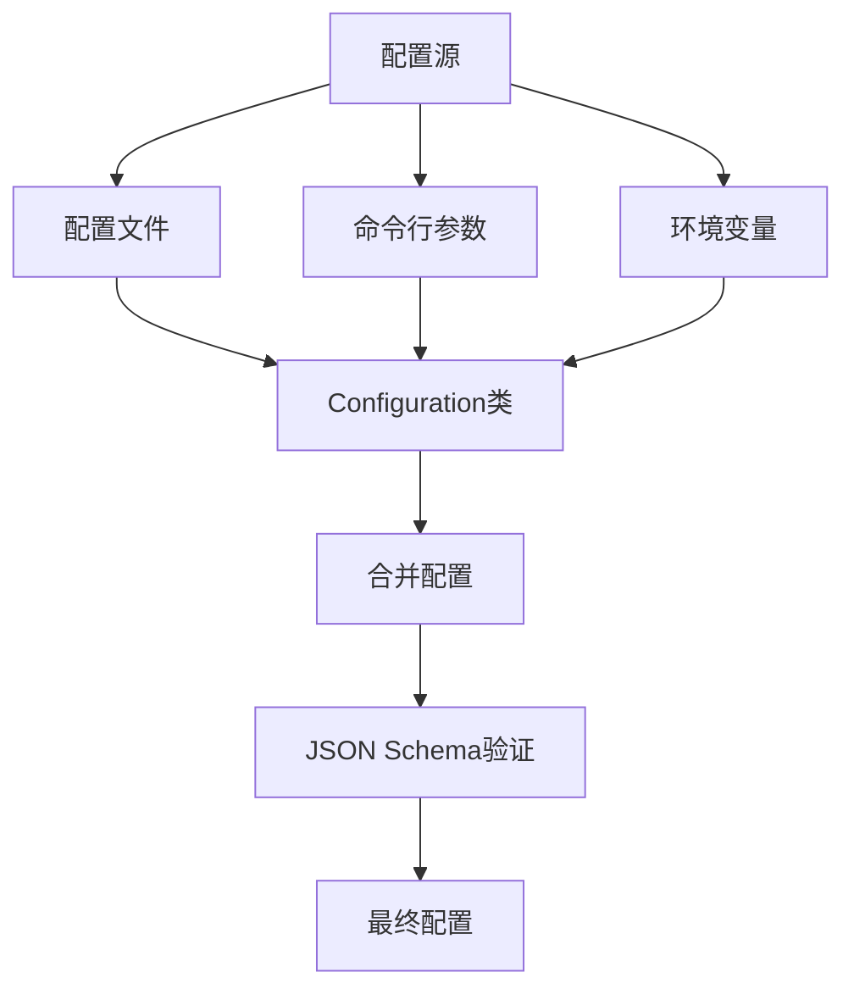
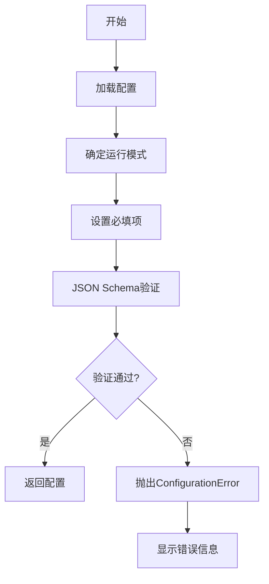

# 配置错误排查

<cite>
**本文档中引用的文件**  
- [configuration.py](file://freqtrade/configuration/configuration.py)
- [config_full.example.json](file://config_examples/config_full.example.json)
- [test_configuration.py](file://tests/test_configuration.py)
- [config_schema.py](file://freqtrade/config_schema/config_schema.py)
</cite>

## 目录
1. [简介](#简介)
2. [配置文件结构与验证机制](#配置文件结构与验证机制)
3. [常见配置错误类型](#常见配置错误类型)
4. [JSON Schema 验证详解](#json-schema-验证详解)
5. [非法配置测试用例分析](#非法配置测试用例分析)
6. [配置调试技巧](#配置调试技巧)
7. [环境变量覆盖机制](#环境变量覆盖机制)
8. [动态配置加载最佳实践](#动态配置加载最佳实践)

## 简介
本文档系统性地整理了 Freqtrade 项目中配置文件相关的典型错误，包括字段命名错误、类型不匹配、必填项缺失等问题。基于 `configuration.py` 中的验证逻辑和 `config_full.example.json` 的完整示例，详细说明了如何利用 JSON Schema 进行配置校验。结合测试用例中的非法配置场景，提供了配置文件调试技巧、环境变量覆盖机制和动态配置加载的最佳实践。

## 配置文件结构与验证机制
Freqtrade 的配置系统通过 `Configuration` 类统一管理，该类负责从文件、命令行参数和环境变量中加载配置，并进行验证和合并。配置文件采用 JSON 格式，支持通过 `add_config_files` 字段递归加载其他配置文件，实现配置的模块化管理。

**Diagram sources**
- [configuration.py](file://freqtrade/configuration/configuration.py#L33-L546)
- [load_config.py](file://freqtrade/configuration/load_config.py#L79-L119)

**Section sources**
- [configuration.py](file://freqtrade/configuration/configuration.py#L33-L546)
- [config_full.example.json](file://config_examples/config_full.example.json#L1-L218)

## 常见配置错误类型
配置文件中的错误主要分为以下几类：字段命名错误、类型不匹配、必填项缺失、逻辑冲突和递归循环。

### 字段命名错误
字段命名错误通常发生在使用已弃用的字段名或拼写错误时。例如，旧版本中使用 `buy` 和 `sell`，新版本已改为 `entry` 和 `exit`。使用旧字段名会导致配置验证失败。

**Section sources**
- [config_validation.py](file://freqtrade/configuration/config_validation.py#L45-L69)

### 类型不匹配
类型不匹配是指配置项的值类型与预期不符。例如，`max_open_trades` 应为整数或数字，而 `stake_amount` 可以是数字或字符串（"unlimited"）。提供错误的类型会导致 JSON Schema 验证失败。

**Section sources**
- [config_schema.py](file://freqtrade/config_schema/config_schema.py#L30-L100)

### 必填项缺失
在特定运行模式下，某些配置项是必需的。例如，在交易模式（`DRY_RUN` 或 `LIVE`）下，`exchange`、`stake_currency`、`dry_run` 和 `strategy` 是必填项。缺少这些项会导致配置验证失败。

**Section sources**
- [config_validation.py](file://freqtrade/configuration/config_validation.py#L45-L69)

### 逻辑冲突
逻辑冲突是指配置项之间的设置相互矛盾。例如，`max_open_trades` 和 `stake_amount` 不能同时为无限（`-1` 或 `"unlimited"`）。这种冲突会在 `validate_config_consistency` 函数中被检测到。

**Section sources**
- [config_validation.py](file://freqtrade/configuration/config_validation.py#L72-L97)

### 递归循环
当配置文件通过 `add_config_files` 字段相互引用时，可能会形成递归循环。系统通过限制递归深度（最大5层）来防止无限循环。

**Section sources**
- [load_config.py](file://freqtrade/configuration/load_config.py#L79-L119)

## JSON Schema 验证详解
JSON Schema 是 Freqtrade 配置验证的核心机制。`CONF_SCHEMA` 定义了所有配置项的结构、类型、枚举值和默认值。验证过程分为两步：首先根据运行模式确定必填项，然后使用 `FreqtradeValidator` 进行验证。

**Diagram sources**
- [config_validation.py](file://freqtrade/configuration/config_validation.py#L45-L69)
- [config_schema.py](file://freqtrade/config_schema/config_schema.py#L30-L100)

**Section sources**
- [config_validation.py](file://freqtrade/configuration/config_validation.py#L45-L69)
- [config_schema.py](file://freqtrade/config_schema/config_schema.py#L30-L100)

## 非法配置测试用例分析
测试用例 `test_configuration.py` 包含了多种非法配置场景，用于验证配置系统的健壮性。这些测试用例覆盖了字段缺失、类型错误、逻辑冲突等情况。

### 字段缺失测试
测试用例 `test_load_config_missing_attributes` 验证了当必填字段缺失时，系统能否正确抛出异常。例如，缺少 `exchange` 或 `stake_currency` 字段时，会触发 `ConfigurationError`。

**Section sources**
- [test_configuration.py](file://tests/test_configuration.py#L10-L20)

### 类型错误测试
测试用例 `test_load_config_incorrect_stake_amount` 验证了当 `stake_amount` 字段提供错误类型（如字符串 "fake"）时，系统能否正确识别并抛出异常。

**Section sources**
- [test_configuration.py](file://tests/test_configuration.py#L22-L28)

### 逻辑冲突测试
测试用例 `test_validate_max_open_trades` 验证了当 `max_open_trades` 和 `stake_amount` 同时为无限时，系统能否正确检测到逻辑冲突并抛出 `OperationalException`。

**Section sources**
- [test_configuration.py](file://tests/test_configuration.py#L300-L310)

## 配置调试技巧
在配置文件出现问题时，可以使用以下技巧进行调试。

### 启用详细日志
通过 `-vvv` 参数启用详细日志，可以查看配置加载和验证的详细过程。日志会显示每个配置项的来源和最终值。

**Section sources**
- [configuration.py](file://freqtrade/configuration/configuration.py#L200-L210)

### 检查配置错误范围
当配置文件存在语法错误时，系统会尝试定位错误位置。`log_config_error_range` 函数会提取错误附近的配置片段，帮助用户快速定位问题。

**Section sources**
- [load_config.py](file://freqtrade/configuration/load_config.py#L10-L40)

### 使用完整示例
`config_full.example.json` 文件提供了所有配置项的完整示例。可以将其作为模板，逐步修改以适应具体需求。

**Section sources**
- [config_full.example.json](file://config_examples/config_full.example.json#L1-L218)

## 环境变量覆盖机制
Freqtrade 支持通过环境变量覆盖配置文件中的设置。环境变量必须以 `FREQTRADE__` 为前缀，后跟配置项的路径，用双下划线分隔。例如，`FREQTRADE__TELEGRAM__CHAT_ID` 对应配置中的 `telegram.chat_id`。

**Diagram sources**
- [environment_vars.py](file://freqtrade/configuration/environment_vars.py#L75-L81)

**Section sources**
- [environment_vars.py](file://freqtrade/configuration/environment_vars.py#L75-L81)

## 动态配置加载最佳实践
动态配置加载通过 `add_config_files` 字段实现，允许将配置分散到多个文件中，便于管理和维护。

### 模块化配置
将不同功能的配置分散到不同文件中，例如将交易策略、交易所设置、通知设置分别放在不同的文件中，通过主配置文件引用。

**Section sources**
- [load_config.py](file://freqtrade/configuration/load_config.py#L79-L119)

### 避免递归循环
在使用 `add_config_files` 时，应避免形成递归循环。系统会检测到循环并抛出 `ConfigurationError`，但应尽量避免这种情况。

**Section sources**
- [load_config.py](file://freqtrade/configuration/load_config.py#L79-L119)

### 使用相对路径
子配置文件的路径应使用相对路径，相对于主配置文件的位置。这样可以确保配置文件的可移植性。

**Section sources**
- [load_config.py](file://freqtrade/configuration/load_config.py#L79-L119)