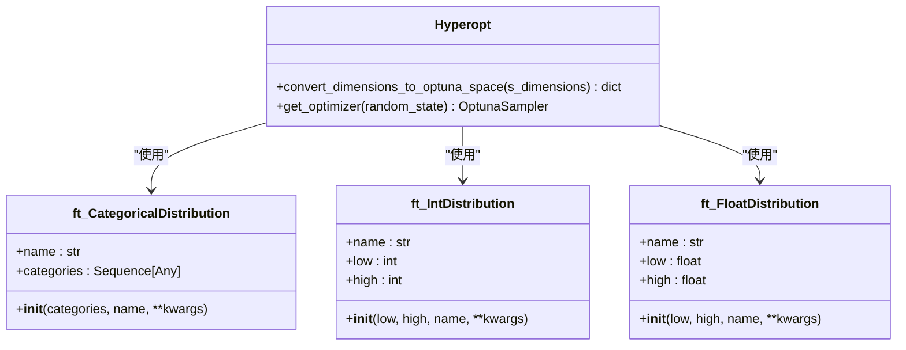
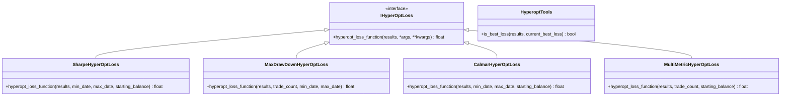
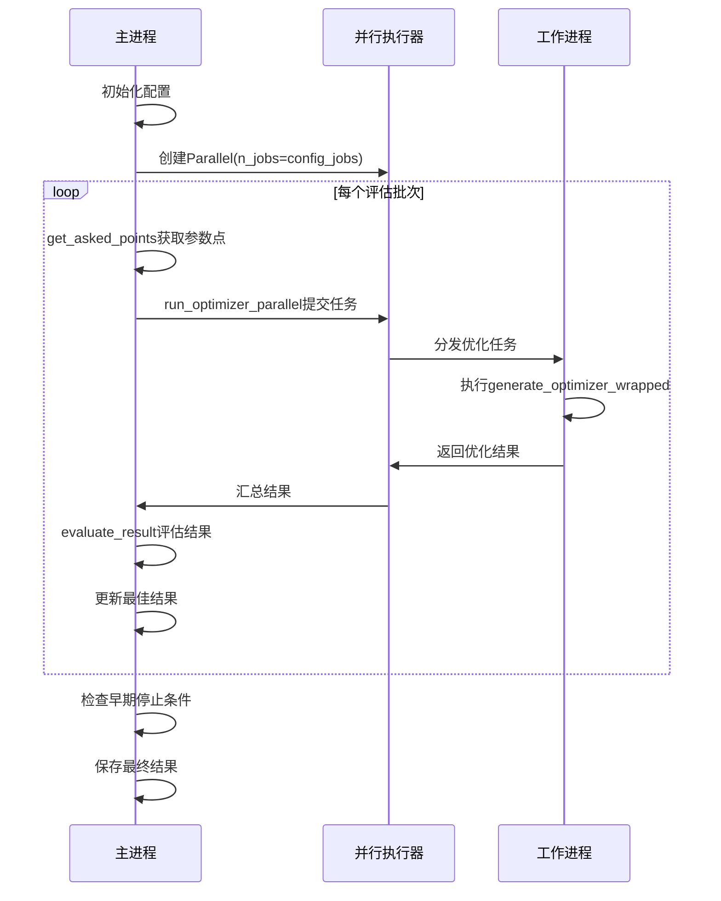
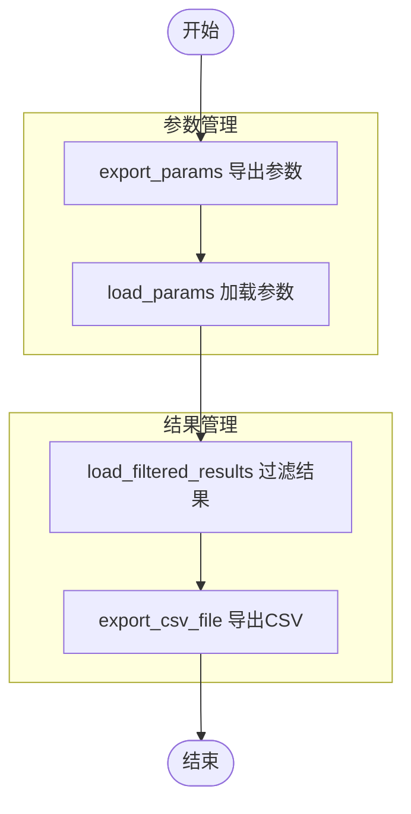

# Hyperopt参数优化策略

<cite>
**本文档引用的文件**  
- [README_hyperopt_loop.md](file://user_data/README_hyperopt_loop.md)
- [hyperopt_tools.py](file://freqtrade/optimize/hyperopt_tools.py)
- [hyperopt.py](file://freqtrade/optimize/hyperopt/hyperopt.py)
- [optunaspaces.py](file://freqtrade/optimize/space/optunaspaces.py)
</cite>

## 目录
1. [简介](#简介)
2. [搜索空间配置](#搜索空间配置)
3. [优化目标函数选择](#优化目标函数选择)
4. [自动化优化循环](#自动化优化循环)
5. [分布式优化与并行执行](#分布式优化与并行执行)
6. [检查点与结果管理](#检查点与结果管理)
7. [防止过拟合的交叉验证](#防止过拟合的交叉验证)
8. [性能优化建议](#性能优化建议)

## 简介

Hyperopt是Freqtrade框架中用于策略参数优化的核心组件，通过系统化的自动化流程实现交易策略的超参数优化。该系统基于Optuna优化框架，支持多维度搜索空间定义、多种优化目标函数选择以及分布式并行执行能力。通过`hyperopt_loop.py`脚本和`hyperopt_tools.py`工具集，用户可以构建完整的自动化优化循环，从参数搜索到回测验证再到结果分析，形成闭环的策略优化工作流。

**Section sources**
- [README_hyperopt_loop.md](file://user_data/README_hyperopt_loop.md#L1-L20)

## 搜索空间配置

在Freqtrade中，搜索空间的配置基于自定义的Optuna分布类，通过`optunaspaces.py`文件中的`ft_CategoricalDistribution`、`ft_IntDistribution`和`ft_FloatDistribution`类实现。这些类扩展了Optuna的标准分布，增加了名称属性以支持参数标识。

搜索空间的定义遵循以下原则：
- **整数空间**：使用`ft_IntDistribution`，指定上下界和参数名称
- **浮点数空间**：使用`ft_FloatDistribution`，适用于需要小数精度的参数
- **分类空间**：使用`ft_CategoricalDistribution`，用于离散参数选项

在`hyperopt.py`中，`convert_dimensions_to_optuna_space`方法负责将策略定义的维度转换为Optuna可识别的分布字典，确保优化器能够正确解析搜索空间。

**Diagram sources**
- [optunaspaces.py](file://freqtrade/optimize/space/optunaspaces.py#L1-L60)
- [hyperopt.py](file://freqtrade/optimize/hyperopt/hyperopt.py#L399-L421)

**Section sources**
- [optunaspaces.py](file://freqtrade/optimize/space/optunaspaces.py#L1-L60)
- [hyperopt.py](file://freqtrade/optimize/hyperopt/hyperopt.py#L399-L421)

## 优化目标函数选择

Freqtrade提供了多种内置的优化目标函数，位于`optimize/hyperopt_loss/`目录下，用户可以根据策略特性选择合适的损失函数。主要的优化目标包括：

- **夏普比率** (`SharpeHyperOptLoss`)：最大化风险调整后收益
- **最大回撤** (`MaxDrawDownHyperOptLoss`)：最小化资金曲线的最大回撤
- **卡玛比率** (`CalmarHyperOptLoss`)：综合考虑收益与最大回撤的比率
- **多指标综合** (`MultiMetricHyperOptLoss`)：结合多个绩效指标的加权优化

`hyperopt_tools.py`中的`HyperoptTools`类提供了`is_best_loss`方法，用于判断当前结果是否优于历史最佳，这是优化过程中的核心比较逻辑。不同的损失函数通过实现`IHyperOptLoss`接口的`hyperopt_loss_function`方法来定义其优化目标。

**Diagram sources**
- [hyperopt_tools.py](file://freqtrade/optimize/hyperopt_tools.py#L327-L328)
- [hyperopt_loss_sharpe.py](file://freqtrade/optimize/hyperopt_loss/hyperopt_loss_sharpe.py#L1-L38)

**Section sources**
- [hyperopt_tools.py](file://freqtrade/optimize/hyperopt_tools.py#L327-L328)
- [hyperopt_loss_sharpe.py](file://freqtrade/optimize/hyperopt_loss/hyperopt_loss_sharpe.py#L1-L38)

## 自动化优化循环

基于`README_hyperopt_loop.md`中的实践经验，可以构建完整的自动化优化循环。该循环由`hyperopt_loop.py`主脚本驱动，执行以下步骤：

1. 遍历`strategies/`目录中的所有策略文件
2. 跳过`STRATEGIES_TO_SKIP`列表中的策略
3. 为每个策略执行超参数优化
4. 提取最优参数
5. 使用最优参数执行回测
6. 保存结果到`.result.json`文件

`analyze_results.py`脚本负责分析所有策略的结果，生成汇总报告。这种自动化流程大大提高了策略优化的效率，支持批量处理多个策略。

**Section sources**
- [README_hyperopt_loop.md](file://user_data/README_hyperopt_loop.md#L21-L175)

## 分布式优化与并行执行

Freqtrade的Hyperopt系统支持多进程并行执行，通过`joblib.Parallel`实现分布式优化。在`hyperopt.py`中，`start`方法初始化并行执行器，根据`hyperopt_jobs`配置参数确定工作进程数量。

核心并行执行逻辑如下：
- 使用`Parallel(n_jobs=config_jobs)`创建并行执行器
- 通过`run_optimizer_parallel`方法在多个进程中并行执行优化任务
- 使用`get_asked_points`方法获取待评估的参数点，避免重复计算
- 通过`evaluate_result`方法评估每个优化结果

系统还实现了早期停止机制，当满足终止条件时自动停止优化过程，提高资源利用效率。

**Diagram sources**
- [hyperopt.py](file://freqtrade/optimize/hyperopt/hyperopt.py#L221-L351)

**Section sources**
- [hyperopt.py](file://freqtrade/optimize/hyperopt/hyperopt.py#L221-L351)

## 检查点与结果管理

Hyperopt系统通过文件系统实现检查点保存与恢复机制。`hyperopt_tools.py`中的`HyperoptTools`类提供了完整的结果管理功能：

- `export_params`：将优化参数导出到JSON文件
- `load_params`：从文件加载参数
- `load_filtered_results`：从结果文件加载并过滤历史评估记录
- `export_csv_file`：将优化结果导出为CSV格式

结果文件以`.fthypt`为扩展名，每行存储一个评估周期的结果，支持流式读取和追加写入。`try_export_params`方法在优化完成后自动导出最佳参数，确保结果不会丢失。

**Diagram sources**
- [hyperopt_tools.py](file://freqtrade/optimize/hyperopt_tools.py#L63-L102)

**Section sources**
- [hyperopt_tools.py](file://freqtrade/optimize/hyperopt_tools.py#L63-L102)

## 防止过拟合的交叉验证

为确保优化结果具有良好的泛化能力，系统实现了多种防止过拟合的机制：

1. **时间序列交叉验证**：通过合理划分训练集和测试集，避免未来数据泄露
2. **多市场验证**：使用`MaxDrawDownPerPairHyperOptLoss`等损失函数，确保策略在所有交易对上表现良好
3. **参数稳定性检查**：通过分析参数敏感度，避免选择过于敏感的参数组合

`hyperopt_tools.py`中的`load_filtered_results`方法支持基于多种条件过滤结果，包括最小/最大交易次数、平均收益等，帮助筛选稳健的参数组合。

**Section sources**
- [hyperopt_tools.py](file://freqtrade/optimize/hyperopt_tools.py#L146-L182)

## 性能优化建议

为提高Hyperopt执行效率，建议采取以下措施：

1. **合理设置epochs数量**：根据策略复杂度调整优化周期数
2. **选择合适的搜索空间**：避免过宽的搜索范围导致优化时间过长
3. **利用并行计算资源**：配置适当的`hyperopt_jobs`参数充分利用多核CPU
4. **定期清理缓存文件**：使用`clean_hyperopt`方法清除临时文件
5. **监控资源使用**：注意内存和CPU使用情况，避免系统过载

通过`hyperopt_loop.py`的批处理能力，可以实现策略的自动化优化流水线，显著提升策略开发效率。

**Section sources**
- [hyperopt.py](file://freqtrade/optimize/hyperopt/hyperopt.py#L93-L131)
- [README_hyperopt_loop.md](file://user_data/README_hyperopt_loop.md#L21-L175)