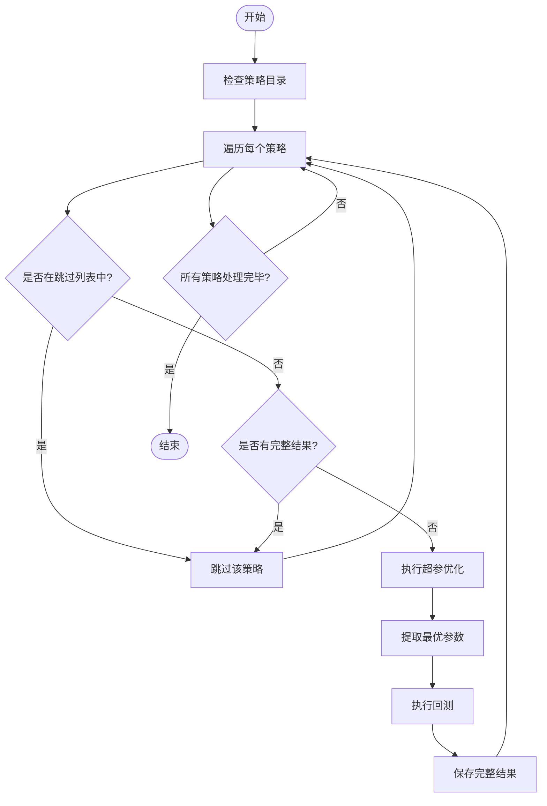
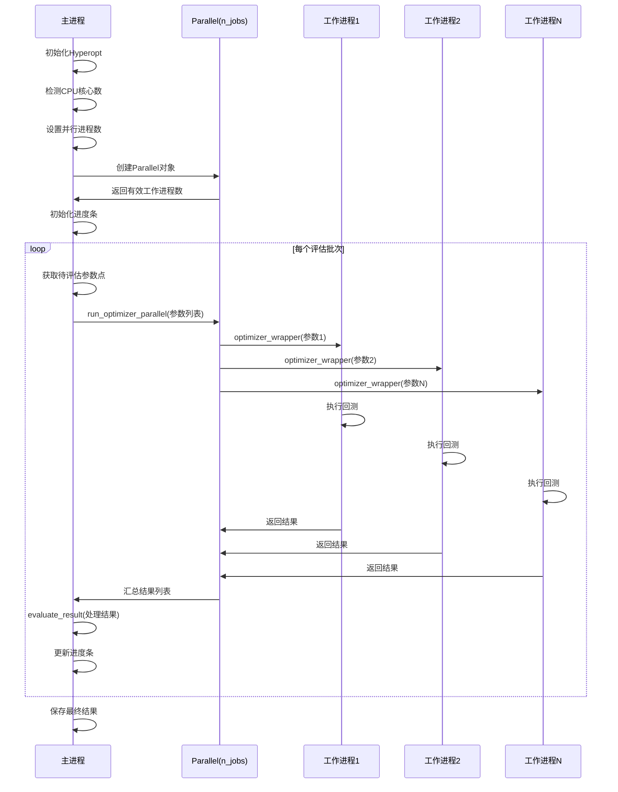

# 性能优化与最佳实践

<cite>
**本文档引用的文件**  
- [hyperopt_loop.py](file://user_data/hyperopt_loop.py)
- [README_hyperopt_loop.md](file://user_data/README_hyperopt_loop.md)
- [featherdatahandler.py](file://freqtrade/data/history/datahandlers/featherdatahandler.py)
- [parquetdatahandler.py](file://freqtrade/data/history/datahandlers/parquetdatahandler.py)
- [hyperopt.py](file://freqtrade/optimize/hyperopt/hyperopt.py)
</cite>

## 目录
1. [简介](#简介)
2. [Hyperopt参数优化循环](#hyperopt参数优化循环)
3. [历史数据存储格式选择](#历史数据存储格式选择)
4. [数据加载性能调优](#数据加载性能调优)
5. [多进程回测配置](#多进程回测配置)
6. [日志级别与API调用优化](#日志级别与api调用优化)
7. [策略计算逻辑优化](#策略计算逻辑优化)
8. [风险管理与资金隔离](#风险管理与资金隔离)
9. [实盘前充分回测](#实盘前充分回测)

## 简介
本文档旨在为Freqtrade交易系统提供全面的性能优化建议和生产环境最佳实践。通过分析代码库中的关键组件，包括Hyperopt参数优化、历史数据存储、多进程回测等，提出具体的优化策略。文档特别关注如何提升系统整体运行效率，同时强调在实盘交易前必须遵循的安全实践，以确保交易系统的长期稳定运行。

## Hyperopt参数优化循环
Freqtrade提供了一个自动化脚本系统，用于批量执行策略的超参数优化和回测。该系统由`hyperopt_loop.py`主脚本驱动，能够遍历`strategies/`目录下的所有策略文件，自动执行超参优化，并使用最优参数进行回测。

该脚本支持为特定策略配置自定义的超参优化参数。用户可以通过创建与策略同名的`.hyperopt`文件来指定特定的优化配置，例如增加迭代次数或调整优化空间。脚本会自动跳过在`STRATEGIES_TO_SKIP`列表中定义的策略，避免对示例或测试策略进行不必要的计算。

**重要机制**：`hyperopt_loop.py`脚本在执行过程中会检查是否已有完整的优化结果文件（`.result.json`）。如果存在且包含完整的超参优化和回测结果，脚本将自动跳过该策略，避免重复计算，从而显著提升整体执行效率。



**图源**
- [hyperopt_loop.py](file://user_data/hyperopt_loop.py#L1-L273)

**章节源**
- [hyperopt_loop.py](file://user_data/hyperopt_loop.py#L1-L273)
- [README_hyperopt_loop.md](file://user_data/README_hyperopt_loop.md#L1-L176)

## 历史数据存储格式选择
Freqtrade支持多种历史数据存储格式，其中`Feather`和`Parquet`是两种高效的二进制格式。选择合适的存储格式对数据加载性能有显著影响。

`FeatherDataHandler`利用`pyarrow`库实现了高效的数据加载和过滤。其核心优势在于支持基于时间范围的**列式过滤**。在加载交易数据时，`_trades_load`方法会构建一个Arrow谓词过滤器，直接在数据读取阶段就应用时间范围限制，避免了将整个大文件加载到内存后再进行过滤，从而大幅提升了性能。

相比之下，`ParquetDataHandler`虽然也使用了高效的Parquet格式，但其`_trades_load`方法目前尚未实现时间范围过滤功能（代码注释中明确指出`# TODO: respect timerange ...`），这意味着加载数据时会读取整个文件，然后在内存中进行过滤，对于大型数据集来说效率较低。

因此，在需要频繁按时间范围加载历史数据的场景下，**Feather格式是更优的选择**，因为它能利用底层库的列式存储优势，实现更高效的数据访问。

```mermaid
classDiagram
class IDataHandler {
<<interface>>
+ohlcv_store(pair, timeframe, data, candle_type)
+_ohlcv_load(pair, timeframe, timerange, candle_type)
+_trades_store(pair, data, trading_mode)
+_trades_load(pair, trading_mode, timerange)
}
class FeatherDataHandler {
+_build_arrow_time_filter(timerange)
+_trades_load(pair, trading_mode, timerange)
}
class ParquetDataHandler {
+_trades_load(pair, trading_mode, timerange)
}
IDataHandler <|-- FeatherDataHandler
IDataHandler <|-- ParquetDataHandler
note right of FeatherDataHandler
使用pyarrow.dataset实现
高效的列式过滤
支持时间范围预过滤
end note
note right of ParquetDataHandler
使用pandas.read_parquet
加载整个文件
时间过滤在内存中进行
end note
```

**图源**
- [featherdatahandler.py](file://freqtrade/data/history/datahandlers/featherdatahandler.py#L1-L186)
- [parquetdatahandler.py](file://freqtrade/data/history/datahandlers/parquetdatahandler.py#L1-L134)

**章节源**
- [featherdatahandler.py](file://freqtrade/data/history/datahandlers/featherdatahandler.py#L1-L186)
- [parquetdatahandler.py](file://freqtrade/data/history/datahandlers/parquetdatahandler.py#L1-L134)

## 数据加载性能调优
为了最大化数据加载性能，应充分利用`FeatherDataHandler`提供的高级功能。其`_build_arrow_time_filter`方法是性能调优的关键。

该方法将`TimeRange`对象转换为Arrow库的谓词表达式。当`timerange`参数被提供时，系统会使用`dataset.dataset()`创建一个数据集读取器，并将构建好的时间过滤器作为`filter`参数传入。这使得Arrow引擎能够在读取数据块时就进行过滤，只将符合条件的数据加载到内存中，极大地减少了I/O和内存占用。

此外，`FeatherDataHandler`在存储数据时应用了`lz4`压缩算法（`compression="lz4"`），这在保证快速读写速度的同时，有效减小了磁盘占用。对于大规模历史数据，这种压缩与高效过滤的结合，是实现快速数据访问的基础。

**最佳实践**：在调用`DataProvider`或相关接口时，始终提供精确的`timerange`参数，以触发底层的列式过滤机制，避免不必要的全量数据加载。

**章节源**
- [featherdatahandler.py](file://freqtrade/data/history/datahandlers/featherdatahandler.py#L1-L186)

## 多进程回测配置
Freqtrade的Hyperopt模块通过`joblib`库的`Parallel`类实现了多进程并行优化。`Hyperopt.start()`方法是并行执行的核心入口。

在`start()`方法中，系统首先通过`cpu_count()`检测可用的CPU核心数，并根据配置中的`hyperopt_jobs`参数确定并行工作的进程数。如果配置为`-1`，则会使用所有可用的核心。

关键的并行执行发生在`run_optimizer_parallel`方法中。该方法使用`Parallel`对象并行调用`generate_optimizer_wrapped`函数，每个进程独立执行一次回测评估。为了处理多进程环境下的日志记录，系统通过`_setup_logging_mp_workaround`方法创建了一个共享的`Manager().Queue()`，确保所有子进程的日志都能被正确收集和处理。

**性能建议**：将`hyperopt_jobs`设置为CPU核心数或略少于核心数，以充分利用计算资源。同时，注意内存消耗，过多的并行进程可能导致内存不足。



**图源**
- [hyperopt.py](file://freqtrade/optimize/hyperopt/hyperopt.py#L247-L351)

**章节源**
- [hyperopt.py](file://freqtrade/optimize/hyperopt/hyperopt.py#L247-L351)

## 日志级别与API调用优化
合理的日志级别设置是提升性能的重要手段。在`Hyperopt.__init__`方法中，日志级别根据`verbosity`配置动态调整。当`verbosity`小于1时，子进程的日志级别设置为`INFO`；否则为`DEBUG`。

在生产环境或大规模优化任务中，应将`verbosity`设置为较低值（如0或1），以避免产生海量的`DEBUG`级别的日志信息。这些日志不仅会消耗大量的I/O资源，还会占用宝贵的CPU时间进行格式化和写入，从而拖慢整体优化速度。

此外，应尽量减少不必要的API调用。例如，在策略代码中，避免在`populate_indicators`或`populate_buy_trend`等高频调用的方法中进行网络请求或复杂的文件I/O操作。所有外部数据应在`__init__`或`bot_start`等初始化方法中一次性加载并缓存。

**章节源**
- [hyperopt.py](file://freqtrade/optimize/hyperopt/hyperopt.py#L49-L91)

## 策略计算逻辑优化
策略的计算逻辑直接影响回测和实盘的执行效率。优化策略计算的核心原则是**减少重复计算和避免高复杂度操作**。

1.  **向量化计算**：充分利用Pandas的向量化操作，避免在DataFrame上使用Python的`for`循环。例如，使用`df['close'].rolling(window=14).mean()`计算移动平均线，远比循环计算高效。
2.  **缓存中间结果**：对于计算成本高且结果不变的指标，应将其计算结果缓存起来，避免在每次调用`populate_buy_trend`时重复计算。
3.  **简化条件判断**：复杂的嵌套`if-else`语句会增加CPU负担。应尽量使用逻辑运算符（`&`, `|`）组合布尔Series来生成买卖信号，这同样是向量化操作。
4.  **避免全局变量滥用**：虽然可以在策略中使用全局变量，但应确保其不会成为性能瓶颈或导致状态混乱。

**章节源**
- [hyperopt.py](file://freqtrade/optimize/hyperopt/hyperopt.py#L214-L236)

## 风险管理与资金隔离
安全实践是自动化交易系统的基石。首要原则是**资金隔离**，即用于实盘交易的资金应与用于开发和测试的资金完全分开。建议使用独立的交易所账户或子账户来运行机器人，严格限制其可用资金。

其次，必须实施严格的风险管理。这包括：
*   **硬性止损**：在配置中设置全局的`stoploss`，作为最后的防线。
*   **动态止盈止损**：在策略中实现基于市场波动率的动态止盈止损逻辑。
*   **仓位管理**：合理设置`stake_amount`，避免单笔交易占用过多资金。
*   **熔断机制**：使用`protections`插件，如`MaxDrawdownProtection`，在账户回撤过大时自动暂停交易。

## 实盘前充分回测
在将任何策略投入实盘之前，必须进行**充分且严谨的回测**。这不仅仅是看最终的收益率，更要深入分析：
*   **回测周期**：覆盖多个市场周期（牛市、熊市、震荡市）。
*   **参数稳健性**：通过`hyperopt`找到的最优参数是否在不同时间段都表现良好？是否存在过拟合？
*   **滑点和手续费**：确保回测配置中包含了真实的滑点和手续费，否则结果将严重失真。
*   **订单执行模拟**：理解回测是如何模拟订单执行的，其假设是否符合实际市场情况。

只有经过全面验证，证明策略在各种市场条件下都具有稳定盈利能力和良好风险控制的，才具备上实盘的资格。