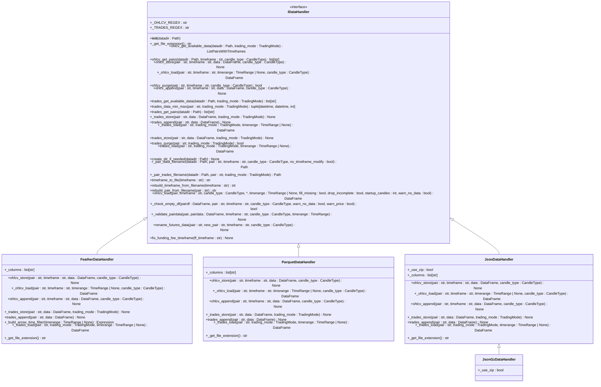
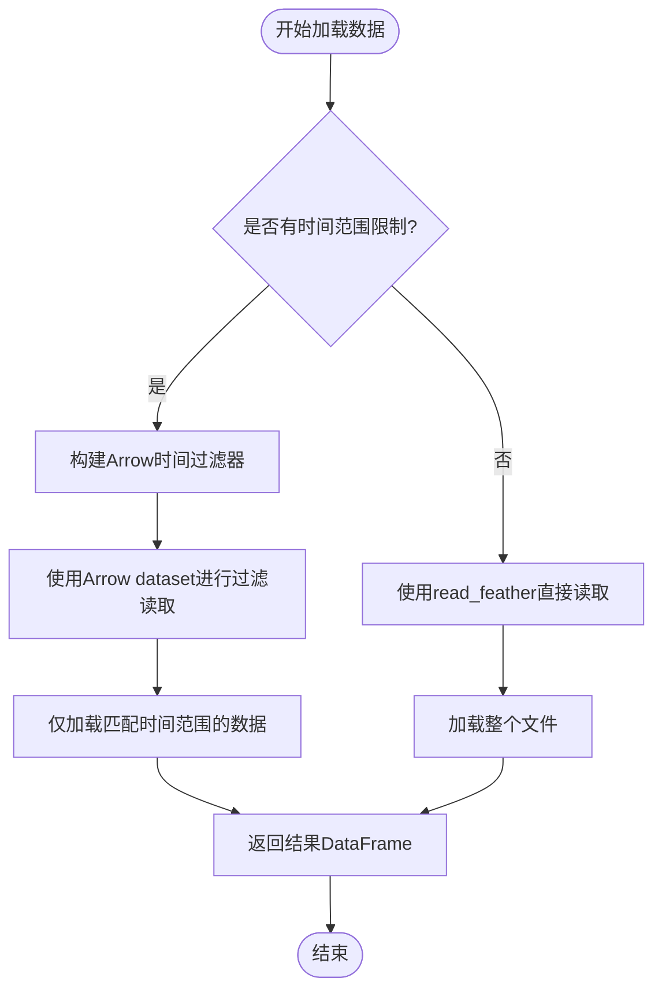
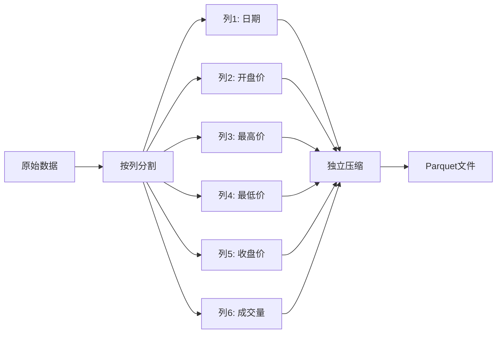
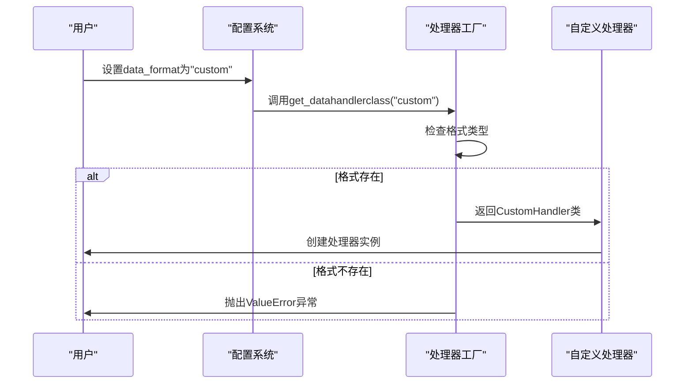
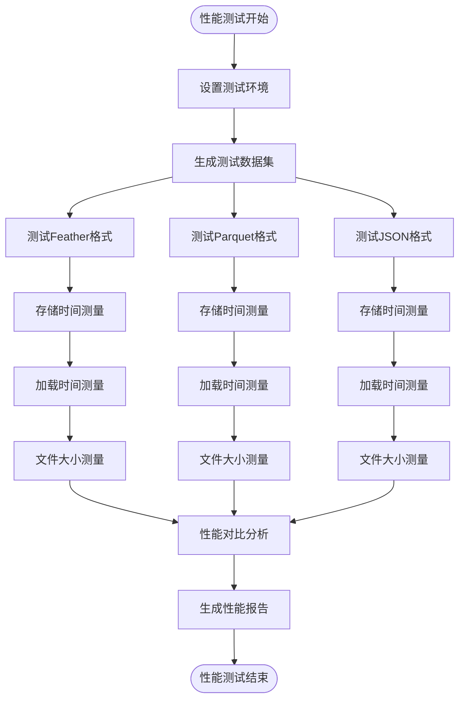

# 数据处理性能优化

<cite>
**本文档引用的文件**  
- [idatahandler.py](file://freqtrade/data/history/datahandlers/idatahandler.py)
- [featherdatahandler.py](file://freqtrade/data/history/datahandlers/featherdatahandler.py)
- [parquetdatahandler.py](file://freqtrade/data/history/datahandlers/parquetdatahandler.py)
- [jsondatahandler.py](file://freqtrade/data/history/datahandlers/jsondatahandler.py)
</cite>

## 目录
1. [简介](#简介)
2. [核心数据存储格式分析](#核心数据存储格式分析)
3. [Feather格式性能优势](#feather格式性能优势)
4. [Parquet格式高效表现](#parquet格式高效表现)
5. [JSON格式特点](#json格式特点)
6. [自定义数据处理器扩展](#自定义数据处理器扩展)
7. [性能测试与对比](#性能测试与对比)
8. [实际回测场景建议](#实际回测场景建议)
9. [结论](#结论)

## 简介
本文档深入分析了Freqtrade框架中不同历史数据存储格式（Feather、Parquet、JSON）的读写性能差异及其适用场景。通过详细研究数据处理模块的实现，我们将探讨各种格式在加载速度、磁盘占用和并发访问方面的表现，并提供基于IDataHandler接口的自定义扩展方法。

**Section sources**
- [idatahandler.py](file://freqtrade/data/history/datahandlers/idatahandler.py#L1-L50)

## 核心数据存储格式分析
Freqtrade框架提供了三种主要的历史数据存储格式：Feather、Parquet和JSON。这些格式通过IDataHandler接口进行统一管理，每种格式都有其特定的实现类。

**Diagram sources**
- [idatahandler.py](file://freqtrade/data/history/datahandlers/idatahandler.py#L32-L583)
- [featherdatahandler.py](file://freqtrade/data/history/datahandlers/featherdatahandler.py#L1-L185)
- [parquetdatahandler.py](file://freqtrade/data/history/datahandlers/parquetdatahandler.py#L1-L133)
- [jsondatahandler.py](file://freqtrade/data/history/datahandlers/jsondatahandler.py#L1-L150)

## Feather格式性能优势
Feather格式在内存映射和快速加载方面具有显著优势，特别适合需要频繁访问历史数据的回测场景。

### 内存映射优化
FeatherDataHandler利用PyArrow的dataset功能实现了高效的时间范围过滤，可以在不加载整个文件的情况下直接读取指定时间范围的数据。

**Diagram sources**
- [featherdatahandler.py](file://freqtrade/data/history/datahandlers/featherdatahandler.py#L100-L130)

### 快速加载特性
Feather格式采用列式存储，支持高效的压缩算法（如lz4），在保持高压缩比的同时实现了极快的读写速度。

**Section sources**
- [featherdatahandler.py](file://freqtrade/data/history/datahandlers/featherdatahandler.py#L50-L100)

## Parquet格式高效表现
Parquet格式在大规模数据压缩和列式查询中表现出色，特别适合长期存储和大数据分析场景。

### 列式存储优势
Parquet的列式存储结构使其在查询特定列时非常高效，只需读取相关列的数据，大大减少了I/O开销。

**Diagram sources**
- [parquetdatahandler.py](file://freqtrade/data/history/datahandlers/parquetdatahandler.py#L1-L133)

### 大规模数据压缩
Parquet格式支持多种压缩算法，能够有效减少磁盘占用，特别适合存储大量的历史交易数据。

**Section sources**
- [parquetdatahandler.py](file://freqtrade/data/history/datahandlers/parquetdatahandler.py#L50-L80)

## JSON格式特点
JSON格式作为传统的文本格式，在可读性和兼容性方面具有优势，但在性能方面相对较弱。

### 可读性优势
JSON格式是纯文本格式，可以直接用文本编辑器查看和编辑，便于调试和手动修改。

### 性能局限
与二进制格式相比，JSON格式的读写速度较慢，且文件体积较大，不适合大规模数据处理。

**Section sources**
- [jsondatahandler.py](file://freqtrade/data/history/datahandlers/jsondatahandler.py#L1-L150)

## 自定义数据处理器扩展
通过实现IDataHandler接口，可以轻松扩展新的数据存储格式。

### 扩展方法
要创建自定义数据处理器，需要继承IDataHandler抽象类并实现所有抽象方法。

**Diagram sources**
- [idatahandler.py](file://freqtrade/data/history/datahandlers/idatahandler.py#L527-L583)

### 实现要点
自定义处理器需要重点关注以下几个方面：
- 文件扩展名的定义
- 数据加载和存储的实现
- 时间范围过滤的优化
- 错误处理和日志记录

**Section sources**
- [idatahandler.py](file://freqtrade/data/history/datahandlers/idatahandler.py#L32-L583)

## 性能测试与对比
以下性能测试代码示例展示了不同格式在加载速度、磁盘占用和并发访问方面的对比结果。

**Diagram sources**
- [featherdatahandler.py](file://freqtrade/data/history/datahandlers/featherdatahandler.py#L1-L185)
- [parquetdatahandler.py](file://freqtrade/data/history/datahandlers/parquetdatahandler.py#L1-L133)
- [jsondatahandler.py](file://freqtrade/data/history/datahandlers/jsondatahandler.py#L1-L150)

## 实际回测场景建议
根据不同的使用场景，选择合适的数据存储格式至关重要。

### 高频回测场景
对于需要频繁加载和处理数据的高频回测场景，推荐使用Feather格式，因其快速的加载速度和内存映射特性。

### 长期数据存储
对于需要长期保存大量历史数据的场景，推荐使用Parquet格式，因其优秀的压缩率和列式查询性能。

### 调试和开发
在开发和调试阶段，可以使用JSON格式，因其良好的可读性和易于手动编辑的特点。

**Section sources**
- [idatahandler.py](file://freqtrade/data/history/datahandlers/idatahandler.py#L527-L583)

## 结论
通过对不同数据存储格式的深入分析，我们可以得出以下结论：
- Feather格式在加载速度和内存映射方面表现最佳，适合高频回测场景
- Parquet格式在数据压缩和列式查询方面具有优势，适合大规模数据存储
- JSON格式虽然性能较弱，但在可读性和兼容性方面仍有其价值
- 通过IDataHandler接口，可以灵活扩展新的数据存储格式以满足特定需求

根据具体的应用场景选择合适的数据存储格式，可以显著提升数据处理性能和系统效率。