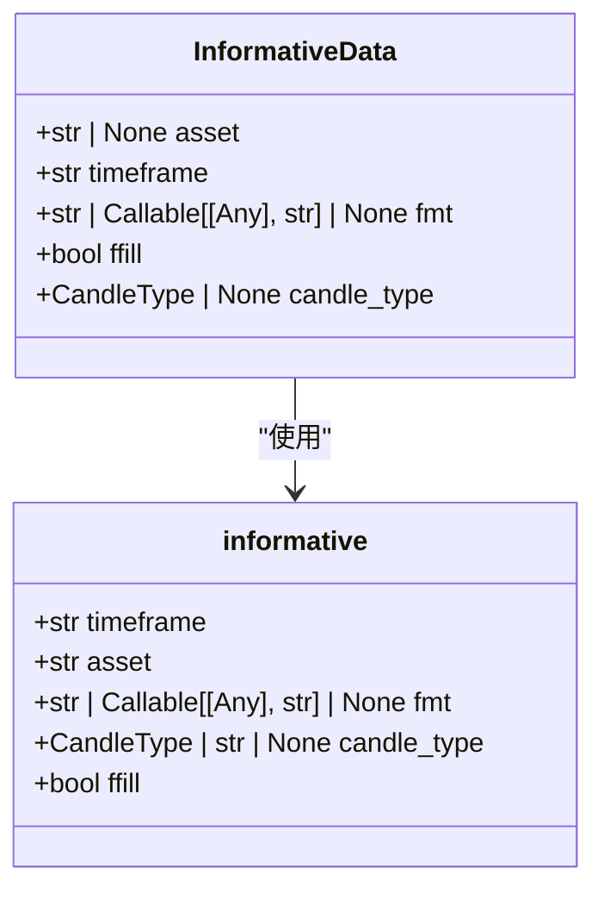

# 策略计算效率优化

<cite>
**本文档引用的文件**   
- [informative_decorator.py](file://freqtrade/strategy/informative_decorator.py)
- [multi_tf.py](file://user_data/strategies/multi_tf.py)
- [SmoothScalp.py](file://user_data/strategies/SmoothScalp.py)
- [GodStra.py](file://user_data/strategies/GodStra.py)
- [strategy_helper.py](file://freqtrade/strategy/strategy_helper.py)
</cite>

## 目录
1. [引言](#引言)
2. [避免耗时操作的最佳实践](#避免耗时操作的最佳实践)
3. [缓存机制与减少重复计算](#缓存机制与减少重复计算)
4. informative装饰器的性能优势](#informative装饰器的性能优势)
5. [向量化运算替代循环逻辑](#向量化运算替代循环逻辑)
6. [性能分析工具的使用](#性能分析工具的使用)
7. [结论](#结论)

## 引言
在量化交易策略开发中，计算性能是决定策略能否在实盘中有效执行的关键因素。低效的策略代码不仅会增加回测时间，还可能导致实盘交易中的信号延迟，从而影响交易结果。本文档详细阐述了如何优化交易策略的计算性能，包括避免在策略中执行耗时操作、合理使用缓存机制、减少重复计算等最佳实践。重点讲解了`informative`装饰器在多时间框架分析中的性能优势，以及如何通过向量化运算替代循环逻辑来提升指标计算速度。同时，本文档介绍了使用Python内置性能分析工具（如cProfile）进行策略性能诊断的方法。

## 避免耗时操作的最佳实践
在交易策略中，应避免执行任何可能阻塞主线程的耗时操作，特别是网络请求、文件I/O和复杂的数据库查询。这些操作会显著增加策略的执行时间，导致无法及时响应市场变化。

**策略来源**
- [SmoothScalp.py](file://user_data/strategies/SmoothScalp.py#L102-L129)
- [GodStra.py](file://user_data/strategies/GodStra.py#L109-L141)

## 缓存机制与减少重复计算
合理使用缓存机制可以显著减少重复计算，提高策略的执行效率。通过缓存已经计算过的指标结果，可以在后续的计算中直接使用缓存值，避免重复计算。

**策略来源**
- [SmoothScalp.py](file://user_data/strategies/SmoothScalp.py#L84-L103)
- [ClucMay72018.py](file://user_data/strategies/ClucMay72018.py#L76-L96)

## informative装饰器的性能优势
`informative`装饰器是Freqtrade框架中用于多时间框架分析的强大工具。通过使用`informative`装饰器，可以高效地获取和合并不同时间框架的数据，避免了手动处理数据合并的复杂性和潜在的性能瓶颈。

**图表来源**
- [informative_decorator.py](file://freqtrade/strategy/informative_decorator.py#L15-L20)
- [informative_decorator.py](file://freqtrade/strategy/informative_decorator.py#L23-L73)

**策略来源**
- [multi_tf.py](file://user_data/strategies/multi_tf.py#L89-L108)
- [informative_decorator_strategy.py](file://tests/strategy/strats/informative_decorator_strategy.py#L0-L42)

## 向量化运算替代循环逻辑
向量化运算是提升指标计算速度的关键。通过使用Pandas和NumPy等库提供的向量化函数，可以替代传统的循环逻辑，显著提高计算效率。例如，使用`ta.RSI`函数计算RSI指标，而不是手动编写循环来计算。

**策略来源**
- [SmoothScalp.py](file://user_data/strategies/SmoothScalp.py#L102-L129)
- [BinHV27.py](file://user_data/strategies/BinHV27.py#L84-L103)

## 性能分析工具的使用
使用Python内置的性能分析工具（如cProfile）可以帮助开发者诊断策略的性能瓶颈。通过分析函数调用的时间消耗，可以识别出需要优化的关键部分。

**策略来源**
- [backtest_analysis.py](file://yccai/bo_tou_pi/backtest_analysis.py#L188-L222)
- [btc_grid_optimization.py](file://yccai/wang_ge/btc_grid_optimization.py#L317-L351)

## 结论
优化交易策略的计算性能是确保策略在实盘中有效执行的关键。通过避免耗时操作、合理使用缓存机制、减少重复计算、利用`informative`装饰器的性能优势以及使用向量化运算替代循环逻辑，可以显著提升策略的执行效率。同时，使用性能分析工具进行策略性能诊断，可以帮助开发者识别和解决性能瓶颈，确保策略的高效运行。