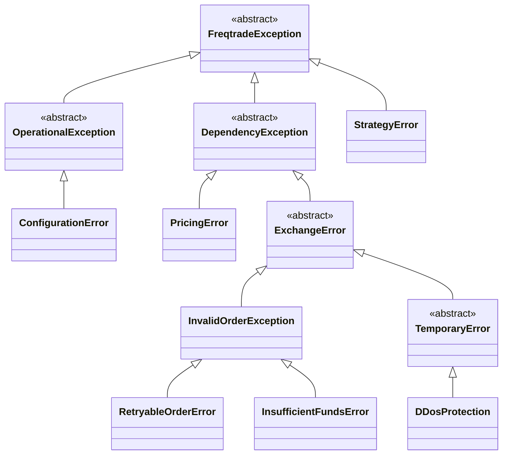

# 故障排除与最佳实践

<cite>
**本文档引用的文件**
- [exceptions.py](file://freqtrade/exceptions.py)
- [buffering_handler.py](file://freqtrade/loggers/buffering_handler.py)
- [ft_rich_handler.py](file://freqtrade/loggers/ft_rich_handler.py)
- [json_formatter.py](file://freqtrade/loggers/json_formatter.py)
- [hyperopt_loop.py](file://user_data/hyperopt_loop.py)
- [README_hyperopt_loop.md](file://user_data/README_hyperopt_loop.md)
</cite>

## 目录
1. [简介](#简介)
2. [日志记录体系](#日志记录体系)
3. [异常层次结构](#异常层次结构)
4. [常见问题诊断](#常见问题诊断)
5. [测试套件验证](#测试套件验证)
6. [高级技巧与最佳实践](#高级技巧与最佳实践)
7. [结论](#结论)

## 简介
本文档旨在构建一个全面的故障排除知识库，基于Freqtrade框架的`loggers`模块日志记录体系和`exceptions.py`定义的异常层次结构。系统化分类常见问题（如连接超时、余额不足、策略失效），并提供详细的诊断步骤和解决方案。解释如何通过日志级别控制、结构化日志输出和缓冲处理机制进行问题定位。结合测试套件（tests）中的案例，说明如何验证系统组件的正确性。收录用户实践文档（如hyperopt_loop.md）中的高级技巧，提供性能优化、风险控制和策略验证的最佳实践清单。

## 日志记录体系

Freqtrade框架的`loggers`模块提供了一套完整的日志记录解决方案，包含多个核心组件，用于控制日志的输出格式、级别和处理方式。

### 日志缓冲处理
`loggers`模块中的`buffering_handler.py`文件定义了`FTBufferingHandler`类，该类继承自Python标准库的`BufferingHandler`。其核心功能是通过重写`flush`方法，实现日志的缓冲处理。与标准的清空缓冲区不同，`FTBufferingHandler`在刷新时会保留一半的记录，避免出现日志“空白”时刻，确保日志流的连续性和完整性。

### 丰富的控制台输出
`ft_rich_handler.py`文件实现了`FtRichHandler`类，这是一个基于`Rich`库的彩色日志处理程序。它为日志消息提供了丰富的格式化输出，包括时间戳、日志级别、记录器名称和消息内容，并使用不同的颜色进行区分，极大地提升了日志的可读性。该处理程序会格式化日志消息，将其组装成一个包含时间、名称、级别和消息的富文本行进行输出。

### 结构化JSON日志
`json_formatter.py`文件中的`JsonFormatter`类将日志记录格式化为JSON字符串。这对于日志的集中收集、分析和机器处理至关重要。该格式化器允许自定义输出的字段映射，例如将`timestamp`映射到`asctime`，`level`映射到`levelname`等。它会将日志记录的属性转换为一个字典，然后将其序列化为JSON字符串，便于在日志分析系统中进行查询和过滤。

**Section sources**
- [buffering_handler.py](file://freqtrade/loggers/buffering_handler.py#L1-L17)
- [ft_rich_handler.py](file://freqtrade/loggers/ft_rich_handler.py#L1-L50)
- [json_formatter.py](file://freqtrade/loggers/json_formatter.py#L1-L75)

## 异常层次结构

Freqtrade框架定义了一个清晰的异常层次结构，位于`freqtrade/exceptions.py`文件中，所有异常都继承自`FreqtradeException`基类。这种分层设计有助于精确地识别和处理不同类型的错误。

**Diagram sources**
- [exceptions.py](file://freqtrade/exceptions.py#L1-L85)

**Section sources**
- [exceptions.py](file://freqtrade/exceptions.py#L1-L85)

## 常见问题诊断

### 连接超时 (Connection Timeout)
**问题描述**：与交易所的API连接超时，通常表现为`TemporaryError`或`DDosProtection`异常。
**诊断步骤**：
1.  检查网络连接是否正常。
2.  查看日志中是否有`DDosProtection`或`TemporaryError`的记录，这表明交易所可能因请求过于频繁而触发了保护机制。
3.  检查`freqtrade`的配置文件，确认`exchange`部分的`rate_limit`设置是否合理。
**解决方案**：
-  优化策略的请求频率，避免在短时间内发送过多请求。
-  在配置中适当增加`rate_limit`值。
-  如果问题持续，考虑在非高峰时段运行。

### 余额不足 (Insufficient Funds)
**问题描述**：在尝试创建订单时，由于账户余额不足而失败。
**诊断步骤**：
1.  在日志中搜索`InsufficientFundsError`异常。
2.  检查`wallets`模块的日志，确认当前的可用余额。
3.  核对`stake_amount`配置项的值是否超过了可用余额。
**解决方案**：
-  确保交易账户有足够的资金。
-  调整`stake_amount`配置，使其小于可用余额。
-  检查`max_open_trades`设置，确保总持仓不会超过账户资金。

### 策略失效 (Strategy Failure)
**问题描述**：自定义策略代码中出现错误，导致交易机器人停止运行。
**诊断步骤**：
1.  在日志中查找`StrategyError`异常。
2.  检查策略文件（位于`user_data/strategies/`目录下）的语法和逻辑。
3.  确认策略中使用的指标和参数是否正确。
**解决方案**：
-  仔细检查策略代码，修复语法错误。
-  使用`freqtrade test-strategy`命令对策略进行单元测试。
-  确保策略实现了所有必需的方法，如`advise_indicators`、`advise_entry`和`advise_exit`。

## 测试套件验证

Freqtrade框架提供了全面的测试套件，位于`tests`目录下，用于验证系统各组件的正确性。这些测试是确保系统稳定性和功能完整性的关键。

### 单元测试
测试套件包含针对各个模块的单元测试，例如：
-   `tests/test_main.py`：验证主程序的命令行参数解析和启动流程。
-   `tests/freqtradebot/test_freqtradebot.py`：测试交易机器人的核心逻辑，如交易创建、退出信号处理和异常处理。
-   `tests/strategy/test_strategy_loading.py`：验证策略加载器能否正确加载和解析用户定义的策略。

### 集成测试
除了单元测试，还包含集成测试，用于验证多个组件协同工作时的行为。例如，`test_process_trade_creation`测试会模拟一个完整的交易创建流程，从信号生成到订单创建，确保整个流程的连贯性。

**Section sources**
- [test_main.py](file://tests/test_main.py#L1-L235)
- [test_freqtradebot.py](file://tests/freqtradebot/test_freqtradebot.py#L1-L799)
- [test_strategy_loading.py](file://tests/strategy/test_strategy_loading.py#L1-L534)

## 高级技巧与最佳实践

### 性能优化
-   **批量超参优化**：利用`user_data/hyperopt_loop.py`脚本，可以自动化地为所有策略执行超参数优化和回测。该脚本会遍历`strategies`目录，为每个策略运行`hyperopt`，提取最优参数，然后执行回测，并将结果保存到`.result.json`文件中，极大地提高了效率。
-   **日志级别控制**：在生产环境中，将日志级别设置为`INFO`或`WARNING`，以减少不必要的日志输出，提高性能。在调试时，可以临时调整为`DEBUG`级别以获取更详细的信息。

### 风险控制
-   **保护机制**：利用`plugins/protections`插件，可以实现冷却期、最大回撤保护等风险控制策略，防止在市场剧烈波动时发生连续亏损。
-   **止损设置**：在策略或配置文件中合理设置`stoploss`和`trailing_stop`，以限制单笔交易的最大亏损。

### 策略验证
-   **回测验证**：在将策略投入实盘前，务必进行充分的回测。使用`freqtrade backtesting`命令，利用历史数据验证策略的盈利能力和稳定性。
-   **参数优化**：使用`freqtrade hyperopt`命令对策略的超参数进行优化，寻找在历史数据上表现最佳的参数组合。但需注意避免过度拟合。

**Section sources**
- [hyperopt_loop.py](file://user_data/hyperopt_loop.py#L1-L273)
- [README_hyperopt_loop.md](file://user_data/README_hyperopt_loop.md#L1-L176)

## 结论
通过深入理解Freqtrade的日志记录体系和异常层次结构，用户可以更有效地诊断和解决系统运行中遇到的各种问题。结合测试套件进行验证，可以确保系统组件的可靠性。最后，应用高级技巧和最佳实践，如自动化超参优化、严格的风险控制和充分的策略验证，能够显著提升交易系统的性能和稳健性，为实现长期稳定的收益奠定坚实基础。