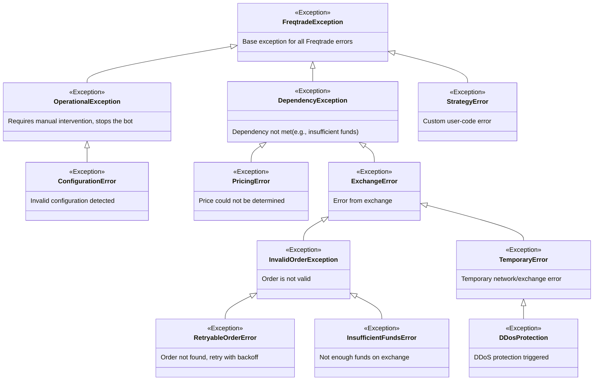
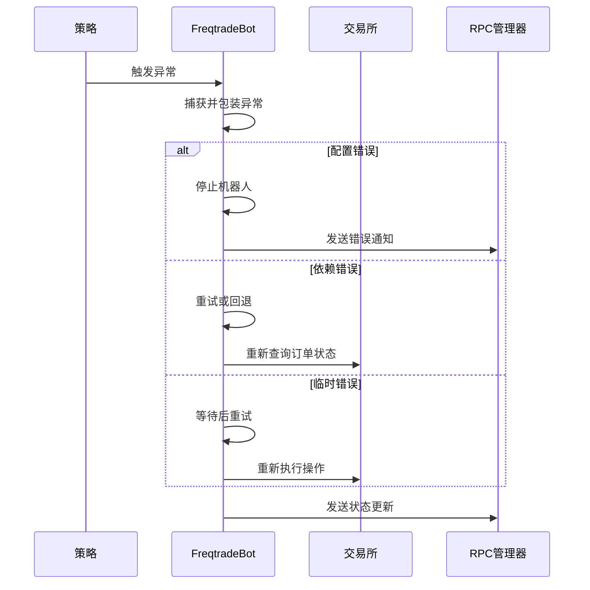
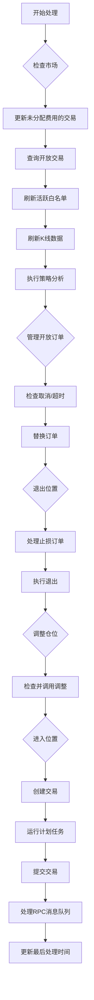
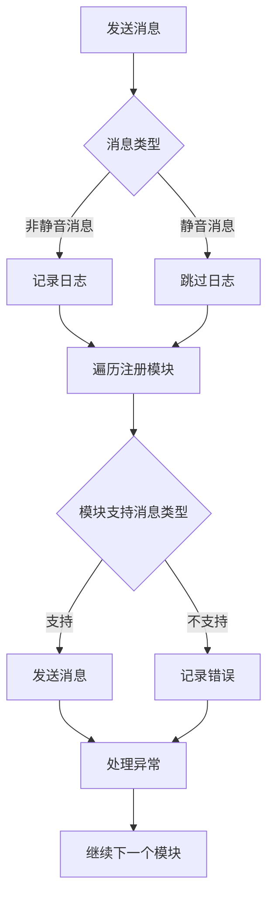
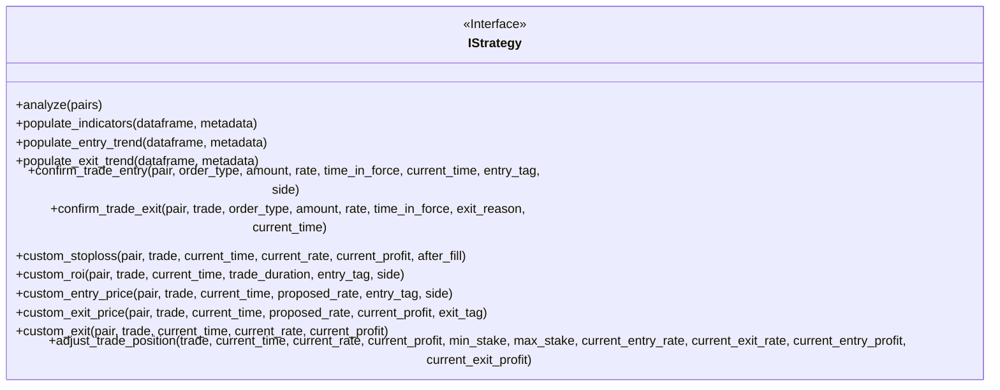

# 异常处理机制

<cite>
**本文档引用的文件**   
- [exceptions.py](file://freqtrade/exceptions.py)
- [freqtradebot.py](file://freqtrade/freqtradebot.py)
- [rpc_manager.py](file://freqtrade/rpc/rpc_manager.py)
- [interface.py](file://freqtrade/strategy/interface.py)
</cite>

## 目录
1. [异常继承体系](#异常继承体系)
2. [核心异常类型与触发条件](#核心异常类型与触发条件)
3. [错误处理流程分析](#错误处理流程分析)
4. [核心模块异常处理机制](#核心模块异常处理机制)
5. [策略开发中的异常处理](#策略开发中的异常处理)
6. [调试与恢复策略](#调试与恢复策略)
7. [总结](#总结)

## 异常继承体系

**Diagram sources**
- [exceptions.py](file://freqtrade/exceptions.py#L1-L83)

**Section sources**
- [exceptions.py](file://freqtrade/exceptions.py#L1-L83)

## 核心异常类型与触发条件

Freqtrade的异常体系以`FreqtradeException`为基类，所有其他异常类型都是其子类。这种设计确保了所有异常都能在最外层被统一处理。

### 操作异常 (OperationalException)
`OperationalException`表示需要人工干预的严重错误，通常会导致机器人停止运行。最常见的原因是配置错误。

### 依赖异常 (DependencyException)
`DependencyException`表示假设的依赖关系未满足，例如账户资金不足。它包含多个子类：
- `PricingError`: 无法确定价格，隐含买卖操作
- `ExchangeError`: 交易所返回的错误
- `InsufficientFundsError`: 交易所资金不足

### 临时错误 (TemporaryError)
`TemporaryError`表示临时的网络或交易所相关错误，通常由交易所拥堵、不可用或用户网络问题引起，通常会自行恢复。

### 策略错误 (StrategyError)
`StrategyError`表示检测到自定义用户代码中的错误，通常由策略中的问题引起。

**Section sources**
- [exceptions.py](file://freqtrade/exceptions.py#L1-L83)

## 错误处理流程分析

**Diagram sources**
- [freqtradebot.py](file://freqtrade/freqtradebot.py#L246-L300)
- [rpc_manager.py](file://freqtrade/rpc/rpc_manager.py#L65-L83)

**Section sources**
- [freqtradebot.py](file://freqtrade/freqtradebot.py#L246-L300)
- [rpc_manager.py](file://freqtrade/rpc/rpc_manager.py#L65-L83)

## 核心模块异常处理机制

### FreqtradeBot异常处理
`FreqtradeBot`是核心模块，负责处理所有交易逻辑和异常。

**Diagram sources**
- [freqtradebot.py](file://freqtrade/freqtradebot.py#L246-L300)

**Section sources**
- [freqtradebot.py](file://freqtrade/freqtradebot.py#L246-L300)

### RPC管理器异常处理
`RPCManager`负责管理所有RPC通信模块，包括Telegram、API等。

**Diagram sources**
- [rpc_manager.py](file://freqtrade/rpc/rpc_manager.py#L65-L83)

**Section sources**
- [rpc_manager.py](file://freqtrade/rpc/rpc_manager.py#L65-L83)

## 策略开发中的异常处理

### 策略接口异常处理
策略通过`IStrategy`接口与系统交互，需要正确处理各种异常情况。

**Diagram sources**
- [interface.py](file://freqtrade/strategy/interface.py#L50-L1882)

**Section sources**
- [interface.py](file://freqtrade/strategy/interface.py#L50-L1882)

## 调试与恢复策略

### 常见异常调试方法
1. **指标计算失败**: 检查数据源是否完整，确保有足够的历史数据
2. **订单拒绝**: 检查资金是否充足，确认交易对是否支持
3. **价格确定失败**: 检查交易所连接状态，确认市场深度

### 日志定位问题根源
通过分析日志可以快速定位问题根源：
- `INFO`级别日志: 正常操作记录
- `WARNING`级别日志: 可能的问题提示
- `ERROR`级别日志: 严重错误信息

### 容错逻辑设计
设计健壮的容错逻辑是确保系统稳定的关键：
1. **重试机制**: 对临时错误实施指数退避重试
2. **降级策略**: 当主要功能失败时使用备用方案
3. **状态恢复**: 在系统重启后能够恢复到正确状态

**Section sources**
- [freqtradebot.py](file://freqtrade/freqtradebot.py#L1927-L2000)
- [freqtradebot.py](file://freqtrade/freqtradebot.py#L2038-L2155)
- [freqtradebot.py](file://freqtrade/freqtradebot.py#L2288-L2340)

## 总结

Freqtrade的异常处理机制通过清晰的继承体系和分层处理策略，确保了系统的稳定性和可靠性。从基类`FreqtradeException`到具体的`InsufficientFundsError`，每个异常都有明确的触发条件和处理方式。核心模块如`FreqtradeBot`和`RPCManager`通过捕获、包装和传播异常，实现了统一的错误处理。对于策略开发者而言，理解这些异常机制有助于编写更健壮的策略代码，通过合理的调试方法和恢复策略，能够有效应对各种异常情况。

**Section sources**
- [exceptions.py](file://freqtrade/exceptions.py#L1-L83)
- [freqtradebot.py](file://freqtrade/freqtradebot.py#L246-L300)
- [rpc_manager.py](file://freqtrade/rpc/rpc_manager.py#L65-L83)
- [interface.py](file://freqtrade/strategy/interface.py#L50-L1882)