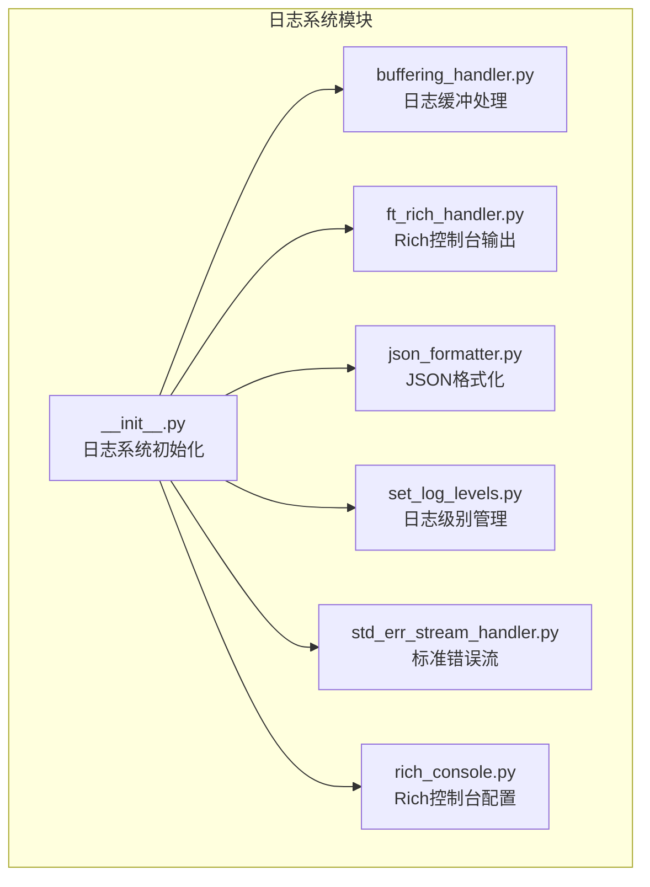
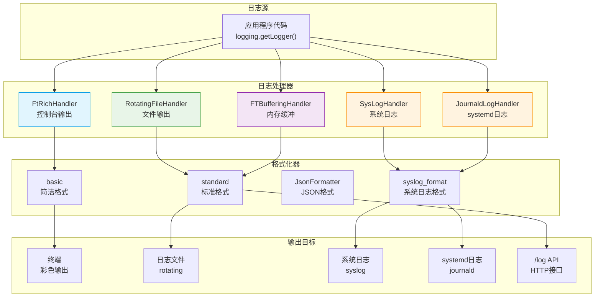
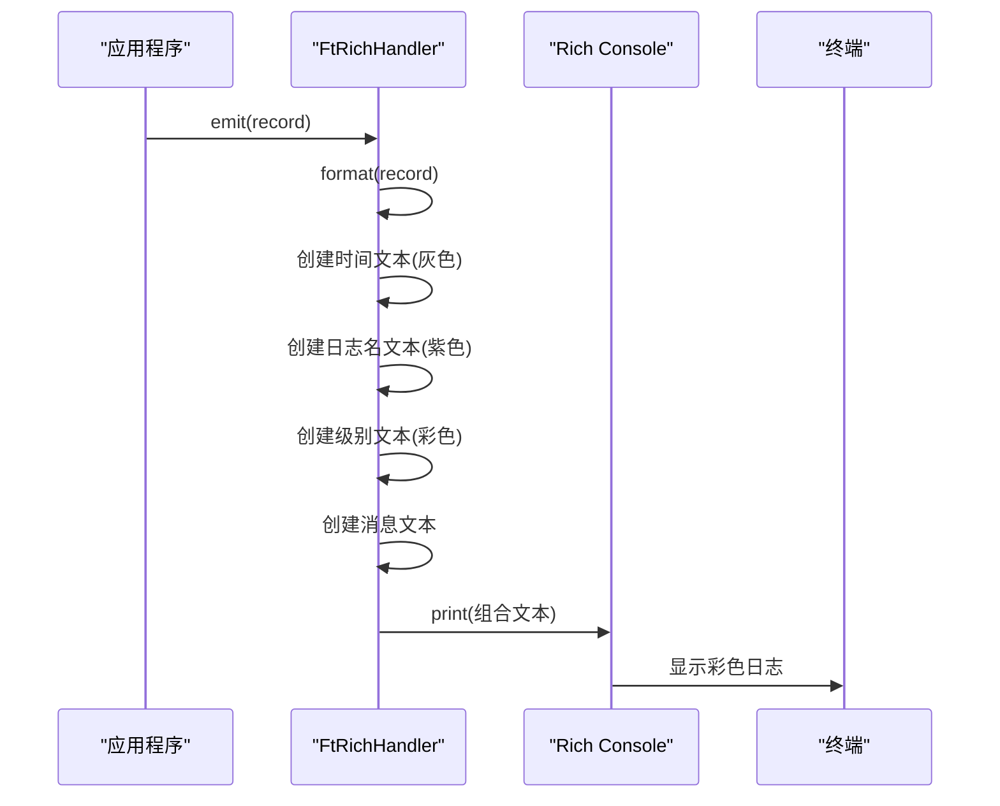
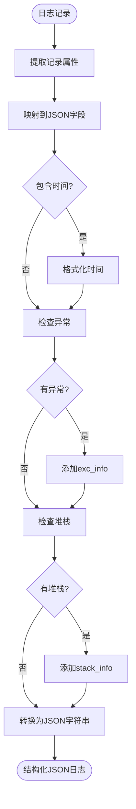
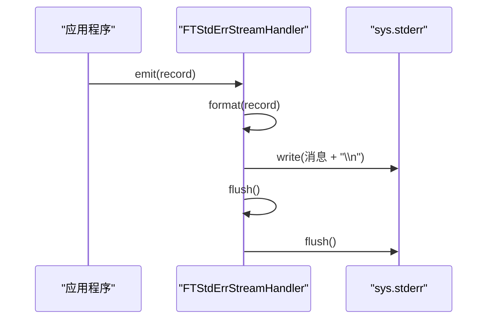
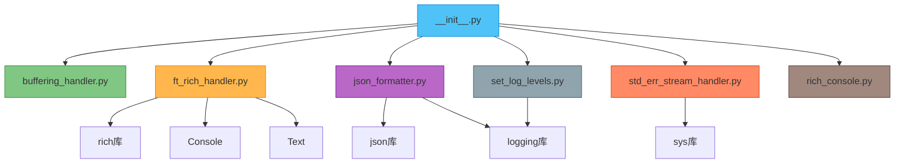

# 日志系统

<cite>
**本文档中引用的文件**  
- [buffering_handler.py](file://freqtrade/loggers/buffering_handler.py)
- [ft_rich_handler.py](file://freqtrade/loggers/ft_rich_handler.py)
- [json_formatter.py](file://freqtrade/loggers/json_formatter.py)
- [set_log_levels.py](file://freqtrade/loggers/set_log_levels.py)
- [std_err_stream_handler.py](file://freqtrade/loggers/std_err_stream_handler.py)
- [__init__.py](file://freqtrade/loggers/__init__.py)
- [rich_console.py](file://freqtrade/loggers/rich_console.py)
</cite>

## 目录
1. [简介](#简介)
2. [项目结构](#项目结构)
3. [核心组件](#核心组件)
4. [架构概述](#架构概述)
5. [详细组件分析](#详细组件分析)
6. [依赖分析](#依赖分析)
7. [性能考虑](#性能考虑)
8. [故障排除指南](#故障排除指南)
9. [结论](#结论)

## 简介
本文档深入解析Freqtrade的日志系统架构与实现机制。重点阐述`buffering_handler`如何通过日志缓冲提升性能，`ft_rich_handler`如何利用Rich库实现美观的控制台输出（包括颜色、进度条、表格等），`json_formatter`如何生成结构化JSON日志以支持系统集成与分析。同时说明`set_log_levels`模块如何动态设置不同组件的日志级别，以及`std_err_stream_handler`如何确保关键日志输出到标准错误流。结合实际配置示例，展示如何自定义日志格式、输出路径、级别控制和异步处理策略，帮助开发者优化日志性能并满足生产环境监控需求。

## 项目结构
Freqtrade的日志系统位于`freqtrade/loggers/`目录下，包含多个专用模块，分别负责日志处理的不同方面。该系统设计为模块化和可扩展，支持多种输出格式和传输方式。



**图示来源**  
- [buffering_handler.py](file://freqtrade/loggers/buffering_handler.py)
- [ft_rich_handler.py](file://freqtrade/loggers/ft_rich_handler.py)
- [json_formatter.py](file://freqtrade/loggers/json_formatter.py)
- [set_log_levels.py](file://freqtrade/loggers/set_log_levels.py)
- [std_err_stream_handler.py](file://freqtrade/loggers/std_err_stream_handler.py)
- [rich_console.py](file://freqtrade/loggers/rich_console.py)
- [__init__.py](file://freqtrade/loggers/__init__.py)

**本节来源**  
- [__init__.py](file://freqtrade/loggers/__init__.py)
- [buffering_handler.py](file://freqtrade/loggers/buffering_handler.py)

## 核心组件
Freqtrade日志系统由多个核心组件构成，每个组件负责特定的日志处理功能。这些组件通过`__init__.py`中的`setup_logging`函数进行集成和配置，形成一个完整的日志处理管道。

**本节来源**  
- [__init__.py](file://freqtrade/loggers/__init__.py#L210-L231)
- [buffering_handler.py](file://freqtrade/loggers/buffering_handler.py#L3-L15)

## 架构概述
Freqtrade日志系统采用分层架构，将日志的生成、格式化、缓冲和输出分离。系统支持多种日志处理器和格式化器，允许灵活配置以适应不同环境和需求。



**图示来源**  
- [__init__.py](file://freqtrade/loggers/__init__.py#L69-L83)
- [buffering_handler.py](file://freqtrade/loggers/buffering_handler.py#L3-L15)
- [ft_rich_handler.py](file://freqtrade/loggers/ft_rich_handler.py#L8-L48)
- [json_formatter.py](file://freqtrade/loggers/json_formatter.py#L4-L73)

## 详细组件分析

### 缓冲处理机制分析
`FTBufferingHandler`通过继承Python标准库的`BufferingHandler`，实现了高效的日志缓冲机制。该处理器在内存中缓存日志记录，避免频繁的I/O操作，从而提升系统性能。

```mermaid
classDiagram
class BufferingHandler {
+int capacity
+list buffer
+acquire()
+release()
+flush()
+emit()
}
class FTBufferingHandler {
+flush()
}
BufferingHandler <|-- FTBufferingHandler
note right of FTBufferingHandler
重写flush()方法，保留一半缓冲区内容
避免日志"空白"时刻
end note
```

**图示来源**  
- [buffering_handler.py](file://freqtrade/loggers/buffering_handler.py#L3-L15)

**本节来源**  
- [buffering_handler.py](file://freqtrade/loggers/buffering_handler.py#L3-L15)

### Rich控制台输出分析
`FtRichHandler`利用Rich库实现美观的控制台输出，支持颜色编码、丰富的文本格式和交互式元素。该处理器专为终端用户设计，提供清晰、可读性强的日志显示。



**图示来源**  
- [ft_rich_handler.py](file://freqtrade/loggers/ft_rich_handler.py#L8-L48)
- [rich_console.py](file://freqtrade/loggers/rich_console.py)

**本节来源**  
- [ft_rich_handler.py](file://freqtrade/loggers/ft_rich_handler.py#L8-L48)

### JSON格式化器分析
`JsonFormatter`将日志记录转换为结构化JSON格式，便于日志收集系统（如ELK、Splunk）进行解析、索引和分析。该格式化器支持自定义字段映射，可灵活配置输出内容。



**图示来源**  
- [json_formatter.py](file://freqtrade/loggers/json_formatter.py#L4-L73)

**本节来源**  
- [json_formatter.py](file://freqtrade/loggers/json_formatter.py#L4-L73)

### 日志级别管理分析
`set_log_levels.py`模块提供动态日志级别管理功能，允许在运行时调整不同组件的日志详细程度。这对于调试特定模块或减少生产环境日志量非常有用。

```mermaid
classDiagram
class set_log_levels {
+list __BIAS_TESTER_LOGGERS
+reduce_verbosity_for_bias_tester()
+restore_verbosity_for_bias_tester()
}
note right of set_log_levels
__BIAS_TESTER_LOGGERS : 特定日志器列表
reduce_verbosity_for_bias_tester() : 降低日志级别
restore_verbosity_for_bias_tester() : 恢复日志级别
end note
```

**图示来源**  
- [set_log_levels.py](file://freqtrade/loggers/set_log_levels.py#L0-L31)

**本节来源**  
- [set_log_levels.py](file://freqtrade/loggers/set_log_levels.py#L0-L31)

### 标准错误流处理分析
`FTStdErrStreamHandler`确保关键日志消息输出到标准错误流，这对于在使用进度条或其他控制台覆盖技术时保持日志可见性至关重要。



**图示来源**  
- [std_err_stream_handler.py](file://freqtrade/loggers/std_err_stream_handler.py#L4-L25)

**本节来源**  
- [std_err_stream_handler.py](file://freqtrade/loggers/std_err_stream_handler.py#L4-L25)

## 依赖分析
Freqtrade日志系统各组件之间存在明确的依赖关系，这些关系通过`__init__.py`文件中的导入和配置进行管理。



**图示来源**  
- [__init__.py](file://freqtrade/loggers/__init__.py#L10-L11)
- [ft_rich_handler.py](file://freqtrade/loggers/ft_rich_handler.py#L1-L7)
- [json_formatter.py](file://freqtrade/loggers/json_formatter.py#L1-L3)
- [std_err_stream_handler.py](file://freqtrade/loggers/std_err_stream_handler.py#L1-2)

**本节来源**  
- [__init__.py](file://freqtrade/loggers/__init__.py)
- [ft_rich_handler.py](file://freqtrade/loggers/ft_rich_handler.py)
- [json_formatter.py](file://freqtrade/loggers/json_formatter.py)
- [std_err_stream_handler.py](file://freqtrade/loggers/std_err_stream_handler.py)

## 性能考虑
Freqtrade日志系统在设计时充分考虑了性能因素。`FTBufferingHandler`通过减少I/O操作次数来提升性能，而`FtRichHandler`则通过高效的文本渲染算法确保控制台输出流畅。JSON格式化虽然有一定开销，但为系统集成提供了重要价值。

**本节来源**  
- [buffering_handler.py](file://freqtrade/loggers/buffering_handler.py#L3-L15)
- [ft_rich_handler.py](file://freqtrade/loggers/ft_rich_handler.py#L8-L48)

## 故障排除指南
当遇到日志系统问题时，可检查以下常见情况：
- 确保日志文件路径有写权限
- 检查`log_config`配置是否正确
- 验证第三方日志库（如cysystemd）是否已安装
- 确认Rich库版本兼容性

**本节来源**  
- [__init__.py](file://freqtrade/loggers/__init__.py#L190-L200)
- [set_log_levels.py](file://freqtrade/loggers/set_log_levels.py#L0-L31)

## 结论
Freqtrade的日志系统是一个功能丰富、设计良好的模块化系统。它通过`buffering_handler`提升性能，利用`ft_rich_handler`提供美观的控制台输出，使用`json_formatter`支持系统集成，并通过`set_log_levels`实现灵活的日志级别管理。该系统既满足了开发调试的需求，也适应了生产环境的监控要求。