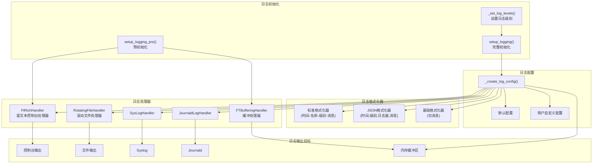
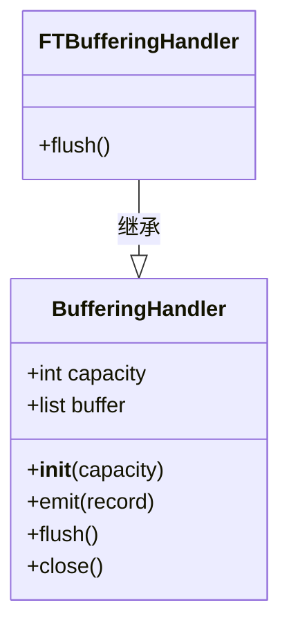
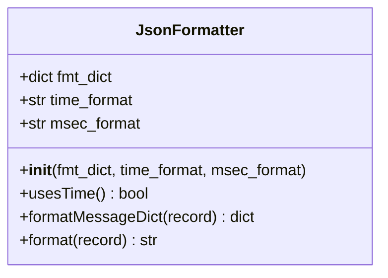
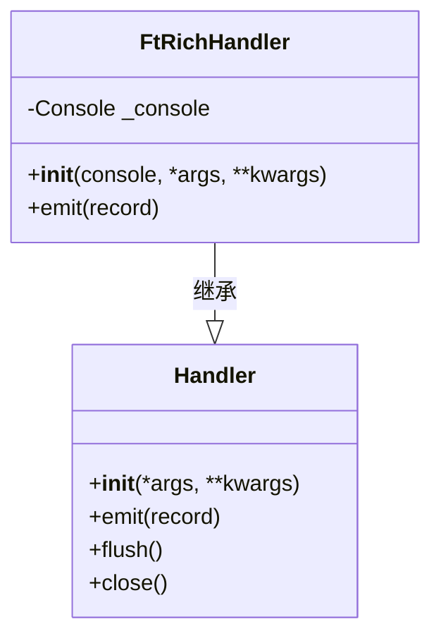
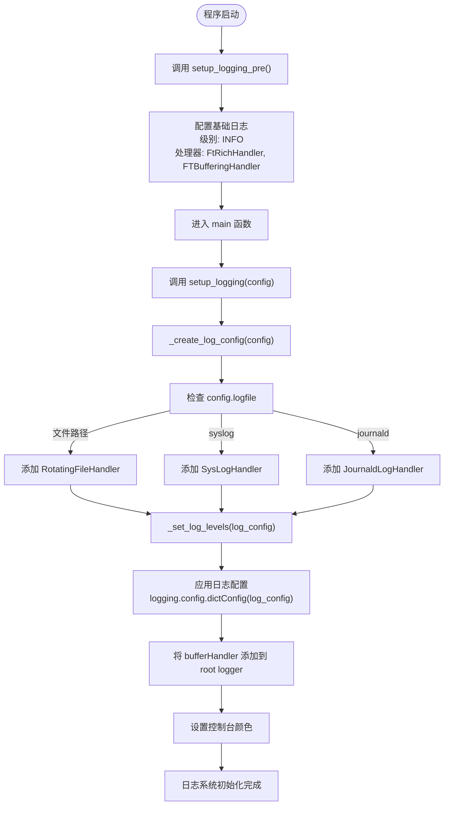
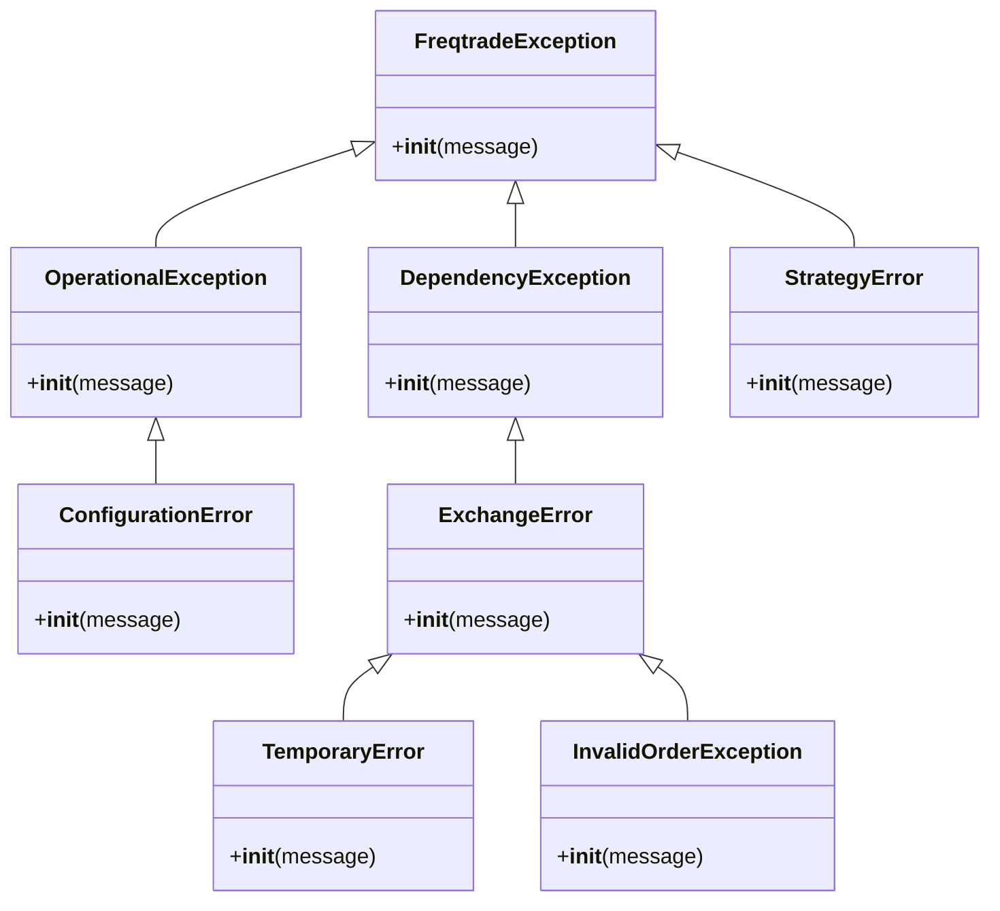
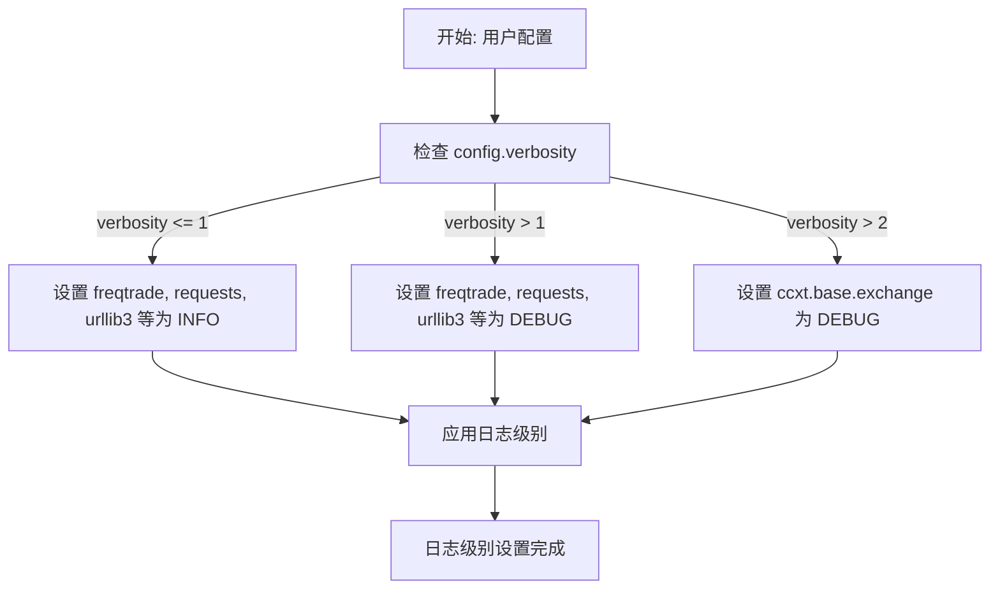

# 日志记录与异常处理

<cite>
**本文档中引用的文件**  
- [exceptions.py](file://freqtrade/exceptions.py)
- [__init__.py](file://freqtrade/loggers/__init__.py)
- [buffering_handler.py](file://freqtrade/loggers/buffering_handler.py)
- [ft_rich_handler.py](file://freqtrade/loggers/ft_rich_handler.py)
- [json_formatter.py](file://freqtrade/loggers/json_formatter.py)
- [rich_console.py](file://freqtrade/loggers/rich_console.py)
- [set_log_levels.py](file://freqtrade/loggers/set_log_levels.py)
- [logging_mixin.py](file://freqtrade/mixins/logging_mixin.py)
- [main.py](file://freqtrade/main.py)
</cite>

## 目录
1. [简介](#简介)
2. [日志系统架构](#日志系统架构)
3. [核心日志组件分析](#核心日志组件分析)
4. [异常处理体系](#异常处理体系)
5. [日志配置与最佳实践](#日志配置与最佳实践)
6. [异常捕获与策略影响](#异常捕获与策略影响)
7. [结论](#结论)

## 简介
Freqtrade 是一个开源的加密货币交易机器人，其日志记录与异常处理机制是确保系统稳定运行的关键组成部分。本文深入解析 Freqtrade 的日志系统与异常处理机制，重点说明 `loggers` 模块中缓冲处理、结构化日志输出（JSON格式）、富文本控制台显示（ft_rich_handler）的实现原理和配置方式。同时，结合 `exceptions.py` 中定义的异常继承体系（如 `FreqtradeException`、`OperationalException`、`ExchangeError` 等），阐述不同异常类型的触发场景、处理策略及对交易流程的影响。最后，提供自定义日志级别、日志路径和异常捕获的最佳实践，帮助开发者快速定位策略错误、网络问题和配置异常。

## 日志系统架构

**图示来源**
- [__init__.py](file://freqtrade/loggers/__init__.py#L0-L231)
- [ft_rich_handler.py](file://freqtrade/loggers/ft_rich_handler.py#L0-L49)
- [buffering_handler.py](file://freqtrade/loggers/buffering_handler.py#L0-L16)
- [json_formatter.py](file://freqtrade/loggers/json_formatter.py#L0-L74)

## 核心日志组件分析

### 缓冲处理机制
Freqtrade 使用 `FTBufferingHandler` 实现日志缓冲，确保在 `/log` 端点可以访问最近的日志条目。该处理器继承自 `logging.handlers.BufferingHandler`，并重写了 `flush` 方法，保留缓冲区一半的记录，避免日志“空白”时刻。

**图示来源**
- [buffering_handler.py](file://freqtrade/loggers/buffering_handler.py#L0-L16)

**代码来源**
- [buffering_handler.py](file://freqtrade/loggers/buffering_handler.py#L0-L16)

### 结构化日志输出
`JsonFormatter` 类实现了 JSON 格式的日志输出，便于日志的机器解析和集中管理。它允许用户自定义字段映射，并支持时间格式化。

**图示来源**
- [json_formatter.py](file://freqtrade/loggers/json_formatter.py#L0-L74)

**代码来源**
- [json_formatter.py](file://freqtrade/loggers/json_formatter.py#L0-L74)

### 富文本控制台显示
`FtRichHandler` 利用 `rich` 库提供彩色和格式化的控制台输出。它在初始化时接收一个 `Console` 对象，并在 `emit` 方法中格式化日志记录，包括时间、日志器名称、级别和消息。

**图示来源**
- [ft_rich_handler.py](file://freqtrade/loggers/ft_rich_handler.py#L0-L49)

**代码来源**
- [ft_rich_handler.py](file://freqtrade/loggers/ft_rich_handler.py#L0-L49)

### 日志初始化流程
Freqtrade 的日志系统通过 `setup_logging_pre` 和 `setup_logging` 两个函数分阶段初始化。`setup_logging_pre` 在早期设置基本的日志配置，而 `setup_logging` 根据用户配置完成最终的日志系统设置。

**图示来源**
- [__init__.py](file://freqtrade/loggers/__init__.py#L0-L231)
- [main.py](file://freqtrade/main.py#L0-L79)

**代码来源**
- [__init__.py](file://freqtrade/loggers/__init__.py#L0-L231)
- [main.py](file://freqtrade/main.py#L0-L79)

## 异常处理体系

### 异常继承体系
Freqtrade 定义了一个清晰的异常继承体系，所有异常都继承自 `FreqtradeException`。这有助于在顶层统一处理异常，并根据异常类型采取不同的恢复策略。

**图示来源**
- [exceptions.py](file://freqtrade/exceptions.py#L0-L83)

**代码来源**
- [exceptions.py](file://freqtrade/exceptions.py#L0-L83)

### 异常类型与处理策略
| 异常类型 | 触发场景 | 处理策略 | 对交易流程的影响 |
|--------|--------|--------|----------------|
| `OperationalException` | 需要人工干预的错误，如无效配置 | 停止机器人 | 交易流程中断，需用户修复后重启 |
| `ConfigurationError` | 配置错误 | 停止机器人并提示错误信息 | 交易流程无法启动 |
| `TemporaryError` | 临时网络或交易所错误 | 重试机制，通常能自行恢复 | 交易延迟，但流程可继续 |
| `InvalidOrderException` | 订单无效，如已成交的订单被取消 | 捕获异常，记录日志，可能重试或放弃 | 订单执行失败，但不影响整体流程 |
| `StrategyError` | 策略代码中的错误 | 停止相关策略，记录详细错误 | 特定策略失效，其他策略可能继续运行 |

**代码来源**
- [exceptions.py](file://freqtrade/exceptions.py#L0-L83)

## 日志配置与最佳实践

### 自定义日志级别
通过 `config.json` 中的 `verbosity` 字段可以调整日志级别。`verbosity` 为 0 时，日志级别为 INFO；大于 0 时，为 DEBUG。此外，`log_config` 允许更精细地控制第三方库的日志级别。

**代码来源**
- [__init__.py](file://freqtrade/loggers/__init__.py#L100-L125)

### 自定义日志路径
用户可以通过 `config.json` 中的 `logfile` 字段指定日志文件路径。支持普通文件、syslog 和 journald。对于普通文件，系统会自动创建父目录并使用 `RotatingFileHandler` 进行日志轮转。

**代码来源**
- [__init__.py](file://freqtrade/loggers/__init__.py#L140-L190)

### 最佳实践
1. **开发阶段**：启用 DEBUG 级别日志，便于调试策略和分析问题。
2. **生产环境**：使用 INFO 或 WARNING 级别，减少日志量。
3. **结构化日志**：在日志集中系统中使用 `JsonFormatter`，便于搜索和分析。
4. **异常处理**：在自定义策略中捕获并处理 `TemporaryError`，实现优雅降级。
5. **日志轮转**：配置合理的 `maxBytes` 和 `backupCount`，防止日志文件过大。

## 异常捕获与策略影响

### 策略错误处理
当策略代码中出现错误时，会抛出 `StrategyError`。这通常会导致该策略被禁用，但不会影响其他策略的运行。开发者应在策略中加入充分的异常捕获，避免因单个错误导致整个策略失效。

**代码来源**
- [exceptions.py](file://freqtrade/exceptions.py#L79-L83)

### 网络与交易所问题
`TemporaryError` 和 `ExchangeError` 主要处理网络和交易所相关的问题。`TemporaryError` 表示临时性问题，系统通常会自动重试。而 `ExchangeError` 可能需要更复杂的处理逻辑，如切换交易所或调整交易参数。

**代码来源**
- [exceptions.py](file://freqtrade/exceptions.py#L64-L69)
- [exceptions.py](file://freqtrade/exceptions.py#L35-L39)

### 配置异常
`ConfigurationError` 是最严重的异常之一，因为它阻止了机器人的启动。确保配置文件的正确性是避免此类问题的关键。使用 `config_schema` 进行配置验证可以有效预防配置错误。

**代码来源**
- [exceptions.py](file://freqtrade/exceptions.py#L14-L17)

## 结论
Freqtrade 的日志系统和异常处理机制设计精良，为开发者提供了强大的调试和监控能力。通过理解 `loggers` 模块的内部工作原理和 `exceptions.py` 中定义的异常体系，开发者可以更有效地配置日志、处理异常，并快速定位和解决交易过程中出现的问题。遵循最佳实践，可以确保交易机器人在各种情况下都能稳定、可靠地运行。