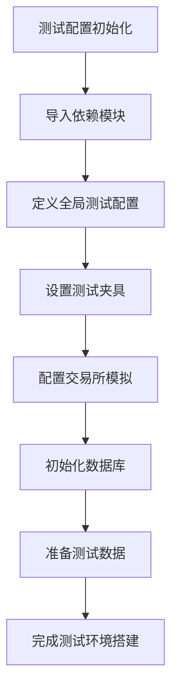
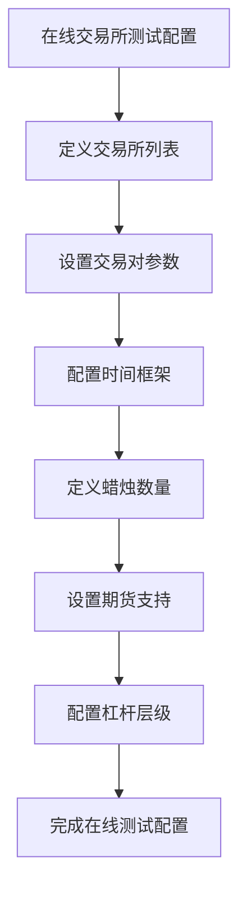
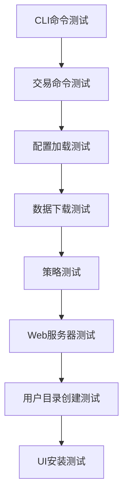
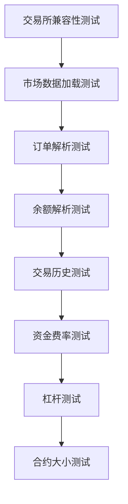
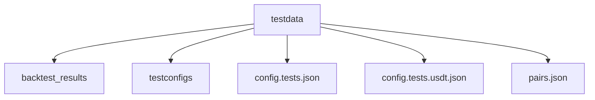
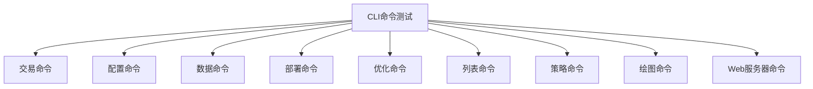
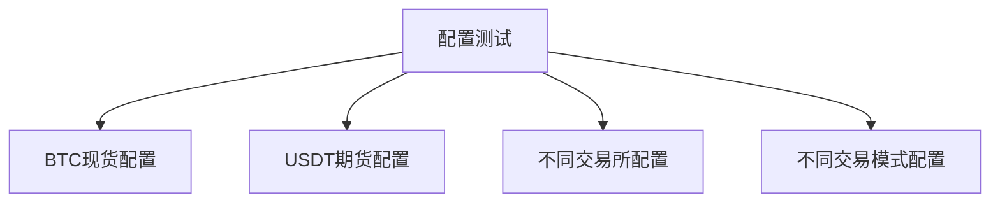

# 系统测试与组件验证

<cite>
**Referenced Files in This Document**   
- [conftest.py](file://tests/conftest.py)
- [exchange_online/conftest.py](file://tests/exchange_online/conftest.py)
- [exchange_online/test_ccxt_compat.py](file://tests/exchange_online/test_ccxt_compat.py)
- [commands/test_commands.py](file://tests/commands/test_commands.py)
- [testdata/testconfigs/main_test_config.json](file://tests/testdata/testconfigs/main_test_config.json)
- [testdata/config.tests.json](file://tests/testdata/config.tests.json)
- [testdata/config.tests.usdt.json](file://tests/testdata/config.tests.usdt.json)
- [testdata/pairs.json](file://tests/testdata/pairs.json)
</cite>

## 目录
1. [引言](#引言)
2. [测试环境配置](#测试环境配置)
3. [单元测试执行](#单元测试执行)
4. [集成测试验证](#集成测试验证)
5. [交易所兼容性测试](#交易所兼容性测试)
6. [测试数据管理](#测试数据管理)
7. [CLI命令测试](#cli命令测试)
8. [配置加载测试](#配置加载测试)
9. [交易流程验证](#交易流程验证)
10. [结论](#结论)

## 引言

Freqtrade系统提供了一套完整的测试套件，用于验证各组件的正确性和系统稳定性。本指南详细介绍了如何利用内置的测试框架进行全面的系统验证，包括单元测试、集成测试和在线交易所兼容性测试。通过这些测试，开发者和用户可以确保系统在各种场景下的可靠运行。

## 测试环境配置

### conftest.py 配置文件分析

`conftest.py` 文件是pytest测试框架的核心配置文件，负责设置测试环境、定义测试夹具和配置测试参数。该文件在 `tests/` 目录及其子目录中存在多个实例，每个实例针对特定的测试场景进行配置。



**Diagram sources**
- [conftest.py](file://tests/conftest.py#L1-L3445)

**Section sources**
- [conftest.py](file://tests/conftest.py#L1-L3445)

### 交易所在线测试配置

`exchange_online/conftest.py` 文件专门用于配置在线交易所测试环境，定义了多个主流交易所的测试参数和验证规则。



**Diagram sources**
- [exchange_online/conftest.py](file://tests/exchange_online/conftest.py#L1-L635)

**Section sources**
- [exchange_online/conftest.py](file://tests/exchange_online/conftest.py#L1-L635)

## 单元测试执行

### pytest测试框架使用

Freqtrade使用pytest作为主要的测试框架，通过命令行执行单元测试。测试文件位于 `tests/` 目录下，按照功能模块组织。

```bash
# 运行所有测试
pytest

# 运行特定模块的测试
pytest tests/commands/

# 运行特定测试文件
pytest tests/commands/test_commands.py

# 运行标记为longrun的测试
pytest --longrun
```

### 测试发现机制

pytest通过文件名模式自动发现测试文件，遵循以下命名约定：
- 测试文件以 `test_` 开头或以 `_test.py` 结尾
- 测试函数以 `test_` 开头
- 测试类以 `Test` 开头

## 集成测试验证

### 命令行接口测试

`test_commands.py` 文件包含了对Freqtrade命令行接口的全面测试，验证各种CLI命令的正确性。



**Diagram sources**
- [commands/test_commands.py](file://tests/commands/test_commands.py#L1-L2041)

**Section sources**
- [commands/test_commands.py](file://tests/commands/test_commands.py#L1-L2041)

### 交易流程集成测试

通过 `test_integration.py` 文件验证完整的交易流程，包括：
- 交易对选择
- 信号生成
- 订单执行
- 风险管理
- 交易记录

## 交易所兼容性测试

### CCXT兼容性测试

`test_ccxt_compat.py` 文件专门用于测试与CCXT库的兼容性，确保Freqtrade能够与各种交易所正确交互。



**Diagram sources**
- [exchange_online/test_ccxt_compat.py](file://tests/exchange_online/test_ccxt_compat.py#L1-L565)

**Section sources**
- [exchange_online/test_ccxt_compat.py](file://tests/exchange_online/test_ccxt_compat.py#L1-L565)

### 在线测试执行

在线交易所测试需要网络连接，可以通过以下命令执行：

```bash
# 执行所有在线测试
pytest --longrun tests/exchange_online/

# 执行特定交易所的测试
pytest --longrun tests/exchange_online/test_ccxt_compat.py::TestCCXTExchange::test_load_markets
```

## 测试数据管理

### 测试数据目录结构

`testdata/` 目录包含各种测试所需的配置文件和数据文件。



### 配置文件测试数据

测试配置文件模拟了不同场景下的系统配置，包括：

```json
{
    "max_open_trades": 3,
    "stake_currency": "BTC",
    "stake_amount": 0.05,
    "timeframe": "5m",
    "dry_run": true,
    "exchange": {
        "name": "binance",
        "pair_whitelist": [
            "ETH/BTC",
            "LTC/BTC",
            "ETC/BTC"
        ]
    }
}
```

**Section sources**
- [testdata/testconfigs/main_test_config.json](file://tests/testdata/testconfigs/main_test_config.json#L1-L78)
- [testdata/config.tests.json](file://tests/testdata/config.tests.json#L1-L76)
- [testdata/config.tests.usdt.json](file://tests/testdata/config.tests.usdt.json#L1-L78)

### 交易对数据

`pairs.json` 文件包含测试用的交易对列表，用于验证交易对选择和管理功能。

```json
[
    "ADA/BTC",
    "BAT/BTC",
    "DASH/BTC",
    "ETC/BTC",
    "ETH/BTC"
]
```

**Section sources**
- [testdata/pairs.json](file://tests/testdata/pairs.json#L1-L27)

## CLI命令测试

### 命令行接口功能测试

`test_commands.py` 文件中的测试用例验证了各种CLI命令的功能正确性。



### 命令执行流程

CLI命令的执行流程包括：
1. 参数解析
2. 配置加载
3. 命令执行
4. 结果输出
5. 错误处理

## 配置加载测试

### 配置文件验证

测试框架验证配置文件的正确加载和解析，包括：
- JSON格式验证
- 必需字段检查
- 数据类型验证
- 范围检查

### 不同配置场景测试

通过不同的测试配置文件验证系统在各种配置下的行为：



## 交易流程验证

### 交易生命周期测试

验证完整的交易生命周期，包括：
- 交易创建
- 订单执行
- 交易更新
- 交易关闭
- 风险管理

### 交易策略测试

通过预定义的测试策略验证策略执行的正确性，包括：
- 信号生成
- 入场条件
- 出场条件
- 止损止盈

## 结论

Freqtrade的测试套件提供了全面的系统验证能力，确保各组件的正确性和系统的稳定性。通过单元测试、集成测试和在线交易所兼容性测试，可以有效验证系统的各个方面。建议在开发和部署过程中定期运行这些测试，以确保系统的可靠运行。