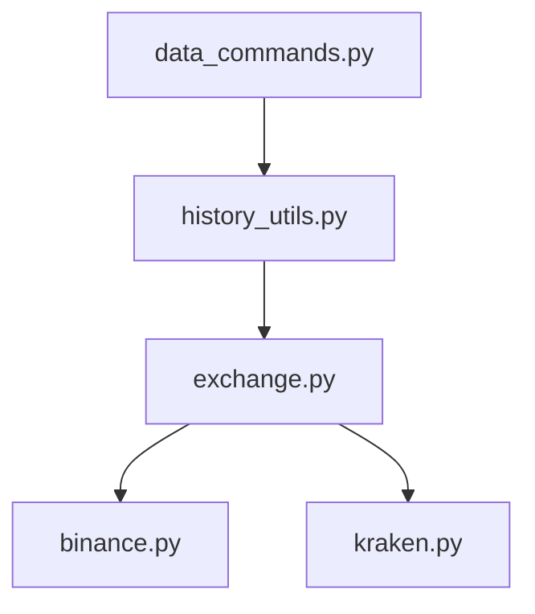
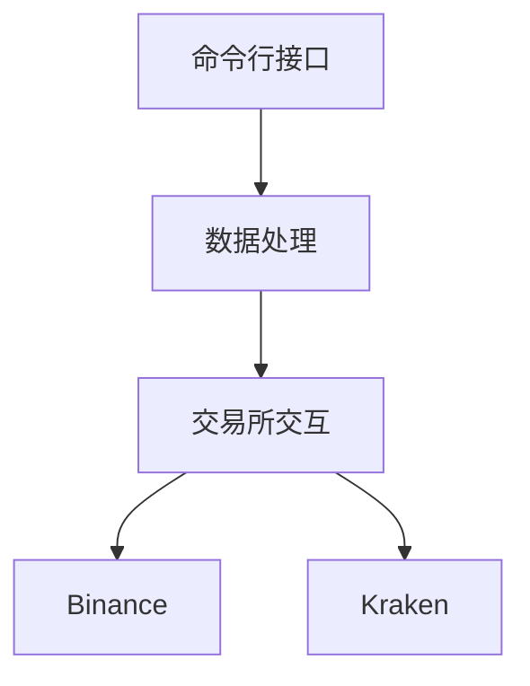
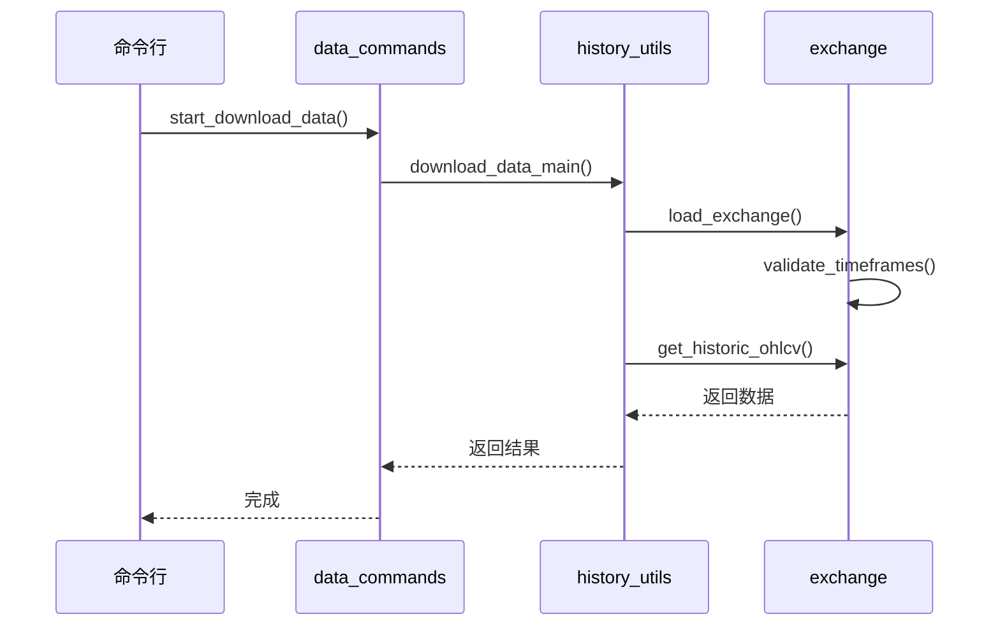
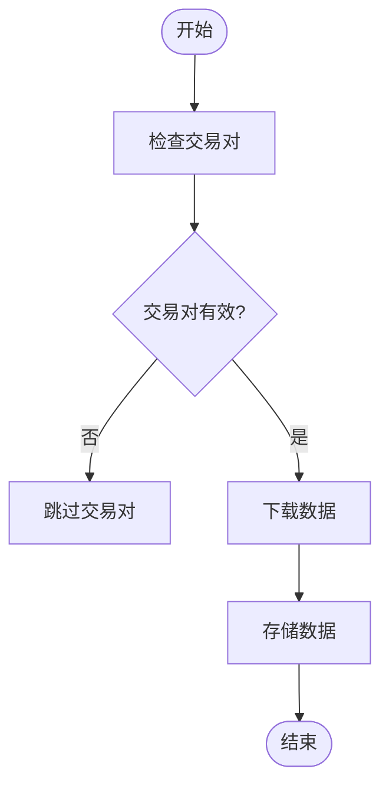
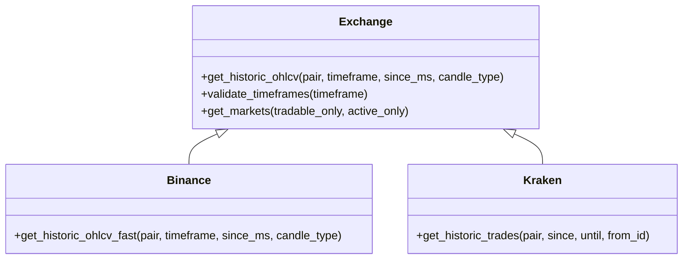
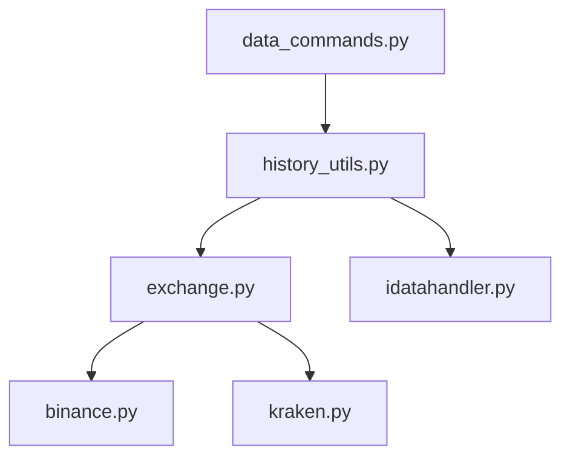

# 历史数据下载

<cite>
**本文档引用的文件**   
- [data_commands.py](file://freqtrade/commands/data_commands.py)
- [history_utils.py](file://freqtrade/data/history/history_utils.py)
- [exchange.py](file://freqtrade/exchange/exchange.py)
- [binance.py](file://freqtrade/exchange/binance.py)
- [kraken.py](file://freqtrade/exchange/kraken.py)
- [idatahandler.py](file://freqtrade/data/history/datahandlers/idatahandler.py)
- [featherdatahandler.py](file://freqtrade/data/history/datahandlers/featherdatahandler.py)
</cite>

## 目录
1. [简介](#简介)
2. [项目结构](#项目结构)
3. [核心组件](#核心组件)
4. [架构概述](#架构概述)
5. [详细组件分析](#详细组件分析)
6. [依赖分析](#依赖分析)
7. [性能考虑](#性能考虑)
8. [故障排除指南](#故障排除指南)
9. [结论](#结论)

## 简介
本文档详细说明了通过 `data_commands.py` 实现的 OHLCV 数据下载机制。它涵盖了支持的交易所（如 Binance、Kraken 等）、时间框架、`download-data` 命令行工具的使用方法、参数配置、并行下载优化、增量更新策略、数据完整性校验流程以及大规模数据下载的性能调优建议。

## 项目结构
项目结构清晰地组织了各个模块，其中 `freqtrade/commands/data_commands.py` 是数据下载功能的核心文件。该文件依赖于 `freqtrade/data/history/history_utils.py` 中的下载逻辑，并通过 `freqtrade/exchange/exchange.py` 与各个交易所进行交互。

**图表来源**
- [data_commands.py](file://freqtrade/commands/data_commands.py)
- [history_utils.py](file://freqtrade/data/history/history_utils.py)
- [exchange.py](file://freqtrade/exchange/exchange.py)
- [binance.py](file://freqtrade/exchange/binance.py)
- [kraken.py](file://freqtrade/exchange/kraken.py)

**章节来源**
- [data_commands.py](file://freqtrade/commands/data_commands.py)
- [history_utils.py](file://freqtrade/data/history/history_utils.py)
- [exchange.py](file://freqtrade/exchange/exchange.py)

## 核心组件
`data_commands.py` 文件中的 `start_download_data` 函数是数据下载的入口点。它通过 `setup_utils_configuration` 函数设置配置，并调用 `download_data_main` 函数来启动下载过程。

**章节来源**
- [data_commands.py](file://freqtrade/commands/data_commands.py#L233-L245)

## 架构概述
系统架构包括命令行接口、数据处理和交易所交互三个主要部分。`data_commands.py` 作为命令行接口，调用 `history_utils.py` 中的函数来处理数据下载逻辑，而 `exchange.py` 则负责与各个交易所进行通信。

**图表来源**
- [data_commands.py](file://freqtrade/commands/data_commands.py)
- [history_utils.py](file://freqtrade/data/history/history_utils.py)
- [exchange.py](file://freqtrade/exchange/exchange.py)

## 详细组件分析

### 数据下载命令分析
`start_download_data` 函数负责启动数据下载过程。它首先检查配置的合理性，然后调用 `download_data_main` 函数来执行下载。

**图表来源**
- [data_commands.py](file://freqtrade/commands/data_commands.py#L233-L245)
- [history_utils.py](file://freqtrade/data/history/history_utils.py#L678-L683)
- [exchange.py](file://freqtrade/exchange/exchange.py)

**章节来源**
- [data_commands.py](file://freqtrade/commands/data_commands.py#L233-L245)
- [history_utils.py](file://freqtrade/data/history/history_utils.py#L678-L683)

### 数据处理分析
`refresh_backtest_ohlcv_data` 函数负责刷新存储的 OHLCV 数据。它通过并行下载优化来提高下载效率，并支持增量更新策略。

**图表来源**
- [history_utils.py](file://freqtrade/data/history/history_utils.py#L349-L459)

**章节来源**
- [history_utils.py](file://freqtrade/data/history/history_utils.py#L349-L459)

### 交易所交互分析
`Exchange` 类是与交易所交互的核心。它提供了下载历史数据、验证时间框架等功能。

**图表来源**
- [exchange.py](file://freqtrade/exchange/exchange.py)
- [binance.py](file://freqtrade/exchange/binance.py)
- [kraken.py](file://freqtrade/exchange/kraken.py)

**章节来源**
- [exchange.py](file://freqtrade/exchange/exchange.py)
- [binance.py](file://freqtrade/exchange/binance.py)
- [kraken.py](file://freqtrade/exchange/kraken.py)

## 依赖分析
`data_commands.py` 依赖于 `history_utils.py` 和 `exchange.py`。`history_utils.py` 又依赖于 `exchange.py` 和 `idatahandler.py`。`exchange.py` 依赖于具体的交易所实现，如 `binance.py` 和 `kraken.py`。

**图表来源**
- [data_commands.py](file://freqtrade/commands/data_commands.py)
- [history_utils.py](file://freqtrade/data/history/history_utils.py)
- [exchange.py](file://freqtrade/exchange/exchange.py)
- [idatahandler.py](file://freqtrade/data/history/datahandlers/idatahandler.py)
- [binance.py](file://freqtrade/exchange/binance.py)
- [kraken.py](file://freqtrade/exchange/kraken.py)

**章节来源**
- [data_commands.py](file://freqtrade/commands/data_commands.py)
- [history_utils.py](file://freqtrade/data/history/history_utils.py)
- [exchange.py](file://freqtrade/exchange/exchange.py)
- [idatahandler.py](file://freqtrade/data/history/datahandlers/idatahandler.py)

## 性能考虑
为了提高大规模数据下载的性能，可以配置连接池和请求频率控制。例如，可以通过设置 `no_parallel_download` 参数来禁用并行下载，以减少对交易所的请求压力。

**章节来源**
- [history_utils.py](file://freqtrade/data/history/history_utils.py#L349-L459)

## 故障排除指南
如果在下载数据时遇到问题，可以检查配置文件中的 `pairs` 和 `timeframes` 是否正确。此外，确保交易所支持所需的时间框架和交易对。

**章节来源**
- [data_commands.py](file://freqtrade/commands/data_commands.py#L233-L245)
- [history_utils.py](file://freqtrade/data/history/history_utils.py#L686-L803)

## 结论
通过 `data_commands.py` 实现的 OHLCV 数据下载机制提供了强大的功能，支持多种交易所和时间框架。通过合理的配置和优化，可以高效地获取历史 K 线数据，确保数据获取的可靠性和效率。