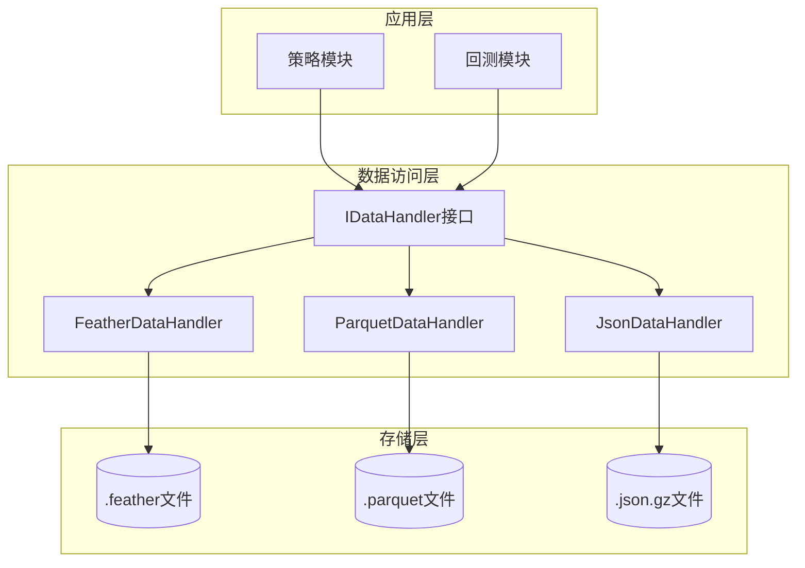
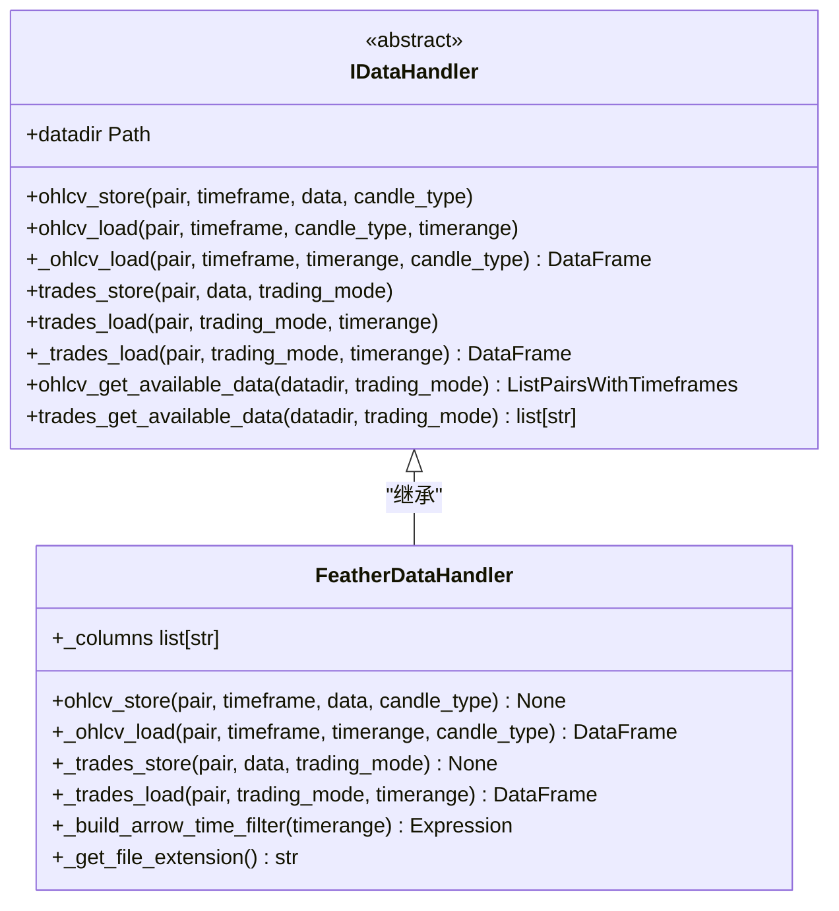
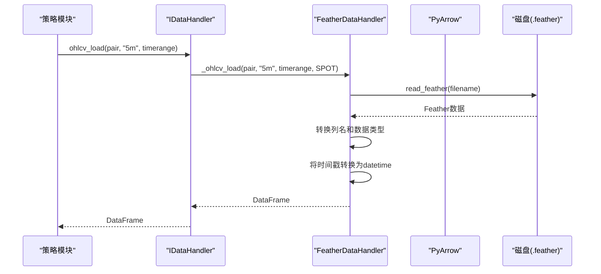
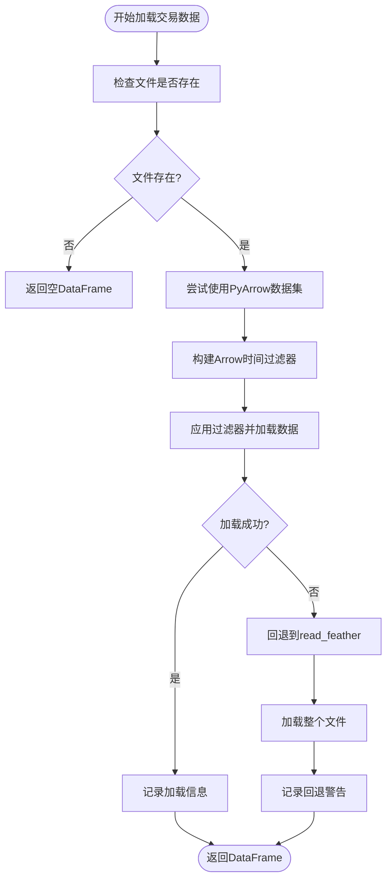
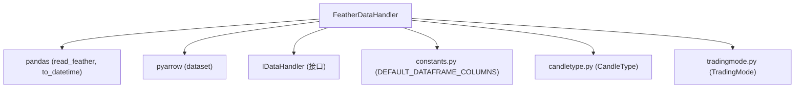

# Feather存储格式

<cite>
**Referenced Files in This Document**   
- [featherdatahandler.py](file://freqtrade/data/history/datahandlers/featherdatahandler.py)
- [idatahandler.py](file://freqtrade/data/history/datahandlers/idatahandler.py)
- [constants.py](file://freqtrade/constants.py)
- [candletype.py](file://freqtrade/enums/candletype.py)
- [tradingmode.py](file://freqtrade/enums/tradingmode.py)
</cite>

## 目录
1. [引言](#引言)
2. [核心组件](#核心组件)
3. [架构概述](#架构概述)
4. [详细组件分析](#详细组件分析)
5. [依赖分析](#依赖分析)
6. [性能考量](#性能考量)
7. [故障排除指南](#故障排除指南)
8. [结论](#结论)

## 引言
Feather是一种高效的列式存储格式，专为快速数据访问和分析而设计。在量化数据管理领域，Feather通过利用Apache Arrow内存格式实现了卓越的I/O性能。本文档深入解析了`FeatherDataHandler`如何在Freqtrade框架中实现高效的数据加载与存储，重点阐述其在数据加载速度、压缩效率以及与Python生态集成方面的优势。同时，文档将说明Feather对时间序列数据的优化特性，包括时间索引处理、缺失值表示和类型保留机制，并讨论其在实盘交易等需要快速数据访问场景下的最佳实践。

## 核心组件
`FeatherDataHandler`是Freqtrade框架中用于处理Feather格式数据的核心类。它继承自`IDataHandler`抽象基类，实现了针对Feather格式的OHLCV（开、高、低、收、量）和交易数据的加载、存储和管理功能。该组件通过Pandas的`to_feather`和`read_feather`方法与底层Feather文件进行交互，并利用PyArrow库进行高级数据操作和过滤。

**Section sources**
- [featherdatahandler.py](file://freqtrade/data/history/datahandlers/featherdatahandler.py#L15-L184)

## 架构概述
`FeatherDataHandler`作为`IDataHandler`接口的一个具体实现，位于数据持久化层。它负责将内存中的Pandas DataFrame对象高效地序列化到磁盘，并在需要时快速反序列化。其设计遵循了策略模式，允许系统在运行时根据配置动态选择不同的数据处理后端（如JSON、Parquet或Feather）。这种架构确保了数据访问逻辑与具体存储格式的解耦，提高了系统的灵活性和可维护性。

**Diagram sources**
- [idatahandler.py](file://freqtrade/data/history/datahandlers/idatahandler.py#L15-L584)
- [featherdatahandler.py](file://freqtrade/data/history/datahandlers/featherdatahandler.py#L15-L184)

## 详细组件分析

### FeatherDataHandler 分析
`FeatherDataHandler`类是实现Feather格式数据处理的核心。它提供了`ohlcv_store`、`_ohlcv_load`、`_trades_store`和`_trades_load`等关键方法，用于管理OHLCV和交易数据。

#### 对象导向组件

**Diagram sources**
- [idatahandler.py](file://freqtrade/data/history/datahandlers/idatahandler.py#L15-L584)
- [featherdatahandler.py](file://freqtrade/data/history/datahandlers/featherdatahandler.py#L15-L184)

#### API/服务组件

**Diagram sources**
- [featherdatahandler.py](file://freqtrade/data/history/datahandlers/featherdatahandler.py#L15-L184)

#### 复杂逻辑组件

**Diagram sources**
- [featherdatahandler.py](file://freqtrade/data/history/datahandlers/featherdatahandler.py#L15-L184)

**Section sources**
- [featherdatahandler.py](file://freqtrade/data/history/datahandlers/featherdatahandler.py#L15-L184)

## 依赖分析
`FeatherDataHandler`的实现依赖于多个关键的外部库和内部模块。其核心依赖包括Pandas用于DataFrame操作，PyArrow用于高性能的Feather文件读写和过滤。在内部，它依赖于`IDataHandler`接口来定义其行为，并使用`constants.py`中的常量（如`DEFAULT_DATAFRAME_COLUMNS`）来确保数据结构的一致性。此外，它还依赖于`enums`模块中的`CandleType`和`TradingMode`枚举来处理不同的交易模式和数据类型。

**Diagram sources**
- [featherdatahandler.py](file://freqtrade/data/history/datahandlers/featherdatahandler.py#L15-L184)
- [idatahandler.py](file://freqtrade/data/history/datahandlers/idatahandler.py#L15-L584)
- [constants.py](file://freqtrade/constants.py#L1-L229)
- [candletype.py](file://freqtrade/enums/candletype.py#L1-L32)
- [tradingmode.py](file://freqtrade/enums/tradingmode.py#L1-L16)

**Section sources**
- [featherdatahandler.py](file://freqtrade/data/history/datahandlers/featherdatahandler.py#L15-L184)
- [idatahandler.py](file://freqtrade/data/history/datahandlers/idatahandler.py#L15-L584)

## 性能考量
`FeatherDataHandler`在性能方面表现出显著优势。首先，它使用LZ4压缩算法，该算法以极快的压缩和解压缩速度著称，非常适合需要频繁I/O操作的量化交易场景。其次，通过利用PyArrow的`dataset`功能，`_trades_load`方法能够实现“按需读取”（read-on-demand），即在加载交易数据时，可以预先构建一个基于时间范围的过滤表达式，从而避免将整个大文件加载到内存中，极大地提升了加载效率和内存利用率。此外，Feather格式本身是列式的，对于只访问部分列的查询操作，其性能远超行式存储格式。

## 故障排除指南
当使用`FeatherDataHandler`遇到问题时，首先应检查日志输出。常见的错误包括文件不存在（`No history for ... found`），这通常意味着需要使用`freqtrade download-data`命令下载数据。另一个潜在问题是Arrow过滤功能加载失败，此时系统会自动回退到传统的`read_feather`方法，并记录警告信息。这可能是由于PyArrow库版本不兼容或损坏的Feather文件所致。确保所有依赖库（特别是Pandas和PyArrow）都是最新且兼容的版本，是避免此类问题的关键。

**Section sources**
- [featherdatahandler.py](file://freqtrade/data/history/datahandlers/featherdatahandler.py#L15-L184)
- [idatahandler.py](file://freqtrade/data/history/datahandlers/idatahandler.py#L15-L584)

## 结论
`FeatherDataHandler`是Freqtrade框架中一个高效、可靠的数据处理组件。它充分利用了Feather列式存储格式和Apache Arrow内存标准的优势，在数据加载速度、压缩效率和内存管理方面表现卓越。其对时间序列数据的原生支持，特别是通过PyArrow实现的高效时间范围过滤，使其成为实盘交易和回测等需要快速访问大量历史数据场景的理想选择。尽管它可能不是长期归档存储的最佳方案（因为其设计更侧重于性能而非极致的压缩比），但对于量化交易系统的核心数据管理需求，`FeatherDataHandler`提供了一个强大且优化的解决方案。