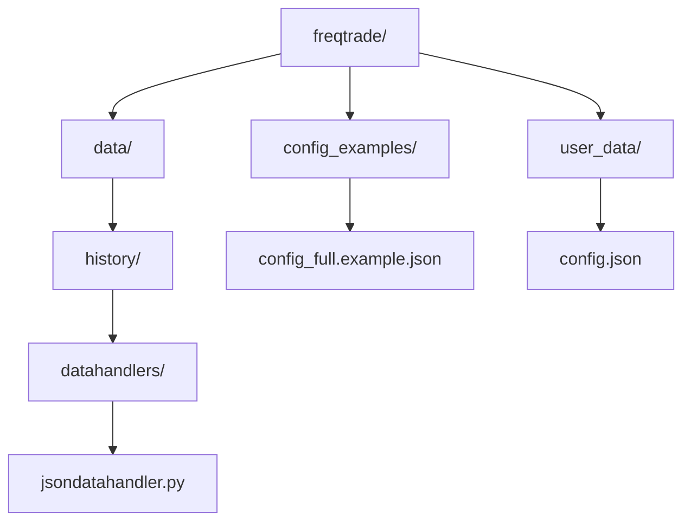
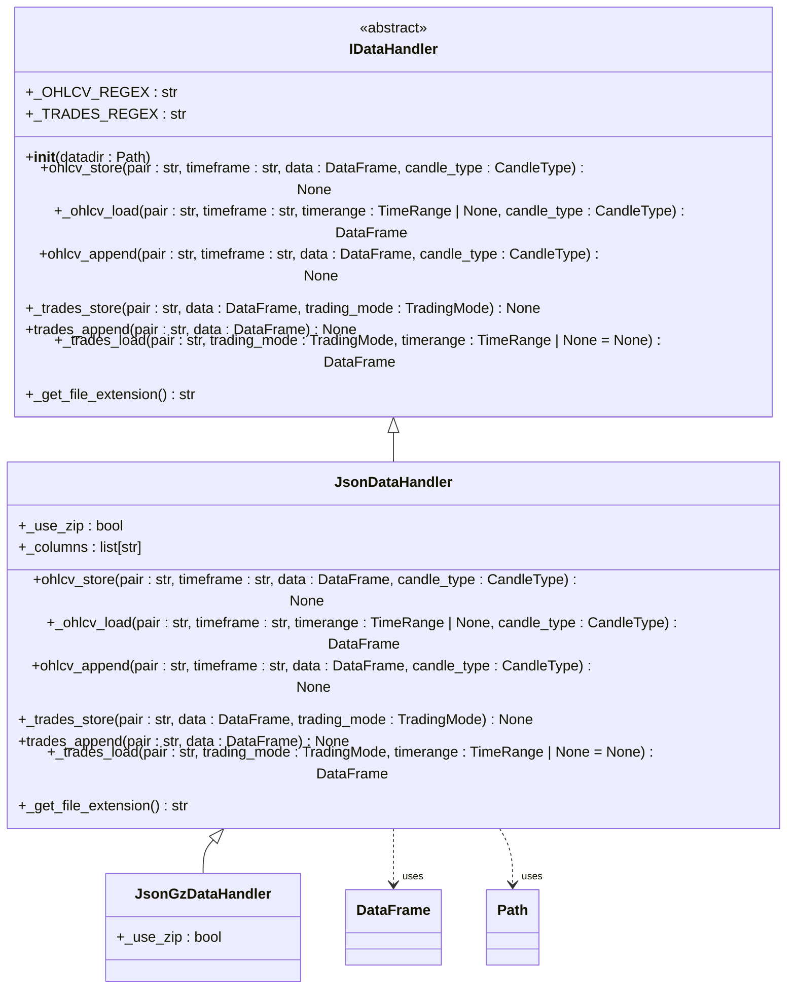
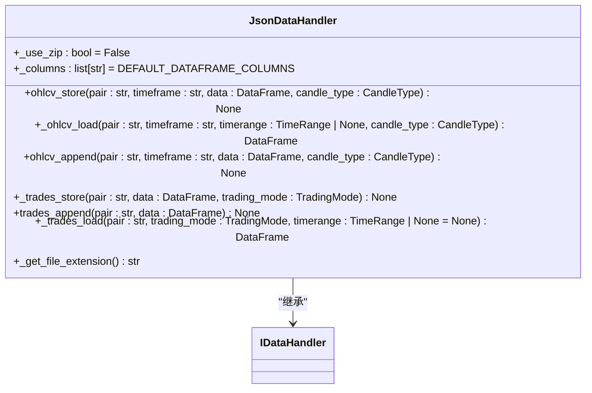
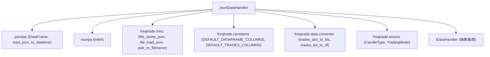

# JSON存储格式

<cite>
**本文档中引用的文件**   
- [jsondatahandler.py](file://freqtrade/data/history/datahandlers/jsondatahandler.py)
- [idatahandler.py](file://freqtrade/data/history/datahandlers/idatahandler.py)
- [config_full.example.json](file://config_examples/config_full.example.json)
- [config.json](file://user_data/config.json)
</cite>

## 目录
1. [简介](#简介)
2. [项目结构](#项目结构)
3. [核心组件](#核心组件)
4. [架构概述](#架构概述)
5. [详细组件分析](#详细组件分析)
6. [依赖分析](#依赖分析)
7. [性能考虑](#性能考虑)
8. [故障排除指南](#故障排除指南)
9. [结论](#结论)

## 简介
本文档详细说明了freqtrade系统中JSON数据存储格式的实现机制。重点分析了`JsonDataHandler`类的设计原理、文件结构组织方式以及元数据嵌入策略。文档还探讨了该存储格式在读写性能、磁盘空间占用和跨平台兼容性方面的优缺点，特别关注在高频数据写入和大数据量回测场景下的表现。同时提供了配置选项说明、错误处理机制和数据完整性校验方法，并结合实际用例给出使用建议。

## 项目结构
freqtrade项目的目录结构清晰地组织了其功能模块。与JSON存储格式相关的代码主要位于`freqtrade/data/history/datahandlers/`目录下，其中`jsondatahandler.py`文件实现了JSON数据处理的核心逻辑。配置文件示例位于`config_examples/`目录，而用户自定义配置和数据则存储在`user_data/`目录中。



**Diagram sources**
- [jsondatahandler.py](file://freqtrade/data/history/datahandlers/jsondatahandler.py)
- [config_full.example.json](file://config_examples/config_full.example.json)
- [config.json](file://user_data/config.json)

**Section sources**
- [jsondatahandler.py](file://freqtrade/data/history/datahandlers/jsondatahandler.py)
- [config_full.example.json](file://config_examples/config_full.example.json)
- [config.json](file://user_data/config.json)

## 核心组件
`JsonDataHandler`类是freqtrade系统中处理JSON格式数据的核心组件。它继承自抽象基类`IDataHandler`，实现了OHLCV（开、高、低、收、量）和交易数据的存储与加载功能。该类通过将Pandas DataFrame转换为JSON格式来持久化数据，支持GZIP压缩以节省磁盘空间。

**Section sources**
- [jsondatahandler.py](file://freqtrade/data/history/datahandlers/jsondatahandler.py#L17-L149)

## 架构概述
freqtrade的数据处理架构采用策略模式，通过`IDataHandler`接口定义了统一的数据操作契约。`JsonDataHandler`作为具体实现之一，与其他数据格式处理器（如Feather、Parquet）共同构成了灵活的数据存储体系。系统通过`get_datahandler`工厂函数根据配置动态选择合适的数据处理器。



**Diagram sources**
- [idatahandler.py](file://freqtrade/data/history/datahandlers/idatahandler.py#L32-L584)
- [jsondatahandler.py](file://freqtrade/data/history/datahandlers/jsondatahandler.py#L17-L149)

## 详细组件分析
### JsonDataHandler类分析
`JsonDataHandler`类的设计遵循了单一职责原则，专注于JSON格式数据的读写操作。其主要功能包括：

- **数据存储**：`ohlcv_store`方法将DataFrame中的OHLCV数据以JSON格式保存到文件，日期被转换为整数时间戳，数据以"values"格式存储，即二维数组形式。
- **数据加载**：`_ohlcv_load`方法从文件中读取JSON数据并重建DataFrame，同时进行必要的数据类型转换。
- **压缩支持**：通过`_use_zip`类变量控制是否启用GZIP压缩，`JsonGzDataHandler`是其启用压缩的子类。
- **文件命名**：使用`_pair_data_filename`方法根据交易对、时间框架和蜡烛类型生成标准化的文件名。

#### 类图


**Diagram sources**
- [jsondatahandler.py](file://freqtrade/data/history/datahandlers/jsondatahandler.py#L17-L149)

**Section sources**
- [jsondatahandler.py](file://freqtrade/data/history/datahandlers/jsondatahandler.py#L17-L149)

### 配置与使用
freqtrade通过配置文件中的`dataformat_ohlcv`和`dataformat_trades`选项来指定数据存储格式。用户可以在`config.json`或`config_full.example.json`中设置为"json"或"jsongz"以启用JSON存储。

#### 配置示例
```json
{
    "dataformat_ohlcv": "jsongz",
    "dataformat_trades": "json"
}
```

**Section sources**
- [config_full.example.json](file://config_examples/config_full.example.json#L210-L211)
- [config.json](file://user_data/config.json)

## 依赖分析
`JsonDataHandler`的实现依赖于多个外部库和内部模块：



**Diagram sources**
- [jsondatahandler.py](file://freqtrade/data/history/datahandlers/jsondatahandler.py#L1-L150)

**Section sources**
- [jsondatahandler.py](file://freqtrade/data/history/datahandlers/jsondatahandler.py#L1-L150)

## 性能考虑
JSON存储格式在freqtrade系统中的性能表现具有以下特点：

- **优点**：
  - **可读性好**：JSON是纯文本格式，易于人类阅读和调试。
  - **跨平台兼容**：广泛支持，便于数据交换和迁移。
  - **压缩效率**：启用GZIP压缩后，磁盘占用显著减少。

- **缺点**：
  - **读写性能**：相比Feather或Parquet等二进制格式，JSON的序列化和反序列化速度较慢。
  - **内存占用**：加载大数据集时，内存消耗较高。
  - **高频写入**：在高频数据写入场景下，性能瓶颈明显，不推荐用于实时数据采集。

对于大数据量回测场景，建议使用Feather或Parquet格式以获得更好的性能。

## 故障排除指南
在使用JSON存储格式时可能遇到以下问题及解决方案：

- **数据加载失败**：检查文件是否存在，确认文件路径和命名是否正确。`_ohlcv_load`方法包含对1M文件的回退支持。
- **旧格式兼容**：`_trades_load`方法能够检测并转换旧的交易数据字典格式。
- **配置错误**：确保`dataformat_ohlcv`配置项正确设置为"json"或"jsongz"。

**Section sources**
- [jsondatahandler.py](file://freqtrade/data/history/datahandlers/jsondatahandler.py#L45-L84)
- [jsondatahandler.py](file://freqtrade/data/history/datahandlers/jsondatahandler.py#L119-L141)

## 结论
`JsonDataHandler`为freqtrade系统提供了一种简单、可读性强的数据持久化方案。尽管在性能上不如二进制格式，但其良好的兼容性和可调试性使其成为开发和小规模测试的理想选择。对于生产环境和大规模回测，建议评估使用更高效的存储格式。通过合理配置和使用，JSON存储格式能够在保证功能完整性的同时满足特定场景的需求。