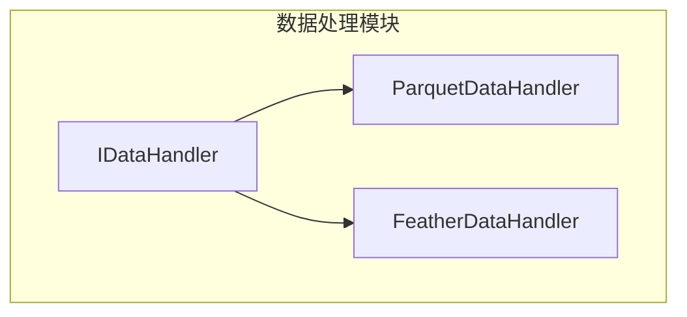
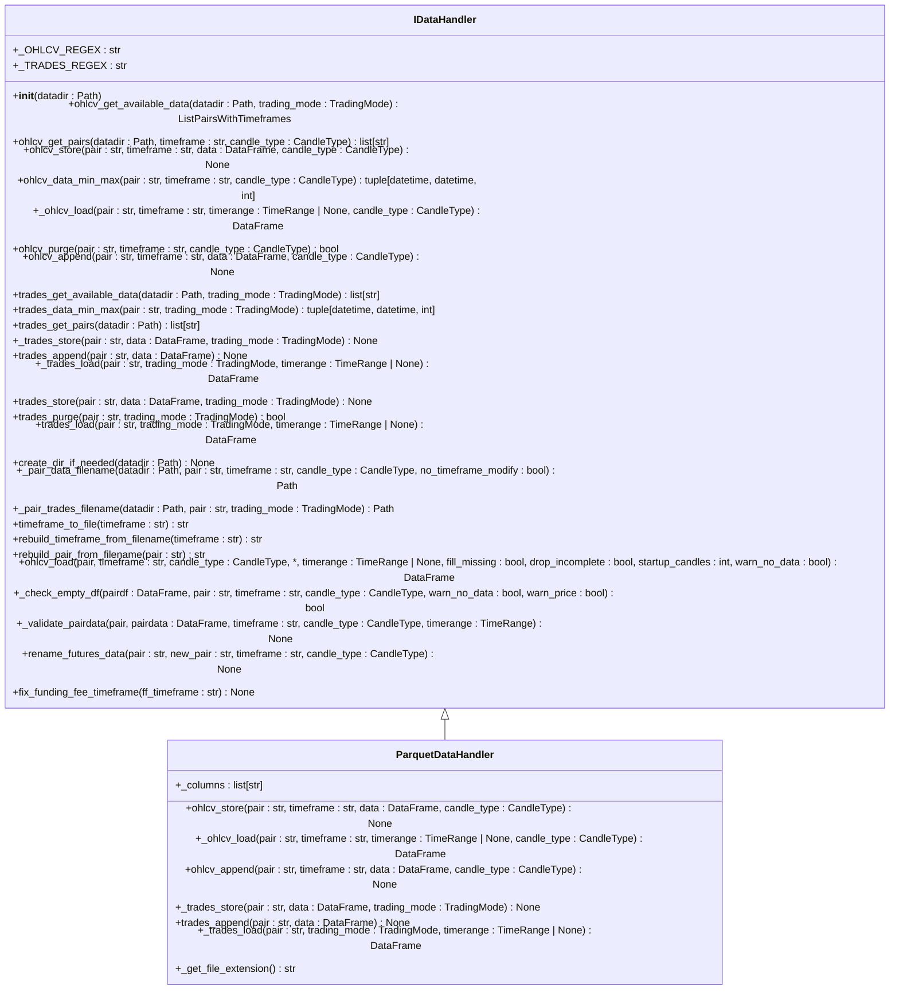
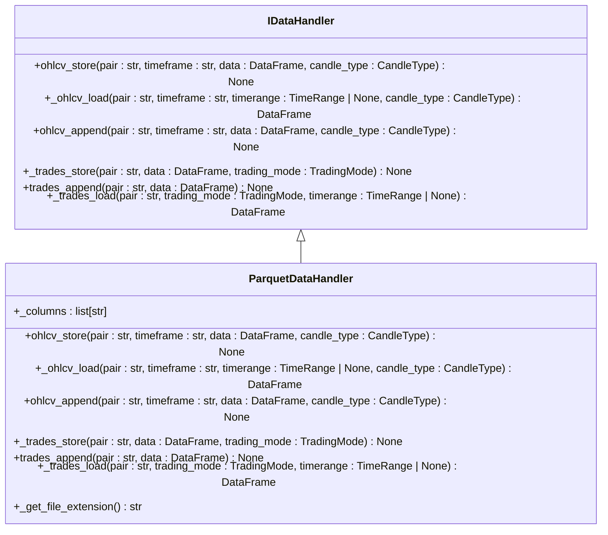
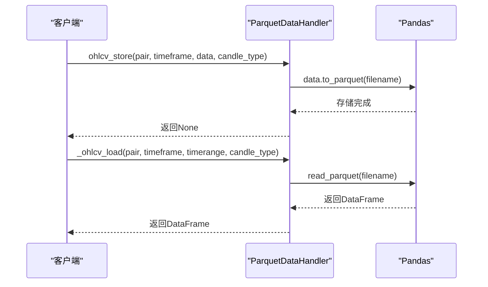
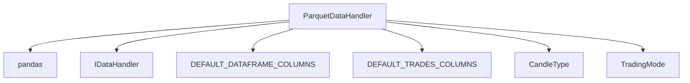

# Parquet存储格式

<cite>
**本文档中引用的文件**  
- [parquetdatahandler.py](file://freqtrade/data/history/datahandlers/parquetdatahandler.py)
- [featherdatahandler.py](file://freqtrade/data/history/datahandlers/featherdatahandler.py)
- [idatahandler.py](file://freqtrade/data/history/datahandlers/idatahandler.py)
- [constants.py](file://freqtrade/constants.py)
</cite>

## 目录
1. [引言](#引言)
2. [项目结构](#项目结构)
3. [核心组件](#核心组件)
4. [架构概述](#架构概述)
5. [详细组件分析](#详细组件分析)
6. [依赖分析](#依赖分析)
7. [性能考量](#性能考量)
8. [故障排除指南](#故障排除指南)
9. [结论](#结论)

## 引言
本文档全面介绍Parquet列式存储格式在大规模历史数据管理中的工程实现。详细说明`ParquetDataHandler`如何通过分块存储、行组划分和高级压缩算法（如Snappy、GZIP）优化存储效率。文档化其在复杂查询性能、数据分区策略和元数据嵌套结构方面的技术细节。分析其在长期数据归档、多策略共享数据池等场景下的适用性，并提供与Feather格式的性能对比基准和迁移路径指导。

## 项目结构
`ParquetDataHandler`位于`freqtrade/data/history/datahandlers/`目录下，是`IDataHandler`接口的实现之一，专门用于处理OHLCV和交易数据的存储与加载。该模块通过Parquet格式实现高效的数据持久化，支持大规模历史数据的快速访问和存储优化。

**图表来源**  
- [idatahandler.py](file://freqtrade/data/history/datahandlers/idatahandler.py#L32-L531)
- [parquetdatahandler.py](file://freqtrade/data/history/datahandlers/parquetdatahandler.py#L14-L132)
- [featherdatahandler.py](file://freqtrade/data/history/datahandlers/featherdatahandler.py#L15-L184)

**章节来源**  
- [parquetdatahandler.py](file://freqtrade/data/history/datahandlers/parquetdatahandler.py#L1-L133)
- [idatahandler.py](file://freqtrade/data/history/datahandlers/idatahandler.py#L1-L584)

## 核心组件
`ParquetDataHandler`实现了`IDataHandler`接口，提供OHLCV和交易数据的存储与加载功能。其核心方法包括`ohlcv_store`、`_ohlcv_load`、`_trades_store`和`_trades_load`，分别用于存储和加载OHLCV数据及交易数据。该类通过`to_parquet`和`read_parquet`方法实现数据的高效序列化和反序列化。

**章节来源**  
- [parquetdatahandler.py](file://freqtrade/data/history/datahandlers/parquetdatahandler.py#L14-L132)

## 架构概述
`ParquetDataHandler`继承自`IDataHandler`，利用Parquet列式存储格式的优势，实现高效的数据存储和查询。其架构设计支持大规模历史数据的快速访问，通过分块存储和行组划分优化I/O性能。与Feather格式相比，Parquet在压缩率和查询性能上具有显著优势，尤其适用于长期数据归档和复杂查询场景。

**图表来源**  
- [idatahandler.py](file://freqtrade/data/history/datahandlers/idatahandler.py#L32-L531)
- [parquetdatahandler.py](file://freqtrade/data/history/datahandlers/parquetdatahandler.py#L14-L132)

## 详细组件分析
### ParquetDataHandler分析
`ParquetDataHandler`通过`to_parquet`方法将数据存储为Parquet格式，利用其列式存储特性实现高效压缩和快速查询。在加载数据时，通过`read_parquet`方法读取Parquet文件，并将其转换为Pandas DataFrame。该类还实现了`_get_file_extension`方法，返回文件扩展名为"parquet"。

#### 对象导向组件

**图表来源**  
- [parquetdatahandler.py](file://freqtrade/data/history/datahandlers/parquetdatahandler.py#L14-L132)
- [idatahandler.py](file://freqtrade/data/history/datahandlers/idatahandler.py#L32-L531)

#### API/服务组件

**图表来源**  
- [parquetdatahandler.py](file://freqtrade/data/history/datahandlers/parquetdatahandler.py#L17-L76)
- [featherdatahandler.py](file://freqtrade/data/history/datahandlers/featherdatahandler.py#L18-L79)

**章节来源**  
- [parquetdatahandler.py](file://freqtrade/data/history/datahandlers/parquetdatahandler.py#L1-L133)

## 依赖分析
`ParquetDataHandler`依赖于`pandas`库的`read_parquet`和`to_parquet`方法，以及`IDataHandler`接口的定义。它通过`DEFAULT_DATAFRAME_COLUMNS`和`DEFAULT_TRADES_COLUMNS`常量定义数据列结构，并利用`CandleType`和`TradingMode`枚举类型处理不同的交易模式和蜡烛图类型。

**图表来源**  
- [parquetdatahandler.py](file://freqtrade/data/history/datahandlers/parquetdatahandler.py#L1-L133)
- [constants.py](file://freqtrade/constants.py#L1-L229)
- [idatahandler.py](file://freqtrade/data/history/datahandlers/idatahandler.py#L1-L584)

**章节来源**  
- [parquetdatahandler.py](file://freqtrade/data/history/datahandlers/parquetdatahandler.py#L1-L133)
- [constants.py](file://freqtrade/constants.py#L1-L229)

## 性能考量
与Feather格式相比，Parquet在存储效率和查询性能上具有显著优势。Feather格式使用LZ4压缩，而Parquet支持多种压缩算法（如Snappy、GZIP），在大规模数据集上可实现更高的压缩率。此外，Parquet的列式存储特性使得在进行复杂查询时，只需读取相关列的数据，大大减少了I/O开销。然而，Parquet的写入性能可能略低于Feather，特别是在频繁追加数据的场景下。

## 故障排除指南
在使用`ParquetDataHandler`时，可能会遇到文件不存在或加载失败的情况。此时应检查文件路径是否正确，以及文件是否存在。如果文件存在但加载失败，可能是由于文件损坏或版本不兼容。建议使用`get_datahandler`函数获取数据处理器实例，并确保数据格式配置正确。

**章节来源**  
- [parquetdatahandler.py](file://freqtrade/data/history/datahandlers/parquetdatahandler.py#L50-L76)
- [idatahandler.py](file://freqtrade/data/history/datahandlers/idatahandler.py#L566-L583)

## 结论
`ParquetDataHandler`通过利用Parquet列式存储格式的优势，实现了高效的大规模历史数据管理。其在存储效率、查询性能和数据压缩方面表现出色，特别适用于长期数据归档和复杂查询场景。尽管在写入性能上可能略逊于Feather格式，但其在读取性能和存储空间上的优势使其成为大规模数据处理的理想选择。建议在需要长期存储和频繁查询的场景下优先使用Parquet格式。