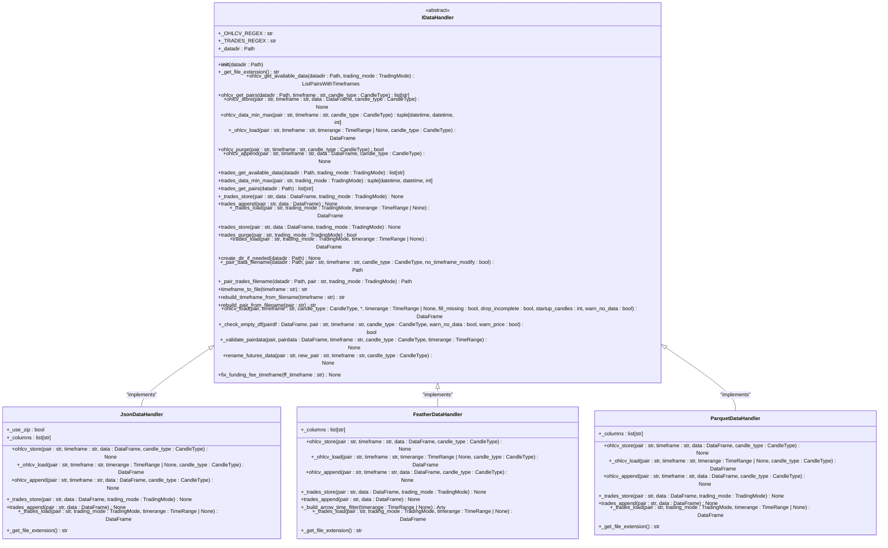
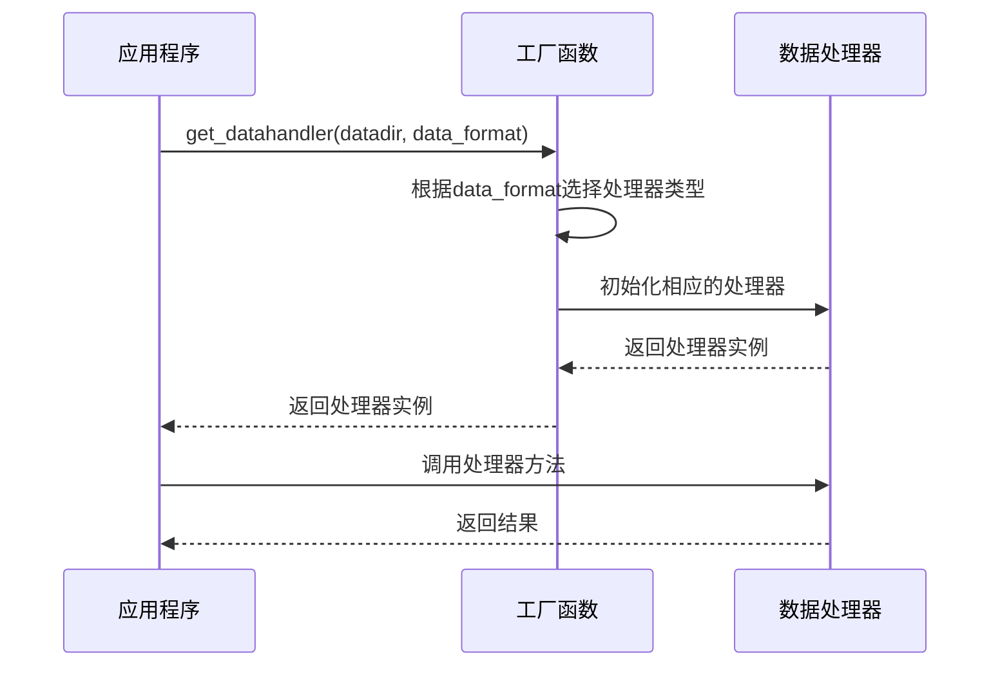

# 数据处理器接口

<cite>
**Referenced Files in This Document**   
- [idatahandler.py](file://freqtrade/data/history/datahandlers/idatahandler.py)
- [jsondatahandler.py](file://freqtrade/data/history/datahandlers/jsondatahandler.py)
- [featherdatahandler.py](file://freqtrade/data/history/datahandlers/featherdatahandler.py)
- [parquetdatahandler.py](file://freqtrade/data/history/datahandlers/parquetdatahandler.py)
- [history_utils.py](file://freqtrade/data/history/history_utils.py)
</cite>

## 目录
1. [引言](#引言)
2. [IDataHandler接口设计哲学](#idatahandler接口设计哲学)
3. [标准化方法契约](#标准化方法契约)
4. [插件化数据管理架构](#插件化数据管理架构)
5. [运行时格式切换机制](#运行时格式切换机制)
6. [接口实现最佳实践](#接口实现最佳实践)
7. [异常处理规范](#异常处理规范)
8. [性能监控建议](#性能监控建议)

## 引言
`IDataHandler`抽象接口是Freqtrade系统中数据管理的核心组件，它为不同存储格式（JSON、Feather、Parquet）的读写操作提供了统一的抽象层。该接口通过定义标准化的方法契约，实现了透明化的数据访问和插件化的数据管理架构，使得系统能够灵活地支持多种数据格式而无需修改上层业务逻辑。

**Section sources**
- [idatahandler.py](file://freqtrade/data/history/datahandlers/idatahandler.py#L1-L50)

## IDataHandler接口设计哲学
`IDataHandler`接口的设计遵循了面向对象的抽象原则和依赖倒置原则，通过定义一个抽象基类来统一管理不同数据格式的读写操作。该接口的核心设计哲学是提供一个稳定的契约，使得上层应用可以独立于具体的数据存储格式进行开发。

接口通过抽象方法定义了数据操作的基本契约，包括`ohlcv_store`、`_ohlcv_load`、`trades_store`和`_trades_load`等核心方法。这些方法的命名和参数设计都经过精心考虑，以确保语义清晰且易于理解。例如，使用`ohlcv`前缀明确标识这是针对K线数据的操作，而`trades`前缀则用于交易数据。

接口还定义了一些辅助方法，如`ohlcv_get_available_data`和`trades_get_pairs`，用于查询可用的数据集。这些方法的实现利用了正则表达式来解析文件名，从而提取出交易对、时间周期和K线类型等元信息。

**Diagram sources **
- [idatahandler.py](file://freqtrade/data/history/datahandlers/idatahandler.py#L32-L531)
- [jsondatahandler.py](file://freqtrade/data/history/datahandlers/jsondatahandler.py#L17-L145)
- [featherdatahandler.py](file://freqtrade/data/history/datahandlers/featherdatahandler.py#L15-L184)
- [parquetdatahandler.py](file://freqtrade/data/history/datahandlers/parquetdatahandler.py#L14-L132)

**Section sources**
- [idatahandler.py](file://freqtrade/data/history/datahandlers/idatahandler.py#L32-L531)

## 标准化方法契约
`IDataHandler`接口定义了一套标准化的方法契约，这些契约为不同数据格式的读写操作提供了统一的API。核心方法包括：

- `ohlcv_store`：用于存储K线数据，接受交易对、时间周期、数据框和K线类型作为参数
- `_ohlcv_load`：内部方法，用于从磁盘加载K线数据
- `trades_store`：用于存储交易数据
- `_trades_load`：内部方法，用于从磁盘加载交易数据

这些方法的设计考虑了数据的一致性和完整性。例如，在存储K线数据时，会先将日期转换为整数时间戳，然后重置索引并选择适当的列，最后以指定的格式保存。在加载数据时，会进行类型转换和日期解析，确保返回的数据框具有正确的数据类型。

接口还提供了一些高级功能，如`ohlcv_load`方法，它封装了数据加载的完整流程，包括时间范围裁剪、缺失值填充和不完整K线处理。这个方法调用了内部的`_ohlcv_load`方法，然后进行数据验证和清理。

**Section sources**
- [idatahandler.py](file://freqtrade/data/history/datahandlers/idatahandler.py#L95-L105)
- [idatahandler.py](file://freqtrade/data/history/datahandlers/idatahandler.py#L127-L141)
- [idatahandler.py](file://freqtrade/data/history/datahandlers/idatahandler.py#L366-L419)

## 插件化数据管理架构
`IDataHandler`接口的实现采用了插件化的架构设计，通过工厂模式和依赖注入来管理不同的数据处理器。系统提供了`get_datahandlerclass`和`get_datahandler`两个工厂函数，用于根据数据格式创建相应的数据处理器实例。

这种设计使得系统可以轻松地扩展支持新的数据格式。要添加新的数据格式支持，只需要创建一个新的类继承`IDataHandler`接口，并在`get_datahandlerclass`函数中添加相应的分支即可。现有的上层代码无需任何修改就可以使用新的数据格式。

**Diagram sources **
- [idatahandler.py](file://freqtrade/data/history/datahandlers/idatahandler.py#L534-L583)

**Section sources**
- [idatahandler.py](file://freqtrade/data/history/datahandlers/idatahandler.py#L534-L583)

## 运行时格式切换机制
系统支持在运行时动态切换数据存储格式，这得益于`IDataHandler`接口的抽象设计。通过配置文件中的`dataformat_ohlcv`和`dataformat_trades`参数，用户可以在不修改代码的情况下切换数据格式。

当需要切换格式时，系统会自动创建相应格式的数据处理器实例。例如，如果配置为`feather`格式，`get_datahandler`函数会返回`FeatherDataHandler`实例；如果配置为`parquet`格式，则返回`ParquetDataHandler`实例。

这种机制不仅提高了系统的灵活性，还为性能优化提供了可能。用户可以根据实际需求选择最适合的数据格式。例如，Feather格式在读写速度上表现优异，而Parquet格式在存储空间上更加节省。

**Section sources**
- [idatahandler.py](file://freqtrade/data/history/datahandlers/idatahandler.py#L571-L583)

## 接口实现最佳实践
在实现`IDataHandler`接口时，应遵循以下最佳实践：

1. **文件命名规范**：遵循统一的文件命名规则，使用交易对、时间周期和K线类型的组合来生成文件名
2. **数据类型一致性**：确保读取的数据具有正确的数据类型，特别是日期和数值字段
3. **错误处理**：在文件不存在或读取失败时返回空的数据框，而不是抛出异常
4. **性能优化**：利用底层库的特性进行性能优化，如Feather格式的压缩和Parquet格式的列式存储

例如，`FeatherDataHandler`在存储数据时使用了`lz4`压缩算法和9级压缩，以在存储空间和读写速度之间取得平衡。`ParquetDataHandler`则利用了Parquet格式的列式存储特性，提高了大数据集的查询效率。

**Section sources**
- [featherdatahandler.py](file://freqtrade/data/history/datahandlers/featherdatahandler.py#L15-L184)
- [parquetdatahandler.py](file://freqtrade/data/history/datahandlers/parquetdatahandler.py#L14-L132)

## 异常处理规范
`IDataHandler`接口的异常处理设计遵循了防御性编程原则。在关键操作中，如文件读取和数据转换，都包含了适当的异常处理机制。

对于文件不存在的情况，接口方法会返回空的数据框，而不是抛出异常。这样可以避免因单个文件问题导致整个数据加载过程失败。对于数据解析错误，会记录详细的错误日志，帮助用户诊断问题。

在`_trades_load`方法中，如果加载的交易数据为空，会返回具有正确列名的空数据框，确保上层代码可以正常处理。这种设计使得系统更加健壮，能够优雅地处理各种异常情况。

**Section sources**
- [idatahandler.py](file://freqtrade/data/history/datahandlers/idatahandler.py#L248-L257)
- [idatahandler.py](file://freqtrade/data/history/datahandlers/idatahandler.py#L283-L303)

## 性能监控建议
为了确保数据处理的性能，建议实施以下监控措施：

1. **加载时间监控**：记录每个数据文件的加载时间，识别性能瓶颈
2. **内存使用监控**：监控数据加载过程中的内存使用情况，避免内存溢出
3. **I/O操作监控**：跟踪文件读写操作的频率和大小，优化I/O性能

在`FeatherDataHandler`中，通过`_build_arrow_time_filter`方法实现了基于Arrow的数据过滤，可以在读取时直接应用时间范围过滤，减少内存占用。这种预过滤机制可以显著提高大数据集的查询性能。

**Section sources**
- [featherdatahandler.py](file://freqtrade/data/history/datahandlers/featherdatahandler.py#L115-L132)
- [history_utils.py](file://freqtrade/data/history/history_utils.py#L78-L132)