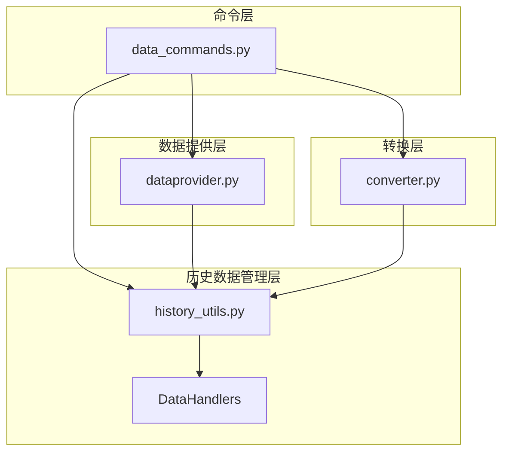
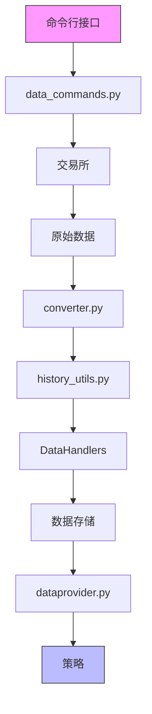
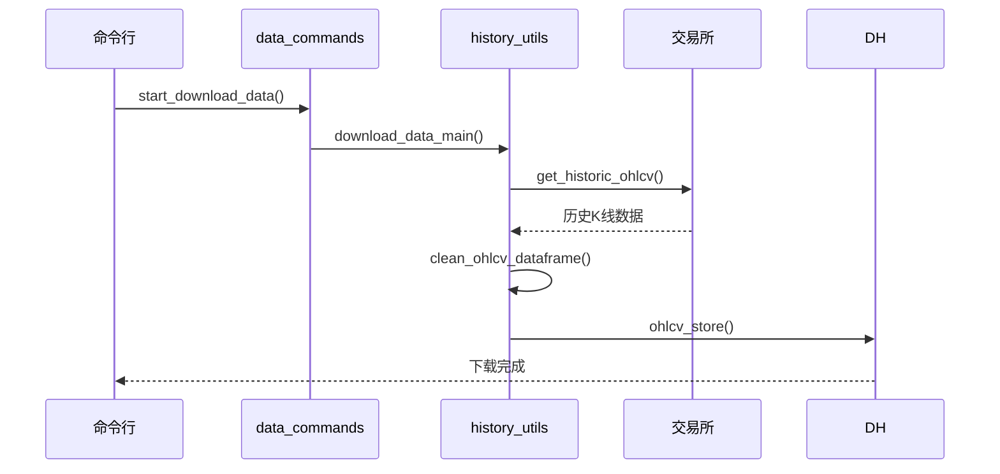
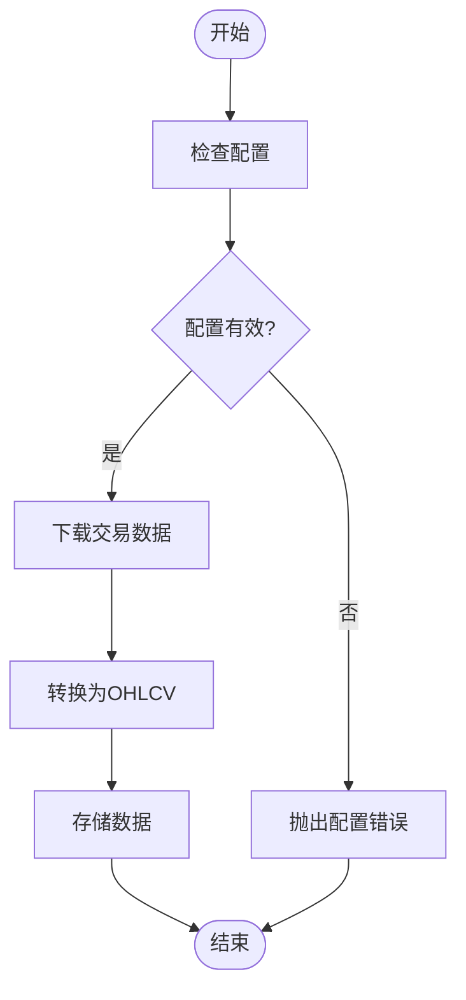
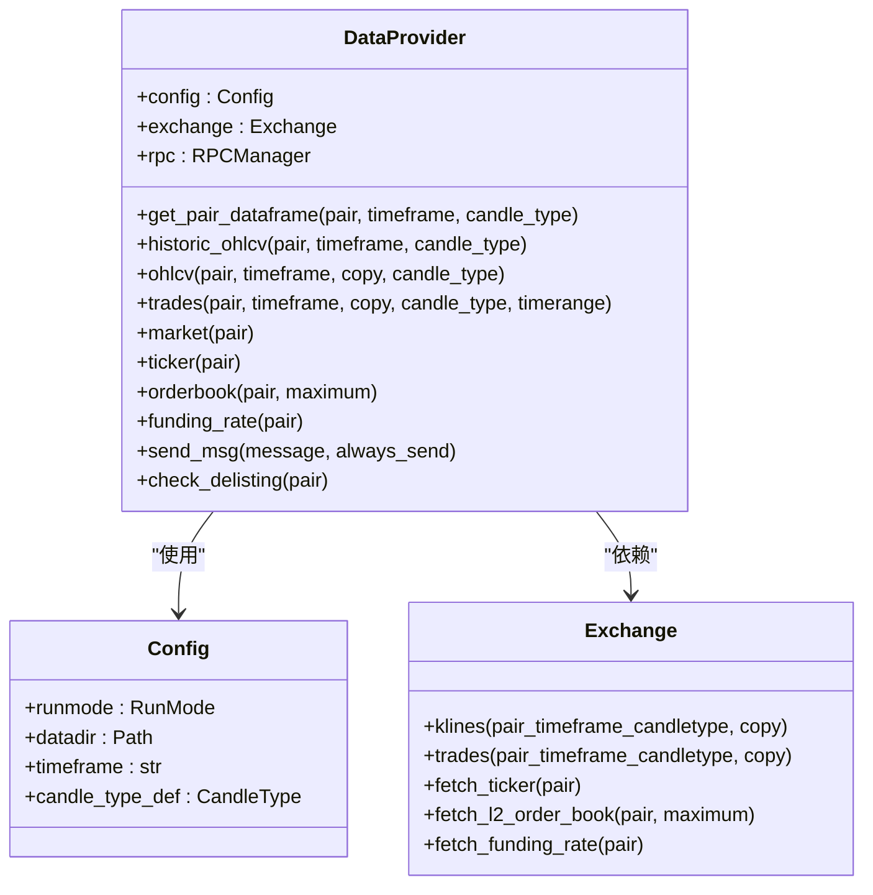
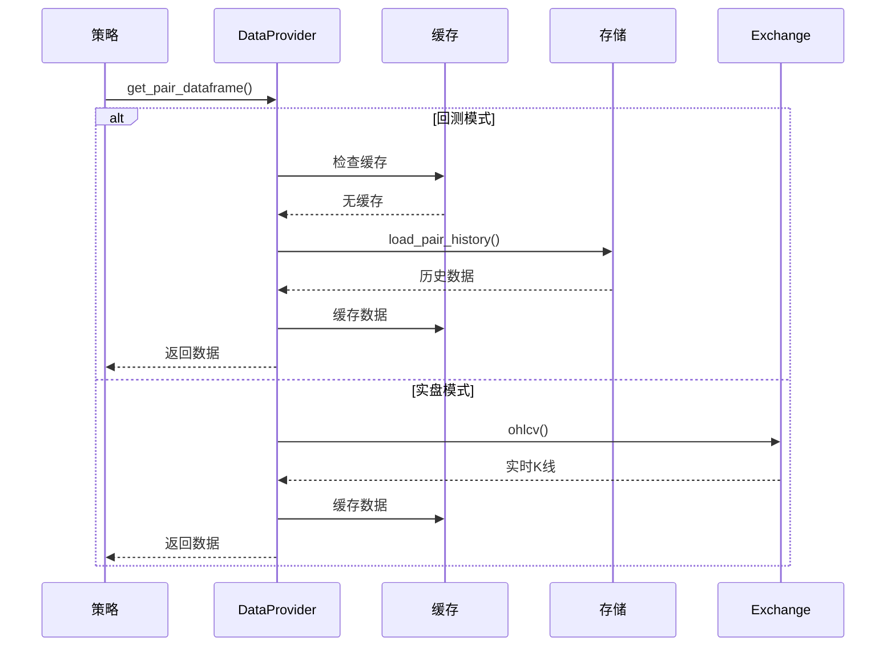
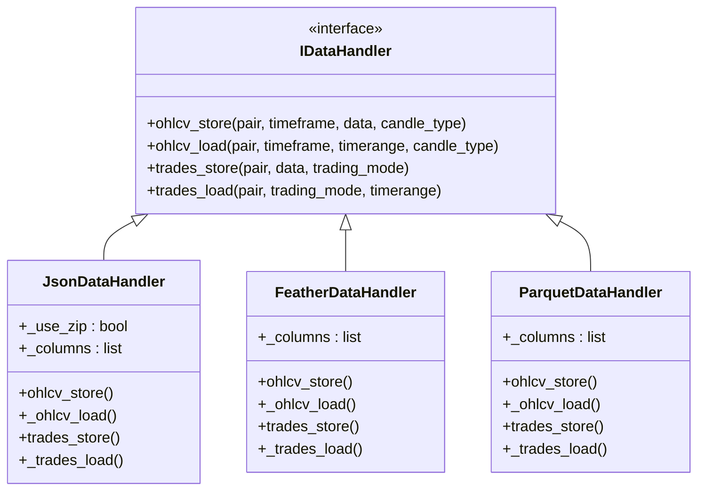
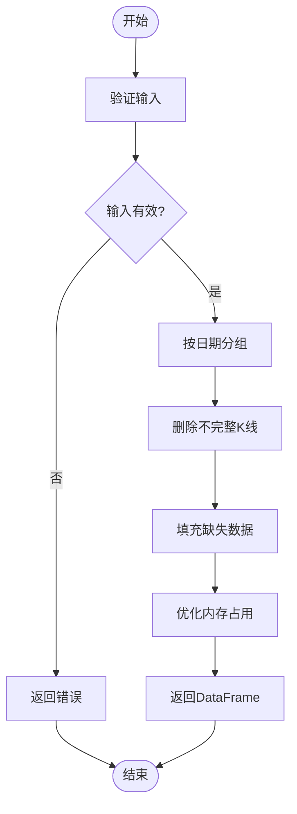
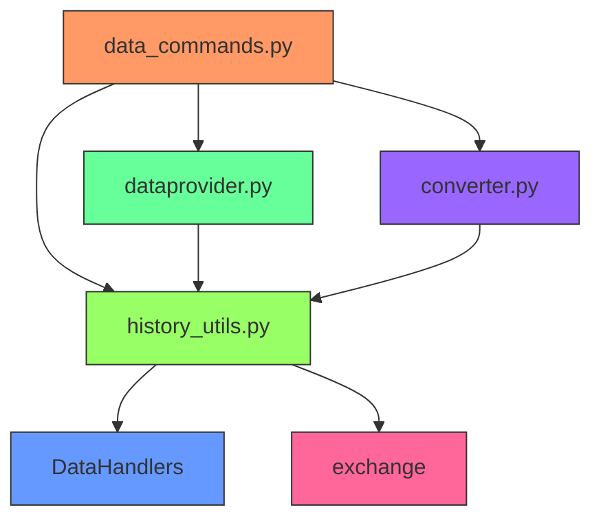

# 数据管理与处理

<cite>
**本文档引用的文件**
- [data_commands.py](file://freqtrade/commands/data_commands.py)
- [dataprovider.py](file://freqtrade/data/dataprovider.py)
- [converter.py](file://freqtrade/data/converter/converter.py)
- [jsondatahandler.py](file://freqtrade/data/history/datahandlers/jsondatahandler.py)
- [featherdatahandler.py](file://freqtrade/data/history/datahandlers/featherdatahandler.py)
- [parquetdatahandler.py](file://freqtrade/data/history/datahandlers/parquetdatahandler.py)
- [history_utils.py](file://freqtrade/data/history/history_utils.py)
</cite>

## 目录
1. [引言](#引言)
2. [项目结构](#项目结构)
3. [核心组件](#核心组件)
4. [架构概述](#架构概述)
5. [详细组件分析](#详细组件分析)
6. [依赖分析](#依赖分析)
7. [性能考虑](#性能考虑)
8. [故障排除指南](#故障排除指南)
9. [结论](#结论)

## 引言
本文档详细说明了Freqtrade框架中的历史数据管理流程，涵盖从数据下载到格式转换的各个环节。重点分析了`data_commands.py`中支持的下载命令如何获取OHLCV数据，解释了不同数据存储格式（JSON、Feather、Parquet）的优缺点与选择策略，探讨了`dataprovider.py`如何为回测和实盘提供统一的数据访问接口，并深入研究了`converter`模块中的数据转换工具链。

## 项目结构
Freqtrade的数据管理模块采用分层架构设计，主要包含命令处理、数据提供、历史数据管理和格式转换四个核心部分。该结构确保了数据流的清晰性和可维护性。

**图示来源**
- [data_commands.py](file://freqtrade/commands/data_commands.py#L1-L231)
- [dataprovider.py](file://freqtrade/data/dataprovider.py#L1-L622)
- [history_utils.py](file://freqtrade/data/history/history_utils.py#L1-L805)
- [converter.py](file://freqtrade/data/converter/converter.py#L1-L300)

**本节来源**
- [data_commands.py](file://freqtrade/commands/data_commands.py#L1-L231)
- [dataprovider.py](file://freqtrade/data/dataprovider.py#L1-L622)

## 核心组件
系统的核心组件包括数据下载命令、数据提供程序、历史数据处理器和格式转换工具。这些组件协同工作，实现了从交易所获取原始数据到为策略提供分析就绪数据的完整流程。

**本节来源**
- [data_commands.py](file://freqtrade/commands/data_commands.py#L1-L231)
- [dataprovider.py](file://freqtrade/data/dataprovider.py#L1-L622)
- [converter.py](file://freqtrade/data/converter/converter.py#L1-L300)

## 架构概述
Freqtrade的数据管理架构采用模块化设计，各组件职责分明。数据流从命令行接口开始，经过数据下载、格式转换、存储管理，最终通过统一的数据提供接口服务于回测和实盘交易。

**图示来源**
- [data_commands.py](file://freqtrade/commands/data_commands.py#L1-L231)
- [dataprovider.py](file://freqtrade/data/dataprovider.py#L1-L622)
- [converter.py](file://freqtrade/data/converter/converter.py#L1-L300)
- [history_utils.py](file://freqtrade/data/history/history_utils.py#L1-L805)

## 详细组件分析

### 数据下载命令分析
`data_commands.py`模块提供了完整的数据下载功能，支持OHLCV数据和逐笔交易数据的下载与转换。

#### 数据下载流程

**图示来源**
- [data_commands.py](file://freqtrade/commands/data_commands.py#L1-L231)
- [history_utils.py](file://freqtrade/data/history/history_utils.py#L678-L683)

#### 数据转换流程

**图示来源**
- [data_commands.py](file://freqtrade/commands/data_commands.py#L1-L231)
- [converter.py](file://freqtrade/data/converter/converter.py#L1-L300)

**本节来源**
- [data_commands.py](file://freqtrade/commands/data_commands.py#L1-L231)
- [converter.py](file://freqtrade/data/converter/converter.py#L1-L300)

### 数据提供程序分析
`dataprovider.py`模块为策略提供了统一的数据访问接口，支持回测和实盘两种模式。

#### 数据提供程序类图

**图示来源**
- [dataprovider.py](file://freqtrade/data/dataprovider.py#L1-L622)

#### 数据访问流程

**图示来源**
- [dataprovider.py](file://freqtrade/data/dataprovider.py#L1-L622)

**本节来源**
- [dataprovider.py](file://freqtrade/data/dataprovider.py#L1-L622)

### 数据存储格式分析
系统支持多种数据存储格式，每种格式都有其特定的优缺点和适用场景。

#### 存储格式类图

**图示来源**
- [jsondatahandler.py](file://freqtrade/data/history/datahandlers/jsondatahandler.py#L1-L150)
- [featherdatahandler.py](file://freqtrade/data/history/datahandlers/featherdatahandler.py#L1-L185)
- [parquetdatahandler.py](file://freqtrade/data/history/datahandlers/parquetdatahandler.py#L1-L133)

#### 存储格式对比
| 格式 | 优点 | 缺点 | 适用场景 |
|------|------|------|----------|
| JSON | 人类可读，易于调试 | 文件体积大，读写速度慢 | 小规模数据，开发调试 |
| Feather | 读写速度快，压缩率高 | 需要额外依赖 | 大规模数据，高性能需求 |
| Parquet | 列式存储，查询效率高 | 写入速度相对较慢 | 大数据分析，长期存储 |

**本节来源**
- [jsondatahandler.py](file://freqtrade/data/history/datahandlers/jsondatahandler.py#L1-L150)
- [featherdatahandler.py](file://freqtrade/data/history/datahandlers/featherdatahandler.py#L1-L185)
- [parquetdatahandler.py](file://freqtrade/data/history/datahandlers/parquetdatahandler.py#L1-L133)

### 转换工具链分析
`converter.py`模块提供了完整的数据转换功能，包括OHLCV数据清理、缺失数据填充和格式转换。

#### 转换工具流程

**图示来源**
- [converter.py](file://freqtrade/data/converter/converter.py#L1-L300)

**本节来源**
- [converter.py](file://freqtrade/data/converter/converter.py#L1-L300)

## 依赖分析
系统各组件之间的依赖关系清晰，遵循单一职责原则和依赖倒置原则。

**图示来源**
- [data_commands.py](file://freqtrade/commands/data_commands.py#L1-L231)
- [dataprovider.py](file://freqtrade/data/dataprovider.py#L1-L622)
- [converter.py](file://freqtrade/data/converter/converter.py#L1-L300)
- [history_utils.py](file://freqtrade/data/history/history_utils.py#L1-L805)

**本节来源**
- [data_commands.py](file://freqtrade/commands/data_commands.py#L1-L231)
- [dataprovider.py](file://freqtrade/data/dataprovider.py#L1-L622)
- [converter.py](file://freqtrade/data/converter/converter.py#L1-L300)
- [history_utils.py](file://freqtrade/data/history/history_utils.py#L1-L805)

## 性能考虑
在处理大规模历史数据时，系统提供了多种性能优化策略：

1. **数据格式选择**：推荐使用Feather或Parquet格式以获得最佳读写性能
2. **内存优化**：通过`reduce_dataframe_footprint`函数将数据类型优化为float32/int32
3. **并行下载**：支持并行下载多个交易对的历史数据
4. **增量更新**：支持增量数据下载，避免重复下载已存在的数据
5. **缓存机制**：内置数据缓存，减少重复计算

**本节来源**
- [converter.py](file://freqtrade/data/converter/converter.py#L1-L300)
- [history_utils.py](file://freqtrade/data/history/history_utils.py#L1-L805)

## 故障排除指南
常见问题及解决方案：

1. **数据下载失败**：检查网络连接和交易所API状态
2. **数据格式错误**：确保数据格式配置正确，必要时使用`convert_data`命令转换格式
3. **内存不足**：使用`reduce_dataframe_footprint`优化内存占用，或分批处理数据
4. **数据不完整**：使用`validate_backtest_data`检查数据完整性
5. **性能瓶颈**：切换到Feather或Parquet格式，优化数据处理流程

**本节来源**
- [history_utils.py](file://freqtrade/data/history/history_utils.py#L1-L805)
- [converter.py](file://freqtrade/data/converter/converter.py#L1-L300)

## 结论
Freqtrade的数据管理模块设计精良，提供了完整的数据生命周期管理功能。通过模块化设计和清晰的接口定义，系统能够高效地处理大规模历史数据，为量化交易策略提供可靠的数据支持。建议用户根据具体需求选择合适的数据存储格式，并充分利用系统提供的性能优化功能。