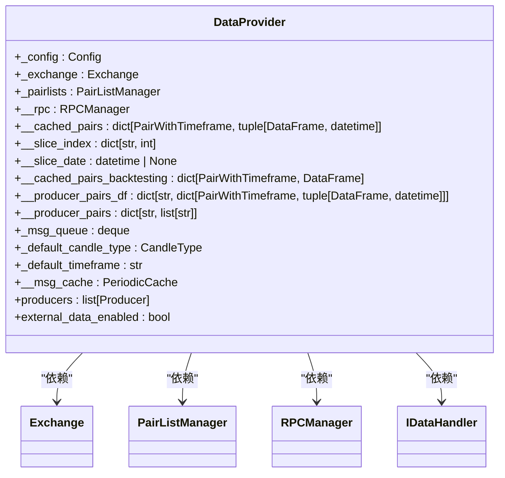
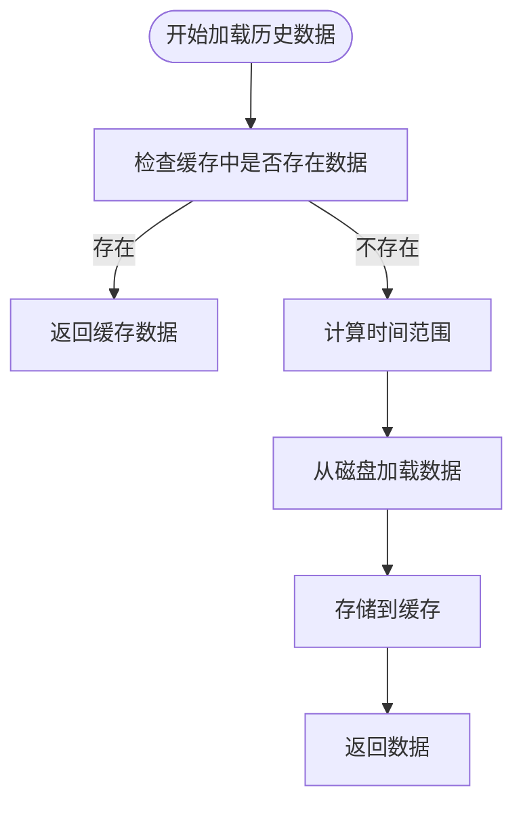
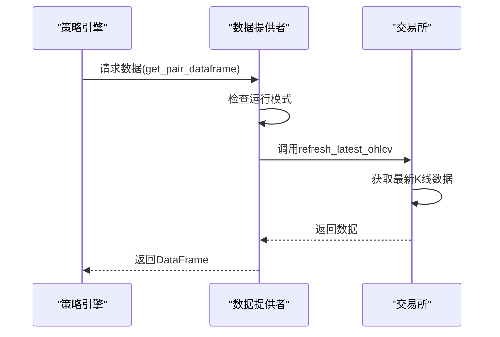
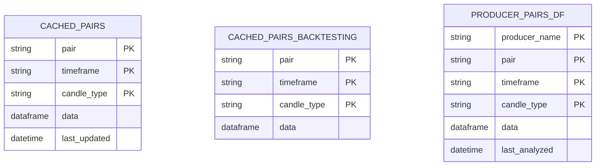
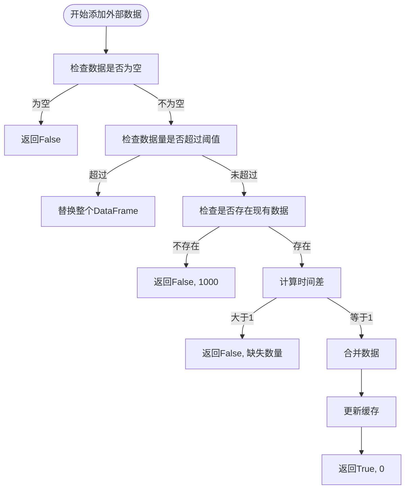

# 数据访问接口

<cite>
**本文档引用的文件**   
- [dataprovider.py](file://freqtrade/data/dataprovider.py)
- [history_utils.py](file://freqtrade/data/history/history_utils.py)
- [idatahandler.py](file://freqtrade/data/history/datahandlers/idatahandler.py)
- [featherdatahandler.py](file://freqtrade/data/history/datahandlers/featherdatahandler.py)
- [parquetdatahandler.py](file://freqtrade/data/history/datahandlers/parquetdatahandler.py)
- [interface.py](file://freqtrade/strategy/interface.py)
- [exchange.py](file://freqtrade/exchange/exchange.py)
</cite>

## 目录
1. [简介](#简介)
2. [数据提供者架构](#数据提供者架构)
3. [实时与历史数据整合](#实时与历史数据整合)
4. [缓存策略与内存优化](#缓存策略与内存优化)
5. [数据订阅与时间序列对齐](#数据订阅与时间序列对齐)
6. [多时间框架支持](#多时间框架支持)
7. [自定义策略最佳实践](#自定义策略最佳实践)
8. [异常处理与数据完整性](#异常处理与数据完整性)

## 简介
数据提供者（DataProvider）是Freqtrade系统的核心组件，负责为策略引擎和回测系统提供统一的数据访问接口。它整合了实时数据流与历史数据加载机制，支持多种数据源和时间框架。本文档深入解析数据提供者的实现机制，包括缓存策略、内存优化技术、数据订阅模式、时间序列对齐算法以及多时间框架支持。

**Section sources**
- [dataprovider.py](file://freqtrade/data/dataprovider.py#L1-L623)

## 数据提供者架构
数据提供者通过统一的接口为策略引擎和回测系统提供数据访问服务。其核心架构包括数据缓存、历史数据加载、实时数据获取和外部数据集成等功能。



**Diagram sources **
- [dataprovider.py](file://freqtrade/data/dataprovider.py#L38-L621)

**Section sources**
- [dataprovider.py](file://freqtrade/data/dataprovider.py#L38-L621)

## 实时与历史数据整合
数据提供者根据运行模式（live/dry-run/backtest）动态选择数据源。在实时交易模式下，从交易所获取最新数据；在回测模式下，从本地缓存加载历史数据。

### 历史数据加载机制
历史数据加载通过`historic_ohlcv`方法实现，该方法从本地存储中加载指定时间段的K线数据。



**Diagram sources **
- [dataprovider.py](file://freqtrade/data/dataprovider.py#L294-L331)
- [history_utils.py](file://freqtrade/data/history/history_utils.py#L36-L75)

### 实时数据获取
实时数据通过交易所API获取，数据提供者定期刷新最新K线数据。



**Diagram sources **
- [dataprovider.py](file://freqtrade/data/dataprovider.py#L473-L497)
- [exchange.py](file://freqtrade/exchange/exchange.py#L1300-L1320)

**Section sources**
- [dataprovider.py](file://freqtrade/data/dataprovider.py#L350-L377)
- [dataprovider.py](file://freqtrade/data/dataprovider.py#L294-L331)

## 缓存策略与内存优化
数据提供者采用多层次缓存策略，有效管理内存使用，避免重复数据加载。

### 缓存结构
数据提供者维护多个缓存字典，分别用于不同场景的数据存储：

- `__cached_pairs`: 存储已分析的实时数据
- `__cached_pairs_backtesting`: 存储回测用的历史数据
- `__producer_pairs_df`: 存储外部生产者提供的数据



**Diagram sources **
- [dataprovider.py](file://freqtrade/data/dataprovider.py#L50-L54)

### 内存优化技术
通过以下机制优化内存使用：

1. **数据切片**：在回测模式下，只加载必要的数据片段
2. **缓存清理**：提供`clear_cache`方法清除过期缓存
3. **数据压缩**：使用高效的文件格式存储历史数据

```python
def clear_cache(self):
    """
    清除配对数据帧缓存。
    """
    self.__cached_pairs = {}
    self.__slice_index = {}
```

**Section sources**
- [dataprovider.py](file://freqtrade/data/dataprovider.py#L425-L433)

## 数据订阅与时间序列对齐
数据提供者支持外部数据源的订阅和时间序列对齐，确保数据的完整性和一致性。

### 外部数据集成
通过`_add_external_df`方法实现外部数据的增量更新，确保数据的连续性。



**Diagram sources **
- [dataprovider.py](file://freqtrade/data/dataprovider.py#L171-L252)

### 时间序列对齐算法
时间序列对齐通过以下步骤实现：

1. 计算时间差：`(incoming_first - local_last) / timeframe_delta`
2. 验证连续性：时间差必须等于1才能保证数据连续
3. 合并数据：使用`append_candles_to_dataframe`方法合并数据

```python
candle_difference = (incoming_first - local_last) / timeframe_delta
if candle_difference > 1:
    return (False, int(candle_difference))
```

**Section sources**
- [dataprovider.py](file://freqtrade/data/dataprovider.py#L171-L252)

## 多时间框架支持
数据提供者原生支持多时间框架，允许策略同时访问不同时间周期的数据。

### 时间框架配置
通过配置文件中的`timeframe`参数设置默认时间框架，支持多种时间单位：

- 分钟：`1m`, `5m`, `15m`
- 小时：`1h`, `4h`
- 天：`1d`

```python
self._default_timeframe = self._config.get("timeframe", "1h")
```

### 多时间框架数据获取
策略可以通过指定不同时间框架参数获取对应的数据：

```python
# 获取1小时K线数据
df_1h = dp.get_pair_dataframe("BTC/USDT", "1h")

# 获取4小时K线数据
df_4h = dp.get_pair_dataframe("BTC/USDT", "4h")
```

**Section sources**
- [dataprovider.py](file://freqtrade/data/dataprovider.py#L62-L62)

## 自定义策略最佳实践
在自定义策略中正确使用数据提供者是确保策略稳定运行的关键。

### 数据访问模式
策略应通过`self.dp`访问数据提供者，遵循以下最佳实践：

```python
class MyStrategy(IStrategy):
    def populate_indicators(self, dataframe: DataFrame, metadata: dict) -> DataFrame:
        # 获取其他时间框架的数据
        df_4h = self.dp.get_analyzed_dataframe(metadata['pair'], '4h')[0]
        
        # 获取外部生产者数据
        external_df, la = self.dp.get_producer_df(metadata['pair'], '1h')
        
        return dataframe
```

### 延迟处理
处理数据延迟时，应使用`get_analyzed_dataframe`方法获取最新分析数据：

```python
def populate_indicators(self, dataframe: DataFrame, metadata: dict) -> DataFrame:
    # 获取最新分析的1小时数据
    analyzed_df, last_updated = self.dp.get_analyzed_dataframe(
        metadata['pair'], '1h'
    )
    
    # 处理延迟数据
    if last_updated and (datetime.now(UTC) - last_updated).seconds > 300:
        logger.warning(f"数据延迟超过5分钟: {metadata['pair']}")
    
    return dataframe
```

**Section sources**
- [interface.py](file://freqtrade/strategy/interface.py#L134-L134)
- [dataprovider.py](file://freqtrade/data/dataprovider.py#L379-L401)

## 异常处理与数据完整性
数据提供者内置了完善的异常处理机制，确保数据的完整性和系统的稳定性。

### 异常处理策略
- **网络异常**：捕获`ExchangeError`并返回空数据
- **数据缺失**：记录警告信息并返回空DataFrame
- **配置错误**：抛出`OperationalException`终止程序

```python
def ticker(self, pair: str):
    """
    从交易所返回最后的ticker数据
    警告：执行网络请求 - 请合理使用。
    """
    if self._exchange is None:
        raise OperationalException(NO_EXCHANGE_EXCEPTION)
    try:
        return self._exchange.fetch_ticker(pair)
    except ExchangeError:
        return {}
```

### 数据完整性验证
通过以下机制确保数据完整性：

1. **启动蜡烛检查**：确保有足够的历史数据用于指标计算
2. **时间序列验证**：检查数据是否连续无缺失
3. **边界检查**：验证数据范围是否符合预期

```python
def get_required_startup(self, timeframe: str) -> int:
    freqai_config = self._config.get("freqai", {})
    if not freqai_config.get("enabled", False):
        return self._config.get("startup_candle_count", 0)
    else:
        # 计算所需的启动蜡烛数量
        startup_candles = self._config.get("startup_candle_count", 0)
        indicator_periods = freqai_config["feature_parameters"]["indicator_periods_candles"]
        self._config["startup_candle_count"] = max(startup_candles, max(indicator_periods))
        tf_seconds = timeframe_to_seconds(timeframe)
        train_candles = freqai_config["train_period_days"] * 86400 / tf_seconds
        total_candles = int(self._config["startup_candle_count"] + train_candles)
        return total_candles
```

**Section sources**
- [dataprovider.py](file://freqtrade/data/dataprovider.py#L333-L348)
- [dataprovider.py](file://freqtrade/data/dataprovider.py#L547-L559)