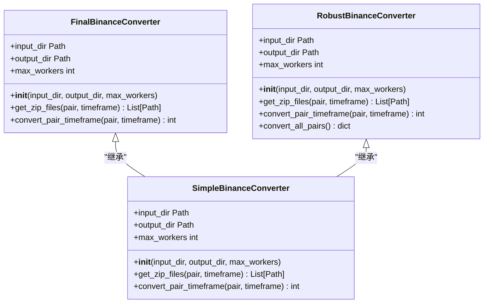
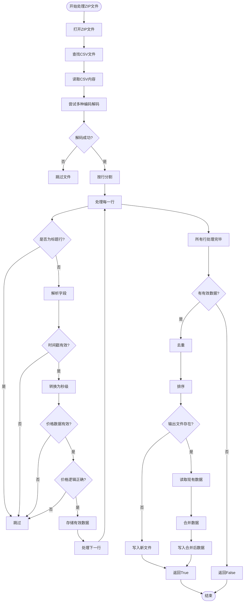

# final_binance_converter.py - 最终版转换工具

<cite>
**Referenced Files in This Document**   
- [final_binance_converter.py](file://final_binance_converter.py)
- [simple_binance_converter.py](file://simple_binance_converter.py)
- [robust_binance_converter.py](file://robust_binance_converter.py)
- [converter.py](file://freqtrade/data/converter/converter.py)
</cite>

## 目录
1. [简介](#简介)
2. [核心功能与实现细节](#核心功能与实现细节)
3. [数据处理优化](#数据处理优化)
4. [代码结构继承关系](#代码结构继承关系)
5. [典型应用场景](#典型应用场景)
6. [使用限制](#使用限制)

## 简介
`final_binance_converter.py` 是一个专门用于处理币安交易所 `indexPriceKlines` 数据的最终版数据转换工具。该工具针对特定数据源进行了优化，解决了前两个版本（`simple_binance_converter.py` 和 `robust_binance_converter.py`）在处理 `indexPriceKlines` 数据时遇到的问题。它主要用于将从币安下载的原始ZIP格式K线数据转换为Freqtrade框架可使用的CSV格式历史数据。

该工具在 `final_convert.bat` 批处理脚本中被调用，专门处理位于 `yccai/binance_data_downloader/data/futures/um/daily/indexPriceKlines` 路径下的数据，并输出到 `user_data/data/futures` 目录。

**Section sources**
- [final_binance_converter.py](file://final_binance_converter.py#L1-L20)
- [final_convert.bat](file://final_convert.bat#L1-L10)

## 核心功能与实现细节
`final_binance_converter.py` 的核心功能由 `FinalBinanceConverter` 类实现，该类提供了一个完整的数据转换工作流，包括文件发现、并行处理和进度跟踪。

### 主要组件
- **FinalBinanceConverter 类**: 主转换器类，负责协调整个转换过程。
- **process_single_zip 函数**: 核心处理函数，负责解析单个ZIP文件中的CSV数据。
- **main 函数**: 命令行接口，解析用户输入并启动转换过程。

### 处理流程
1. **初始化**: `FinalBinanceConverter` 的 `__init__` 方法接收输入/输出目录和工作进程数，自动设置为CPU核心数（最多4个）。
2. **文件发现**: `get_zip_files` 方法根据指定的交易对和时间框架，从输入目录中查找所有相关的ZIP文件。
3. **并行处理**: `convert_pair_timeframe` 方法使用 `ProcessPoolExecutor` 创建一个进程池，将 `process_single_zip` 函数分批提交给工作进程。
4. **结果聚合**: 收集所有工作进程的返回结果，统计成功处理的文件数量。

**Diagram sources**
- [final_binance_converter.py](file://final_binance_converter.py#L158-L218)
- [simple_binance_converter.py](file://simple_binance_converter.py#L157-L217)
- [robust_binance_converter.py](file://robust_binance_converter.py#L136-L240)

**Section sources**
- [final_binance_converter.py](file://final_binance_converter.py#L158-L218)
- [simple_binance_converter.py](file://simple_binance_converter.py#L157-L217)
- [robust_binance_converter.py](file://robust_binance_converter.py#L136-L240)

## 数据处理优化
`final_binance_converter.py` 针对 `indexPriceKlines` 数据的特殊性进行了多项关键优化。

### 时间戳精度处理
`indexPriceKlines` 数据中的时间戳通常以毫秒为单位，而Freqtrade框架期望的是秒级时间戳。该工具在 `process_single_zip` 函数中通过 `int(float(timestamp_str)) // 1000` 将毫秒时间戳精确地转换为秒级时间戳。

### 数据完整性验证机制
该工具实施了多层次的数据验证，确保输出数据的完整性和准确性：
1. **字段完整性**: 检查每行数据是否至少包含6个字段（时间戳、开盘价、最高价、最低价、收盘价、成交量）。
2. **数值有效性**: 验证价格和成交量是否为正数，排除无效或错误的数据点。
3. **逻辑一致性**: 检查K线数据的逻辑，确保最高价不低于开盘价和收盘价中的较大者，最低价不高于开盘价和收盘价中的较小者。
4. **去重与排序**: 使用字典对数据进行去重（以时间戳为键），然后按时间戳排序，确保数据的连续性和唯一性。

### 调试日志级别设置
与其他版本不同，`final_binance_converter.py` 将日志级别设置为 `DEBUG`，这在 `logging.basicConfig(level=logging.DEBUG, ...)` 中明确指定。这一设置对于调试 `indexPriceKlines` 数据中可能出现的编码问题或数据格式异常至关重要，可以提供更详细的运行时信息，帮助开发者快速定位问题。

**Diagram sources**
- [final_binance_converter.py](file://final_binance_converter.py#L21-L156)

**Section sources**
- [final_binance_converter.py](file://final_binance_converter.py#L21-L156)

## 代码结构继承关系
`final_binance_converter.py` 与 `simple_binance_converter.py` 和 `robust_binance_converter.py` 共享相似的代码结构，体现了代码的演进和复用。

### 继承与演进
这三个转换器都遵循相同的面向对象设计模式：
- 都包含一个主转换器类（`FinalBinanceConverter`, `SimpleBinanceConverter`, `RobustBinanceConverter`）。
- 都实现了 `__init__`, `get_zip_files`, 和 `convert_pair_timeframe` 方法。
- 都使用 `process_single_zip` 函数作为核心处理逻辑。

`final_binance_converter.py` 可以看作是 `simple_binance_converter.py` 的一个专门化版本，它继承了其简洁高效的处理逻辑，但针对 `indexPriceKlines` 数据的特殊需求进行了定制。

### 关键差异
尽管结构相似，但它们在实现细节上存在关键差异：
1. **日志级别**: `final_binance_converter.py` 使用 `DEBUG` 级别，而其他两个使用 `INFO` 级别。
2. **标题行处理**: `final_binance_converter.py` 使用 `line.startswith('open_time,open,high,low,close,volume')` 进行精确匹配，而其他版本使用 `in` 操作符检查字段名。
3. **字段分割**: `final_binance_converter.py` 使用 `split(',')[:6]` 取前6个字段，而 `simple_binance_converter.py` 使用 `split(',', 5)` 进行最多5次分割。
4. **额外功能**: `robust_binance_converter.py` 包含了 `convert_all_pairs` 方法，可以处理所有交易对，而 `final_binance_converter.py` 专注于单个任务。

**Section sources**
- [final_binance_converter.py](file://final_binance_converter.py#L1-L243)
- [simple_binance_converter.py](file://simple_binance_converter.py#L1-L242)
- [robust_binance_converter.py](file://robust_binance_converter.py#L1-L284)

## 典型应用场景
`final_binance_converter.py` 的典型应用场景是处理从币安API下载的 `indexPriceKlines` 数据，用于回测和交易策略开发。

### 使用流程
1. **数据下载**: 使用 `yccai/binance_data_downloader` 工具下载 `indexPriceKlines` 数据。
2. **数据转换**: 运行 `final_convert.bat` 脚本，该脚本会调用 `final_binance_converter.py`。
3. **策略回测**: 在Freqtrade中使用转换后的CSV数据进行策略回测。

### 参数说明
- `--input`: 指定包含原始ZIP文件的输入目录。
- `--output`: 指定转换后CSV文件的输出目录。
- `--pair`: 指定要转换的交易对（如 `BTCUSDT`）。
- `--timeframe`: 指定时间框架（如 `1m`）。
- `--workers`: 指定并行处理的进程数。

**Section sources**
- [final_convert.bat](file://final_convert.bat#L1-L23)

## 使用限制
`final_binance_converter.py` 是一个高度专业化的工具，因此存在一些使用限制。

### 专用性
该工具是专门为 `indexPriceKlines` 数据设计的，可能不适用于其他类型的数据（如 `klines` 或 `markPriceKlines`），因为这些数据的CSV格式可能略有不同。

### 内存消耗
由于使用了多进程并行处理，该工具在处理大量文件时可能会消耗较多内存。虽然它通过分批处理（`batch_size = 100`）来缓解这一问题，但在内存受限的系统上仍需谨慎使用。

### 错误处理
该工具的错误处理相对基础。当遇到无法解码的文件或处理异常时，它会记录错误并继续处理下一个文件，但不会提供详细的错误恢复机制。

### 依赖关系
该工具依赖于标准库，不依赖外部包（如pandas），这使其更加轻量级，但也意味着它缺少一些高级数据处理功能。

**Section sources**
- [final_binance_converter.py](file://final_binance_converter.py#L1-L243)