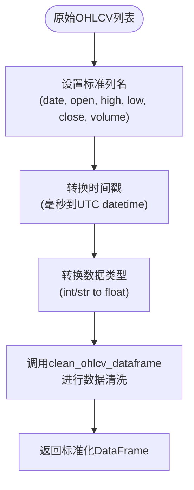
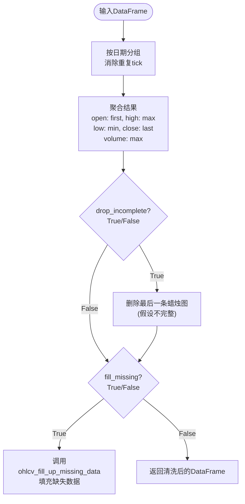
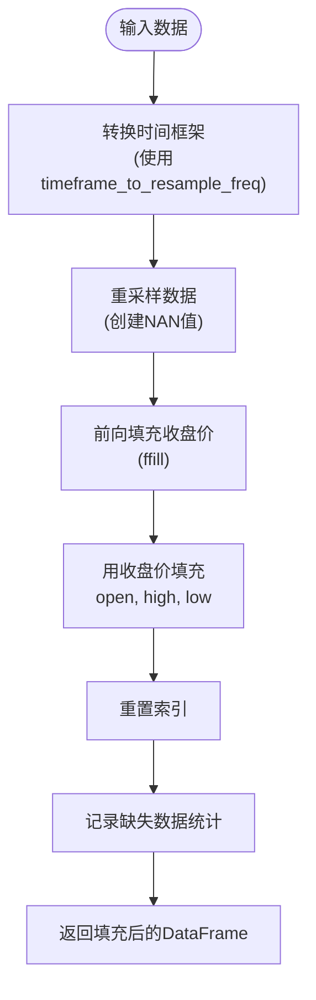
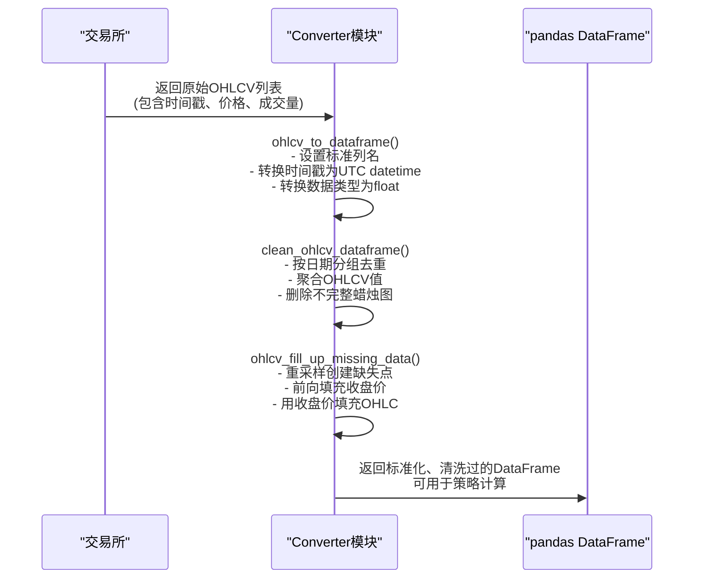
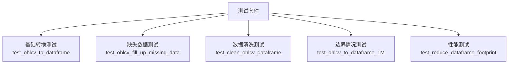

# OHLCV数据转换功能

<cite>
**Referenced Files in This Document**   
- [converter.py](file://freqtrade/data/converter/converter.py)
- [constants.py](file://freqtrade/constants.py)
- [exchange_utils_timeframe.py](file://freqtrade/exchange/exchange_utils_timeframe.py)
- [test_converter.py](file://tests/data/test_converter.py)
</cite>

## 目录
1. [简介](#简介)
2. [核心功能概述](#核心功能概述)
3. [OHLCV数据转换流程](#ohlcv数据转换流程)
4. [数据清洗逻辑分析](#数据清洗逻辑分析)
5. [缺失数据填充算法](#缺失数据填充算法)
6. [完整转换流程示例](#完整转换流程示例)
7. [性能优化考虑](#性能优化考虑)
8. [测试验证](#测试验证)

## 简介
该文档详细说明了Freqtrade系统中OHLCV（开、高、低、收、成交量）数据的转换功能。重点分析了如何将从交易所获取的原始蜡烛图数据转换为可用于策略计算的pandas DataFrame格式，包括时间戳处理、列名标准化、数据类型设置、异常值清洗和缺失数据填充等关键步骤。

## 核心功能概述
OHLCV数据转换功能主要由`converter.py`模块中的三个核心函数组成：`ohlcv_to_dataframe`、`clean_ohlcv_dataframe`和`ohlcv_fill_up_missing_data`。这些函数协同工作，将原始的交易所数据转换为标准化、清洗过的DataFrame格式，为后续的技术分析和交易策略执行提供可靠的数据基础。

**Section sources**
- [converter.py](file://freqtrade/data/converter/converter.py#L17-L133)

## OHLCV数据转换流程
`ohlcv_to_dataframe`函数是整个转换流程的入口点，负责将原始的OHLCV列表数据转换为pandas DataFrame。

### 转换流程图

**Diagram sources**
- [converter.py](file://freqtrade/data/converter/converter.py#L17-L56)

**Section sources**
- [converter.py](file://freqtrade/data/converter/converter.py#L17-L56)
- [constants.py](file://freqtrade/constants.py#L69)

### 关键转换步骤
1. **列名标准化**：使用`DEFAULT_DATAFRAME_COLUMNS`常量定义的标准列名（date, open, high, low, close, volume）来创建DataFrame
2. **时间戳处理**：将原始的时间戳（毫秒级）转换为UTC时区的pandas datetime对象
3. **数据类型转换**：将所有价格和成交量字段转换为float类型，以确保与TA-LIB等技术分析库的兼容性

## 数据清洗逻辑分析
`clean_ohlcv_dataframe`函数负责对初步转换后的DataFrame进行清洗，确保数据的质量和一致性。

### 清洗流程

**Diagram sources**
- [converter.py](file://freqtrade/data/converter/converter.py#L59-L93)

**Section sources**
- [converter.py](file://freqtrade/data/converter/converter.py#L59-L93)

### 清洗逻辑详解
1. **去重处理**：通过`groupby("date")`操作消除同一时间戳的重复数据点，确保每个时间点只有一条记录
2. **聚合策略**：
   - 开盘价（open）：取第一个值
   - 最高价（high）：取最大值
   - 最低价（low）：取最小值
   - 收盘价（close）：取最后一个值
   - 成交量（volume）：取最大值
3. **不完整蜡烛图处理**：根据`drop_incomplete`参数决定是否删除最后一条可能不完整的蜡烛图

## 缺失数据填充算法
`ohlcv_fill_up_missing_data`函数实现了智能的缺失数据填充算法，确保时间序列的连续性。

### 填充算法流程

**Diagram sources**
- [converter.py](file://freqtrade/data/converter/converter.py#L96-L133)
- [exchange_utils_timeframe.py](file://freqtrade/exchange/exchange_utils_timeframe.py#L31-L49)

**Section sources**
- [converter.py](file://freqtrade/data/converter/converter.py#L96-L133)
- [exchange_utils_timeframe.py](file://freqtrade/exchange/exchange_utils_timeframe.py#L31-L49)

### 填充策略
1. **时间框架转换**：使用`timeframe_to_resample_freq`函数将时间框架（如"5m"）转换为pandas重采样频率（如"5T"）
2. **重采样创建缺失**：通过`resample`操作创建缺失的时间点（NaN值）
3. **智能填充**：
   - 收盘价：使用前向填充（ffill）策略
   - 开盘价、最高价、最低价：用前一个收盘价填充
   - 成交量：设置为0
4. **日志记录**：记录填充前后的数据量变化，当缺失比例超过1%时发出INFO级别日志

## 完整转换流程示例
以下是一个从交易所原始数据到可用DataFrame的完整转换流程示例：

### 转换流程序列图

**Diagram sources**
- [converter.py](file://freqtrade/data/converter/converter.py#L17-L133)

**Section sources**
- [converter.py](file://freqtrade/data/converter/converter.py#L17-L133)
- [test_converter.py](file://tests/data/test_converter.py#L100-L150)

## 性能优化考虑
数据转换过程中包含了多项性能优化措施：

### 内存优化
- 使用`reduce_dataframe_footprint`函数将非OHLCV列的数据类型从float64/int64优化为float32/int32
- 保留OHLCV列的float64精度以确保计算准确性
- 在日志中记录优化前后的内存使用情况

### 处理效率
- 批量处理：支持同时处理多个交易对和时间框架的数据
- 智能日志：仅在缺失数据比例超过1%时输出详细日志，减少不必要的I/O开销
- 链式调用：函数之间通过返回值直接传递，减少中间变量的创建

**Section sources**
- [converter.py](file://freqtrade/data/converter/converter.py#L280-L301)

## 测试验证
系统提供了全面的单元测试来验证数据转换功能的正确性。

### 测试覆盖范围
- **基础转换测试**：验证`ohlcv_to_dataframe`能否正确转换不同时间框架的数据
- **缺失数据填充测试**：验证`ohlcv_fill_up_missing_data`能否正确填充缺失的蜡烛图
- **数据清洗测试**：验证`clean_ohlcv_dataframe`能否正确处理重复数据和不完整蜡烛图
- **边界情况测试**：测试月度、年度等特殊时间框架的处理

**Diagram sources**
- [test_converter.py](file://tests/data/test_converter.py#L100-L600)

**Section sources**
- [test_converter.py](file://tests/data/test_converter.py#L100-L600)