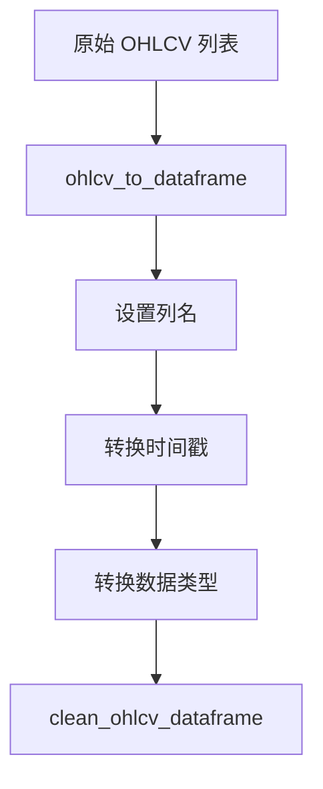
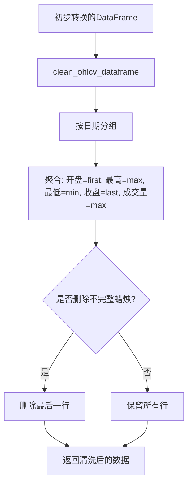
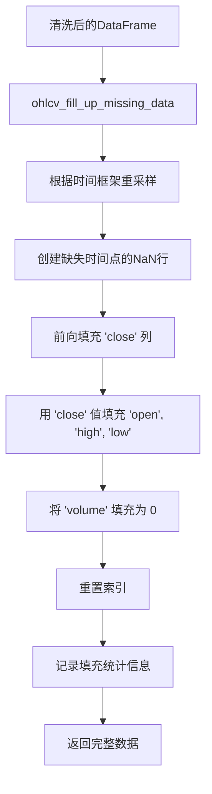
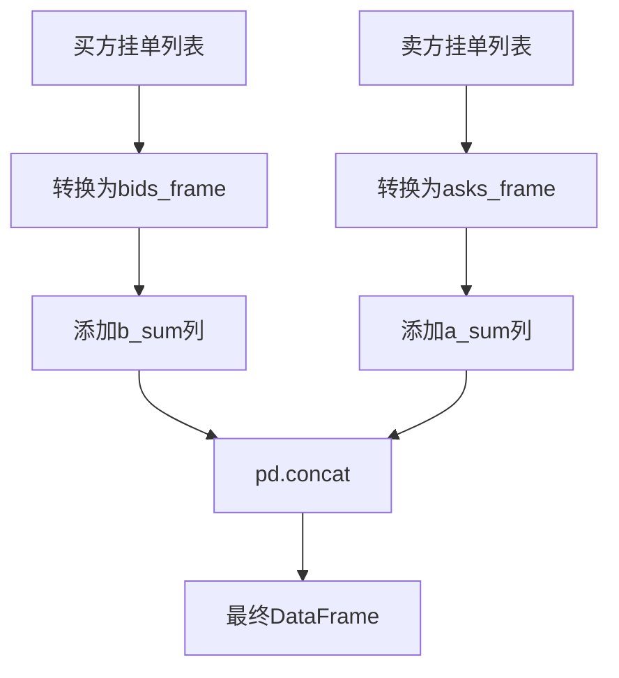
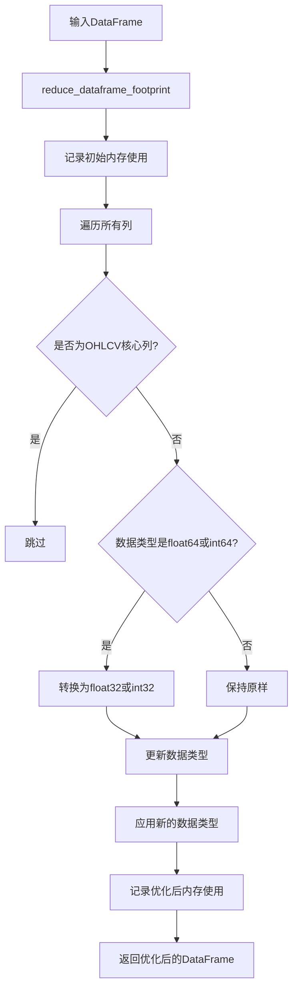
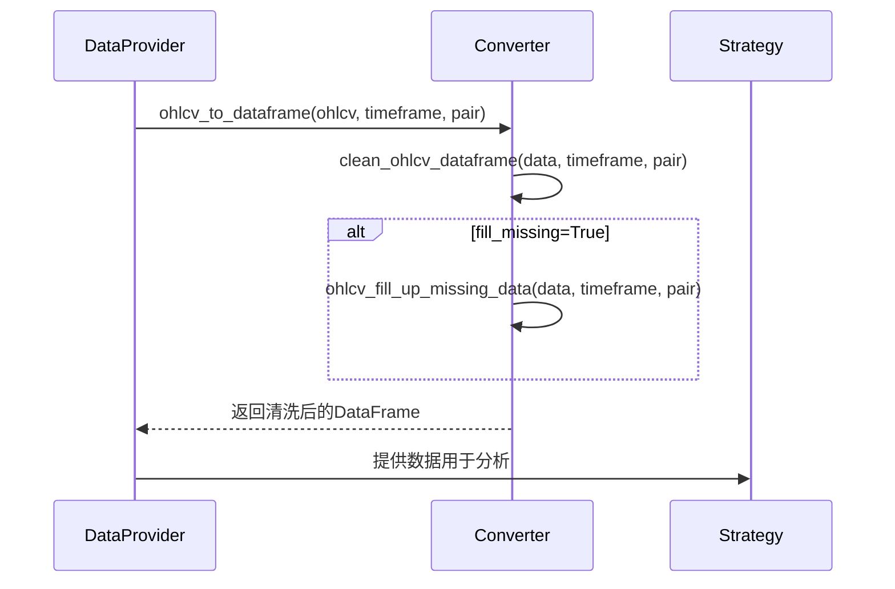

# freqtrade.data.converter - 内部数据转换模块

<cite>
**Referenced Files in This Document**   
- [converter.py](file://freqtrade/data/converter/converter.py)
- [constants.py](file://freqtrade/constants.py)
- [test_converter.py](file://tests/data/test_converter.py)
</cite>

## 目录
1. [简介](#简介)
2. [核心数据转换流程](#核心数据转换流程)
3. [OHLCV 数据清洗与填充](#ohlcv-数据清洗与填充)
4. [订单簿数据结构转换](#订单簿数据结构转换)
5. [数据格式与内存优化](#数据格式与内存优化)
6. [调用时序与数据流](#调用时序与数据流)

## 简介
`freqtrade.data.converter` 模块是 Freqtrade 框架中负责数据格式转换的核心组件。它提供了一系列函数，用于将从交易所获取的原始市场数据（如 OHLCV 蜡烛图数据和订单簿数据）转换为标准化的、可供策略分析和回测使用的内部数据结构。该模块确保了数据的一致性、完整性和高效性，是连接数据获取与策略执行的关键桥梁。

**Section sources**
- [converter.py](file://freqtrade/data/converter/converter.py#L1-L20)

## 核心数据转换流程

`ohlcv_to_dataframe` 函数是整个数据转换流程的入口点。它接收由交易所 API（如 ccxt）返回的原始 OHLCV 列表数据，并将其转换为一个结构化的 pandas DataFrame。此函数首先将原始数据列表映射到预定义的列名（`date`, `open`, `high`, `low`, `close`, `volume`），然后将时间戳从毫秒转换为带 UTC 时区的 pandas datetime 对象。为了确保与技术分析库（如 TA-Lib）的兼容性，它会将所有数值列（包括可能为整数的 OHLCV 值）强制转换为浮点数。最后，它调用 `clean_ohlcv_dataframe` 函数进行后续的清洗和处理。

**Diagram sources**
- [converter.py](file://freqtrade/data/converter/converter.py#L17-L56)

**Section sources**
- [converter.py](file://freqtrade/data/converter/converter.py#L17-L56)
- [constants.py](file://freqtrade/constants.py#L69)

## OHLCV 数据清洗与填充

### 数据清洗流程
`clean_ohlcv_dataframe` 函数负责对初步转换后的 DataFrame 进行清洗。其主要任务是处理可能存在的重复时间戳（即“重复的滴答”）。它通过以 `date` 列为键进行分组聚合来实现这一点，使用 `first` 取开盘价，`max` 取最高价，`min` 取最低价，`last` 取收盘价，`max` 取成交量。此外，该函数还提供了一个 `drop_incomplete` 参数，用于在数据流的末尾删除最后一个可能不完整的蜡烛条。

**Diagram sources**
- [converter.py](file://freqtrade/data/converter/converter.py#L59-L93)

**Section sources**
- [converter.py](file://freqtrade/data/converter/converter.py#L59-L93)

### 缺失数据填充算法
`ohlcv_fill_up_missing_data` 函数实现了关键的缺失数据填充算法。当数据流中存在因交易所暂停或网络问题导致的缺失蜡烛条时，此函数会将其补全。其核心机制是利用 pandas 的 `resample` 方法，根据指定的时间框架（如 '5m'）对数据进行重采样。这会在缺失的时间点上创建 NaN 值。然后，算法使用前向填充（`ffill`）来填充 `close` 列，确保价格的连续性。对于 `open`, `high`, `low` 列，则使用前一个 `close` 的值进行填充，而 `volume` 列则填充为 0，表示该时间段内没有交易发生。此过程会记录填充前后的数据量变化，并在缺失比例较高时发出日志警告。

**Diagram sources**
- [converter.py](file://freqtrade/data/converter/converter.py#L96-L133)

**Section sources**
- [converter.py](file://freqtrade/data/converter/converter.py#L96-L133)

## 订单簿数据结构转换

`order_book_to_dataframe` 函数专门用于处理订单簿数据。它接收两个列表：`bids`（买方挂单）和 `asks`（卖方挂单），每个列表的元素都是包含价格和数量的元组。该函数首先将这两个列表分别转换为独立的 DataFrame，并添加一个累积求和（cumsum）列，分别表示累计买入量（`b_sum`）和累计卖出量（`a_sum`）。最后，它使用 `pd.concat` 将两个 DataFrame 沿着列轴合并，形成一个包含六列的最终 DataFrame：`b_sum`, `b_size`, `bids`, `asks`, `a_size`, `a_sum`。这种结构便于分析市场的深度和买卖压力。

**Diagram sources**
- [converter.py](file://freqtrade/data/converter/converter.py#L181-L211)

**Section sources**
- [converter.py](file://freqtrade/data/converter/converter.py#L181-L211)

## 数据格式与内存优化

### 格式转换机制
`convert_ohlcv_format` 函数提供了在不同数据存储格式（如 JSON、Feather、Parquet）之间批量转换 OHLCV 数据的能力。它利用 `get_datahandler` 工厂方法，根据配置创建源格式和目标格式的数据处理器（`IDataHandler`）。函数会遍历配置中指定的交易对、时间框架和蜡烛图类型的所有组合，从源处理器加载数据，并将其存储到目标处理器中。如果 `erase` 参数为真，且源目标格式不同，则在转换完成后会删除原始数据，从而实现格式迁移。

**Section sources**
- [converter.py](file://freqtrade/data/converter/converter.py#L214-L275)

### 内存优化技术
`reduce_dataframe_footprint` 函数旨在减少 DataFrame 的内存占用。它会遍历 DataFrame 的所有列，将数据类型为 `np.float64` 的列转换为 `np.float32`，将 `np.int64` 的列转换为 `np.int32`。然而，为了保证数值精度，它会跳过 OHLCV 核心列（`open`, `high`, `low`, `close`, `volume`）。该函数在执行前后会记录内存使用情况，以便用户了解优化效果。这对于处理大量历史数据以进行回测时尤为重要，可以显著降低内存消耗。

**Diagram sources**
- [converter.py](file://freqtrade/data/converter/converter.py#L278-L299)

**Section sources**
- [converter.py](file://freqtrade/data/converter/converter.py#L278-L299)

## 调用时序与数据流
在回测和交易流程中，这些转换函数的调用遵循一个清晰的时序。当需要加载历史数据时，数据提供者（`DataProvider`）会首先调用 `ohlcv_to_dataframe`。该函数会依次调用 `clean_ohlcv_dataframe` 和 `ohlcv_fill_up_missing_data`（如果配置了填充缺失数据），最终返回一个干净、完整且标准化的 DataFrame。这个 DataFrame 随后被传递给策略模块进行指标计算和信号生成。`order_book_to_dataframe` 通常在实时交易模式下，当需要分析市场深度时被调用。`convert_ohlcv_format` 和 `reduce_dataframe_footprint` 则更多地在数据预处理和后处理阶段被调用，前者用于数据迁移，后者用于优化内存使用。

**Diagram sources**
- [converter.py](file://freqtrade/data/converter/converter.py#L17-L133)

**Section sources**
- [converter.py](file://freqtrade/data/converter/converter.py#L17-L299)