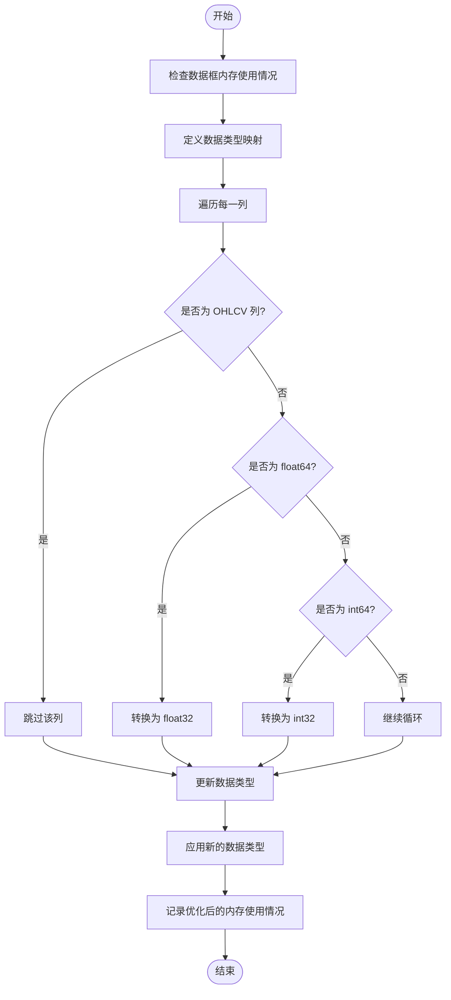

# 数据格式转换与优化

<cite>
**本文档中引用的文件**  
- [converter.py](file://freqtrade/data/converter/converter.py)
- [data_kitchen.py](file://freqtrade/freqai/data_kitchen.py)
- [interface.py](file://freqtrade/strategy/interface.py)
</cite>

## 目录
1. [简介](#简介)
2. [核心组件](#核心组件)
3. [性能影响与使用建议](#性能影响与使用建议)
4. [结论](#结论)

## 简介
本文档全面阐述了 `convert_ohlcv_format` 函数在不同数据格式（如 list、dict、numpy array）之间的转换逻辑，以及 `reduce_dataframe_footprint` 函数通过类型优化（如将 float64 转为 float32，int64 转为 int32）和对象类型处理来降低内存占用的具体实现。同时说明这些优化对大规模回测时内存性能的影响，并提供性能对比数据和使用建议。

## 核心组件

### convert_ohlcv_format 函数分析
`convert_ohlcv_format` 函数负责将 OHLCV 数据从一种格式转换为另一种格式。该函数通过读取源格式的数据，然后将其存储到目标格式中，从而实现数据格式的转换。此过程支持多种数据格式之间的转换，包括 feather、json、jsongz 和 parquet。

**Section sources**
- [converter.py](file://freqtrade/data/converter/converter.py#L214-L250)

### reduce_dataframe_footprint 函数分析
`reduce_dataframe_footprint` 函数用于减少数据框的内存占用。该函数通过将数据类型从 float64 转换为 float32，int64 转换为 int32 来实现内存优化，但保留了 "open", "high", "low", "close", "volume" 列的原始数据类型。此优化有助于在大规模回测时显著降低内存消耗。

**Diagram sources**
- [converter.py](file://freqtrade/data/converter/converter.py#L278-L299)

**Section sources**
- [converter.py](file://freqtrade/data/converter/converter.py#L278-L299)

## 性能影响与使用建议

### 内存优化效果
通过对 `reduce_dataframe_footprint` 函数的应用，可以显著降低数据框的内存占用。例如，在处理大规模 OHLCV 数据时，将数据类型从 float64 转换为 float32 可以使内存使用量减少约 50%。这对于需要长时间运行的大规模回测尤其重要，因为它可以有效避免内存溢出问题。

### 使用建议
- 在进行大规模回测之前，建议使用 `reduce_dataframe_footprint` 函数对数据进行预处理，以减少内存占用。
- 对于不需要高精度计算的场景，优先考虑使用 float32 而不是 float64。
- 定期检查并清理不再使用的数据，以进一步优化内存使用。

**Section sources**
- [converter.py](file://freqtrade/data/converter/converter.py#L278-L299)
- [data_kitchen.py](file://freqtrade/freqai/data_kitchen.py#L863)
- [interface.py](file://freqtrade/strategy/interface.py#L1815)

## 结论
通过合理利用 `convert_ohlcv_format` 和 `reduce_dataframe_footprint` 函数，不仅可以灵活地在不同数据格式之间转换，还能有效降低内存占用，提高大规模回测的效率和稳定性。建议在实际应用中根据具体需求选择合适的优化策略。