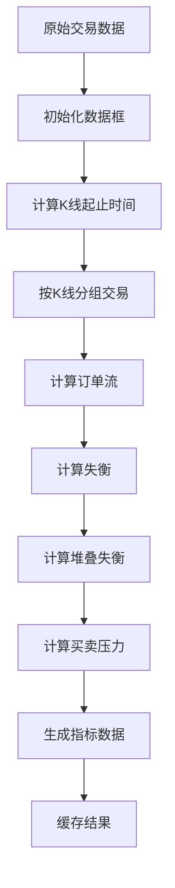
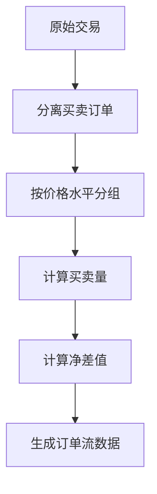
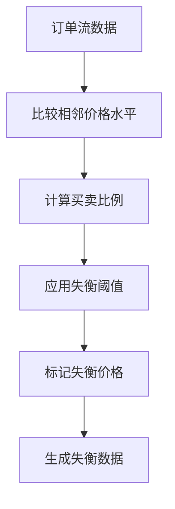
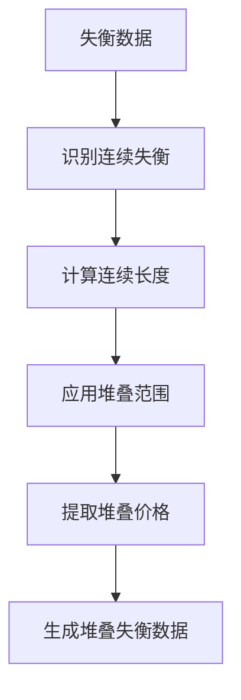
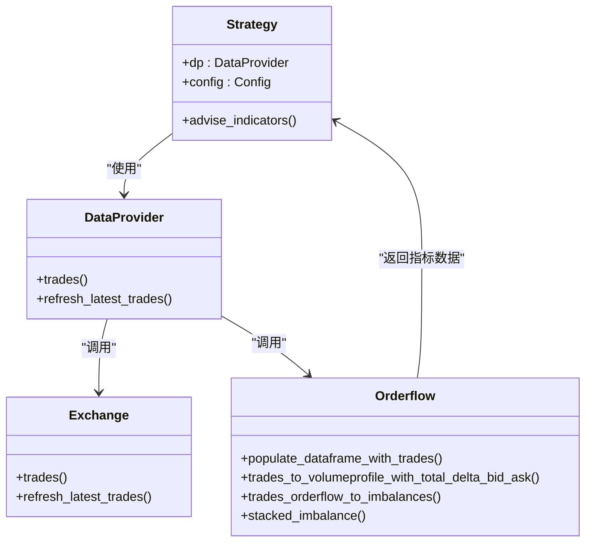
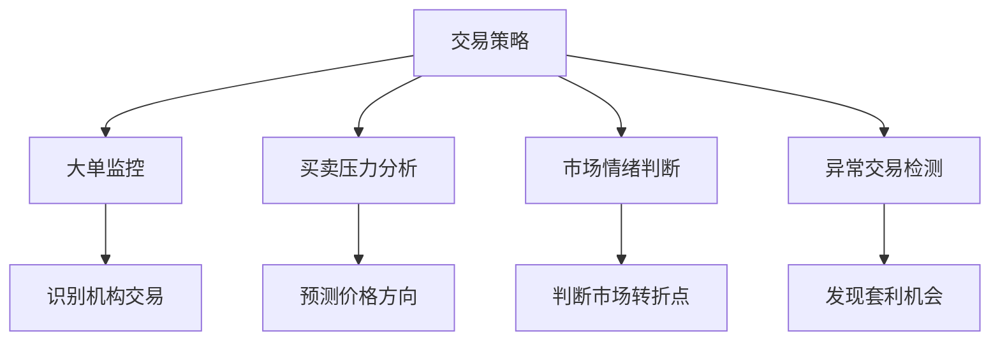
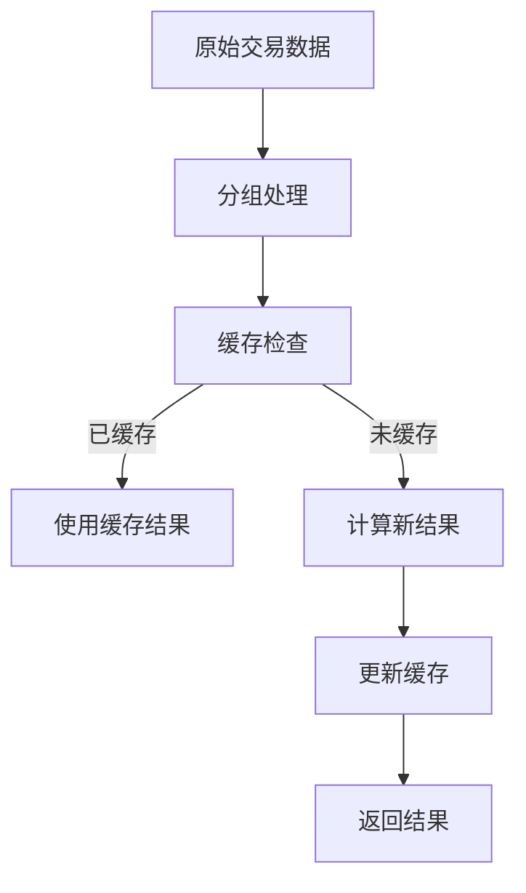
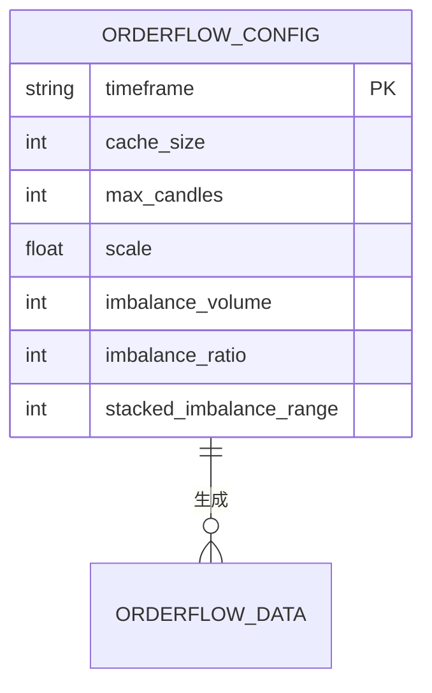

# 订单流数据处理

<cite>
**本文档中引用的文件**   
- [orderflow.py](file://freqtrade\data\converter\orderflow.py)
- [interface.py](file://freqtrade\strategy\interface.py)
- [dataprovider.py](file://freqtrade\data\dataprovider.py)
- [constants.py](file://freqtrade\constants.py)
</cite>

## 目录
1. [简介](#简介)
2. [核心功能分析](#核心功能分析)
3. [订单流数据处理流程](#订单流数据处理流程)
4. [指标计算与结构化](#指标计算与结构化)
5. [集成与应用场景](#集成与应用场景)
6. [性能与缓存机制](#性能与缓存机制)
7. [配置参数说明](#配置参数说明)

## 简介
`orderflow.py` 模块是Freqtrade系统中用于处理订单流数据的核心组件。该模块能够解析和结构化原始订单流数据，包括订单创建、更新、取消等事件，并从中提取有价值的信息，如大单监控、买卖压力分析等。通过将这些信息转换为可供策略使用的指标数据，该模块为量化交易策略提供了重要的数据支持。

## 核心功能分析

`orderflow.py` 模块主要提供以下核心功能：
- **订单流数据解析**：将原始的公共交易数据解析为结构化的订单流数据
- **买卖压力分析**：计算每个价格水平的买卖订单量和净差值
- **大单监控**：识别异常的订单不平衡情况
- **堆叠失衡检测**：检测连续的价格水平上的订单失衡模式
- **指标数据生成**：生成可供交易策略直接使用的各种指标数据

该模块通过一系列函数协同工作，实现了从原始交易数据到可用指标数据的完整转换流程。

**本节来源**
- [orderflow.py](file://freqtrade\data\converter\orderflow.py#L1-L265)

## 订单流数据处理流程

**图表来源**
- [orderflow.py](file://freqtrade\data\converter\orderflow.py#L78-L187)

订单流数据处理流程主要包括以下步骤：

1. **数据框初始化**：使用 `_init_dataframe_with_trades_columns` 函数初始化数据框，添加必要的订单流相关列
2. **K线时间计算**：通过 `_calculate_ohlcv_candle_start_and_end` 函数计算每个交易所属的K线起止时间
3. **交易分组**：根据K线起止时间将交易数据分组，便于后续处理
4. **订单流计算**：对每个K线内的交易进行汇总，计算每个价格水平的买卖订单量
5. **失衡检测**：识别买卖订单量存在显著差异的价格水平
6. **堆叠失衡检测**：检测连续多个价格水平上存在的失衡模式
7. **指标生成**：计算买卖压力、最大最小差值等综合指标
8. **结果缓存**：将处理结果缓存，提高后续处理效率

**本节来源**
- [orderflow.py](file://freqtrade\data\converter\orderflow.py#L78-L187)

## 指标计算与结构化

### 订单流计算

**图表来源**
- [orderflow.py](file://freqtrade\data\converter\orderflow.py#L190-L217)

`trades_to_volumeprofile_with_total_delta_bid_ask` 函数负责将原始交易数据转换为订单流数据：
- 根据交易方向分离买卖订单
- 按指定的价格间隔（scale）对价格进行分组
- 计算每个价格水平的买卖订单量和总交易量
- 计算买卖差值（delta）

### 失衡检测

**图表来源**
- [orderflow.py](file://freqtrade\data\converter\orderflow.py#L220-L241)

`trades_orderflow_to_imbalances` 函数用于检测订单失衡：
- 比较相邻价格水平的买卖订单量
- 当买卖比例超过设定阈值时标记为失衡
- 结合最小交易量要求过滤噪声

### 堆叠失衡检测

**图表来源**
- [orderflow.py](file://freqtrade\data\converter\orderflow.py#L244-L264)

`stacked_imbalance` 函数用于检测堆叠失衡：
- 识别连续多个价格水平上的失衡模式
- 计算连续失衡的长度
- 当连续长度达到设定范围时，提取相应的价格水平

**本节来源**
- [orderflow.py](file://freqtrade\data\converter\orderflow.py#L190-L264)

## 集成与应用场景

### 与核心转换功能的集成

**图表来源**
- [interface.py](file://freqtrade\strategy\interface.py#L1766-L1816)
- [dataprovider.py](file://freqtrade\data\dataprovider.py#L453-L461)

`orderflow.py` 模块通过以下方式与核心系统集成：

1. **策略层集成**：在 `IStrategy.advise_indicators` 方法中，通过 `_if_enabled_populate_trades` 调用订单流处理功能
2. **数据提供层集成**：`DataProvider` 类负责从交易所获取原始交易数据，并传递给订单流处理模块
3. **交易所层集成**：`Exchange` 类提供获取和刷新交易数据的接口

### 应用场景

**图表来源**
- [orderflow.py](file://freqtrade\data\converter\orderflow.py#L78-L187)

订单流数据处理模块的主要应用场景包括：

- **大单监控**：通过检测订单失衡，识别可能的机构交易或大额资金流动
- **买卖压力分析**：通过计算买卖差值，判断市场的多空力量对比
- **市场情绪判断**：通过分析订单流模式，判断市场参与者的情绪和预期
- **异常交易检测**：通过识别异常的订单模式，发现潜在的套利机会或市场操纵行为

**本节来源**
- [interface.py](file://freqtrade\strategy\interface.py#L1766-L1816)
- [dataprovider.py](file://freqtrade\data\dataprovider.py#L453-L461)

## 性能与缓存机制

**图表来源**
- [orderflow.py](file://freqtrade\data\converter\orderflow.py#L78-L187)

`orderflow.py` 模块采用了以下性能优化和缓存机制：

1. **数据分组优化**：只处理与当前K线相关的交易数据，减少计算量
2. **结果缓存**：将处理结果缓存，避免重复计算
3. **增量更新**：只处理新增的交易数据，提高处理效率
4. **批量处理**：对多个K线同时进行处理，提高整体性能

缓存机制通过 `cached_grouped_trades` 参数实现，可以有效减少重复计算，提高系统整体性能。

**本节来源**
- [orderflow.py](file://freqtrade\data\converter\orderflow.py#L78-L187)

## 配置参数说明

**图表来源**
- [orderflow.py](file://freqtrade\data\converter\orderflow.py#L78-L187)

订单流处理模块支持以下配置参数：

| 参数 | 类型 | 描述 | 默认值 |
|------|------|------|--------|
| cache_size | 整数 | 缓存大小 | 1000 |
| max_candles | 整数 | 最大K线数量 | 1500 |
| scale | 浮点数 | 价格间隔 | 0.005 |
| imbalance_volume | 整数 | 失衡最小交易量 | 0 |
| imbalance_ratio | 整数 | 失衡比例阈值 | 3 |
| stacked_imbalance_range | 整数 | 堆叠失衡范围 | 3 |

这些参数可以通过配置文件进行调整，以适应不同的交易策略和市场条件。

**本节来源**
- [orderflow.py](file://freqtrade\data\converter\orderflow.py#L78-L187)