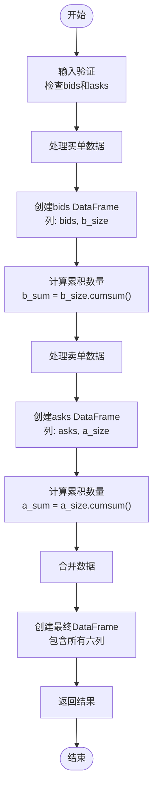
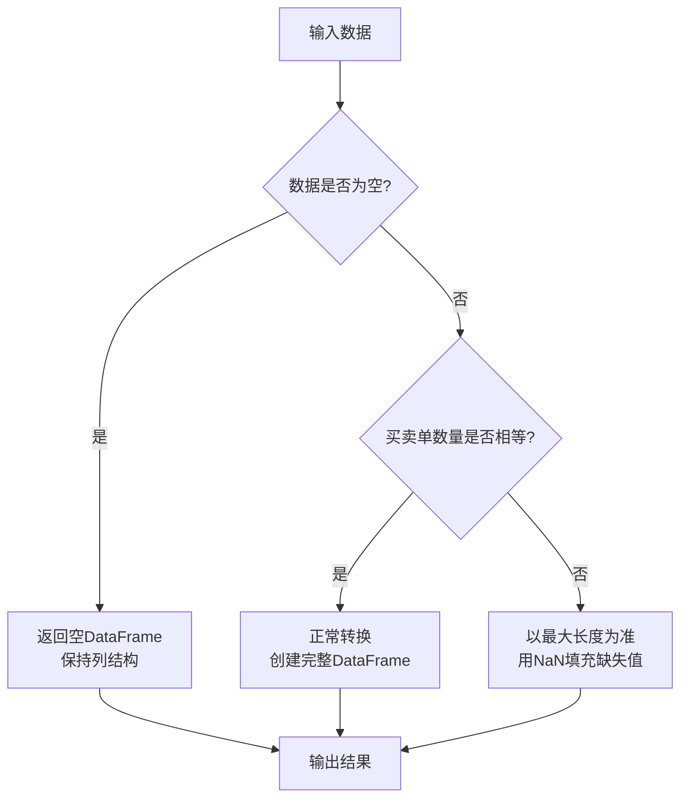

# 订单簿数据转换功能

<cite>
**本文档引用的文件**  
- [converter.py](file://freqtrade/data/converter/converter.py)
- [test_converter.py](file://tests/data/test_converter.py)
</cite>

## 目录
1. [功能概述](#功能概述)
2. [核心实现机制](#核心实现机制)
3. [数据结构转换流程](#数据结构转换流程)
4. [应用场景分析](#应用场景分析)
5. [实际数据示例](#实际数据示例)
6. [边界情况处理](#边界情况处理)

## 功能概述

`order_book_to_dataframe`函数是Freqtrade系统中用于处理交易所订单簿数据的核心工具。该函数专门负责将原始的订单簿JSON结构（包含asks和bids数组）转换为结构化的pandas DataFrame格式，为后续的市场深度分析和价差计算提供标准化的数据基础。

该功能在量化交易系统中扮演着关键角色，通过将非结构化的订单簿数据转换为结构化表格，使得复杂的市场数据分析成为可能。转换后的数据结构不仅保留了原始的价格-数量对信息，还通过累积计算提供了市场深度的直观表示。

**Section sources**
- [converter.py](file://freqtrade/data/converter/converter.py#L181-L211)

## 核心实现机制

`order_book_to_dataframe`函数通过一系列精确的数据处理步骤，将交易所返回的订单簿数据转换为结构化格式。函数接收两个主要参数：`bids`（买方挂单列表）和`asks`（卖方挂单列表），每个列表都包含价格-数量对的数组。

转换过程的核心在于创建两个独立的DataFrame：一个用于买单，一个用于卖单。对于买单数据，函数创建包含"bids"（价格）和"b_size"（数量）列的DataFrame，并计算累积数量"b_sum"。同样，卖单数据被组织为包含"asks"（价格）和"a_size"（数量）的DataFrame，并计算累积数量"a_sum"。

最终，通过pandas的`concat`函数将两个DataFrame沿列轴合并，形成包含六个关键列的完整结构：b_sum、b_size、bids、asks、a_size、a_sum。这种结构设计使得市场深度信息一目了然，便于后续分析。



**Diagram sources**
- [converter.py](file://freqtrade/data/converter/converter.py#L181-L211)

**Section sources**
- [converter.py](file://freqtrade/data/converter/converter.py#L181-L211)

## 数据结构转换流程

订单簿数据的转换流程遵循严格的步骤，确保数据的完整性和准确性。首先，函数将原始的二维数组结构（价格-数量对）转换为pandas DataFrame，这一步骤实现了从非结构化数据到结构化数据的转变。

对于买单数据，函数使用`["bids", "b_size"]`作为列名创建DataFrame，其中"bids"列存储价格信息，"b_size"列存储对应的交易数量。随后，通过`cumsum()`方法计算累积数量，生成"b_sum"列，该列表示从最高买价开始的累计需求量。

同样，卖单数据被转换为以`["asks", "a_size"]`为列名的DataFrame，"asks"列存储卖方报价，"a_size"列存储对应的供应量。累积数量"a_sum"的计算从最低卖价开始，表示累计供应量。

最后，通过`pd.concat`函数将两个DataFrame沿列轴合并，形成最终的六列结构。这种设计确保了买卖双方的市场深度信息在同一个表格中对齐，便于比较和分析。当买卖单数量不一致时，pandas会自动用NaN填充缺失值，保持数据结构的完整性。

**Section sources**
- [converter.py](file://freqtrade/data/converter/converter.py#L181-L211)

## 应用场景分析

转换后的订单簿DataFrame在量化交易分析中具有广泛的应用价值。最直接的应用是市场深度分析，通过观察"b_sum"和"a_sum"列的变化，可以直观地了解市场的供需平衡状况。累积数量的快速增长表明市场深度较浅，而缓慢增长则表明市场深度较深。

在价差计算方面，转换后的数据结构特别有用。通过比较"bids"列的最高价格和"asks"列的最低价格，可以精确计算买卖价差（Bid-Ask Spread），这是衡量市场流动性的关键指标。较小的价差通常表示较高的流动性，而较大的价差则可能表示市场波动性较高或流动性不足。

此外，这种结构化的数据格式非常适合进行时间序列分析。通过定期采集并转换订单簿数据，可以构建市场深度的时间序列，用于分析市场情绪变化、预测价格走势或检测异常交易行为。累积数量的变化率也可以作为交易策略的输入信号，例如在累积数量快速增加时采取相应的交易决策。

**Section sources**
- [converter.py](file://freqtrade/data/converter/converter.py#L181-L211)

## 实际数据示例

考虑以下实际的订单簿数据示例：

**原始订单簿数据：**
```
bids = [
    [100.0, 5.0],  # 价格100.0，数量5.0
    [99.5, 3.0],   # 价格99.5，数量3.0
    [99.0, 2.0]    # 价格99.0，数量2.0
]
asks = [
    [100.5, 4.0],  # 价格100.5，数量4.0
    [101.0, 6.0],  # 价格101.0，数量6.0
    [101.5, 1.0]   # 价格101.5，数量1.0
]
```

**转换后的DataFrame：**
| b_sum | b_size | bids | asks | a_size | a_sum |
|-------|--------|------|------|--------|-------|
| 5.0   | 5.0    | 100.0| 100.5| 4.0    | 4.0   |
| 8.0   | 3.0    | 99.5 | 101.0| 6.0    | 10.0  |
| 10.0  | 2.0    | 99.0 | 101.5| 1.0    | 11.0  |

从转换结果可以看出，买单的累积数量从5.0增加到10.0，而卖单的累积数量从4.0增加到11.0。这种结构清晰地展示了市场的供需状况，最高买价为100.0，最低卖价为100.5，买卖价差为0.5。

**Section sources**
- [test_converter.py](file://tests/data/test_converter.py#L605-L630)

## 边界情况处理

`order_book_to_dataframe`函数在设计时充分考虑了各种边界情况，确保了函数的鲁棒性。首先，函数能够正确处理空的订单簿数据。当`bids`和`asks`都为空列表时，函数返回一个具有正确列结构但没有行的空DataFrame，这保持了数据接口的一致性。

其次，函数能够处理买卖单数量不一致的情况。当买单和卖单的数量不同时，转换后的DataFrame行数等于两者中的最大值。对于较短的一方，缺失的值会自动填充为NaN，这符合pandas的数据处理惯例，同时也保留了数据的完整性。

函数还隐式处理了数据类型转换，确保价格和数量都被正确解释为数值类型。这种健壮的错误处理机制使得函数能够在各种实际交易场景中稳定运行，即使面对不完整或异常的订单簿数据也能提供有意义的输出。



**Diagram sources**
- [test_converter.py](file://tests/data/test_converter.py#L632-L664)

**Section sources**
- [test_converter.py](file://tests/data/test_converter.py#L631-L664)