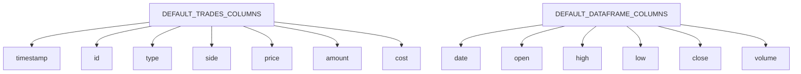
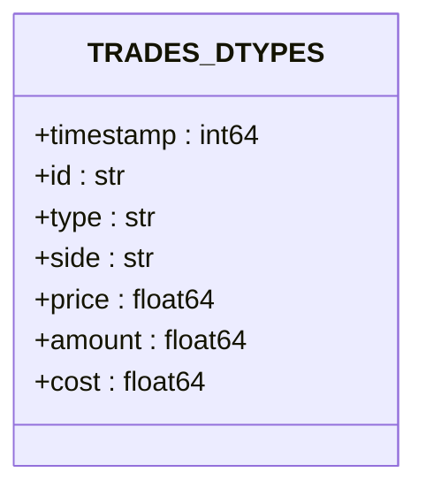
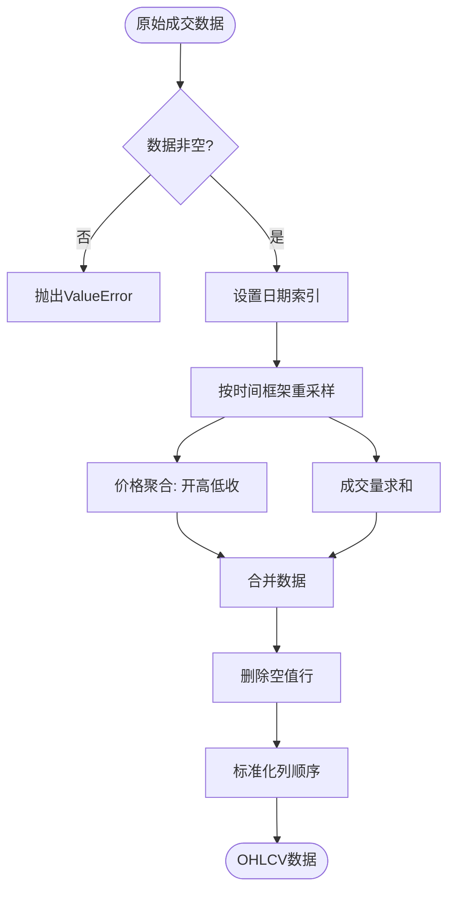
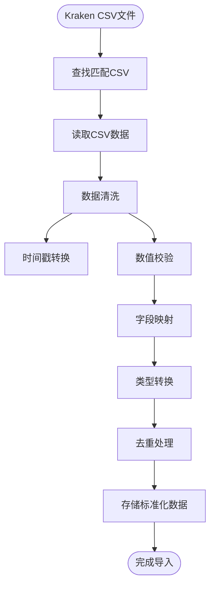
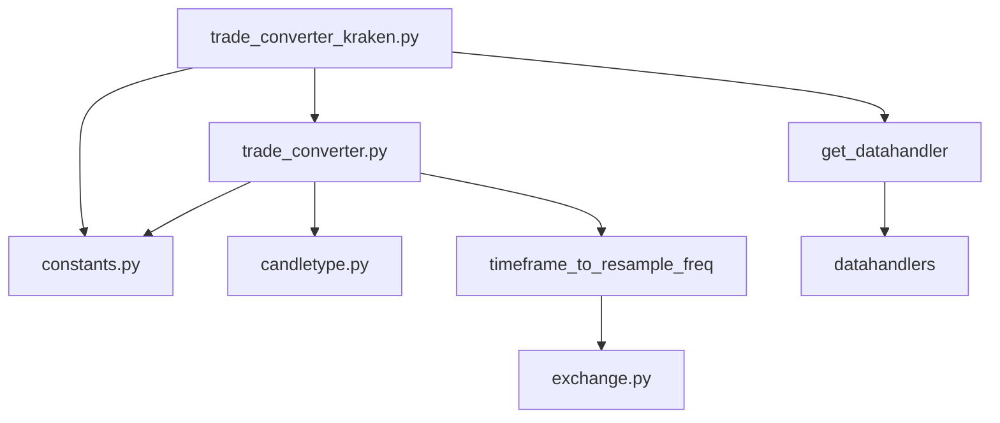
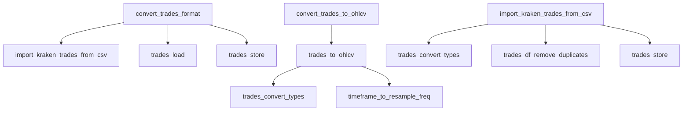

# 逐笔成交数据转换

<cite>
**Referenced Files in This Document**   
- [trade_converter.py](file://freqtrade/data/converter/trade_converter.py)
- [trade_converter_kraken.py](file://freqtrade/data/converter/trade_converter_kraken.py)
- [constants.py](file://freqtrade/constants.py)
- [candletype.py](file://freqtrade/enums/candletype.py)
</cite>

## 目录
1. [简介](#简介)
2. [核心转换逻辑](#核心转换逻辑)
3. [Kraken交易所特殊处理](#kraken交易所特殊处理)
4. [数据结构与类型定义](#数据结构与类型定义)
5. [转换流程图解](#转换流程图解)
6. [依赖关系分析](#依赖关系分析)

## 简介
本文档详细说明了Freqtrade系统中将逐笔成交数据（trades）聚合转换为OHLCV（开高低收量）蜡烛图数据的完整逻辑。该转换过程是回测系统的基础，能够将原始的交易流数据转换为可用于技术分析和策略回测的标准时间序列数据。文档特别关注了针对Kraken交易所CSV格式数据的特殊处理机制。

## 核心转换逻辑

逐笔成交数据到OHLCV数据的转换主要通过`trades_to_ohlcv`函数实现。该函数接收原始成交数据和目标时间框架作为输入，输出标准化的OHLCV数据框。

转换过程包括以下关键步骤：
1. 将输入的成交数据按日期索引
2. 根据指定时间框架计算重采样间隔
3. 对价格序列进行OHLC聚合
4. 对成交量序列进行求和
5. 清理无效数据并返回标准化结果

**Section sources**
- [trade_converter.py](file://freqtrade/data/converter/trade_converter.py#L69-L88)

## Kraken交易所特殊处理

针对Kraken交易所的CSV格式数据，系统提供了专门的导入和转换机制。`import_kraken_trades_from_csv`函数负责处理Kraken特有的数据格式，包括：

- 从CSV文件中读取基础成交数据（时间戳、价格、数量）
- 时间戳单位转换（从秒到毫秒）
- 数据完整性校验和清洗
- 字段映射和标准化
- 重复数据去除

该机制允许用户将Kraken导出的CSV交易数据无缝集成到Freqtrade系统中。

**Section sources**
- [trade_converter_kraken.py](file://freqtrade/data/converter/trade_converter_kraken.py#L25-L92)

## 数据结构与类型定义

系统定义了标准化的数据结构和类型，确保数据在转换过程中的完整性和一致性。

### 核心数据列定义
系统使用常量定义了标准的数据列结构：

**Diagram sources**
- [constants.py](file://freqtrade/constants.py#L72)
- [constants.py](file://freqtrade/constants.py#L69)

### 数据类型规范
系统为交易数据定义了严格的类型规范，确保数据处理的准确性和效率：

**Diagram sources**
- [constants.py](file://freqtrade/constants.py#L87-L95)

## 转换流程图解

### 通用转换流程

**Diagram sources**
- [trade_converter.py](file://freqtrade/data/converter/trade_converter.py#L69-L88)

### Kraken CSV导入流程

**Diagram sources**
- [trade_converter_kraken.py](file://freqtrade/data/converter/trade_converter_kraken.py#L25-L92)

## 依赖关系分析

### 核心组件依赖

**Diagram sources**
- [trade_converter.py](file://freqtrade/data/converter/trade_converter.py)
- [trade_converter_kraken.py](file://freqtrade/data/converter/trade_converter_kraken.py)

### 函数调用关系

**Diagram sources**
- [trade_converter.py](file://freqtrade/data/converter/trade_converter.py#L25-L88)
- [trade_converter_kraken.py](file://freqtrade/data/converter/trade_converter_kraken.py#L25-L92)