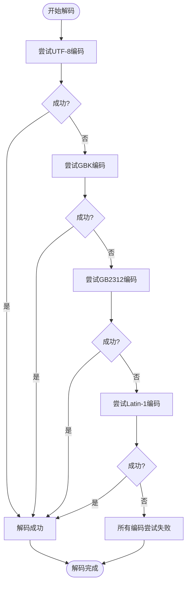
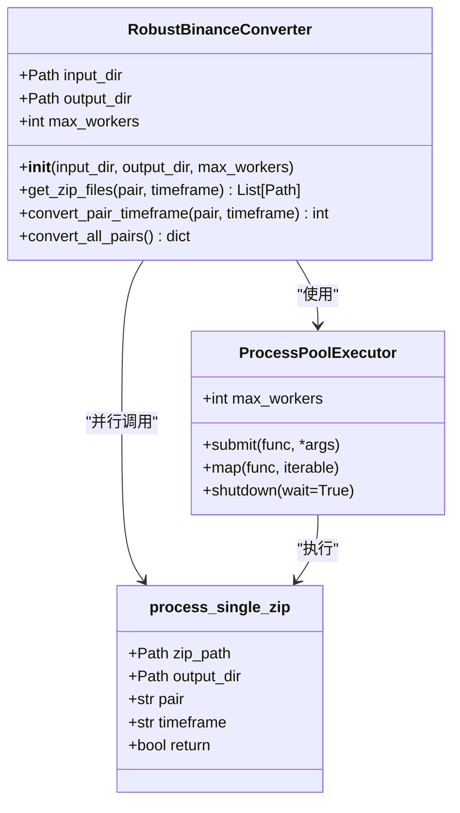
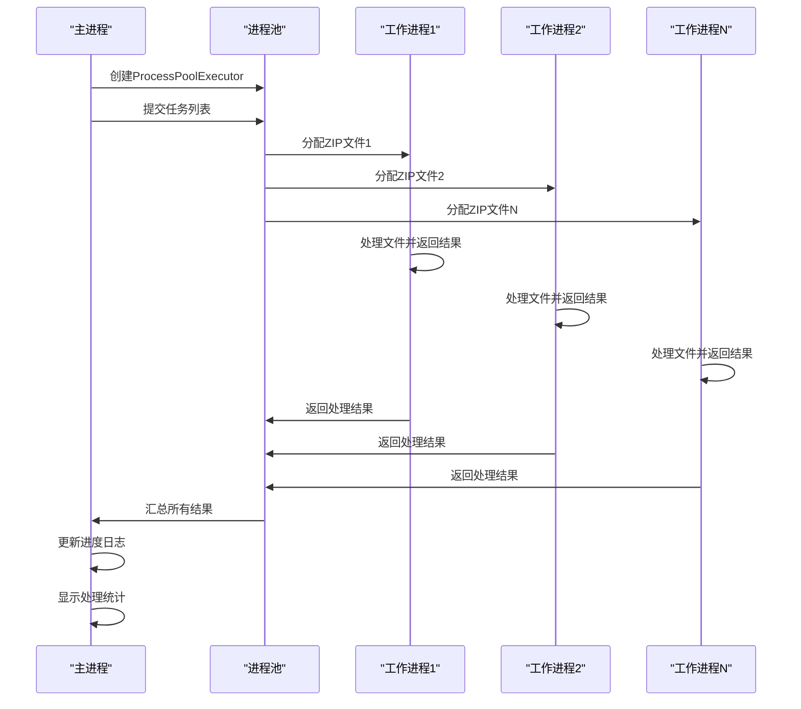
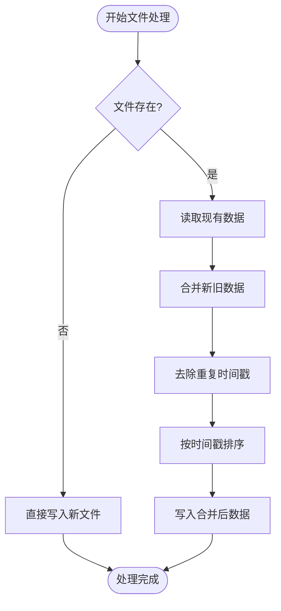
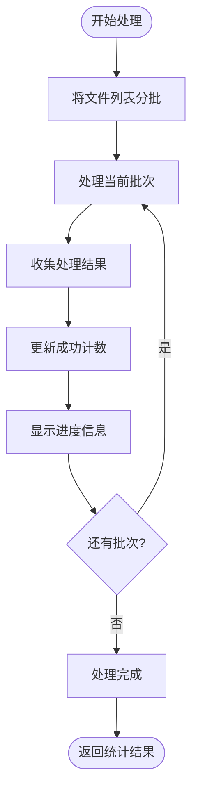
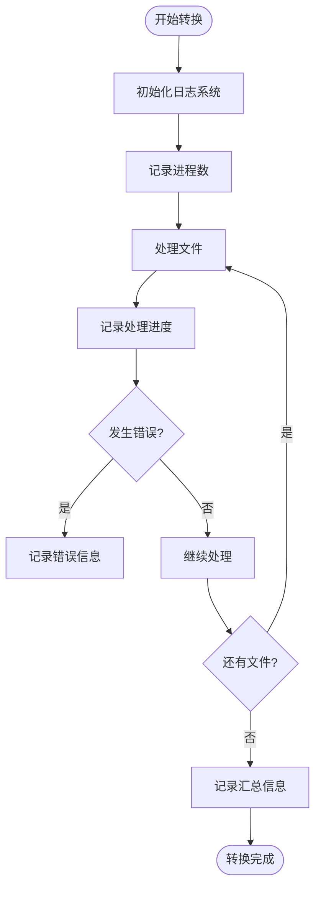

# robust_binance_converter.py - 健壮数据转换工具

<cite>
**本文档引用的文件**
- [robust_binance_converter.py](file://robust_binance_converter.py)
- [final_binance_converter.py](file://final_binance_converter.py)
- [simple_binance_converter.py](file://simple_binance_converter.py)
</cite>

## 目录
1. [简介](#简介)
2. [核心容错机制](#核心容错机制)
3. [并行处理架构](#并行处理架构)
4. [增量合并策略](#增量合并策略)
5. [分批处理与内存管理](#分批处理与内存管理)
6. [日志监控系统](#日志监控系统)
7. [实际使用案例](#实际使用案例)
8. [性能调优参数](#性能调优参数)

## 简介
`robust_binance_converter.py` 是一个专为币安数据设计的健壮数据转换工具，旨在将原始市场数据转换为Freqtrade兼容的格式。该工具特别针对大规模数据迁移场景进行了优化，具备强大的容错能力、高效的并行处理架构和完善的监控系统。本文档详细说明其核心机制，包括多编码自动检测、数据清洗验证规则、基于`ProcessPoolExecutor`的并行处理架构、增量合并策略以及分批处理机制。

## 核心容错机制

`robust_binance_converter.py` 的核心优势在于其强大的容错数据转换机制，能够处理各种编码问题和数据异常，确保数据转换过程的稳定性和可靠性。

### 多编码自动检测
该工具实现了智能的多编码自动检测机制，能够自动识别和处理不同编码格式的CSV文件。在处理ZIP压缩包内的CSV文件时，脚本会依次尝试`utf-8`、`gbk`、`gb2312`和`latin-1`四种常见编码格式。通过循环尝试解码，一旦成功解码则立即停止尝试，确保能够正确读取不同地区和来源的数据文件。这种机制有效解决了因编码不一致导致的数据读取失败问题，提高了工具的兼容性和鲁棒性。



**Diagram sources**
- [robust_binance_converter.py](file://robust_binance_converter.py#L50-L58)

**Section sources**
- [robust_binance_converter.py](file://robust_binance_converter.py#L24-L134)

### 数据清洗与验证规则
工具实施了严格的数据清洗和验证规则，确保输出数据的质量和一致性。数据验证包括多个层面：

1. **基本数据验证**：检查价格和成交量数据是否为有效数值，确保开盘价、最高价、最低价和收盘价均为正数，成交量非负。
2. **价格逻辑校验**：验证K线数据的逻辑合理性，确保最高价不低于开盘价和收盘价中的较大值，最低价不高于开盘价和收盘价中的较小值。
3. **负值过滤**：自动过滤掉所有包含负值的价格数据，防止异常数据影响后续分析。
4. **时间戳验证**：验证时间戳是否为有效的数字，确保时间序列的连续性和正确性。

这些验证规则共同构成了一个多层次的数据质量保障体系，有效过滤了原始数据中的噪声和异常值。

```mermaid
flowchart TD
Start([开始数据验证]) --> ValidateTimestamp["验证时间戳有效性"]
ValidateTimestamp --> TimestampValid{有效?}
TimestampValid --> |否| SkipRow["跳过该行"]
TimestampValid --> |是| ValidatePrice["验证价格数据"]
ValidatePrice --> PriceValid{价格>0?}
PriceValid --> |否| SkipRow
PriceValid --> |是| ValidateVolume["验证成交量"]
ValidateVolume --> VolumeValid{成交量>=0?}
VolumeValid --> |否| SkipRow
VolumeValid --> |是| ValidateLogic["验证价格逻辑"]
ValidateLogic --> LogicValid{High>=Max(Open,Close)?<br/>Low<=Min(Open,Close)?}
LogicValid --> |否| SkipRow
LogicValid --> |是| AcceptRow["接受该行数据"]
SkipRow --> End([处理下一行])
AcceptRow --> End
```

**Diagram sources**
- [robust_binance_converter.py](file://robust_binance_converter.py#L78-L97)

**Section sources**
- [robust_binance_converter.py](file://robust_binance_converter.py#L24-L134)

## 并行处理架构

`robust_binance_converter.py` 采用基于`ProcessPoolExecutor`的并行处理架构，充分利用多核CPU的计算能力，显著提升数据转换效率。

### ProcessPoolExecutor 架构
该工具使用`concurrent.futures.ProcessPoolExecutor`实现多进程并行处理，与线程池相比，进程池能够真正实现并行计算，避免了Python全局解释器锁（GIL）的限制。每个进程独立运行，处理不同的ZIP文件，实现了任务的完全并行化。进程池的大小可以根据系统CPU核心数自动调整，默认最多使用6个进程，既保证了并行效率，又避免了过多进程带来的系统资源消耗。



**Diagram sources**
- [robust_binance_converter.py](file://robust_binance_converter.py#L13-L13)
- [robust_binance_converter.py](file://robust_binance_converter.py#L183-L183)

**Section sources**
- [robust_binance_converter.py](file://robust_binance_converter.py#L136-L240)

### 并行任务调度
工具的并行处理架构设计精巧，通过`functools.partial`创建偏函数，将固定的参数（如输出目录、交易对、时间框架）绑定到`process_single_zip`函数上，然后将处理函数和ZIP文件列表提交给进程池。这种设计使得每个工作进程只需要关注文件路径这一变量，简化了任务分发和结果收集的过程。主进程负责监控进度并实时输出处理状态，包括已完成的文件数、处理速度和成功率等关键指标。



**Diagram sources**
- [robust_binance_converter.py](file://robust_binance_converter.py#L183-L194)

**Section sources**
- [robust_binance_converter.py](file://robust_binance_converter.py#L162-L202)

## 增量合并策略

`robust_binance_converter.py` 实现了智能的增量合并策略，能够高效处理重复数据和增量更新，确保数据的完整性和一致性。

### 文件合并机制
当目标输出文件已存在时，工具不会简单地覆盖原有文件，而是采用增量合并策略。首先读取现有CSV文件中的数据，然后将新处理的数据与现有数据进行合并。合并过程中会自动去除时间戳重复的数据行，并按时间戳排序，确保最终数据的连续性和唯一性。这种机制特别适用于定期更新市场数据的场景，可以避免重复处理历史数据，大大提高了数据更新的效率。



**Diagram sources**
- [robust_binance_converter.py](file://robust_binance_converter.py#L118-L128)

**Section sources**
- [robust_binance_converter.py](file://robust_binance_converter.py#L24-L134)

### 异常处理与数据完整性
在增量合并过程中，工具还实现了完善的异常处理机制。如果在读取或合并现有数据时发生错误，工具会自动切换到覆盖模式，使用新处理的数据直接覆盖原有文件。这种设计确保了即使在部分数据损坏的情况下，也能保证最终输出文件的完整性和可用性，避免了因单个文件问题导致整个转换过程失败的风险。

## 分批处理与内存管理

为了防止在处理大规模数据集时发生内存溢出，`robust_binance_converter.py` 采用了分批处理机制，有效控制内存使用。

### 分批处理机制
工具将待处理的ZIP文件列表按批次分割，每批处理100个文件。这种分批处理策略有多个优势：首先，它限制了同时加载到内存中的数据量，避免了内存峰值；其次，它允许在每批处理完成后进行垃圾回收，释放不再需要的内存资源；最后，它提供了更好的进度控制和错误恢复能力，即使某一批次处理失败，也不会影响其他批次的处理。



**Diagram sources**
- [robust_binance_converter.py](file://robust_binance_converter.py#L185-L194)

**Section sources**
- [robust_binance_converter.py](file://robust_binance_converter.py#L162-L202)

### 内存优化策略
除了分批处理外，工具还采用了多种内存优化策略。使用`pandas.DataFrame`进行数据操作时，通过`drop_duplicates`和`sort_values`等方法高效处理数据，避免了手动管理大量数据结构。同时，工具在处理完每个ZIP文件后立即释放相关资源，确保内存使用始终保持在合理水平。这种精细化的内存管理使得工具能够稳定处理TB级别的市场数据，而不会出现内存不足的问题。

## 日志监控系统

`robust_binance_converter.py` 配备了完善的日志监控系统，为大规模数据迁移提供了强大的监控和调试能力。

### 日志级别与信息
工具使用Python标准库的`logging`模块，设置了INFO级别的日志输出。日志系统记录了从进程初始化到每个文件处理的详细信息，包括使用的进程数、处理进度、成功/失败文件数、处理速度等关键指标。对于警告和错误信息，如无法解码的文件或处理异常，会以相应的日志级别输出，便于问题定位和排查。详细的进度日志使得用户可以实时了解转换过程的状态，对于长时间运行的大规模数据迁移任务尤为重要。



**Diagram sources**
- [robust_binance_converter.py](file://robust_binance_converter.py#L22-L22)
- [robust_binance_converter.py](file://robust_binance_converter.py#L146-L146)

**Section sources**
- [robust_binance_converter.py](file://robust_binance_converter.py#L242-L279)

### 监控价值
在大规模数据迁移场景中，日志系统提供了重要的监控价值。通过分析日志输出，用户可以：
1. 实时监控转换进度和处理速度
2. 及时发现和定位数据质量问题
3. 评估系统性能和资源使用情况
4. 验证转换结果的完整性和准确性
5. 为后续的性能优化提供数据支持

详细的日志记录不仅有助于问题排查，也为数据治理和质量控制提供了重要依据。

## 实际使用案例

### 全量转换
全量转换是最常见的使用场景，用于将整个币安数据集转换为Freqtrade格式。通过不指定交易对和时间框架参数，工具会自动扫描输入目录下的所有子目录，处理所有可用的ZIP文件。这种方式适用于首次数据迁移或需要更新全部历史数据的场景。

```bash
python robust_binance_converter.py --input /path/to/binance/data --output /path/to/freqtrade/data
```

### 指定交易对转换
当只需要转换特定交易对的数据时，可以使用`--pair`和`--timeframe`参数指定具体的交易对和时间框架。这种方式可以精确控制转换范围，节省处理时间和系统资源，特别适用于增量更新或特定策略回测的数据准备。

```bash
python robust_binance_converter.py --input /path/to/binance/data --output /path/to/freqtrade/data --pair BTCUSDT --timeframe 1h
```

### 预览模式
工具还提供了预览模式（`--dry-run`），在该模式下不会实际执行文件转换，仅输出将要执行的操作。这为用户提供了安全的测试环境，可以在正式运行前验证参数设置的正确性，避免因配置错误导致的数据问题。

```bash
python robust_binance_converter.py --input /path/to/binance/data --output /path/to/freqtrade/data --dry-run
```

**Section sources**
- [robust_binance_converter.py](file://robust_binance_converter.py#L242-L279)

## 性能调优参数

### 并行进程数配置
`--workers`参数允许用户手动指定并行处理的进程数。默认情况下，工具会自动检测CPU核心数并设置最多6个进程。在高性能服务器上，可以适当增加进程数以充分利用计算资源；而在资源受限的环境中，则应减少进程数以避免系统过载。

### 性能优化建议
1. **批量大小调整**：虽然批处理大小在代码中固定为100，但可以根据系统内存大小进行调整。内存充足的系统可以增加批处理大小以提高吞吐量，而内存有限的系统则应减小批处理大小。
2. **I/O优化**：由于数据转换是I/O密集型任务，使用SSD存储可以显著提升处理速度。
3. **内存监控**：在处理超大规模数据集时，应监控系统内存使用情况，必要时可降低并行进程数以避免内存溢出。
4. **错误容忍度**：工具的容错机制允许跳过个别损坏的文件，确保整体转换过程的稳定性。在数据质量较差的情况下，这种设计尤为重要。

**Section sources**
- [robust_binance_converter.py](file://robust_binance_converter.py#L144-L148)
- [robust_binance_converter.py](file://robust_binance_converter.py#L245-L249)