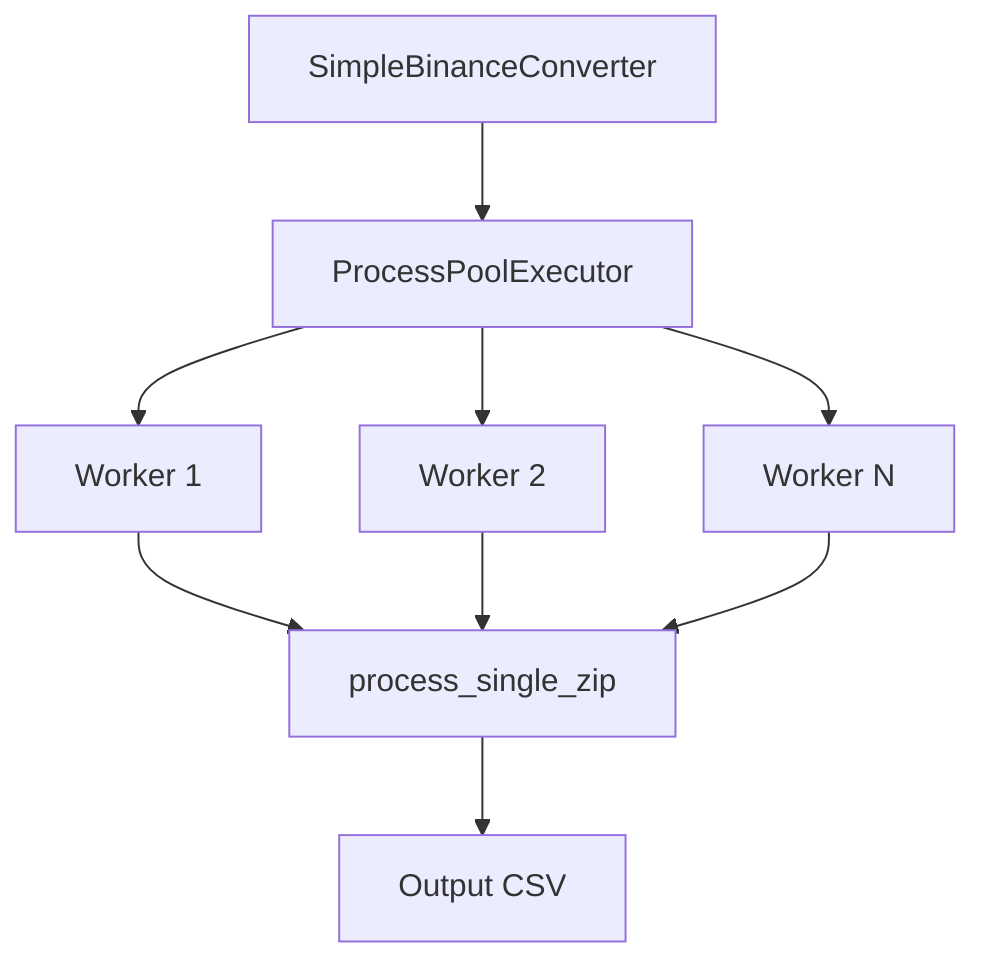
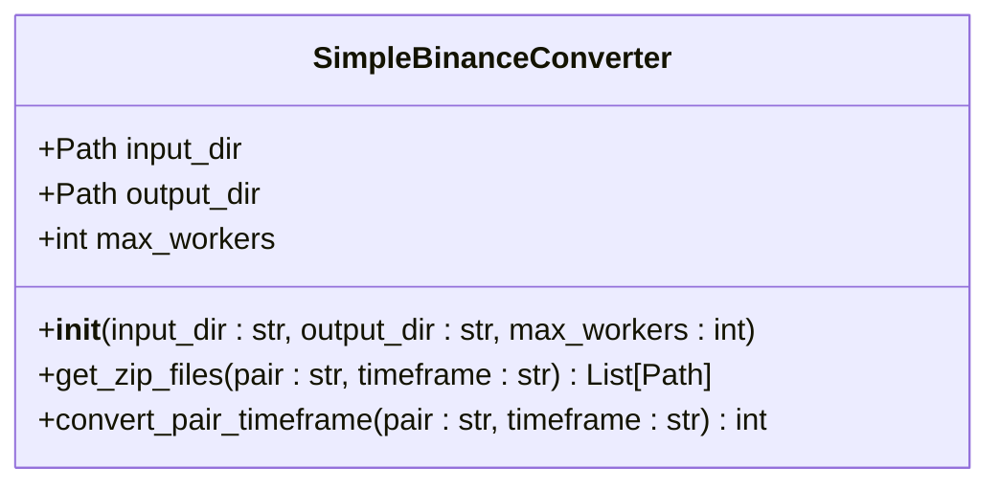
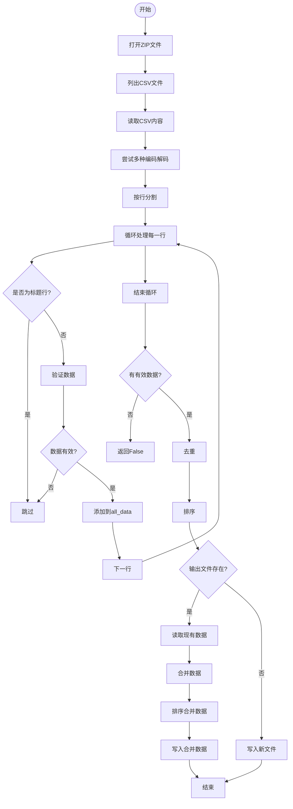
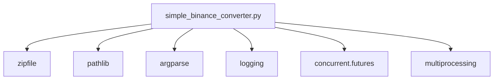

# simple_binance_converter.py - 轻量级转换工具

<cite>
**本文档引用的文件**  
- [simple_binance_converter.py](file://simple_binance_converter.py)
- [robust_binance_converter.py](file://robust_binance_converter.py)
</cite>

## 目录
1. [简介](#简介)
2. [项目结构](#项目结构)
3. [核心组件](#核心组件)
4. [架构概述](#架构概述)
5. [详细组件分析](#详细组件分析)
6. [依赖分析](#依赖分析)
7. [性能考量](#性能考量)
8. [故障排除指南](#故障排除指南)
9. [结论](#结论)

## 简介
`simple_binance_converter.py` 是一个专为币安交易所设计的轻量级数据转换工具，旨在将原始K线数据高效地转换为Freqtrade可识别的格式。该工具特别适用于数据质量较高的场景，通过简化处理流程，在错误处理、内存占用和处理速度方面与`robust_binance_converter.py`形成鲜明对比。

## 项目结构
该工具位于项目根目录下，是一个独立的Python脚本，不依赖于`freqtrade`主包的复杂结构。其设计目标是简单、快速和高效，避免了复杂的依赖关系和数据验证流程。

**Section sources**
- [simple_binance_converter.py](file://simple_binance_converter.py#L1-L20)

## 核心组件
`simple_binance_converter.py` 的核心组件包括 `SimpleBinanceConverter` 类和 `process_single_zip` 函数。前者负责管理输入输出路径、并行处理逻辑和整体转换流程，后者则专注于单个ZIP文件的解析和数据提取。

**Section sources**
- [simple_binance_converter.py](file://simple_binance_converter.py#L157-L217)
- [simple_binance_converter.py](file://simple_binance_converter.py#L21-L155)

## 架构概述
该工具采用主从架构，`SimpleBinanceConverter` 作为主控制器，协调多个工作进程并行处理ZIP文件。每个工作进程调用 `process_single_zip` 函数独立完成一个文件的转换任务，最终将结果合并到统一的输出文件中。

**Diagram sources**
- [simple_binance_converter.py](file://simple_binance_converter.py#L157-L217)
- [simple_binance_converter.py](file://simple_binance_converter.py#L21-L155)

## 详细组件分析

### SimpleBinanceConverter 类分析
`SimpleBinanceConverter` 类是整个工具的核心，封装了转换逻辑。

#### 类图

**Diagram sources**
- [simple_binance_converter.py](file://simple_binance_converter.py#L157-L168)
- [simple_binance_converter.py](file://simple_binance_converter.py#L170-L178)
- [simple_binance_converter.py](file://simple_binance_converter.py#L180-L217)

### process_single_zip 函数分析
该函数负责处理单个ZIP文件，是并行处理的基本单元。

#### 流程图

**Diagram sources**
- [simple_binance_converter.py](file://simple_binance_converter.py#L21-L155)

## 依赖分析
该工具依赖于Python标准库中的 `zipfile`, `pathlib`, `argparse`, `logging`, `concurrent.futures` 和 `multiprocessing` 模块，以及第三方库 `pandas`（在robust版本中）。与 `robust_binance_converter.py` 相比，它避免了使用 `pandas` 进行数据处理，从而减少了内存占用。

**Diagram sources**
- [simple_binance_converter.py](file://simple_binance_converter.py#L1-L20)

## 性能考量
`simple_binance_converter.py` 在处理速度上优于 `robust_binance_converter.py`，因为它使用了更简单的数据处理逻辑和更小的批处理大小（50 vs 100）。然而，这也意味着它在错误处理和数据验证方面较弱。其内存占用较低，因为它不使用 `pandas` DataFrame，而是直接操作原生Python数据结构。

**Section sources**
- [simple_binance_converter.py](file://simple_binance_converter.py#L200)
- [robust_binance_converter.py](file://robust_binance_converter.py#L185)
- [simple_binance_converter.py](file://simple_binance_converter.py#L164)
- [robust_binance_converter.py](file://robust_binance_converter.py#L144)

## 故障排除指南
由于该工具的轻量级特性，它在遇到数据格式错误时可能直接跳过或失败，而不会进行复杂的错误恢复。建议在使用前确保输入数据的质量。如果转换失败，应检查日志输出以确定具体原因。

**Section sources**
- [simple_binance_converter.py](file://simple_binance_converter.py#L155-L156)
- [simple_binance_converter.py](file://simple_binance_converter.py#L19-L19)

## 结论
`simple_binance_converter.py` 是一个为高性能和低开销场景设计的轻量级数据转换工具。它通过牺牲部分健壮性来换取更快的处理速度和更低的内存占用，非常适合处理数据质量已知良好的大规模数据集。对于需要更强错误处理能力的场景，应使用 `robust_binance_converter.py`。