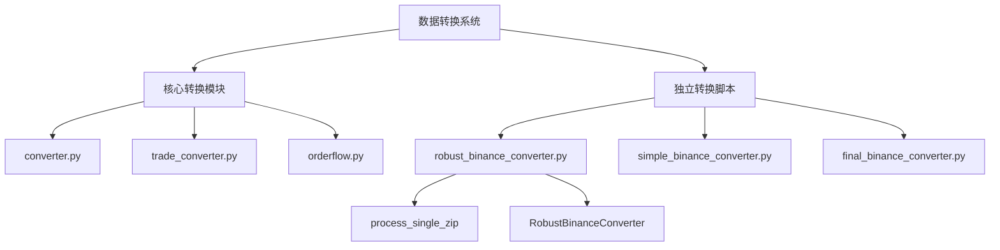
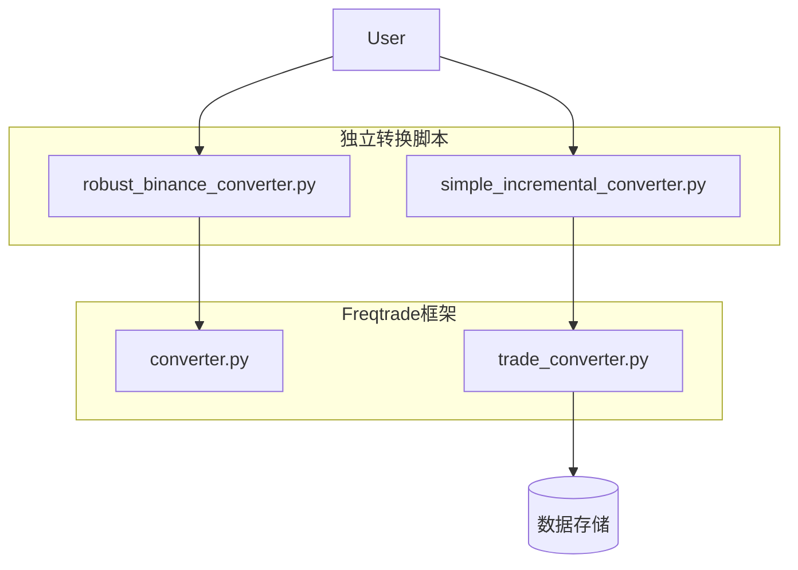
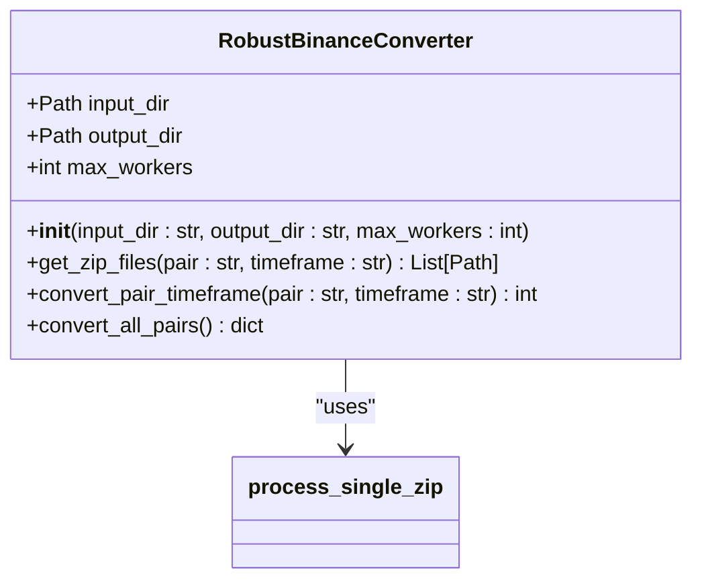
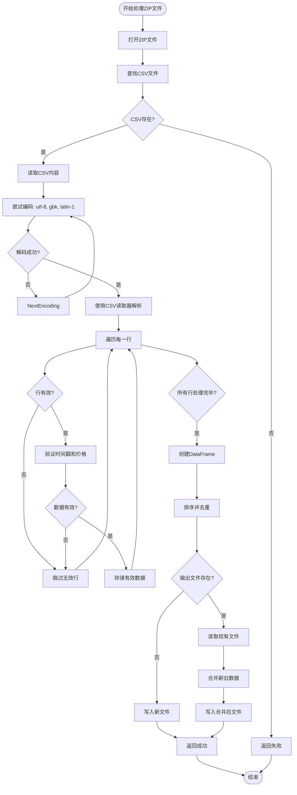
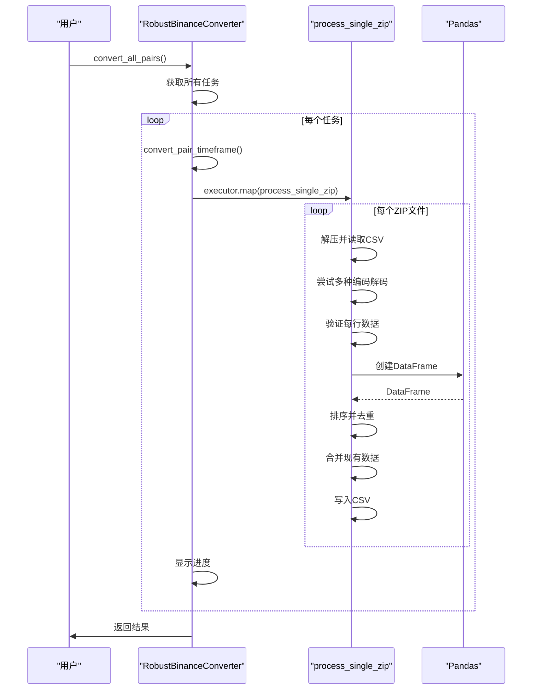
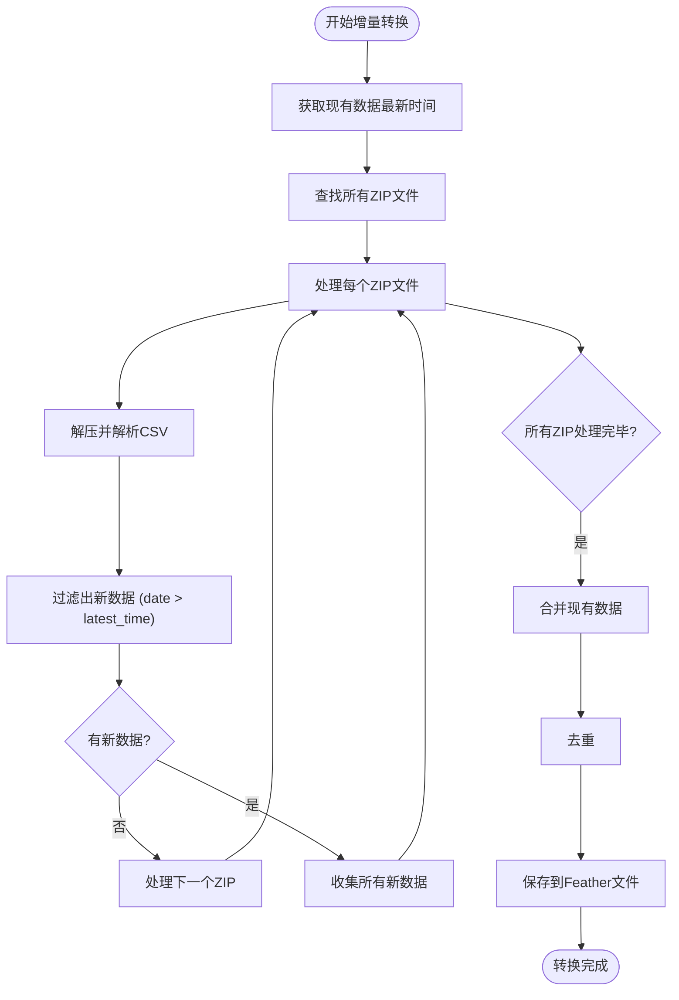
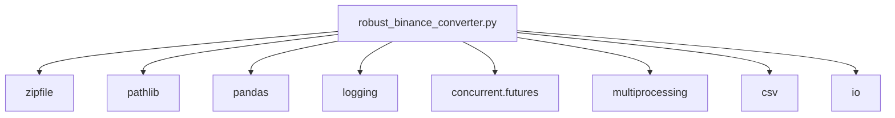

# 数据转换与预处理

<cite>
**Referenced Files in This Document**   
- [robust_binance_converter.py](file://robust_binance_converter.py)
- [freqtrade/data/converter/converter.py](file://freqtrade/data/converter/converter.py)
- [freqtrade/data/converter/trade_converter.py](file://freqtrade/data/converter/trade_converter.py)
- [yccai/binance_data_downloader/转化成frequent/simple_incremental_converter.py](file://yccai/binance_data_downloader/转化成frequent/simple_incremental_converter.py)
</cite>

## 目录
1. [简介](#简介)
2. [项目结构](#项目结构)
3. [核心组件](#核心组件)
4. [架构概述](#架构概述)
5. [详细组件分析](#详细组件分析)
6. [依赖分析](#依赖分析)
7. [性能考虑](#性能考虑)
8. [故障排除指南](#故障排除指南)
9. [结论](#结论)

## 简介
本文档系统化地记录了从原始交易所数据到Freqtrade标准格式的转换流程。重点分析了robust_binance_converter.py中的容错机制和并行处理架构，以及其在大规模数据迁移中的稳定性保障。文档详细解释了时间帧聚合算法、数据清洗规则和增量更新逻辑，并提供了转换脚本的使用范例，包括命令行参数配置、批处理模式和进度监控，确保用户能够高效完成数据格式标准化。

## 项目结构
Freqtrade项目的数据转换功能主要分布在`freqtrade/data/converter`目录下，同时包含独立的健壮性转换脚本`robust_binance_converter.py`。该结构支持从原始交易数据（如币安CSV）到Freqtrade标准OHLCV格式的转换。

**Diagram sources**
- [robust_binance_converter.py](file://robust_binance_converter.py)
- [freqtrade/data/converter/converter.py](file://freqtrade/data/converter/converter.py)

**Section sources**
- [robust_binance_converter.py](file://robust_binance_converter.py)
- [freqtrade/data/converter](file://freqtrade/data/converter)

## 核心组件
robust_binance_converter.py是本系统的核心，它实现了从原始币安数据到Freqtrade标准格式的健壮转换。该脚本通过`RobustBinanceConverter`类和`process_single_zip`函数，提供了并行处理、多编码支持和数据验证等关键功能。

**Section sources**
- [robust_binance_converter.py](file://robust_binance_converter.py#L136-L240)

## 架构概述
系统采用模块化设计，`robust_binance_converter.py`作为独立的批量处理工具，而`freqtrade/data/converter`中的模块则为Freqtrade框架提供通用的数据转换服务。两者协同工作，确保数据的完整性和一致性。

**Diagram sources**
- [robust_binance_converter.py](file://robust_binance_converter.py)
- [yccai/binance_data_downloader/转化成frequent/simple_incremental_converter.py](file://yccai/binance_data_downloader/转化成frequent/simple_incremental_converter.py)
- [freqtrade/data/converter/converter.py](file://freqtrade/data/converter/converter.py)
- [freqtrade/data/converter/trade_converter.py](file://freqtrade/data/converter/trade_converter.py)

## 详细组件分析

### RobustBinanceConverter 分析
`RobustBinanceConverter`类是整个转换流程的核心控制器，负责管理输入输出目录、并行处理工作进程，并协调所有转换任务。

#### 类图

**Diagram sources**
- [robust_binance_converter.py](file://robust_binance_converter.py#L136-L240)

**Section sources**
- [robust_binance_converter.py](file://robust_binance_converter.py#L136-L240)

### process_single_zip 函数分析
`process_single_zip`函数是数据处理的原子单元，负责解压单个ZIP文件、解析CSV内容、清洗数据并写入最终结果。它体现了系统的核心容错机制。

#### 流程图

**Diagram sources**
- [robust_binance_converter.py](file://robust_binance_converter.py#L24-L134)

**Section sources**
- [robust_binance_converter.py](file://robust_binance_converter.py#L24-L134)

### 时间帧聚合与数据清洗
虽然`robust_binance_converter.py`直接处理OHLCV数据，但Freqtrade框架中的`trades_to_ohlcv`函数展示了标准的时间帧聚合算法。数据清洗规则在多个组件中均有体现。

#### 序列图

**Diagram sources**
- [robust_binance_converter.py](file://robust_binance_converter.py)
- [freqtrade/data/converter/trade_converter.py](file://freqtrade/data/converter/trade_converter.py#L79-L107)

**Section sources**
- [robust_binance_converter.py](file://robust_binance_converter.py)
- [freqtrade/data/converter/trade_converter.py](file://freqtrade/data/converter/trade_converter.py#L79-L107)

### 增量更新逻辑
`simple_incremental_converter.py`实现了一种更高级的增量更新策略，通过比较时间戳来避免重复处理已存在的数据。

#### 流程图

**Diagram sources**
- [yccai/binance_data_downloader/转化成frequent/simple_incremental_converter.py](file://yccai/binance_data_downloader/转化成frequent/simple_incremental_converter.py)

**Section sources**
- [yccai/binance_data_downloader/转化成frequent/simple_incremental_converter.py](file://yccai/binance_data_downloader/转化成frequent/simple_incremental_converter.py)

## 依赖分析
系统依赖于Python标准库（如`zipfile`, `pathlib`）和第三方库（如`pandas`, `numpy`）。`robust_binance_converter.py`独立于Freqtrade主框架，但其输出格式与`freqtrade/data/converter`模块兼容。

**Diagram sources**
- [robust_binance_converter.py](file://robust_binance_converter.py)

**Section sources**
- [robust_binance_converter.py](file://robust_binance_converter.py)

## 性能考虑
`RobustBinanceConverter`通过并行处理显著提升了转换速度。它使用`ProcessPoolExecutor`和`max_workers`参数来控制并发度，同时采用分批处理策略（`batch_size = 100`）以避免内存占用过高。系统会自动检测CPU核心数，但限制最多使用6个进程，以平衡性能和系统资源占用。

## 故障排除指南
常见问题包括编码错误、数据格式不匹配和文件路径问题。`robust_binance_converter.py`通过尝试多种编码（utf-8, gbk, latin-1）来解决编码问题，并通过严格的数据验证规则过滤无效数据行。使用`--dry-run`参数可以预览转换过程而不实际修改文件。

**Section sources**
- [robust_binance_converter.py](file://robust_binance_converter.py#L245-L274)

## 结论
robust_binance_converter.py提供了一个健壮、高效的数据转换解决方案，特别适用于大规模的历史数据迁移。其并行处理架构和多重容错机制确保了在复杂生产环境中的稳定性。结合`simple_incremental_converter.py`的增量更新逻辑，用户可以构建一个完整的、可持续的数据预处理管道，为Freqtrade策略回测和交易提供高质量的数据支持。