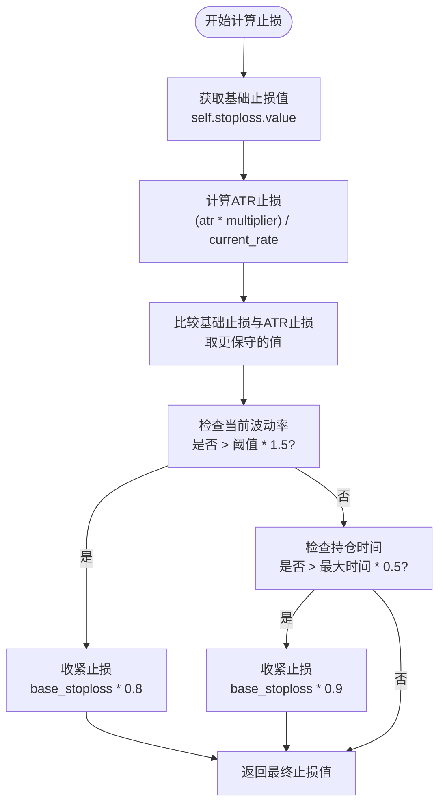
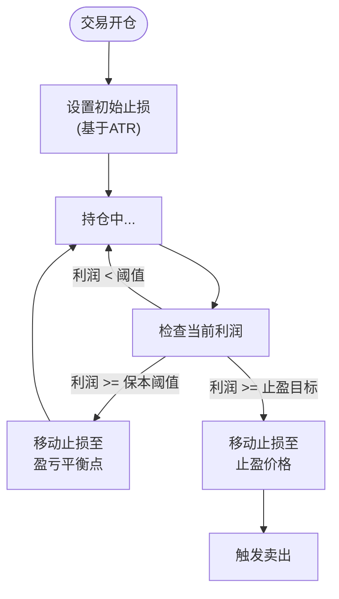

# 动态风险管理

<cite>
**Referenced Files in This Document**   
- [interface.py](file://freqtrade/strategy/interface.py)
- [FixedRiskRewardLoss.py](file://user_data/strategies/FixedRiskRewardLoss.py)
- [SmoothScalp.py](file://user_data/strategies/SmoothScalp.py)
- [SmoothScalp.py](file://yccai/bo_tou_pi/SmoothScalp.py)
</cite>

## 目录
1. [简介](#简介)
2. [核心回调方法概述](#核心回调方法概述)
3. [custom_stoploss 动态止损](#custom_stoploss-动态止损)
4. [custom_roi 动态止盈](#custom_roi-动态止盈)
5. [adjust_trade_position 仓位调整](#adjust_trade_position-仓位调整)
6. [策略参数化与优化](#策略参数化与优化)
7. [结论](#结论)

## 简介

动态风险管理是量化交易策略中至关重要的组成部分，它允许交易者根据市场条件和持仓状态实时调整风险敞口。在Freqtrade框架中，通过`custom_stoploss`、`custom_roi`和`adjust_trade_position`等关键回调方法，实现了高度灵活和自适应的风险控制体系。这些方法超越了静态的止损止盈设置，使策略能够根据波动率、持仓时间、利润水平等动态因素进行智能决策，从而在保护资本的同时最大化收益潜力。

## 核心回调方法概述

Freqtrade框架提供了三个核心的回调方法来实现动态风险管理：

- **`custom_stoploss`**: 用于实现基于市场条件和持仓盈利的动态止损逻辑，可以根据ATR、波动率、持仓时间等因素调整止损位。
- **`custom_roi`**: 用于实现基于持仓时间或市场状态的动态止盈策略，可以替代或补充静态的`minimal_roi`。
- **`adjust_trade_position`**: 用于在交易进行中调整仓位大小，支持金字塔加仓或分批止盈等高级策略。

这些方法的共同特点是它们都是在策略类中被重写（override）的，由框架在特定时机自动调用，并且其逻辑可以完全参数化，以便进行超参数优化。

## custom_stoploss 动态止损

`custom_stoploss`方法是实现动态止损的核心。它在每次K线更新时被调用，允许策略根据最新的市场数据和持仓信息计算出新的止损价格。

### 方法签名与参数

```python
def custom_stoploss(
    self,
    pair: str,
    trade: Trade,
    current_time: datetime,
    current_rate: float,
    current_profit: float,
    after_fill: bool,
    **kwargs,
) -> float | None:
```

- `pair`: 当前分析的交易对。
- `trade`: 交易对象，包含开仓价格、时间等信息。
- `current_time`: 当前时间。
- `current_rate`: 当前价格。
- `current_profit`: 当前利润比率。
- `after_fill`: 一个布尔值，指示此回调是在订单成交后调用的。此参数可用于实现更精细的风险控制逻辑，例如在成交后立即设置一个更紧的止损。

### 实现逻辑与示例

`custom_stoploss`的返回值是一个相对于当前价格的负比率。例如，返回`-0.05`表示止损位设置在当前价格下方5%。

**示例1：基于ATR和波动率的动态止损**

在`SmoothScalp`策略中，`custom_stoploss`方法结合了多种因素：
1.  **基础止损**: 使用策略参数`self.stoploss.value`作为基础。
2.  **ATR调整**: 计算基于ATR（平均真实波幅）的止损位，并与基础止损比较，取更保守（更接近当前价格）的值。
3.  **波动率调整**: 当市场波动率超过阈值时，收紧止损（乘以0.8）。
4.  **时间调整**: 当持仓时间过长时，收紧止损以保护利润。



**Diagram sources**
- [SmoothScalp.py](file://user_data/strategies/SmoothScalp.py#L305-L336)

**示例2：基于风险回报比的多阶段止损**

在`FixedRiskRewardLoss`策略中，`custom_stoploss`实现了一个复杂的多阶段止损逻辑：
1.  **初始止损**: 在开仓时，使用ATR计算一个动态的初始止损价，这定义了这笔交易的“风险单位”。
2.  **保本止损**: 当利润达到预设的“风险单位”倍数时，将止损位移动到开仓价（盈亏平衡点），确保交易不会亏损。
3.  **止盈止损**: 当利润达到预设的止盈目标时，将止损位上移到止盈价格，从而锁定利润。

这种逻辑强制执行了固定的风险回报比，是系统化交易纪律性的体现。



**Diagram sources**
- [FixedRiskRewardLoss.py](file://user_data/strategies/FixedRiskRewardLoss.py#L73-L127)

**Section sources**
- [interface.py](file://freqtrade/strategy/interface.py#L440-L469)
- [FixedRiskRewardLoss.py](file://user_data/strategies/FixedRiskRewardLoss.py#L73-L127)
- [SmoothScalp.py](file://user_data/strategies/SmoothScalp.py#L305-L336)

## custom_roi 动态止盈

`custom_roi`方法允许策略实现动态的止盈目标，其优先级高于静态的`minimal_roi`。当`custom_roi`返回一个值时，如果利润达到该值，就会触发卖出。

### 方法签名与参数

```python
def custom_roi(
    self,
    pair: str,
    trade: Trade,
    current_time: datetime,
    trade_duration: int,
    entry_tag: str | None,
    side: str,
    **kwargs,
) -> float | None:
```

- `trade_duration`: 当前交易的持续时间（分钟），这是实现时间依赖性止盈的关键参数。

### 实现逻辑与示例

`custom_roi`的返回值是一个正的利润比率。例如，返回`0.05`表示当利润达到5%时触发卖出。

虽然提供的代码示例中没有直接展示`custom_roi`的实现，但其典型应用场景包括：
- **时间衰减止盈**: 随着持仓时间的增加，逐步降低止盈目标，以适应市场可能的反转。
- **趋势强度止盈**: 当趋势强度指标（如ADX）减弱时，降低止盈目标，锁定部分利润。
- **波动率自适应止盈**: 在高波动市场中设置更高的止盈目标，在低波动市场中设置更低的目标。

其逻辑与`custom_stoploss`类似，但关注的是利润的“上限”而非“下限”。

**Section sources**
- [interface.py](file://freqtrade/strategy/interface.py#L471-L498)

## adjust_trade_position 仓位调整

`adjust_trade_position`方法用于在交易进行中动态调整仓位大小，支持更复杂的交易策略，如金字塔加仓或分批止盈。

### 方法签名与参数

```python
def adjust_trade_position(
    self,
    trade: Trade,
    current_time: datetime,
    current_rate: float,
    current_profit: float,
    min_stake: float | None,
    max_stake: float,
    current_entry_rate: float,
    current_exit_rate: float,
    current_entry_profit: float,
    current_exit_profit: float,
    **kwargs,
) -> float | None | tuple[float | None, str | None]:
```

- `min_stake`, `max_stake`: 允许的最小和最大投注金额。
- `current_entry_rate`, `current_exit_rate`: 使用入口和出口定价计算的当前价格。

### 实现逻辑与示例

该方法的返回值决定了仓位调整的方向和大小：
- **正数**: 增加仓位（加仓）。
- **负数**: 减少仓位（减仓）。
- **None**: 不进行任何调整。
- **元组**: 可以返回一个包含调整金额和订单理由的元组。

**示例：亏损加仓策略**

在`strategy_test_v3`测试策略中，展示了`adjust_trade_position`的基本用法：
- 当当前利润低于-0.75%时，返回第一笔开仓订单的投注金额，进行加仓。
- 这是一种典型的“摊平成本”策略，通过在亏损时加仓来降低平均成本。

```python
def adjust_trade_position(...):
    if current_profit < -0.0075:
        orders = trade.select_filled_orders(trade.entry_side)
        return round(orders[0].stake_amount, 0)
    return None
```

更高级的应用可以结合技术指标，例如在趋势确认后进行金字塔加仓，或在达到特定利润目标时分批止盈。

**Section sources**
- [interface.py](file://freqtrade/strategy/interface.py#L648-L689)
- [strategy_test_v3.py](file://tests/strategy/strats/strategy_test_v3.py#L185-L203)

## 策略参数化与优化

动态风险管理的强大之处在于其与策略参数化的紧密结合。通过使用`RealParameter`和`IntParameter`等超参数优化工具，可以将风险管理规则也设计为可配置和可优化的组件。

### 参数化示例

在`FixedRiskRewardLoss`和`SmoothScalp`策略中，关键的风险管理参数都被定义为可优化的超参数：
- `risk_reward_ratio`: 风险回报比，可在1.0到5.0之间优化。
- `set_to_break_even_at_profit`: 触发保本止损的利润阈值。
- `stoploss`: 基础止损值。
- `volatility_threshold`: 波动率阈值，用于动态调整止损和仓位。

### 优化流程

1.  **定义参数空间**: 在策略类中使用`RealParameter`或`IntParameter`定义参数的名称、范围和默认值。
2.  **集成到逻辑中**: 在`custom_stoploss`、`custom_roi`等方法中，通过`self.parameter_name.value`来引用这些参数。
3.  **运行超参数优化**: 使用Freqtrade的`hyperopt`命令，框架会自动搜索最优的参数组合，不仅优化入场信号，也优化风险管理规则。

这种将风险管理规则参数化的方法，使得策略能够找到在特定市场条件下最优的风险控制方案，从而构建一个全面的自适应风险控制体系。

**Section sources**
- [FixedRiskRewardLoss.py](file://user_data/strategies/FixedRiskRewardLoss.py#L56-L71)
- [SmoothScalp.py](file://user_data/strategies/SmoothScalp.py#L13-L413)

## 结论

本文档详细介绍了Freqtrade框架中动态风险管理功能的实现。通过`custom_stoploss`、`custom_roi`和`adjust_trade_position`这三个核心回调方法，策略可以实现高度智能和自适应的风险控制。`custom_stoploss`能够根据ATR、波动率和持仓时间动态调整止损位，`custom_roi`可以实现基于时间或市场状态的动态止盈，而`adjust_trade_position`则支持金字塔加仓和分批止盈等复杂策略。最重要的是，这些风险管理规则都可以通过超参数优化进行自动化调优，使得整个策略体系能够适应不断变化的市场环境，实现全面的自适应风险控制。