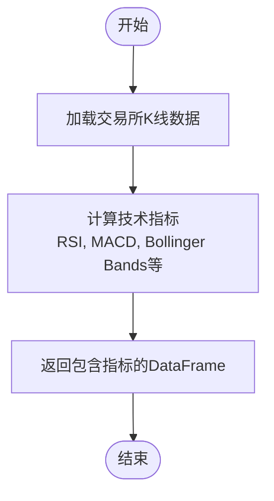

# 基础策略开发

<cite>
**本文档中引用的文件**   
- [IStrategy.py](file://freqtrade/strategy/interface.py)
- [sample_strategy.py](file://freqtrade/templates/sample_strategy.py)
- [parameters.py](file://freqtrade/strategy/parameters.py)
</cite>

## 目录
1. [策略类基本结构](#策略类基本结构)
2. [核心参数配置](#核心参数配置)
3. [核心方法实现](#核心方法实现)
4. [策略元数据与交易对管理](#策略元数据与交易对管理)
5. [基础风险管理](#基础风险管理)
6. [均线交叉策略示例](#均线交叉策略示例)
7. [回测验证](#回测验证)

## 策略类基本结构

Freqtrade框架中的所有交易策略都必须继承自`IStrategy`接口。该接口定义了策略类必须遵循的强制性结构，确保了策略与框架核心组件的兼容性。一个策略类本质上是一个Python类，它通过实现特定的方法和定义特定的属性来定义交易逻辑。

策略类的核心结构包括：
- **继承关系**：策略类必须继承自`IStrategy`基类。
- **必需方法**：必须实现`populate_indicators`、`populate_entry_trend`和`populate_exit_trend`这三个核心方法。
- **配置属性**：通过类级别的属性来配置策略的行为，如时间框架、止盈止损等。

**Section sources**
- [IStrategy.py](file://freqtrade/strategy/interface.py#L50-L1882)

## 核心参数配置

策略的行为由一系列类级别的属性进行配置。这些参数在策略实例化时被读取，并用于指导交易决策。

### timeframe
`timeframe`参数定义了策略所使用的K线时间周期，例如`"5m"`表示5分钟K线。这是策略分析市场数据的基础，所有技术指标的计算和交易信号的生成都基于此时间框架。选择合适的时间框架是策略设计的关键，它直接影响策略的交易频率和对市场噪音的敏感度。

### minimal_roi
`minimal_roi`（最小投资回报率）是一个字典，用于定义基于持仓时间的动态止盈目标。字典的键表示持仓时间（以分钟为单位），值表示在此时间点后应达到的收益率。例如，`{"60": 0.01, "30": 0.02, "0": 0.04}`表示：持仓60分钟后，收益率达到1%即可卖出；持仓30分钟后，目标为2%；一旦开仓，目标即为4%。这是一个逐步收紧的止盈机制。

### stoploss
`stoploss`参数定义了策略的硬性止损水平，以负数比率表示。例如，`stoploss = -0.10`表示当单笔交易的亏损达到10%时，将强制平仓以限制损失。这是一个重要的风险管理工具，防止单笔交易造成过大亏损。

### process_only_new_candles
`process_only_new_candles`是一个布尔值，用于优化性能。当设置为`True`时，`populate_indicators`方法仅在新的K线完全形成后才执行一次。这避免了在K线未完成时重复计算指标，从而节省了计算资源。对于大多数策略，建议将此参数设为`True`。

**Section sources**
- [sample_strategy.py](file://freqtrade/templates/sample_strategy.py#L39-L425)

## 核心方法实现

策略的交易逻辑通过三个核心方法来实现，这些方法接收包含市场数据的DataFrame，并返回添加了信号的DataFrame。

### populate_indicators
此方法负责计算和添加所有必要的技术指标。它接收一个包含OHLCV（开盘价、最高价、最低价、收盘价、成交量）数据的DataFrame和一个包含当前交易对等信息的元数据字典。开发者在此方法中调用TA-Lib或qtpylib等库来计算指标，如RSI、MACD、布林带等，并将结果作为新列添加到DataFrame中。



**Diagram sources**
- [sample_strategy.py](file://freqtrade/templates/sample_strategy.py#L140-L320)

### populate_entry_trend
此方法基于`populate_indicators`中计算出的指标来生成入场（买入）信号。它通过在DataFrame中创建一个名为`enter_long`的列来实现，当条件满足时，该列的值被设为1。例如，一个简单的均线交叉策略可能在短期均线上穿长期均线时生成信号。

### populate_exit_trend
此方法与`populate_entry_trend`类似，但用于生成退场（卖出）信号。它通过创建一个名为`exit_long`的列来标记卖出时机。退场信号可以基于多种条件，如利润达到`minimal_roi`、触发止损，或技术指标发出卖出信号。

**Section sources**
- [sample_strategy.py](file://freqtrade/templates/sample_strategy.py#L322-L425)

## 策略元数据与交易对管理

### informative_pairs
`informative_pairs`方法允许策略定义额外的、信息性的K线组合。这些组合通常使用不同的时间框架（如15分钟或1小时）或不同的交易对，为策略提供更宏观的市场视角。例如，一个基于5分钟K线的策略可以使用1小时K线来判断主要趋势方向。

### startup_candle_count
`startup_candle_count`参数指定了策略在产生有效信号前需要的最少K线数量。这是因为许多技术指标（如移动平均线）需要一定数量的历史数据才能被正确计算。如果历史数据不足，指标值可能不准确。

**Section sources**
- [sample_strategy.py](file://freqtrade/templates/sample_strategy.py#L125-L138)

## 基础风险管理

除了`stoploss`和`minimal_roi`之外，策略还可以通过其他参数进行风险管理。

### trailing_stop
`trailing_stop`（追踪止损）是一种动态止损机制。当`trailing_stop = True`时，止损线会随着价格的有利变动而移动。例如，`trailing_stop_positive = 0.01`表示当利润达到1%后，止损线将被设置在最高价的1%以下，并随着价格的上涨而不断上移，从而锁定利润。

### order_types
`order_types`字典允许策略指定不同订单的类型。例如，可以将入场订单设为`"limit"`（限价单），将止损单设为`"market"`（市价单），以确保在市场剧烈波动时止损单能够快速成交。

**Section sources**
- [sample_strategy.py](file://freqtrade/templates/sample_strategy.py#L95-L119)

## 均线交叉策略示例

以下是一个从零开始构建的简单均线交叉策略的完整示例：

```python
class SimpleMAcross(IStrategy):
    INTERFACE_VERSION = 3
    timeframe = "5m"
    stoploss = -0.10
    minimal_roi = {"0": 0.05}
    process_only_new_candles = True

    # 可优化的超参数
    short_period = IntParameter(5, 15, default=9, space='buy')
    long_period = IntParameter(20, 50, default=21, space='buy')

    def populate_indicators(self, dataframe: DataFrame, metadata: dict) -> DataFrame:
        dataframe['ma_short'] = ta.SMA(dataframe, timeperiod=self.short_period.value)
        dataframe['ma_long'] = ta.SMA(dataframe, timeperiod=self.long_period.value)
        return dataframe

    def populate_entry_trend(self, dataframe: DataFrame, metadata: dict) -> DataFrame:
        dataframe.loc[
            (qtpylib.crossed_above(dataframe['ma_short'], dataframe['ma_long'])),
            'enter_long'
        ] = 1
        return dataframe

    def populate_exit_trend(self, dataframe: DataFrame, metadata: dict) -> DataFrame:
        dataframe.loc[
            (qtpylib.crossed_below(dataframe['ma_short'], dataframe['ma_long'])),
            'exit_long'
        ] = 1
        return dataframe
```

该策略在短期均线上穿长期均线时买入，在短期均线下穿长期均线时卖出。

**Section sources**
- [sample_strategy.py](file://freqtrade/templates/sample_strategy.py#L39-L425)

## 回测验证

在开发完策略后，必须在历史数据上进行回测以验证其有效性。使用Freqtrade的`backtesting`命令，可以加载历史K线数据并模拟策略的交易行为。回测结果将提供关键的性能指标，如总收益率、最大回撤、胜率等，帮助开发者评估策略的盈利能力和风险水平。只有经过充分回测并证明有效的策略，才应考虑用于实盘交易。

**Section sources**
- [IStrategy.py](file://freqtrade/strategy/interface.py#L50-L1882)