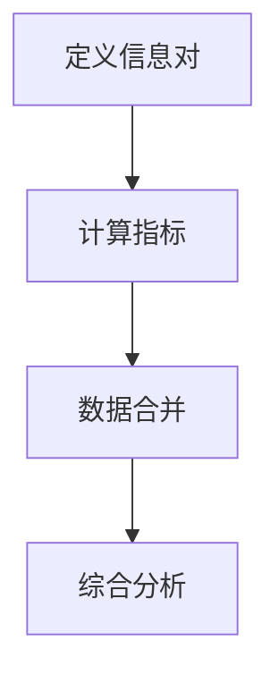
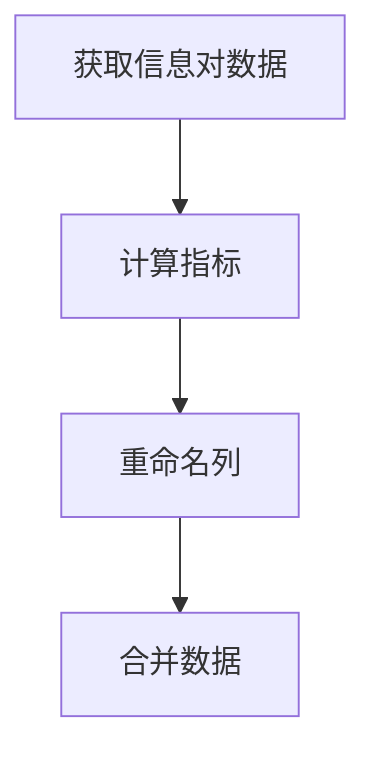

# 多时间框架分析

<cite>
**本文档引用的文件**
- [informative_decorator.py](file://freqtrade/strategy/informative_decorator.py)
- [strategy_helper.py](file://freqtrade/strategy/strategy_helper.py)
- [interface.py](file://freqtrade/strategy/interface.py)
- [InformativeSample.py](file://user_data/strategies/InformativeSample.py)
- [multi_tf.py](file://user_data/strategies/multi_tf.py)
</cite>

## 目录
1. [简介](#简介)
2. [核心机制](#核心机制)
3. [装饰器参数详解](#装饰器参数详解)
4. [数据融合逻辑](#数据融合逻辑)
5. [策略中的实现](#策略中的实现)
6. [性能优化建议](#性能优化建议)
7. [结论](#结论)

## 简介
多时间框架分析是量化交易策略中的一项关键技术，它允许交易者在不同时间尺度上观察和分析市场行为。通过结合多个时间框架的数据，可以更全面地理解市场趋势，从而做出更明智的交易决策。本文档将深入解析 `@informative` 装饰器的实现机制，并探讨如何在策略中有效利用这一功能。

**Section sources**
- [informative_decorator.py](file://freqtrade/strategy/informative_decorator.py#L1-L20)

## 核心机制
`@informative` 装饰器是实现多时间框架分析的核心工具。它允许用户定义额外的时间框架和资产组合，以获取更丰富的市场信息。该装饰器通过以下步骤工作：
1. **定义信息对**：指定需要额外获取的交易对及其时间周期。
2. **计算指标**：在指定的信息对上计算技术指标。
3. **数据合并**：将计算出的指标与主数据流合并，以便进行综合分析。



**Diagram sources**
- [informative_decorator.py](file://freqtrade/strategy/informative_decorator.py#L23-L73)
- [strategy_helper.py](file://freqtrade/strategy/strategy_helper.py#L5-L100)

**Section sources**
- [informative_decorator.py](file://freqtrade/strategy/informative_decorator.py#L23-L73)
- [strategy_helper.py](file://freqtrade/strategy/strategy_helper.py#L5-L100)

## 装饰器参数详解
`@informative` 装饰器接受多个参数，用于配置信息对的获取和处理方式。以下是各参数的详细说明：

### timeframe
- **描述**：指定信息对的时间框架。
- **要求**：必须等于或高于策略的时间框架。

### asset
- **描述**：指定信息对的资产，例如 BTC、BTC/USDT 或 ETH/BTC。
- **默认值**：不指定时使用当前交易对。

### fmt
- **描述**：列格式（字符串）或列格式化器（可调用函数）。
- **默认值**：未指定时，默认格式为 `{base}_{quote}_{column}_{timeframe}`（当指定了资产时）或 `{column}_{timeframe}`（当未指定资产时）。

### ffill
- **描述**：是否在合并信息对后进行前向填充。
- **默认值**：`True`

### candle_type
- **描述**：K线类型，可以是空字符串、mark、index、premiumIndex 或 funding_rate。
- **默认值**：空字符串

**Section sources**
- [informative_decorator.py](file://freqtrade/strategy/informative_decorator.py#L23-L73)

## 数据融合逻辑
数据融合是多时间框架分析的关键步骤。`_create_and_merge_informative_pair` 函数负责将不同时间框架的数据合并到主数据流中。该函数的主要逻辑如下：
1. **获取信息对数据**：从数据提供者（DataProvider）获取指定时间框架和资产的K线数据。
2. **计算指标**：在信息对数据上计算技术指标。
3. **重命名列**：根据指定的格式化规则重命名列名，确保列名的唯一性。
4. **合并数据**：使用 `merge_informative_pair` 函数将信息对数据与主数据流合并。



**Diagram sources**
- [informative_decorator.py](file://freqtrade/strategy/informative_decorator.py#L97-L170)
- [strategy_helper.py](file://freqtrade/strategy/strategy_helper.py#L5-L100)

**Section sources**
- [informative_decorator.py](file://freqtrade/strategy/informative_decorator.py#L97-L170)
- [strategy_helper.py](file://freqtrade/strategy/strategy_helper.py#L5-L100)

## 策略中的实现
在实际策略中，可以通过 `informative_pairs` 方法定义需要缓存的额外信息对。以下是一个示例策略，展示了如何使用 `@informative` 装饰器：

```python
class InformativeSample(IStrategy):
    def informative_pairs(self):
        return [(f"BTC/USDT", self.inf_timeframe.value)]

    def populate_indicators(self, dataframe: DataFrame, metadata: dict) -> DataFrame:
        if self.dp:
            inf_tf = self.inf_timeframe.value
            informative = self.dp.get_pair_dataframe(pair=f"BTC/USDT", timeframe=inf_tf)
            informative['sma20'] = informative['close'].rolling(self.inf_sma_period.value).mean()
            dataframe = merge_informative_pair(dataframe, informative, self.timeframe, inf_tf, ffill=True)
        return dataframe
```

**Section sources**
- [InformativeSample.py](file://user_data/strategies/InformativeSample.py#L101-L111)
- [multi_tf.py](file://user_data/strategies/multi_tf.py#L89-L108)

## 性能优化建议
为了提高多时间框架分析的性能，建议采取以下措施：
1. **合理选择信息性时间框架**：避免使用过多的时间框架，以免增加计算开销。
2. **避免过度使用多时间框架**：仅在必要时使用多时间框架，以减少数据处理的复杂性。
3. **处理不同交易所数据可用性差异**：确保所选交易所支持所需的时间框架和资产组合。

**Section sources**
- [informative_decorator.py](file://freqtrade/strategy/informative_decorator.py#L23-L73)
- [strategy_helper.py](file://freqtrade/strategy/strategy_helper.py#L5-L100)

## 结论
多时间框架分析是提升交易策略效果的重要手段。通过 `@informative` 装饰器，可以轻松实现跨时间框架的数据融合和分析。合理配置装饰器参数并优化性能，可以使策略更加稳健和高效。

**Section sources**
- [informative_decorator.py](file://freqtrade/strategy/informative_decorator.py#L1-L171)
- [strategy_helper.py](file://freqtrade/strategy/strategy_helper.py#L1-L171)
- [interface.py](file://freqtrade/strategy/interface.py#L1-L1884)
- [InformativeSample.py](file://user_data/strategies/InformativeSample.py#L1-L174)
- [multi_tf.py](file://user_data/strategies/multi_tf.py#L1-L16)