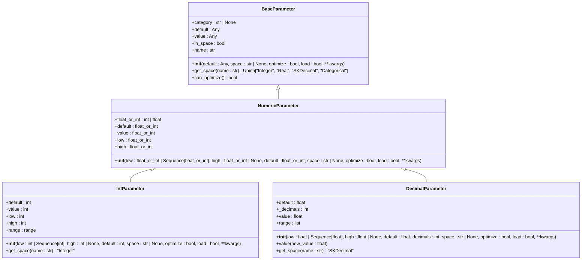
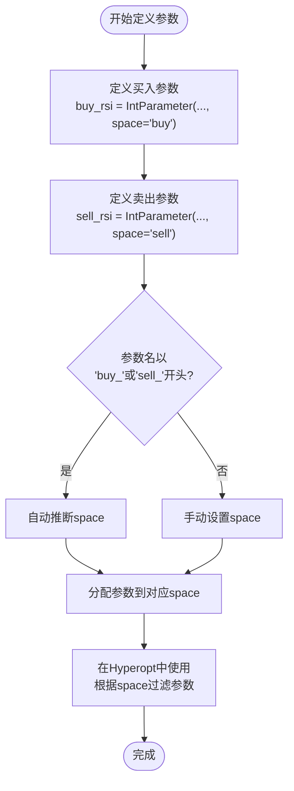
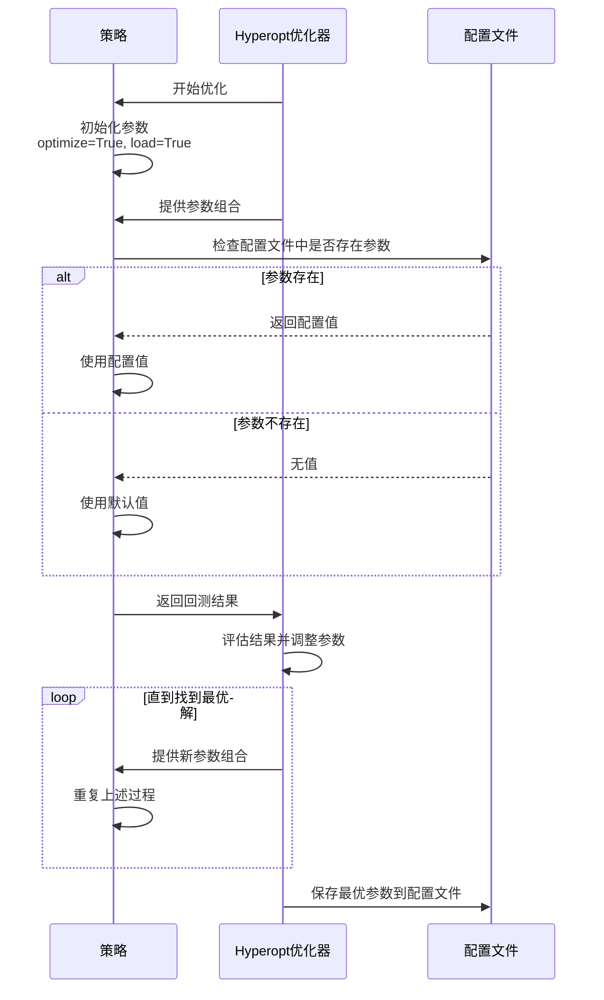
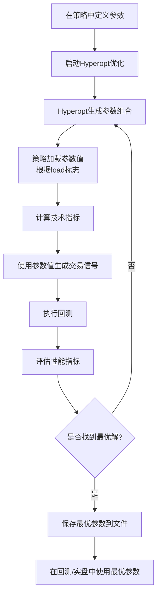

# 策略参数化设计

<cite>
**Referenced Files in This Document**   
- [parameters.py](file://freqtrade/strategy/parameters.py)
- [sample_strategy.py](file://freqtrade/templates/sample_strategy.py)
</cite>

## 目录
1. [引言](#引言)
2. [核心参数类型](#核心参数类型)
3. [参数空间划分](#参数空间划分)
4. [优化与加载标志](#优化与加载标志)
5. [参数定义与使用流程](#参数定义与使用流程)
6. [最佳实践建议](#最佳实践建议)
7. [结论](#结论)

## 引言

策略参数化设计是量化交易系统中的核心概念，它允许将策略中的固定阈值（如RSI超买超卖线）转换为可优化的超参数。通过这种设计，交易策略可以适应不同的市场条件，并通过Hyperopt等优化工具找到最优的参数组合。本文档将详细讲解基于`parameters.py`中定义的各种参数类型（如`BooleanParameter`、`IntParameter`、`DecimalParameter`等）实现策略参数化的方法，并通过`sample_strategy.py`中的`buy_rsi`和`sell_rsi`参数实例，演示参数定义、访问和在交易逻辑中使用的完整流程。

## 核心参数类型

在Freqtrade框架中，策略参数化依赖于`parameters.py`文件中定义的一系列参数类。这些类继承自`BaseParameter`，并提供了不同类型参数的封装。

### 数值型参数

`IntParameter`和`DecimalParameter`是用于定义数值型超参数的核心类。它们允许为策略中的阈值设置一个可优化的范围。

- **IntParameter**: 用于定义整数型参数。例如，在RSI策略中，可以将超买超卖线定义为一个整数范围，而不是固定的30和70。
- **DecimalParameter**: 用于定义浮点数型参数，特别适用于需要小数精度的场景，如止损比例或资金管理参数。

这些参数类在初始化时接受`low`和`high`作为优化空间的边界，并通过`default`指定默认值。`optimize`标志决定该参数是否参与超参数优化，而`load`标志则控制是否从配置文件中加载参数值。



**Diagram sources**
- [parameters.py](file://freqtrade/strategy/parameters.py#L34-L380)

**Section sources**
- [parameters.py](file://freqtrade/strategy/parameters.py#L34-L380)

### 布尔型与分类型参数

除了数值型参数，`BooleanParameter`和`CategoricalParameter`提供了对非数值型决策的支持。

- **BooleanParameter**: 是`CategoricalParameter`的一个特例，其优化空间被限定为`[True, False]`。它常用于开启或关闭某个策略组件，如是否启用追踪止损。
- **CategoricalParameter**: 允许定义一个离散的选项列表作为优化空间。例如，可以选择不同的技术指标（如MACD、RSI、CCI）作为信号源。

这些参数类型通过`categories`或`opt_range`属性定义其可能的取值范围，并在超参数优化过程中从这些离散值中选择最优解。

## 参数空间划分

参数的`space`属性是策略参数化设计中的一个重要概念，它用于将参数划分为不同的逻辑类别，最常见的是`buy`和`sell`空间。

### 空间定义与自动推断

`space`参数可以显式地指定为`'buy'`或`'sell'`，也可以通过参数名的前缀来自动推断。如果一个参数的名称以`buy_`开头，则其`space`会被自动设置为`'buy'`；同理，以`sell_`开头的参数则属于`'sell'`空间。

这种设计使得策略代码更加清晰，同时也便于超参数优化器（Hyperopt）根据不同的交易方向分别进行优化。例如，在`sample_strategy.py`中，`buy_rsi`和`sell_rsi`参数分别属于买入和卖出空间，Hyperopt可以独立地为这两个空间寻找最优参数。

### 空间的实际应用

在超参数优化过程中，`space`属性决定了参数是否会被包含在特定的优化任务中。通过配置文件中的`hyperopt`设置，用户可以选择只优化`buy`空间、`sell`空间，或两者都优化。这为策略的精细化调优提供了极大的灵活性。



**Diagram sources**
- [parameters.py](file://freqtrade/strategy/parameters.py#L34-L380)
- [sample_strategy.py](file://freqtrade/templates/sample_strategy.py#L95-L98)

**Section sources**
- [parameters.py](file://freqtrade/strategy/parameters.py#L34-L380)
- [sample_strategy.py](file://freqtrade/templates/sample_strategy.py#L95-L98)

## 优化与加载标志

`optimize`和`load`是两个关键的布尔标志，它们控制着参数在策略生命周期中的行为。

### optimize标志

`optimize`标志决定了该参数是否参与超参数优化过程。当`optimize=True`时，该参数的值将在Hyperopt运行期间被调整，以寻找最大化目标函数（如夏普比率）的最优解。如果设置为`False`，则该参数将被视为固定值，不会被优化器改变。

这个标志对于策略开发非常有用。在策略的早期阶段，开发者可能希望只优化一部分关键参数，而将其他参数保持固定，以减少搜索空间的复杂性。随着策略的成熟，可以逐步将更多参数的`optimize`标志设为`True`，进行更全面的优化。

### load标志

`load`标志控制着参数值的来源。当`load=True`时，策略会尝试从配置文件（如`buy_params`和`sell_params`字典）中加载该参数的值。如果配置文件中存在该参数，则使用配置文件中的值；否则，使用代码中定义的`default`值。

这个机制实现了策略代码与参数配置的分离。开发者可以在代码中定义参数的优化范围，而具体的最优值则由Hyperopt生成并保存在配置文件中。在实盘交易时，策略会自动加载这些经过优化的参数，而无需修改代码。



**Diagram sources**
- [parameters.py](file://freqtrade/strategy/parameters.py#L34-L380)
- [sample_strategy.py](file://freqtrade/templates/sample_strategy.py#L95-L98)

**Section sources**
- [parameters.py](file://freqtrade/strategy/parameters.py#L34-L380)
- [sample_strategy.py](file://freqtrade/templates/sample_strategy.py#L95-L98)

## 参数定义与使用流程

本节通过`sample_strategy.py`中的`buy_rsi`和`sell_rsi`参数实例，演示参数从定义到在交易逻辑中使用的完整流程。

### 参数定义

在策略类中，参数的定义通常位于类属性级别。以`buy_rsi`为例：

```python
buy_rsi = IntParameter(low=1, high=50, default=30, space="buy", optimize=True, load=True)
```

这行代码创建了一个名为`buy_rsi`的`IntParameter`实例，其优化空间为1到50，默认值为30，属于`buy`空间，并且参与优化和加载。

### 在交易逻辑中使用

定义后的参数可以在策略的`populate_entry_trend`和`populate_exit_trend`方法中通过`self.buy_rsi.value`来访问其当前值。例如：

```python
dataframe.loc[
    (qtpylib.crossed_above(dataframe["rsi"], self.buy_rsi.value)),
    "enter_long",
] = 1
```

在Hyperopt运行期间，`self.buy_rsi.value`的值会随着优化过程不断变化。而在回测或实盘交易时，它会加载配置文件中的最优值或使用默认值。

### 完整流程图



**Diagram sources**
- [parameters.py](file://freqtrade/strategy/parameters.py#L34-L380)
- [sample_strategy.py](file://freqtrade/templates/sample_strategy.py#L95-L98)

**Section sources**
- [parameters.py](file://freqtrade/strategy/parameters.py#L34-L380)
- [sample_strategy.py](file://freqtrade/templates/sample_strategy.py#L95-L98)

## 最佳实践建议

### 参数范围设置

设置合理的参数范围是避免过度拟合的关键。范围过宽会增加优化时间并可能导致找到不稳定的解；范围过窄则可能错过真正的最优值。

- **基于市场逻辑**: 参数范围应基于对市场的理解。例如，RSI的超买线通常在70-80之间，因此将`sell_rsi`的范围设为`[60, 80]`比`[1, 100]`更合理。
- **逐步细化**: 可以先使用较宽的范围进行初步优化，然后根据结果缩小范围进行更精细的搜索。

### 避免过度拟合

过度拟合是超参数优化中最常见的陷阱，即参数在历史数据上表现极佳，但在未来市场中失效。

- **使用足够长的回测周期**: 确保回测数据覆盖多种市场状况（牛市、熊市、震荡市）。
- **样本外测试**: 将数据分为训练集和测试集，只在训练集上进行优化，然后在测试集上验证性能。
- **限制参数数量**: 遵循“奥卡姆剃刀”原则，使用尽可能少的参数。过多的参数很容易导致过度拟合。

### 参数组合的协同优化

某些参数之间存在内在联系，应考虑协同优化。

- **相关参数一起优化**: 例如，移动平均线的长短周期参数应同时优化，而不是单独优化。
- **使用保护机制**: 结合使用`protection`空间的参数（如冷却期、最大回撤保护）来提高策略的鲁棒性。

## 结论

策略参数化设计是构建高效、适应性强的量化交易策略的基础。通过合理使用`IntParameter`、`DecimalParameter`等参数类型，结合`space`、`optimize`和`load`等机制，可以实现策略的灵活配置和自动化优化。遵循最佳实践，如合理设置参数范围、避免过度拟合和协同优化参数组合，能够显著提升策略的稳定性和盈利能力。最终，一个设计良好的参数化策略不仅能在历史数据上表现优异，更能适应不断变化的市场环境。