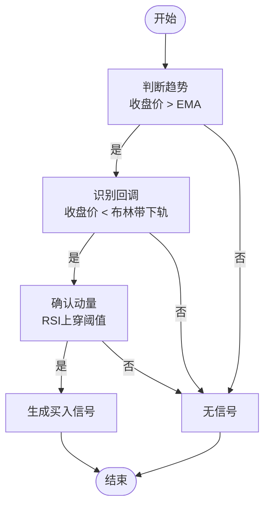
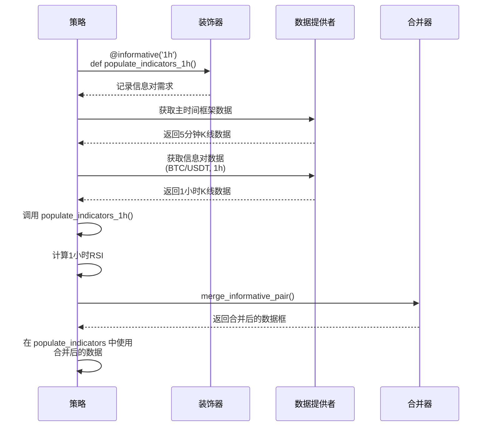
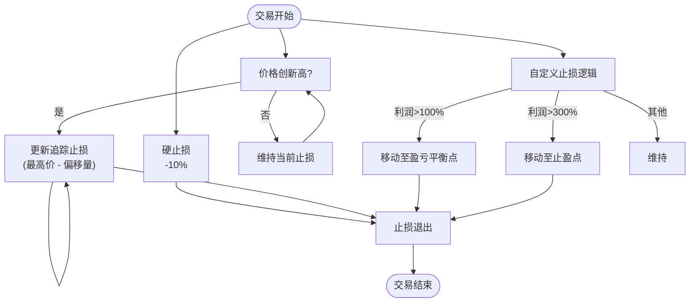
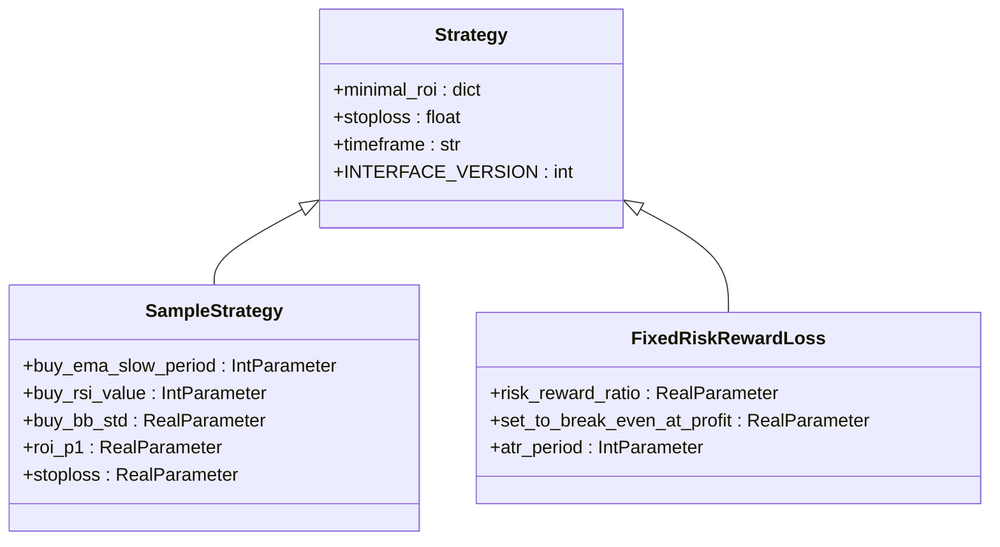

# 策略开发指南

<cite>
**本文档引用的文件**   
- [interface.py](file://freqtrade/strategy/interface.py)
- [informative_decorator.py](file://freqtrade/strategy/informative_decorator.py)
- [sample_strategy.py](file://freqtrade/templates/sample_strategy.py)
- [SampleStrategy.py](file://user_data/strategies/SampleStrategy.py)
- [multi_tf.py](file://user_data/strategies/multi_tf.py)
</cite>

## 目录
1. [策略接口与核心回调方法](#策略接口与核心回调方法)
2. [技术指标与进出场条件](#技术指标与进出场条件)
3. [多时间框架分析机制](#多时间框架分析机制)
4. [风险管理与止损止盈](#风险管理与止损止盈)
5. [参数化与超参数优化](#参数化与超参数优化)
6. [从简单到复杂的策略开发](#从简单到复杂的策略开发)
7. [回测与实盘部署](#回测与实盘部署)

## 策略接口与核心回调方法

`IStrategy` 接口是所有策略的基类，定义了策略必须实现的核心方法和属性。策略的执行流程由这些回调方法驱动，它们在不同的时机被调用。

`populate_indicators` 方法是策略的入口点，负责向数据框中添加所有必要的技术指标。该方法在每个新K线生成时被调用，其执行时机由 `process_only_new_candles` 属性控制。当此属性为 `True` 时，仅在新K线闭合后执行，以避免在K线形成过程中产生重复计算和潜在的未来数据泄露。

`populate_entry_trend` 和 `populate_exit_trend` 方法分别用于生成入场和出场信号。它们在 `populate_indicators` 之后被调用，并基于已计算的指标来判断交易信号。`populate_entry_trend` 方法会检查 `use_exit_signal` 配置，如果为 `False`，则即使有入场信号也不会执行买入操作。这两个方法的返回值是一个包含 `enter_long`、`exit_long` 等信号列的DataFrame。

**Section sources**
- [interface.py](file://freqtrade/strategy/interface.py#L227-L234)
- [interface.py](file://freqtrade/strategy/interface.py#L245-L252)
- [interface.py](file://freqtrade/strategy/interface.py#L264-L271)

## 技术指标与进出场条件

策略通过集成技术指标来定义进出场条件。`SampleStrategy` 示例展示了如何结合趋势、动量和波动率指标来构建一个稳健的交易逻辑。

该策略首先使用一条慢速EMA（如200周期）来判断市场的大趋势。只有当收盘价高于EMA时，才认为市场处于上升趋势，这是入场的前提条件。接着，策略利用布林带下轨来识别价格回调。当价格跌破布林带下轨时，表明市场可能出现了超卖。最后，通过RSI指标来确认动量。当RSI从低位上穿一个阈值（如30）时，确认下跌动能衰竭，上涨动能回归，从而触发买入信号。

**Diagram sources**
- [SampleStrategy.py](file://user_data/strategies/SampleStrategy.py#L181-L215)

**Section sources**
- [SampleStrategy.py](file://user_data/strategies/SampleStrategy.py#L154-L179)
- [SampleStrategy.py](file://user_data/strategies/SampleStrategy.py#L181-L215)

## 多时间框架分析机制

`informative_decorator.py` 模块实现了多时间框架分析的核心机制。通过 `@informative` 装饰器，策略可以轻松地从更高时间框架或不同交易对中获取数据，并将其合并到主数据框中。

装饰器的工作原理是收集所有被装饰的方法，并在策略初始化时，将这些方法所需的信息对（如 `BTC/USDT` 的1小时K线）添加到一个列表中。在 `populate_indicators` 执行前，系统会自动获取这些信息对的数据，并调用相应的装饰方法来计算指标。计算完成后，这些指标会通过 `merge_informative_pair` 函数合并到主数据框中，并根据指定的格式化规则重命名列名，以避免冲突。

例如，在 `multi_tf.py` 策略中，`@informative('1h', 'BTC/{stake}')` 装饰器会获取当前计价货币对（如 `BTC/USDT`）的1小时K线，并计算RSI指标。合并后，该指标的列名会根据格式化字符串（如 `'BTC_{column}_{timeframe}'`）变为 `BTC_rsi_1h`，从而清晰地标识其来源。

**Diagram sources**
- [informative_decorator.py](file://freqtrade/strategy/informative_decorator.py#L23-L73)
- [multi_tf.py](file://user_data/strategies/multi_tf.py#L80-L100)

**Section sources**
- [informative_decorator.py](file://freqtrade/strategy/informative_decorator.py#L0-L171)
- [multi_tf.py](file://user_data/strategies/multi_tf.py#L38-L180)

## 风险管理与止损止盈

策略通过多种机制来管理风险，包括硬止损、追踪止损和自定义止损。

硬止损由 `stoploss` 属性定义，是一个固定的百分比，代表了单笔交易的最大可接受亏损。追踪止损 (`trailing_stop`) 则更为动态，它会随着价格的有利变动而移动，以锁定利润。`trailing_stop_positive` 定义了触发追踪止损的盈利阈值，而 `trailing_stop_positive_offset` 定义了止损线与最高价之间的偏移量。

更高级的风险管理可以通过 `custom_stoploss` 方法实现。该方法允许策略根据交易的实时状态（如当前利润、持仓时间）动态计算止损价位。例如，`FixedRiskRewardLoss.py` 策略使用ATR指标计算初始风险，然后根据一个可优化的 `risk_reward_ratio` 来设置止盈目标。当价格达到目标时，止损位会被移动到该位置，从而将潜在利润转化为已实现利润。

**Diagram sources**
- [FixedRiskRewardLoss.py](file://user_data/strategies/FixedRiskRewardLoss.py#L45-L157)

**Section sources**
- [interface.py](file://freqtrade/strategy/interface.py#L440-L469)
- [FixedRiskRewardLoss.py](file://user_data/strategies/FixedRiskRewardLoss.py#L45-L157)

## 参数化与超参数优化

策略的参数化设计是实现超参数优化的基础。通过使用 `RealParameter`、`IntParameter` 等类，可以将策略中的常量（如EMA周期、RSI阈值）定义为可优化的参数。

在 `SampleStrategy` 中，`buy_ema_slow_period` 和 `buy_rsi_value` 等参数被标记为 `optimize=True`，这意味着它们会被超优化工具（如Hyperopt）纳入搜索空间。优化过程会尝试这些参数的不同组合，以找到在历史数据上表现最佳的配置。这极大地减少了手动调参的工作量，并有助于发现更稳健的策略参数。

**Diagram sources**
- [SampleStrategy.py](file://user_data/strategies/SampleStrategy.py#L51-L280)
- [FixedRiskRewardLoss.py](file://user_data/strategies/FixedRiskRewardLoss.py#L45-L157)

**Section sources**
- [SampleStrategy.py](file://user_data/strategies/SampleStrategy.py#L68-L128)
- [FixedRiskRewardLoss.py](file://user_data/strategies/FixedRiskRewardLoss.py#L45-L157)

## 从简单到复杂的策略开发

策略开发应遵循从简单到复杂的渐进式路径。最简单的策略，如 `DoesNothingStrategy`，可以作为学习模板，帮助理解策略的基本结构。

在此基础上，可以构建基于单一指标的均线交叉策略。例如，当短期EMA上穿长期EMA时买入，下穿时卖出。然后，可以逐步增加复杂性，引入多个指标的组合，如 `CombinedBinHAndCluc` 策略，它融合了两种不同的“抢反弹”逻辑，通过“或”条件来增加交易机会。

最终，可以开发出像 `multi_tf.py` 这样的复杂多因子模型，它整合了多个时间框架和多个交易对的指标，形成一个需要多重信号共振的交易系统。这种渐进式开发有助于隔离和测试每个组件，确保策略的每个部分都按预期工作。

**Section sources**
- [multi_tf.py](file://user_data/strategies/multi_tf.py#L38-L180)
- [CombinedBinHAndCluc.py](file://user_data/strategies/CombinedBinHAndCluc.py#L16-L125)

## 回测与实盘部署

策略在回测和实盘部署中存在关键差异。回测是在历史数据上模拟交易，用于评估策略的盈利能力和风险特征。而实盘部署则是在真实市场中执行交易，面临滑点、网络延迟和交易所API限制等现实挑战。

在回测中，策略可以访问完整的K线数据，包括收盘价，这可能导致“未来数据”问题。而在实盘中，策略只能基于当前不完整的K线数据做出决策。因此，`process_only_new_candles` 设置为 `True` 是至关重要的，它确保策略只在K线闭合后才进行交易，从而避免了未来数据的使用。

此外，实盘部署需要考虑订单执行的细节，如 `confirm_trade_entry` 和 `confirm_trade_exit` 回调函数，它们允许在订单发送前进行最终检查。同时，必须处理订单超时和部分成交等复杂情况，这在回测中通常被简化。

**Section sources**
- [interface.py](file://freqtrade/strategy/interface.py#L352-L386)
- [interface.py](file://freqtrade/strategy/interface.py#L388-L424)
- [interface.py](file://freqtrade/strategy/interface.py#L298-L319)