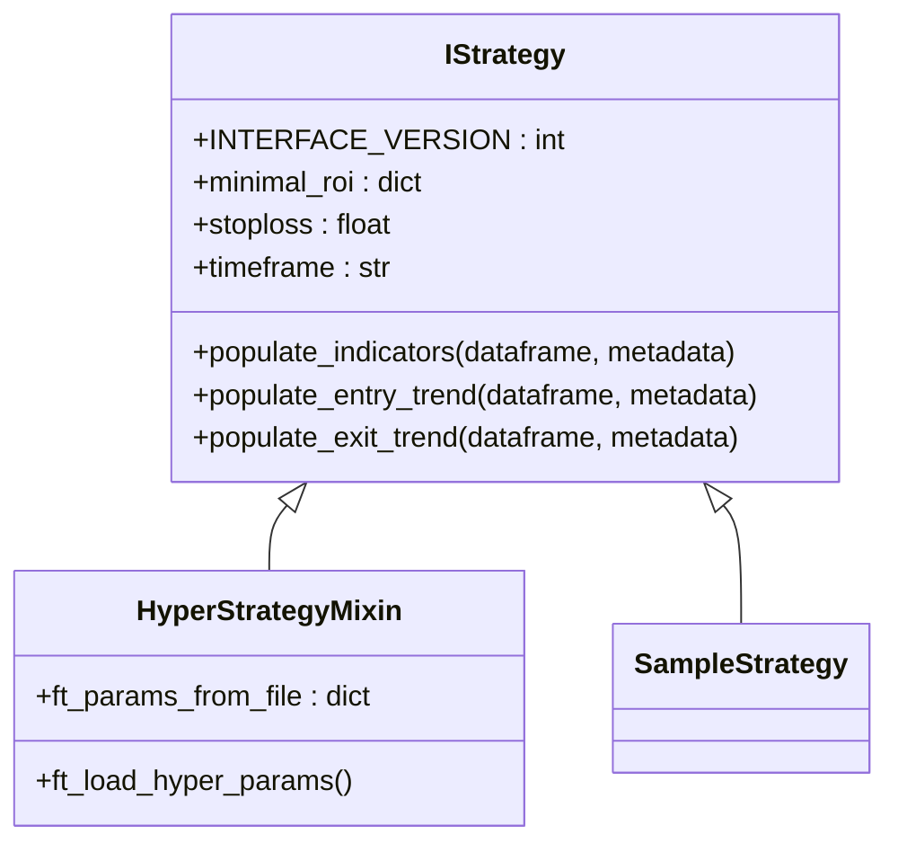
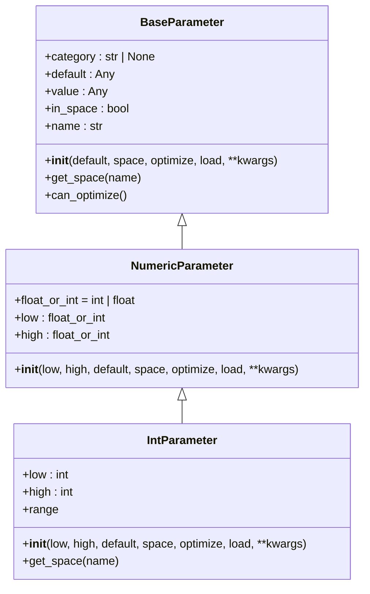
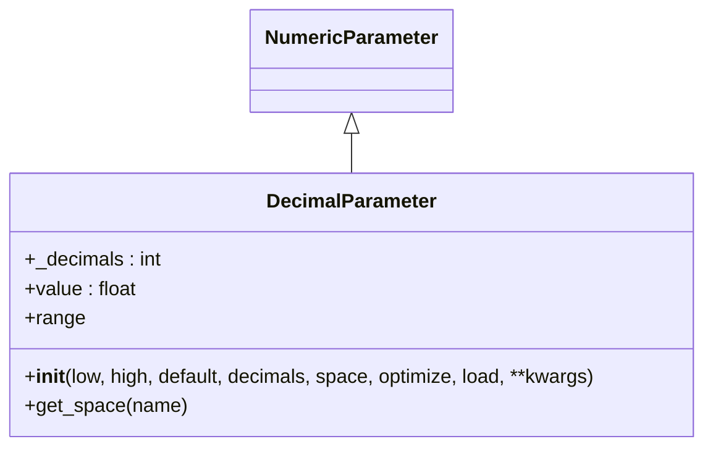
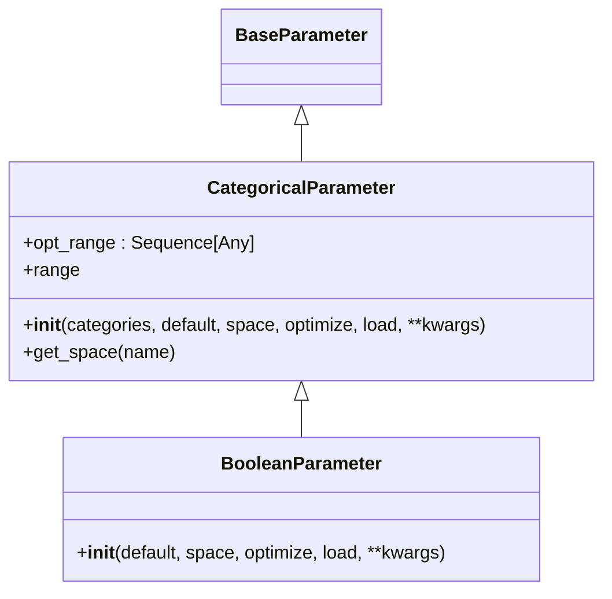
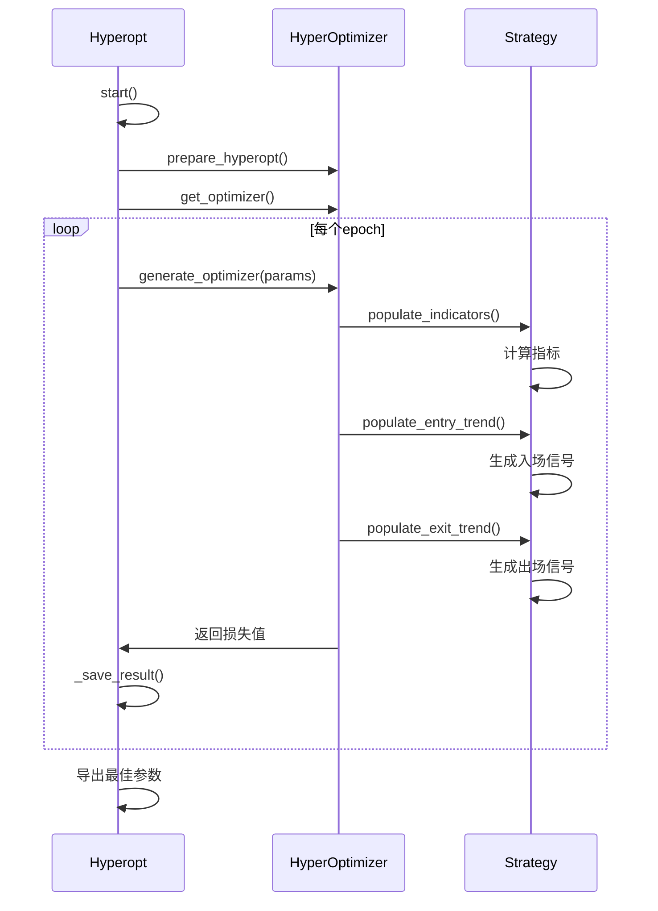

# 参数化策略设计

<cite>
**本文档中引用的文件**  
- [interface.py](file://freqtrade/strategy/interface.py)
- [parameters.py](file://freqtrade/strategy/parameters.py)
- [hyperopt.py](file://freqtrade/optimize/hyperopt/hyperopt.py)
- [sample_strategy.py](file://freqtrade/templates/sample_strategy.py)
- [test_strategy_parameters.py](file://tests/strategy/test_strategy_parameters.py)
</cite>

## 目录
1. [引言](#引言)
2. [参数化策略架构](#参数化策略架构)
3. [核心参数类详解](#核心参数类详解)
4. [与Hyperopt优化器的集成](#与hyperopt优化器的集成)
5. [策略生命周期管理](#策略生命周期管理)
6. [实际应用示例](#实际应用示例)
7. [参数约束与条件依赖](#参数约束与条件依赖)
8. [序列化与持久化](#序列化与持久化)
9. [最佳实践](#最佳实践)
10. [结论](#结论)

## 引言

freqtrade框架提供了一套完整的参数化策略设计机制，允许交易策略通过可优化的超参数进行灵活配置。该系统基于IStrategy接口构建，支持多种参数类型，包括BooleanParameter、IntParameter和DecimalParameter等，这些参数不仅可以在策略中定义，还可以与Hyperopt优化器无缝集成，实现自动化的参数调优。本文档将深入解析这一机制的设计与实现。

**Section sources**
- [interface.py](file://freqtrade/strategy/interface.py#L50-L150)

## 参数化策略架构

freqtrade的参数化策略架构围绕IStrategy抽象接口展开，该接口定义了所有自定义策略必须遵循的结构。策略通过继承IStrategy类来实现自己的交易逻辑，同时可以利用参数化机制定义可优化的超参数。整个架构支持策略在回测和实盘交易中的生命周期管理，确保参数的正确加载和使用。



**Diagram sources**
- [interface.py](file://freqtrade/strategy/interface.py#L50-L1882)

## 核心参数类详解

freqtrade提供了多种参数类来支持不同类型的超参数定义。这些参数类都继承自BaseParameter，并根据具体需求进行了扩展。

### IntParameter

IntParameter用于定义整数类型的可优化参数。它允许指定参数的取值范围（low和high）、默认值（default）以及所属的空间（space）。在Hyperopt模式下，该参数会生成一个包含所有可能取值的范围列表，而在非Hyperopt模式下，只会返回当前值。



**Diagram sources**
- [parameters.py](file://freqtrade/strategy/parameters.py#L130-L183)

### DecimalParameter

DecimalParameter用于定义具有有限精度的浮点数参数。与RealParameter不同，DecimalParameter允许指定小数位数（decimals），这在金融交易中尤为重要，因为价格和数量通常需要精确到特定的小数位。该参数在内部通过将浮点数转换为整数来处理，以避免浮点运算的精度问题。



**Diagram sources**
- [parameters.py](file://freqtrade/strategy/parameters.py#L225-L290)

### BooleanParameter

BooleanParameter是CategoricalParameter的一个特例，专门用于处理布尔类型的参数。它简化了布尔参数的定义，只需指定默认值即可，其取值空间固定为[True, False]。这种设计使得布尔参数的使用更加直观和方便。



**Diagram sources**
- [parameters.py](file://freqtrade/strategy/parameters.py#L349-L380)

## 与Hyperopt优化器的集成

参数化策略与Hyperopt优化器的集成是freqtrade的核心功能之一。Hyperopt类负责管理整个优化过程，包括参数空间的探索、结果的保存和最佳参数的导出。当策略在Hyperopt模式下运行时，参数的range属性会返回所有可能的取值，从而允许Hyperopt在这些取值上进行搜索。



**Diagram sources**
- [hyperopt.py](file://freqtrade/optimize/hyperopt/hyperopt.py#L40-L351)

## 策略生命周期管理

参数化策略在初始化、回测和实盘交易中的生命周期管理由IStrategy类和HyperStrategyMixin共同完成。在策略初始化时，ft_load_hyper_params方法会根据配置加载超参数；在回测过程中，参数的值会被用于计算交易信号；在实盘交易中，最优参数会被持久化并应用于实际交易。

**Section sources**
- [interface.py](file://freqtrade/strategy/interface.py#L300-L350)
- [parameters.py](file://freqtrade/strategy/parameters.py#L29-L380)

## 实际应用示例

以下是一个使用参数化策略的实际示例，展示了如何在自定义策略中声明可优化参数并通过Hyperopt进行自动调优。

```python
class SampleStrategy(IStrategy):
    # Hyperoptable parameters
    buy_rsi = IntParameter(low=1, high=50, default=30, space="buy", optimize=True, load=True)
    sell_rsi = IntParameter(low=50, high=100, default=70, space="sell", optimize=True, load=True)
    short_rsi = IntParameter(low=51, high=100, default=70, space="sell", optimize=True, load=True)
    exit_short_rsi = IntParameter(low=1, high=50, default=30, space="buy", optimize=True, load=True)
    
    def populate_entry_trend(self, dataframe: DataFrame, metadata: dict) -> DataFrame:
        dataframe.loc[
            (
                (qtpylib.crossed_above(dataframe["rsi"], self.buy_rsi.value))
                & (dataframe["tema"] <= dataframe["bb_middleband"])
                & (dataframe["tema"] > dataframe["tema"].shift(1))
                & (dataframe["volume"] > 0)
            ),
            "enter_long",
        ] = 1
        return dataframe
```

**Section sources**
- [sample_strategy.py](file://freqtrade/templates/sample_strategy.py#L60-L80)

## 参数约束与条件依赖

在定义参数时，可以设置各种约束条件来确保参数搜索空间的合理性。例如，IntParameter和DecimalParameter都要求low小于等于high，CategoricalParameter要求至少有两个类别。此外，还可以通过optimize和load参数控制参数是否参与优化以及是否从配置文件中加载。

**Section sources**
- [parameters.py](file://freqtrade/strategy/parameters.py#L130-L380)

## 序列化与持久化

参数的序列化与反序列化过程由HyperoptTools类负责。在优化过程中，每个epoch的结果都会被保存到文件中，包括参数值、损失值和其他相关信息。优化完成后，最佳参数会被导出到配置文件中，以便在后续的回测或实盘交易中使用。

**Section sources**
- [hyperopt.py](file://freqtrade/optimize/hyperopt/hyperopt.py#L200-L250)

## 最佳实践

1. 在定义参数时，应合理设置取值范围，避免搜索空间过大导致优化时间过长。
2. 对于布尔参数，优先使用BooleanParameter而不是CategoricalParameter。
3. 在策略中使用参数时，应通过.value属性访问其当前值。
4. 定期检查和更新参数配置，以适应市场变化。
5. 使用Hyperopt进行优化时，建议先在小范围内进行测试，再扩大搜索空间。

## 结论

freqtrade的参数化策略设计机制为交易策略的开发和优化提供了强大的支持。通过合理使用各种参数类和Hyperopt优化器，开发者可以快速构建和优化复杂的交易策略，提高交易系统的性能和稳定性。