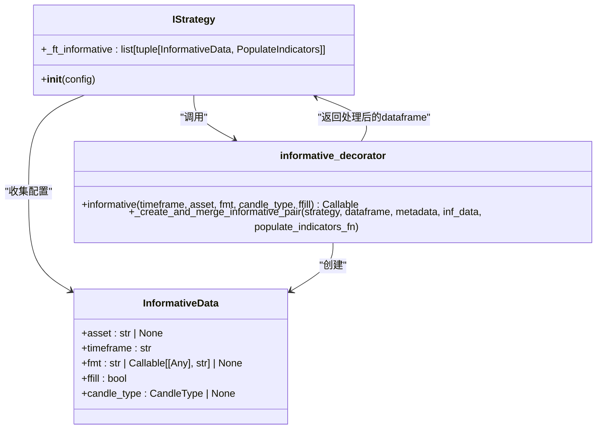
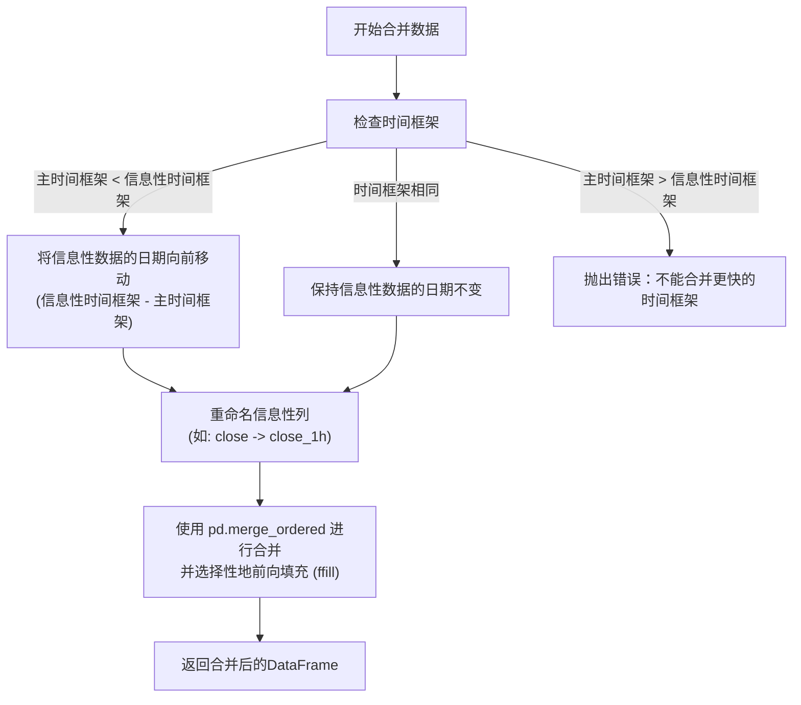

# 多时间框架分析

<cite>
**本文档引用的文件**   
- [informative_decorator.py](file://freqtrade/strategy/informative_decorator.py)
- [strategy_helper.py](file://freqtrade/strategy/strategy_helper.py)
- [interface.py](file://freqtrade/strategy/interface.py)
- [multi_tf.py](file://user_data/strategies/multi_tf.py)
- [InformativeSample.py](file://user_data/strategies/InformativeSample.py)
</cite>

## 目录
1. [引言](#引言)
2. [核心机制：@informative装饰器](#核心机制informative装饰器)
3. [数据对齐与防前瞻偏误](#数据对齐与防前瞻偏误)
4. [性能优化与缓存策略](#性能优化与缓存策略)
5. [策略实现示例](#策略实现示例)
6. [数据预处理与注意事项](#数据预处理与注意事项)

## 引言
多时间框架分析是量化交易策略中的核心高级技术，它允许交易者结合不同时间周期的市场信息来做出更稳健的决策。在Freqtrade框架中，`@informative` 装饰器是实现这一功能的关键工具。它使得策略能够无缝地引入高周期（如1小时、4小时）的数据，用于判断长期趋势，并将其与主交易周期（如5分钟、15分钟）的短期信号进行融合。本文档将深入解析 `@informative` 装饰器的内部工作机制，涵盖其如何管理数据加载、处理数据对齐、优化性能以及在实际策略中的应用。

## 核心机制：@informative装饰器

`@informative` 装饰器是Freqtrade中用于定义“信息性指标”（informative indicators）的Python装饰器。其核心作用是将一个普通的 `populate_indicators_xxx` 方法标记为一个专门用于处理辅助时间框架数据的函数。当策略初始化时，系统会扫描所有被 `@informative` 修饰的方法，并收集其参数，从而构建一个需要额外加载的数据源列表。

该装饰器接受多个关键参数：
- **timeframe**: 指定信息性数据的时间框架，必须等于或高于策略的主时间框架。
- **asset**: 指定信息性数据的交易对。若为空，则使用当前交易对；支持 `{stake}` 等格式化变量。
- **fmt**: 自定义信息性数据列的命名格式，避免列名冲突。
- **candle_type**: 指定K线类型，如现货、期货等。
- **ffill**: 是否在合并数据后进行前向填充，以处理缺失值。

在策略的 `__init__` 方法中，系统会遍历策略类的所有属性，查找带有 `_ft_informative` 属性的可调用方法（即被 `@informative` 修饰的方法），并将它们的配置信息（`InformativeData`）和方法本身存储在 `self._ft_informative` 列表中。这为后续的数据加载和处理奠定了基础。



**图表来源**
- [informative_decorator.py](file://freqtrade/strategy/informative_decorator.py#L15-L20)
- [interface.py](file://freqtrade/strategy/interface.py#L157-L176)

**本节来源**
- [informative_decorator.py](file://freqtrade/strategy/informative_decorator.py#L23-L73)
- [interface.py](file://freqtrade/strategy/interface.py#L157-L176)

## 数据对齐与防前瞻偏误

在合并不同时间框架的数据时，一个关键挑战是避免“前瞻偏误”（lookahead bias），即在当前时间点使用了未来才能知道的数据。例如，一个15分钟K线的结束时间是15:00，而一个1小时K线的结束时间是16:00。如果直接将16:00的1小时K线数据与15:00的15分钟K线数据合并，那么15:00的15分钟K线就“知道”了16:00的收盘价，这是不现实的。

Freqtrade通过 `merge_informative_pair` 函数解决了这个问题。该函数的核心逻辑是将信息性数据的日期列向前移动一个信息性时间框架的长度。具体来说，对于一个1小时的信息性K线，其数据会被移动到下一个1小时周期的开始时间。例如，14:00-15:00的1小时K线数据会被合并到15:00、15:15、15:30和15:45这四个15分钟K线上，因为这些时间点都处于14:00-15:00这个1小时周期的“已关闭”状态。



**图表来源**
- [strategy_helper.py](file://freqtrade/strategy/strategy_helper.py#L5-L100)

**本节来源**
- [strategy_helper.py](file://freqtrade/strategy/strategy_helper.py#L5-L100)

## 性能优化与缓存策略

加载和处理多个时间框架的数据会显著增加计算开销。Freqtrade通过一系列机制来优化性能：

1.  **数据提供者（DataProvider）缓存**: `self.dp` 对象负责从数据源获取K线数据。它内部实现了缓存机制，确保相同交易对和时间框架的数据在一次回测或交易会话中只被加载一次，避免了重复的I/O操作。
2.  **延迟计算**: 信息性指标的计算被推迟到 `populate_indicators` 方法中执行。这意味着只有在真正需要时，系统才会去加载和处理这些辅助数据。
3.  **高效的数据合并**: `merge_informative_pair` 使用 `pandas.merge_ordered` 并结合 `fill_method="ffill"`，这比先合并再单独进行 `ffill` 操作快2.5倍。
4.  **装饰器堆叠**: 允许在一个方法上堆叠多个 `@informative` 装饰器，从而在一个函数调用中为多个时间框架计算相同的指标，减少了函数调用的开销。

这些优化策略共同作用，确保了即使在使用多个信息性时间框架的情况下，策略的执行效率依然可以接受。

**本节来源**
- [strategy_helper.py](file://freqtrade/strategy/strategy_helper.py#L5-L100)
- [informative_decorator.py](file://freqtrade/strategy/informative_decorator.py#L97-L170)

## 策略实现示例

以下是一个使用 `@informative` 装饰器的典型策略示例。该策略在5分钟主周期上进行交易，但使用1小时周期的RSI指标来判断整体趋势。

```python
class MyStrategy(IStrategy):
    timeframe = '5m'

    @informative('1h')
    def populate_indicators_1h(self, dataframe: DataFrame, metadata: dict) -> DataFrame:
        """为1小时周期计算RSI"""
        dataframe['rsi_1h'] = ta.RSI(dataframe, timeperiod=14)
        return dataframe

    def populate_indicators(self, dataframe: DataFrame, metadata: dict) -> DataFrame:
        # 为5分钟周期计算指标
        dataframe['rsi'] = ta.RSI(dataframe, timeperiod=14)
        # 信息性数据（rsi_1h）在此处已可用
        return dataframe

    def populate_entry_trend(self, dataframe: DataFrame, metadata: dict) -> DataFrame:
        dataframe.loc[
            (
                (dataframe['rsi'] < 30) &  # 5分钟周期超卖
                (dataframe['rsi_1h'] > 50) # 1小时周期处于上升趋势
            ),
            'enter_long'
        ] = 1
        return dataframe
```

在 `multi_tf.py` 策略中，展示了更复杂的用法，包括使用 `BTC/{stake}` 作为信息对来获取大盘指标，以及使用自定义的 `fmt` 参数来精确控制列名。

**本节来源**
- [multi_tf.py](file://user_data/strategies/multi_tf.py#L89-L108)
- [InformativeSample.py](file://user_data/strategies/InformativeSample.py#L100-L120)

## 数据预处理与注意事项

在使用多时间框架分析时，需要注意以下几点：

1.  **数据完整性**: 确保所有需要的信息性数据源都已下载并存在于本地。如果 `get_pair_dataframe` 返回空的DataFrame，策略将抛出异常。
2.  **列名冲突**: 使用 `fmt` 参数或确保列名唯一，避免不同信息源的列名发生冲突。
3.  **内存占用**: 加载多个时间框架的数据会增加内存消耗，尤其是在处理大量交易对时。应合理选择信息性时间框架的数量和粒度。
4.  **时间框架限制**: 信息性时间框架必须等于或高于主时间框架，这是由 `@informative` 装饰器的内部校验逻辑强制执行的。
5.  **缺失值处理**: `ffill=True` 是推荐的选项，它能确保在信息性K线更新前，使用上一个周期的值，从而保持数据的连续性。

遵循这些注意事项，可以构建出既强大又稳健的多时间框架交易策略。

**本节来源**
- [informative_decorator.py](file://freqtrade/strategy/informative_decorator.py#L130-L140)
- [strategy_helper.py](file://freqtrade/strategy/strategy_helper.py#L5-L100)