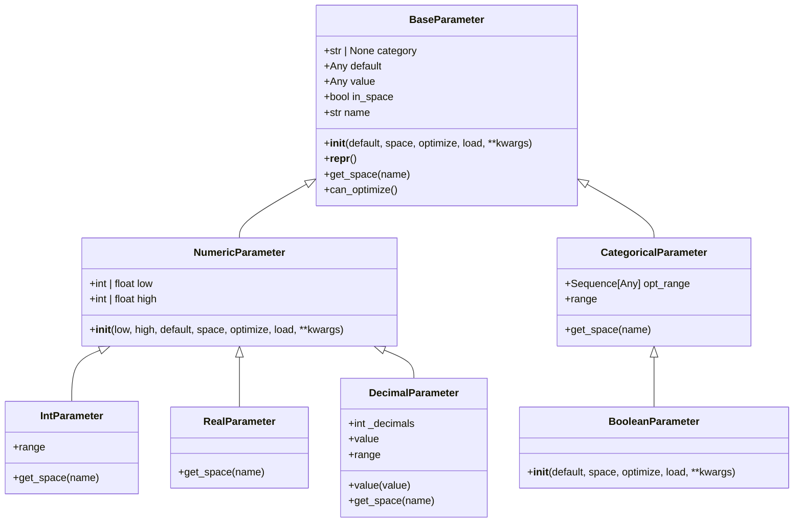
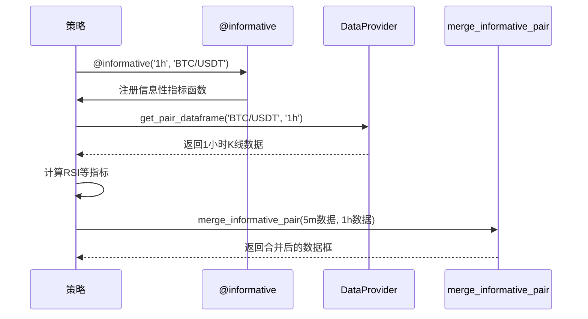
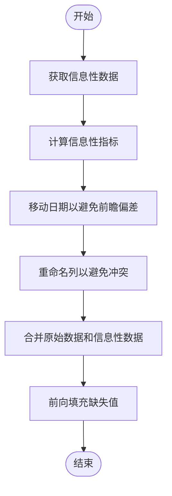
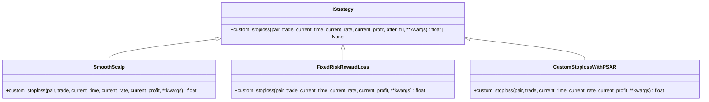
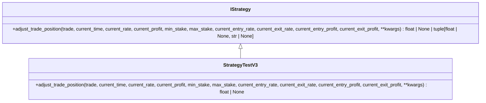
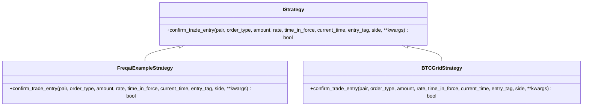
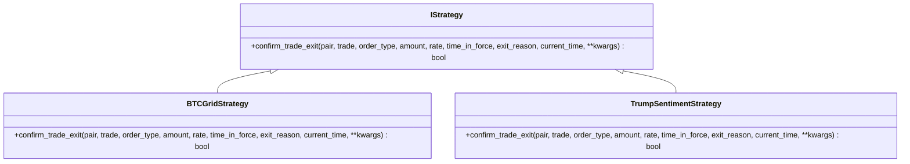
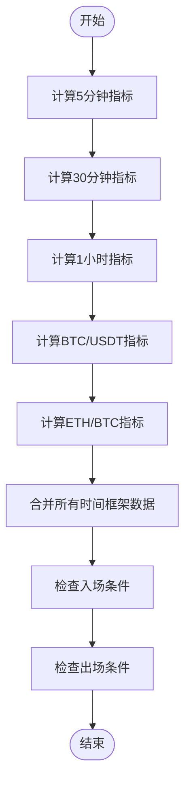

# 高级策略特性

<cite>
**本文档中引用的文件**  
- [informative_decorator.py](file://freqtrade/strategy/informative_decorator.py)
- [parameters.py](file://freqtrade/strategy/parameters.py)
- [interface.py](file://freqtrade/strategy/interface.py)
- [strategy_helper.py](file://freqtrade/strategy/strategy_helper.py)
- [multi_tf.py](file://user_data/strategies/multi_tf.py)
- [SmoothScalp.py](file://user_data/strategies/SmoothScalp.py)
- [FixedRiskRewardLoss.py](file://user_data/strategies/FixedRiskRewardLoss.py)
- [CustomStoplossWithPSAR.py](file://user_data/strategies/CustomStoplossWithPSAR.py)
</cite>

## 目录
1. [引言](#引言)
2. [参数化策略设计](#参数化策略设计)
3. [多时间框架分析](#多时间框架分析)
4. [高级风险管理](#高级风险管理)
5. [交易确认回调](#交易确认回调)
6. [复杂策略示例](#复杂策略示例)
7. [结论](#结论)

## 引言
本文档深入探讨了Freqtrade框架中策略开发的高级特性，重点解析了参数化策略设计和多时间框架分析。通过分析核心源码，详细说明了如何使用超参数类实现策略参数的动态配置和优化兼容性，以及@informative装饰器的工作原理。文档还涵盖了自定义止损、动态仓位调整和交易确认回调等高级功能的实现细节，并提供了一个结合多时间框架分析和动态风险管理的复杂策略示例。

## 参数化策略设计

Freqtrade框架提供了多种超参数类，用于实现策略参数的动态配置和优化兼容性。这些类继承自BaseParameter，允许在策略中定义可优化的参数。

### 超参数类体系
框架提供了多种超参数类，包括BooleanParameter、IntParameter和DecimalParameter，分别用于处理布尔值、整数和浮点数参数。

**Diagram sources**
- [parameters.py](file://freqtrade/strategy/parameters.py#L1-L382)

**Section sources**
- [parameters.py](file://freqtrade/strategy/parameters.py#L1-L382)

### BooleanParameter
BooleanParameter是CategoricalParameter的一个特例，用于处理布尔值参数。它将参数空间限制为[True, False]，并提供了便捷的初始化方式。

### IntParameter
IntParameter用于处理整数参数，允许指定参数的上下界和默认值。它还提供了range属性，用于获取参数空间中的所有可能值。

### DecimalParameter
DecimalParameter用于处理浮点数参数，特别适用于需要有限精度的场景。通过decimals参数，可以控制小数点后的位数，确保参数值的精度符合要求。

## 多时间框架分析

多时间框架分析是高级策略开发中的重要特性，允许策略在不同时间框架上进行指标计算和信号生成。Freqtrade通过@informative装饰器实现了这一功能。

### @informative装饰器
@informative装饰器是实现多时间框架分析的核心机制。它允许在策略中定义信息性指标函数，这些函数会在指定的时间框架上计算指标。

**Diagram sources**
- [informative_decorator.py](file://freqtrade/strategy/informative_decorator.py#L23-L73)
- [strategy_helper.py](file://freqtrade/strategy/strategy_helper.py#L5-L100)

**Section sources**
- [informative_decorator.py](file://freqtrade/strategy/informative_decorator.py#L1-L171)
- [strategy_helper.py](file://freqtrade/strategy/strategy_helper.py#L1-L171)

### 工作原理
@informative装饰器的工作原理可以分为以下几个步骤：
1. 装饰器接收时间框架、资产和格式化参数
2. 创建InformativeData对象，存储装饰器的配置信息
3. 将信息性指标函数注册到策略中
4. 在populate_indicators方法中，通过_data_provider获取指定时间框架的数据
5. 使用merge_informative_pair工具函数将不同时间框架的数据合并

### 数据融合
数据融合是多时间框架分析的关键环节。merge_informative_pair函数负责将不同时间框架的数据正确合并，避免前瞻偏差。

**Diagram sources**
- [strategy_helper.py](file://freqtrade/strategy/strategy_helper.py#L5-L100)

**Section sources**
- [strategy_helper.py](file://freqtrade/strategy/strategy_helper.py#L1-L171)

## 高级风险管理

高级风险管理功能允许策略根据市场条件动态调整止损和仓位，提高策略的适应性和盈利能力。

### 自定义止损
自定义止损功能通过custom_stoploss方法实现，允许根据市场条件动态调整止损位置。

**Diagram sources**
- [interface.py](file://freqtrade/strategy/interface.py#L440-L469)
- [SmoothScalp.py](file://user_data/strategies/SmoothScalp.py#L305-L336)
- [FixedRiskRewardLoss.py](file://user_data/strategies/FixedRiskRewardLoss.py#L73-L127)
- [CustomStoplossWithPSAR.py](file://user_data/strategies/CustomStoplossWithPSAR.py#L62-L96)

**Section sources**
- [interface.py](file://freqtrade/strategy/interface.py#L440-L469)
- [SmoothScalp.py](file://user_data/strategies/SmoothScalp.py#L305-L336)
- [FixedRiskRewardLoss.py](file://user_data/strategies/FixedRiskRewardLoss.py#L73-L127)
- [CustomStoplossWithPSAR.py](file://user_data/strategies/CustomStoplossWithPSAR.py#L62-L96)

### 动态仓位调整
动态仓位调整功能通过adjust_trade_position方法实现，允许在交易过程中根据市场条件调整仓位。

**Diagram sources**
- [interface.py](file://freqtrade/strategy/interface.py#L648-L689)
- [strategy_test_v3.py](file://tests/strategy/strats/strategy_test_v3.py#L185-L203)

**Section sources**
- [interface.py](file://freqtrade/strategy/interface.py#L648-L689)
- [strategy_test_v3.py](file://tests/strategy/strats/strategy_test_v3.py#L185-L203)

## 交易确认回调

交易确认回调功能允许在交易执行前后进行额外的验证和处理，提高交易的安全性和灵活性。

### 入场确认
入场确认通过confirm_trade_entry方法实现，允许在订单提交前进行额外的验证。

**Diagram sources**
- [interface.py](file://freqtrade/strategy/interface.py#L352-L386)
- [FreqaiExampleStrategy.py](file://freqtrade/templates/FreqaiExampleStrategy.py#L270-L292)
- [BTCGridStrategy.py](file://yccai/wang_ge/BTCGridStrategy.py#L370-L383)

**Section sources**
- [interface.py](file://freqtrade/strategy/interface.py#L352-L386)
- [FreqaiExampleStrategy.py](file://freqtrade/templates/FreqaiExampleStrategy.py#L270-L292)
- [BTCGridStrategy.py](file://yccai/wang_ge/BTCGridStrategy.py#L370-L383)

### 出场确认
出场确认通过confirm_trade_exit方法实现，允许在退出订单提交前进行额外的验证。

**Diagram sources**
- [interface.py](file://freqtrade/strategy/interface.py#L388-L424)
- [BTCGridStrategy.py](file://yccai/wang_ge/BTCGridStrategy.py#L385-L391)
- [TrumpSentimentStrategy.py](file://user_data/strategies/TrumpSentimentStrategy.py#L373-L384)

**Section sources**
- [interface.py](file://freqtrade/strategy/interface.py#L388-L424)
- [BTCGridStrategy.py](file://yccai/wang_ge/BTCGridStrategy.py#L385-L391)
- [TrumpSentimentStrategy.py](file://user_data/strategies/TrumpSentimentStrategy.py#L373-L384)

## 复杂策略示例

本节通过分析multi_tf策略，展示如何综合应用多时间框架分析和动态风险管理等高级特性。

### 策略概述
multi_tf策略是一个功能强大的教学示例，旨在全面展示@informative装饰器的各种用法，以实现复杂的多时间周期和多资产分析。

**Diagram sources**
- [multi_tf.py](file://user_data/strategies/multi_tf.py#L1-L182)

**Section sources**
- [multi_tf.py](file://user_data/strategies/multi_tf.py#L1-L182)

### 多时间框架应用
该策略展示了@informative装饰器的多种用法：
1. 高周期自身指标：获取当前交易对在30m和1h周期下的RSI
2. 大盘指标：获取BTC/USDT在1h周期下的RSI，作为市场风向标
3. 其他关键对指标：获取ETH/BTC的指标，分析主要竞争币种的相对强弱
4. 自定义命名：通过格式化字符串，为引入的指标自定义列名

### 交易逻辑
该策略的交易逻辑是一个极致的"共振抄底"逻辑：
- 入场：只有当所有层面（当前币种的5m、30m、1h周期、BTC的1h周期、ETH/BTC的1h周期）的RSI指标同时显示"超卖"信号时，才会入场
- 出场：当当前币种在5m周期上显示"超买"时卖出

## 结论
本文档深入探讨了Freqtrade框架中策略开发的高级特性，包括参数化策略设计、多时间框架分析、高级风险管理和交易确认回调。通过分析核心源码，我们了解了这些特性的实现原理和应用方法。这些高级特性为策略开发提供了强大的工具，使开发者能够构建更加复杂和智能的交易策略。然而，需要注意的是，这些特性虽然强大，但也增加了策略的复杂性，需要谨慎使用和充分测试。