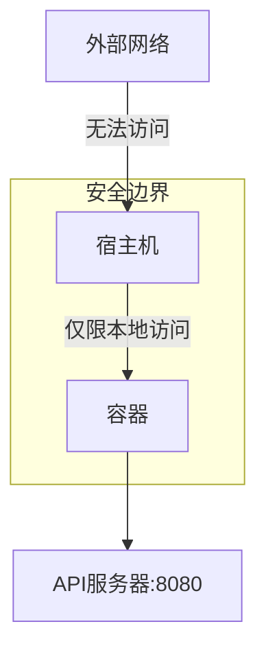
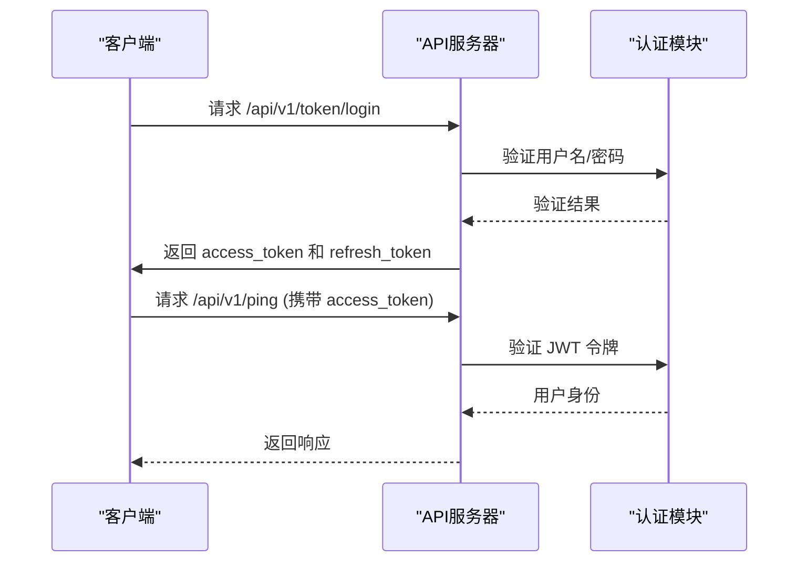
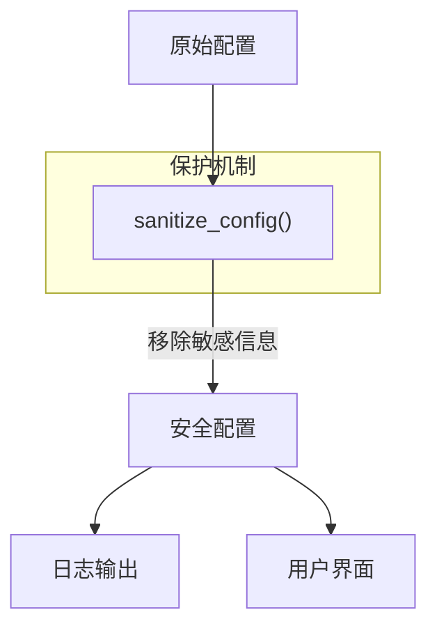

# 安全配置

<cite>
**本文档中引用的文件**  
- [docker-compose.yml](file://docker-compose.yml)
- [webserver.py](file://freqtrade/rpc/api_server/webserver.py)
- [api_auth.py](file://freqtrade/rpc/api_server/api_auth.py)
- [config_secrets.py](file://freqtrade/configuration/config_secrets.py)
- [key_value_store.py](file://freqtrade/persistence/key_value_store.py)
- [config_schema.py](file://freqtrade/config_schema/config_schema.py)
</cite>

## 目录
1. [网络层安全配置](#网络层安全配置)
2. [应用层安全机制](#应用层安全机制)
3. [数据层安全策略](#数据层安全策略)
4. [安全审计与漏洞防范](#安全审计与漏洞防范)

## 网络层安全配置

Freqtrade系统通过Docker容器化部署，其网络访问控制主要通过`docker-compose.yml`文件中的端口绑定策略实现。API服务器默认监听在`127.0.0.1`回环地址上，确保服务仅对本地主机开放，有效防止外部网络的直接访问。

在`docker-compose.yml`中，端口映射配置为`"127.0.0.1:8080:8080"`，这表示容器内的8080端口仅绑定到宿主机的127.0.0.1接口，外部网络无法通过宿主机的公网IP访问该服务，从而构建了第一道安全防线。

**Diagram sources**
- [docker-compose.yml](file://docker-compose.yml#L25-L26)

**Section sources**
- [docker-compose.yml](file://docker-compose.yml#L1-L36)

## 应用层安全机制

### Web UI身份验证

Freqtrade的Web UI和API服务器采用多层身份验证机制。系统首先检查是否存在JWT（JSON Web Token），如果存在则进行解码和验证；若无JWT，则回退到HTTP Basic认证，验证用户名和密码。

认证流程由`http_basic_or_jwt_token`函数实现，该函数作为依赖注入到所有受保护的API路由中。用户成功通过HTTP Basic认证后，系统会签发JWT访问令牌和刷新令牌，后续请求可使用JWT进行无状态认证。

**Diagram sources**
- [api_auth.py](file://freqtrade/rpc/api_server/api_auth.py#L107-L147)
- [webserver.py](file://freqtrade/rpc/api_server/webserver.py#L132-L165)

### API服务器认证流程

API服务器的认证流程集成在FastAPI应用的路由配置中。所有受保护的API端点（除公开端点外）都依赖于`http_basic_or_jwt_token`依赖项，确保每个请求都经过身份验证。

当服务器启动时，会检查配置的安全性，包括：
- 监听地址是否为回环地址（非回环地址会发出安全警告）
- 是否设置了API密码（未设置会发出警告）
- `jwt_secret_key`是否为默认值（使用默认值会发出严重警告）

这些检查在`start_api`方法中实现，确保在服务启动时就识别潜在的安全风险。

**Section sources**
- [webserver.py](file://freqtrade/rpc/api_server/webserver.py#L195-L243)
- [api_auth.py](file://freqtrade/rpc/api_server/api_auth.py#L107-L147)

## 数据层安全策略

### 敏感数据安全存储

Freqtrade系统通过`config_secrets.py`模块对敏感配置信息进行保护。系统定义了`_SENSITIVE_KEYS`列表，包含所有需要保护的敏感键名，如API密钥、密码、Telegram令牌等。

`sanitize_config`函数用于在日志输出或配置展示时，将这些敏感字段的值替换为"REDACTED"，防止敏感信息意外泄露。此外，`remove_exchange_credentials`函数在回测等非交易场景中移除交易所凭证，确保安全。

**Diagram sources**
- [config_secrets.py](file://freqtrade/configuration/config_secrets.py#L0-L48)

### 访问控制与密钥管理

系统使用JWT进行访问控制，`jwt_secret_key`是生成和验证令牌的核心密钥。强烈建议用户在配置中设置一个强随机的密钥，避免使用默认值，否则可能导致未授权访问。

WebSocket连接也受到严格保护，通过`ws_token`或有效的JWT令牌进行认证。`validate_ws_token`函数同时支持这两种认证方式，确保WebSocket连接的安全性。

**Section sources**
- [config_schema.py](file://freqtrade/config_schema/config_schema.py#L662-L696)
- [api_auth.py](file://freqtrade/rpc/api_server/api_auth.py#L55-L85)

## 安全审计与漏洞防范

### 安全审计日志

Freqtrade系统在关键安全节点生成详细的审计日志。当API服务器启动时，会记录监听地址和端口，并在检测到潜在安全风险时发出明确警告：

- 如果监听地址不是回环地址，会警告"SECURITY WARNING - Local Rest Server listening to external connections"
- 如果未设置密码，会警告"SECURITY WARNING - No password for local REST Server defined"
- 如果`jwt_secret_key`为默认值，会警告"SECURITY WARNING - `jwt_secret_key` seems to be default"

这些日志帮助用户及时发现和修复安全配置问题。

**Section sources**
- [webserver.py](file://freqtrade/rpc/api_server/webserver.py#L195-L243)

### 漏洞防范措施

#### CSRF保护

系统通过CORS（跨域资源共享）中间件实现基础的CSRF保护。`configure_app`方法中配置了`CORS_origins`选项，允许管理员指定哪些源可以访问API，有效防止跨站请求伪造攻击。

#### 输入验证

所有API输入都通过FastAPI的Pydantic模型进行严格验证。例如，`AccessAndRefreshToken`和`AccessToken`等响应模型确保了输出数据的结构和类型安全，防止注入攻击和数据泄露。

此外，系统使用`secrets.compare_digest`进行密码比较，该函数具有恒定时间特性，可有效防止时序攻击。

**Section sources**
- [webserver.py](file://freqtrade/rpc/api_server/webserver.py#L117-L177)
- [api_auth.py](file://freqtrade/rpc/api_server/api_auth.py#L33-L49)