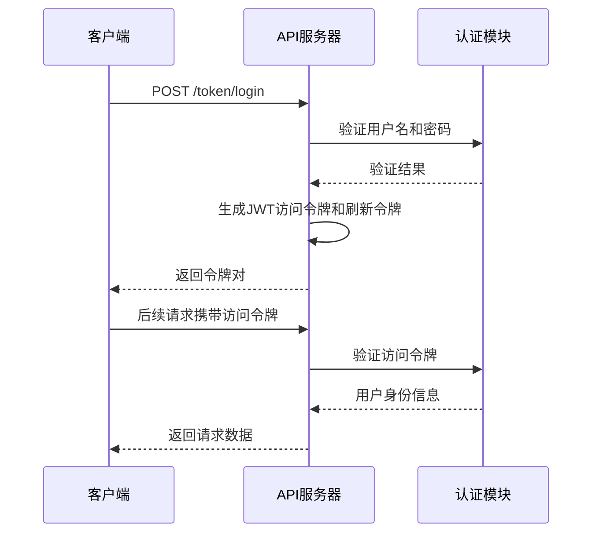
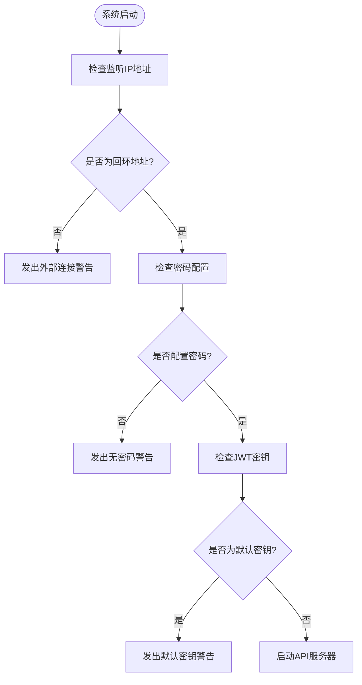
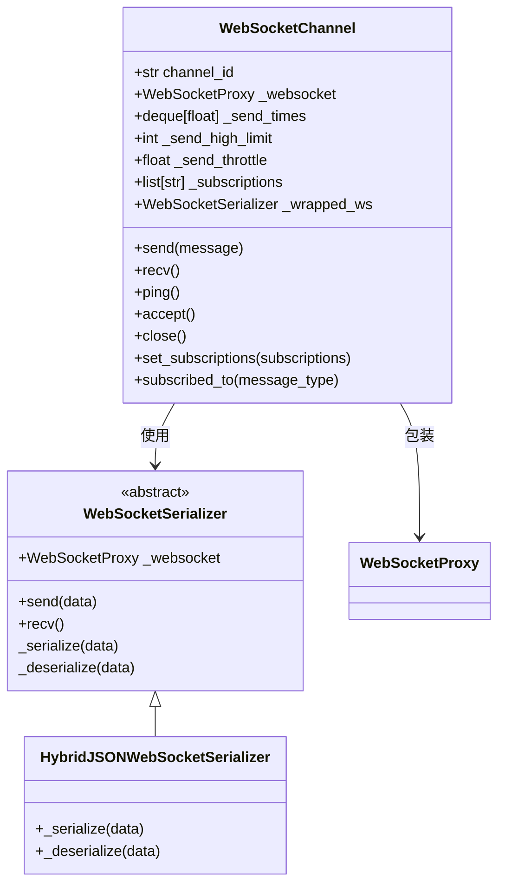
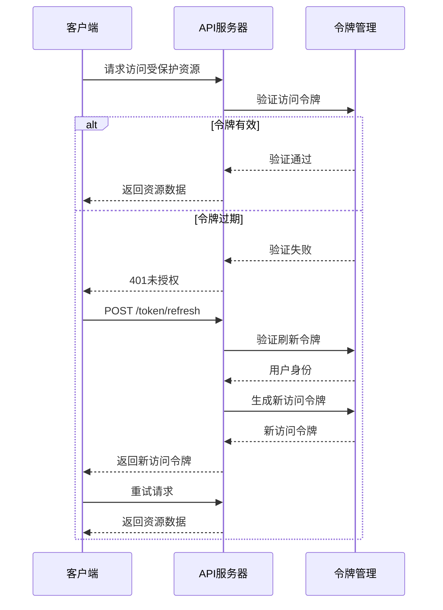
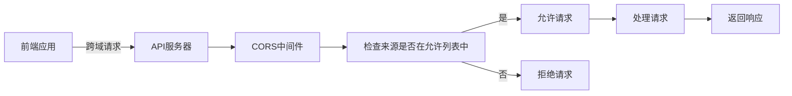

# 传输安全

<cite>
**本文档中引用的文件**  
- [api_auth.py](file://freqtrade/rpc/api_server/api_auth.py)
- [webserver.py](file://freqtrade/rpc/api_server/webserver.py)
- [serializer.py](file://freqtrade/rpc/api_server/ws/serializer.py)
- [channel.py](file://freqtrade/rpc/api_server/ws/channel.py)
- [config_schema.py](file://freqtrade/config_schema/config_schema.py)
</cite>

## 目录
1. [引言](#引言)
2. [JWT身份认证流程](#jwt身份认证流程)
3. [HTTPS强制启用策略](#https强制启用策略)
4. [WebSocket安全封装](#websocket安全封装)
5. [敏感数据过滤与序列化控制](#敏感数据过滤与序列化控制)
6. [访问令牌生命周期管理](#访问令牌生命周期管理)
7. [反重放攻击与速率限制](#反重放攻击与速率限制)
8. [CORS策略实现](#cors策略实现)

## 引言
Freqtrade的API传输安全机制通过多层防护确保通信的机密性、完整性和可用性。系统采用基于JWT的身份认证、HTTPS加密传输、WebSocket安全封装以及严格的访问控制策略，全面保护交易数据和用户隐私。本文档详细阐述这些安全机制的实现原理和配置方法。

## JWT身份认证流程
Freqtrade的API服务器采用JWT（JSON Web Token）进行身份认证，结合HTTP Basic认证提供双重安全验证。用户通过用户名和密码登录后，系统生成包含用户身份信息的JWT访问令牌和刷新令牌。访问令牌有效期为15分钟，用于后续API请求的身份验证；刷新令牌有效期为30天，用于在访问令牌过期后获取新的访问令牌。

**图示来源**  
- [api_auth.py](file://freqtrade/rpc/api_server/api_auth.py#L107-L147)
- [webserver.py](file://freqtrade/rpc/api_server/webserver.py#L117-L177)

**本节来源**  
- [api_auth.py](file://freqtrade/rpc/api_server/api_auth.py#L88-L104)
- [api_auth.py](file://freqtrade/rpc/api_server/api_auth.py#L124-L147)

## HTTPS强制启用策略
Freqtrade通过配置强制启用HTTPS加密传输，确保所有API通信都在安全通道上进行。系统在启动时检查监听IP地址，若非本地回环地址则发出安全警告，提示用户配置为127.0.0.1以防止外部未授权访问。同时，系统要求配置强密码和唯一的JWT密钥，避免使用默认值，防止潜在的安全风险。

**图示来源**  
- [webserver.py](file://freqtrade/rpc/api_server/webserver.py#L195-L243)

**本节来源**  
- [webserver.py](file://freqtrade/rpc/api_server/webserver.py#L195-L243)

## WebSocket安全封装
WebSocket连接通过令牌验证和消息序列化进行安全封装。系统支持两种验证方式：专用WebSocket令牌和JWT令牌。消息传输采用HybridJSONWebSocketSerializer进行序列化，支持Pandas DataFrame的特殊序列化处理，确保复杂数据结构的安全传输。连接建立后，系统通过ping/pong机制维持连接活跃状态，并在异常时及时关闭连接。

**图示来源**  
- [serializer.py](file://freqtrade/rpc/api_server/ws/serializer.py#L16-L42)
- [channel.py](file://freqtrade/rpc/api_server/ws/channel.py#L24-L223)

**本节来源**  
- [serializer.py](file://freqtrade/rpc/api_server/ws/serializer.py#L0-L56)
- [channel.py](file://freqtrade/rpc/api_server/ws/channel.py#L44-L86)

## 敏感数据过滤与序列化控制
API请求和响应中的敏感数据通过严格的过滤规则进行保护。系统在序列化DataFrame时，自动移除入口和出口信号，防止交易策略的敏感信息泄露。JSON序列化采用orjson库，支持NumPy数据类型的序列化，并通过自定义默认函数处理特殊对象类型。反序列化时使用rapidjson库，确保高效安全的数据解析。

**本节来源**  
- [serializer.py](file://freqtrade/rpc/api_server/ws/serializer.py#L44-L56)
- [misc.py](file://freqtrade/misc.py#L171-L208)

## 访问令牌生命周期管理
访问令牌的生命周期通过短有效期和刷新机制进行管理。访问令牌有效期为15分钟，过期后客户端需使用刷新令牌获取新的访问令牌。刷新令牌有效期为30天，提供长期会话支持。系统通过`token_login`端点处理登录请求，生成令牌对；通过`token_refresh`端点处理令牌刷新请求，验证刷新令牌后签发新的访问令牌。

**图示来源**  
- [api_auth.py](file://freqtrade/rpc/api_server/api_auth.py#L150-L160)

**本节来源**  
- [api_auth.py](file://freqtrade/rpc/api_server/api_auth.py#L88-L104)
- [api_auth.py](file://freqtrade/rpc/api_server/api_auth.py#L150-L160)

## 反重放攻击与速率限制
系统通过多种机制防范重放攻击和滥用。WebSocket连接的发送速率受到限制，通过计算平均发送时间动态调整发送限制，防止消息洪泛攻击。API服务器通过CORS中间件配置允许的来源，限制跨域请求。同时，系统记录安全警告日志，监控潜在的安全威胁，如外部连接、缺少密码和使用默认JWT密钥等。

**本节来源**  
- [channel.py](file://freqtrade/rpc/api_server/ws/channel.py#L71-L80)
- [webserver.py](file://freqtrade/rpc/api_server/webserver.py#L117-L177)

## CORS策略实现
CORS（跨域资源共享）策略通过FastAPI的CORSMiddleware中间件实现。系统从配置中读取允许的来源列表，支持通配符配置。中间件允许所有方法和头部，支持凭据传输，确保前端应用能够安全地与API服务器通信。配置示例中可指定多个允许的来源，如`http://localhost:8080`和`https://example.com`。

**图示来源**  
- [webserver.py](file://freqtrade/rpc/api_server/webserver.py#L117-L177)

**本节来源**  
- [webserver.py](file://freqtrade/rpc/api_server/webserver.py#L117-L177)
- [config_schema.py](file://freqtrade/config_schema/config_schema.py#L662-L696)