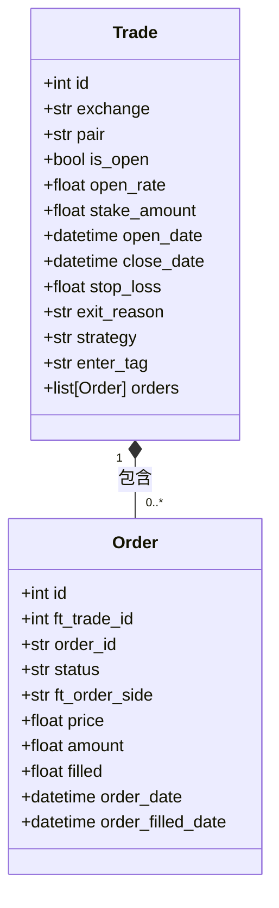
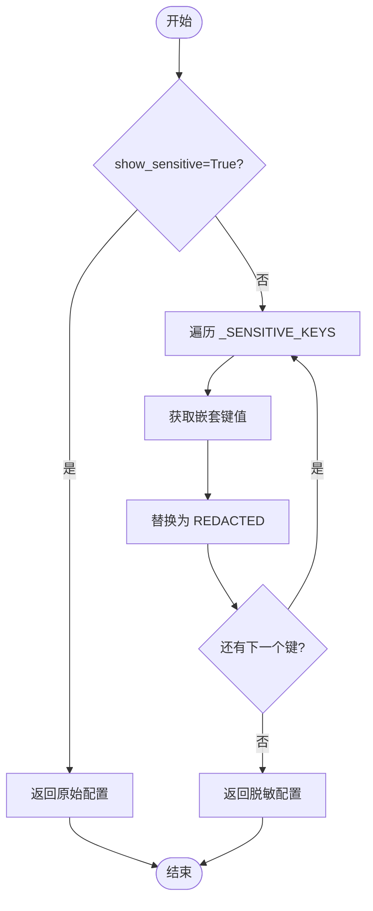
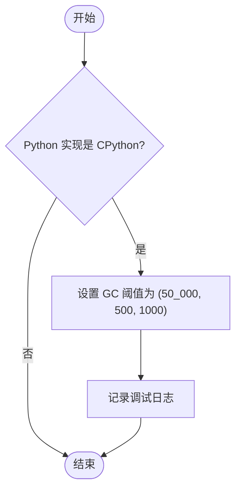
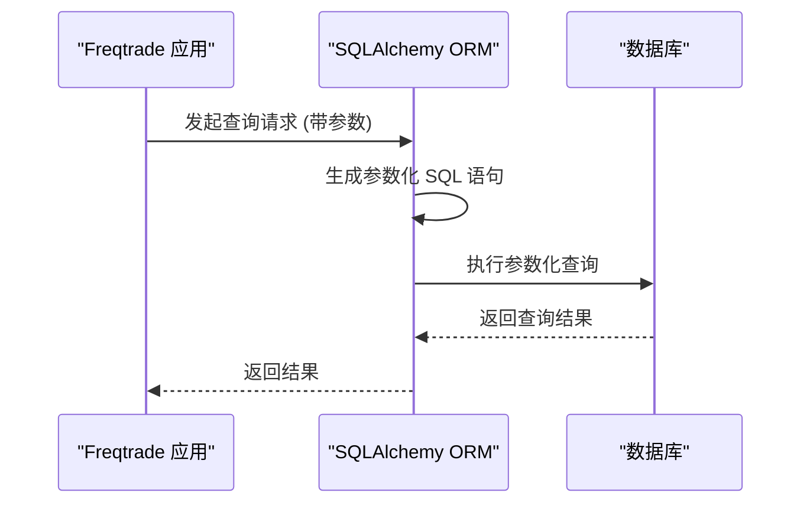
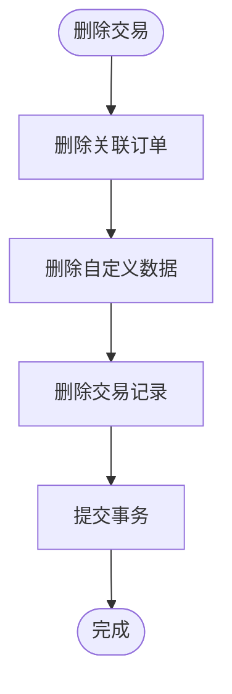

# 存储安全

<cite>
**本文档引用的文件**  
- [models.py](file://freqtrade/persistence/models.py)
- [trade_model.py](file://freqtrade/persistence/trade_model.py)
- [pairlock.py](file://freqtrade/persistence/pairlock.py)
- [config_secrets.py](file://freqtrade/configuration/config_secrets.py)
- [gc_setup.py](file://freqtrade/system/gc_setup.py)
- [misc.py](file://freqtrade/misc.py)
</cite>

## 目录
1. [引言](#引言)
2. [持久化数据安全策略](#持久化数据安全策略)
3. [内存敏感对象清理与GC优化](#内存敏感对象清理与gc优化)
4. [数据库连接与SQL注入防护](#数据库连接与sql注入防护)
5. [自定义数据存储权限校验](#自定义数据存储权限校验)
6. [结论](#结论)

## 引言
Freqtrade 是一个开源的加密货币交易机器人，其核心功能依赖于对交易记录、订单状态等敏感数据的安全存储与管理。本文档深入分析 Freqtrade 的存储安全机制，涵盖数据库加密、内存清理、连接安全、SQL注入防护及权限校验等关键方面，旨在为开发者和用户提供一个全面的安全性概览。

## 持久化数据安全策略
Freqtrade 通过 SQLAlchemy ORM 框架将交易记录、订单状态等敏感数据持久化到数据库中。系统并未在数据库层面实现字段级加密，而是通过配置管理和日志脱敏来保护敏感信息。

### 交易与订单数据模型
核心数据模型 `Trade` 和 `Order` 定义了交易和订单的结构，所有数据通过 `init_db` 函数初始化的数据库会话进行持久化。

**Diagram sources**
- [trade_model.py](file://freqtrade/persistence/trade_model.py#L1641-L2125)
- [trade_model.py](file://freqtrade/persistence/trade_model.py#L64-L377)

**Section sources**
- [trade_model.py](file://freqtrade/persistence/trade_model.py#L1641-L2125)
- [models.py](file://freqtrade/persistence/models.py#L46-L96)

### 敏感信息脱敏
系统通过 `sanitize_config` 函数对包含 API 密钥、密码等敏感信息的配置进行脱敏处理，确保这些信息在日志或调试输出中被替换为 "REDACTED"。

**Diagram sources**
- [config_secrets.py](file://freqtrade/configuration/config_secrets.py#L0-L67)

**Section sources**
- [config_secrets.py](file://freqtrade/configuration/config_secrets.py#L0-L67)

## 内存敏感对象清理与GC优化
Freqtrade 通过及时清理内存中的敏感对象和优化垃圾回收（GC）配置来提升性能和安全性。

### 内存对象清理
未成交订单（`Order`）和交易（`Trade`）对象在状态更新或交易关闭后，其相关数据会被及时从内存中清理。例如，当订单被关闭时，`close_bt_order` 方法会更新订单状态并清除相关字段。

**Section sources**
- [trade_model.py](file://freqtrade/persistence/trade_model.py#L350-L377)

### GC优化配置
系统通过 `gc_set_threshold` 函数调整 Python 的垃圾回收阈值，减少 GC 运行次数，从而提高性能。该配置仅在 CPython 实现中生效。

**Diagram sources**
- [gc_setup.py](file://freqtrade/system/gc_setup.py#L0-L17)

**Section sources**
- [gc_setup.py](file://freqtrade/system/gc_setup.py#L0-L17)

## 数据库连接与SQL注入防护
Freqtrade 采用安全的数据库连接方式，并通过 ORM 框架内置的防护机制来防止 SQL 注入攻击。

### 数据库连接字符串安全
数据库连接字符串中的密码在日志输出时会被自动脱敏。`parse_db_uri_for_logging` 函数将密码部分替换为 "*****"，确保敏感信息不会泄露。

**Section sources**
- [misc.py](file://freqtrade/misc.py#L171-L208)

### SQL注入防护
由于 Freqtrade 使用 SQLAlchemy ORM 进行数据库操作，所有查询都通过参数化查询生成，从根本上防止了 SQL 注入攻击。开发者无需手动处理 SQL 字符串拼接。

**Diagram sources**
- [models.py](file://freqtrade/persistence/models.py#L46-L96)
- [trade_model.py](file://freqtrade/persistence/trade_model.py#L1641-L2125)

**Section sources**
- [models.py](file://freqtrade/persistence/models.py#L46-L96)

## 自定义数据存储权限校验
Freqtrade 提供了自定义数据存储功能，通过 `CustomDataWrapper` 类进行管理。系统通过会话管理和数据访问控制来确保自定义数据的权限安全。

### 自定义数据模型
`_CustomData` 模型用于存储与交易相关的自定义数据，其会话与 `Trade` 模型共享，确保数据访问的一致性。

**Section sources**
- [trade_model.py](file://freqtrade/persistence/trade_model.py#L1641-L2125)
- [models.py](file://freqtrade/persistence/models.py#L46-L96)

### 权限校验流程
当删除交易时，`CustomDataWrapper.delete_custom_data` 方法会被调用，确保与该交易相关的所有自定义数据也被一并删除，防止数据残留。

**Diagram sources**
- [trade_model.py](file://freqtrade/persistence/trade_model.py#L1641-L2125)

**Section sources**
- [trade_model.py](file://freqtrade/persistence/trade_model.py#L1641-L2125)

## 结论
Freqtrade 通过一系列机制保障了数据存储的安全性。尽管数据库层面未实现字段加密，但通过配置脱敏、日志保护、ORM 参数化查询和内存管理等手段，有效降低了敏感信息泄露的风险。GC 优化配置提升了系统性能，而自定义数据存储的权限校验确保了数据的完整性和一致性。总体而言，Freqtrade 的存储安全策略在开源项目中是合理且有效的。