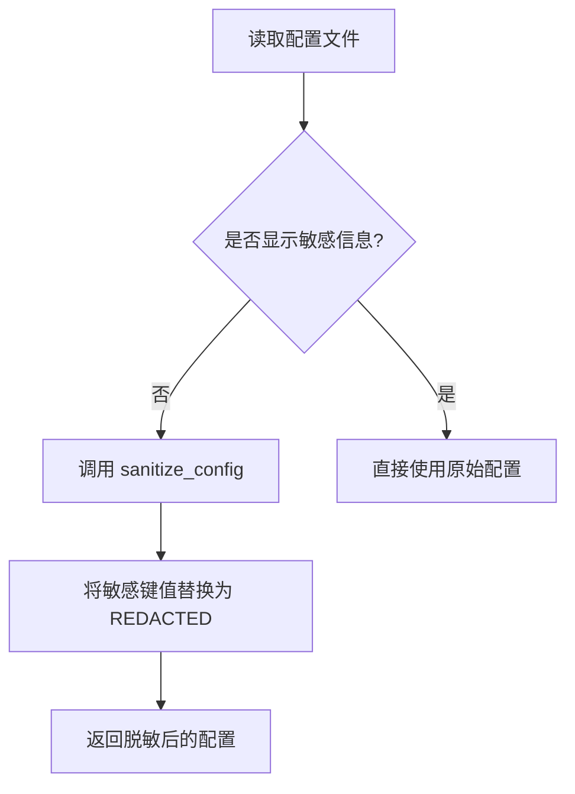
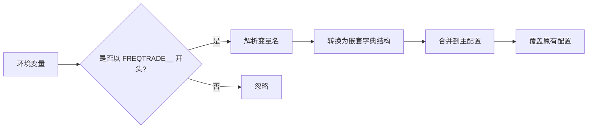
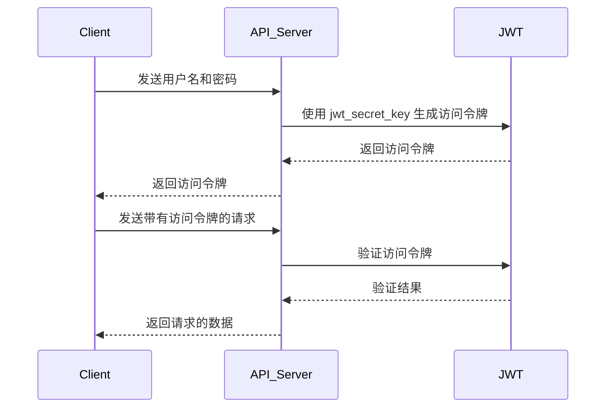
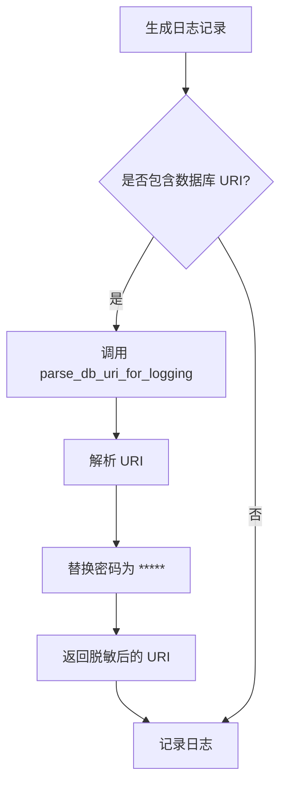

# 数据安全

<cite>
**本文档引用的文件**
- [config.json](file://user_data/config.json)
- [config_secrets.py](file://freqtrade/configuration/config_secrets.py)
- [environment_vars.py](file://freqtrade/configuration/environment_vars.py)
- [api_auth.py](file://freqtrade/rpc/api_server/api_auth.py)
- [json_formatter.py](file://freqtrade/loggers/json_formatter.py)
- [misc.py](file://freqtrade/misc.py)
</cite>

## 目录
1. [引言](#引言)
2. [敏感配置信息的安全存储](#敏感配置信息的安全存储)
3. [API响应与日志中的数据脱敏](#api响应与日志中的数据脱敏)
4. [数据库连接与内存数据安全](#数据库连接与内存数据安全)
5. [安全合规性总结](#安全合规性总结)

## 引言
Freqtrade 是一个用于加密货币交易的开源机器人框架，其安全性对于保护用户的资金和敏感信息至关重要。本文档系统化地阐述了 Freqtrade 的数据安全策略，重点说明如何安全地存储敏感配置信息（如交易所 API 密钥、JWT 密钥），并涵盖配置文件加密、环境变量注入、密钥管理系统集成的最佳实践。此外，文档还详细描述了 API 响应数据的敏感信息过滤机制、日志记录中的数据脱敏处理、数据库连接字符串的安全配置方案以及内存中敏感数据的清理策略，确保符合安全合规要求。

## 敏感配置信息的安全存储

Freqtrade 提供了多种机制来安全地存储和管理敏感配置信息，防止敏感数据泄露。

### 配置文件中的敏感信息保护
Freqtrade 使用 JSON 格式的配置文件来存储各种设置，包括敏感信息如交易所 API 密钥和密码。为了防止这些信息在日志或输出中被意外暴露，Freqtrade 实现了 `sanitize_config` 函数，该函数会将配置中的敏感键值替换为 "REDACTED"。这些敏感键包括 `exchange.key`, `exchange.secret`, `telegram.token`, `api_server.password` 等。当需要显示配置但又不希望暴露敏感信息时，此函数会自动调用。

**Diagram sources**
- [config_secrets.py](file://freqtrade/configuration/config_secrets.py#L26-L48)

**Section sources**
- [config_secrets.py](file://freqtrade/configuration/config_secrets.py#L26-L48)
- [config.json](file://user_data/config.json#L1-L94)

### 环境变量注入
Freqtrade 支持通过环境变量来覆盖配置文件中的设置。环境变量的命名遵循 `FREQTRADE__{section}__{key}` 的模式，例如 `FREQTRADE__EXCHANGE__KEY` 和 `FREQTRADE__EXCHANGE__SECRET`。这种方式允许用户将敏感信息存储在环境变量中，而不是直接写入配置文件，从而提高了安全性。环境变量的值会被解析并合并到主配置中，覆盖原有的设置。

**Diagram sources**
- [environment_vars.py](file://freqtrade/configuration/environment_vars.py#L75-L81)

**Section sources**
- [environment_vars.py](file://freqtrade/configuration/environment_vars.py#L75-L81)

### JWT 密钥与 API 认证
Freqtrade 的 API 服务器使用 JWT（JSON Web Token）进行身份验证。JWT 密钥在配置文件的 `api_server.jwt_secret_key` 字段中定义。该密钥用于生成和验证访问令牌和刷新令牌。如果未设置此密钥，系统会发出安全警告，提示用户使用默认密钥是不安全的。建议用户设置一个强随机密钥以增强安全性。

**Diagram sources**
- [api_auth.py](file://freqtrade/rpc/api_server/api_auth.py#L107-L147)

**Section sources**
- [api_auth.py](file://freqtrade/rpc/api_server/api_auth.py#L107-L147)
- [config.json](file://user_data/config.json#L1-L94)

## API响应与日志中的数据脱敏

### API响应数据过滤
Freqtrade 的 RPC 模块在返回配置信息时，会调用 `_rpc_show_config` 方法。该方法会返回一个经过筛选的配置字典，明确不返回完整的配置，以避免敏感信息通过 API 泄露。返回的信息仅包含必要的非敏感数据，如版本号、交易模式、止损设置等。

**Section sources**
- [rpc.py](file://freqtrade/rpc/rpc.py#L171-L208)

### 日志记录中的数据脱敏
Freqtrade 使用自定义的日志格式化器 `JsonFormatter` 来输出 JSON 格式的日志。在记录数据库连接字符串时，会调用 `parse_db_uri_for_logging` 函数，该函数会解析 URI 并将密码部分替换为 "*****"，从而在日志中隐藏数据库密码。这确保了即使日志文件被泄露，数据库凭证也不会暴露。

**Diagram sources**
- [misc.py](file://freqtrade/misc.py#L171-L208)

**Section sources**
- [misc.py](file://freqtrade/misc.py#L171-L208)

## 数据库连接与内存数据安全

### 数据库连接字符串安全
数据库连接字符串通常包含用户名和密码。Freqtrade 在内部处理数据库连接时，会使用 `parse_db_uri_for_logging` 函数来确保在日志输出中对密码进行脱敏。此外，建议用户使用环境变量来配置数据库连接，而不是在配置文件中硬编码凭证。

**Section sources**
- [misc.py](file://freqtrade/misc.py#L171-L208)

### 内存中敏感数据清理
Freqtrade 在运行时会将配置加载到内存中。虽然没有明确的机制来主动清理内存中的敏感数据，但通过使用环境变量和配置文件分离，可以减少敏感信息在代码中的暴露。此外，当程序正常退出时，内存会被操作系统回收。

## 安全合规性总结
Freqtrade 通过多种机制确保数据安全，包括配置文件脱敏、环境变量注入、JWT 认证和日志脱敏。这些措施共同作用，有效保护了用户的敏感信息。为了达到最佳安全实践，建议用户：
- 使用强随机的 `jwt_secret_key`。
- 通过环境变量而非配置文件提供 API 密钥。
- 定期审查日志文件，确保没有敏感信息泄露。
- 使用安全的数据库连接方式，如 SSL 加密。